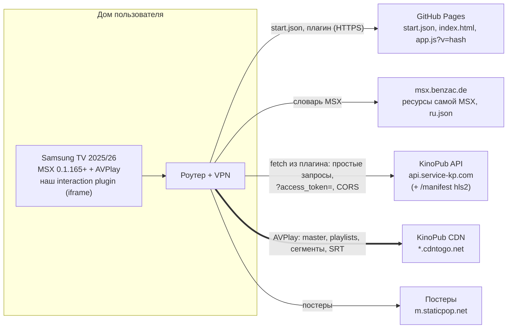

# Архитектура: MSX-приложение для KinoPub — клиентская схема (основная)

- Статус: **v1.14, основная схема, финал MVP** (контрольная точка M2: всё реализовано и проверено против mock; v1.9.1 — фикс 35a по первому полевому тесту на ТВ, §9.3; v1.9.2 — бюджет `app.js` 90 КБ gzip, CNFR-15; v1.10 — по отзыву с ТВ крупные плитки и навигация без перехода по кругу, §11; v1.11 — по отзыву с ТВ шаг перемотки, §9.4; v1.12 — по запросу с ТВ меню: «Я смотрю», «Спорт», все разделы KinoPub и «Пункты меню», §11.1; v1.13 — по отзыву с ТВ порядок пунктов меню и секций главной первой группой настроек, §11.1; v1.14 — по отзыву с ТВ разделы сверены с настоящим API: вкладки типов у полок, подборки без «0 шт.», §11.2). Прожарка закрыта, внесены замечания CM-01…CM-05 (`docs/grill/client-design-tree.md` §5). Раунд C1: вопросы `docs/grill/client-round-1.md`, ответы `docs/grill/client-round-1-answers.md`, дерево и факты CFX-01…CFX-11 — `docs/grill/client-design-tree.md`.
- Статус реализации — §20, журнал версий v1.0…v1.14 — §21.
- Дата: 2026-10-07.
- Запасной вариант — **Plan B, серверная схема**: `docs/architecture.md` v0.4 (прожарена в двух раундах; итог — приложение в `docs/grill/design-tree.md`). Plan B включается, если у API KinoPub нет CORS для запросов из MSX или клиентская схема не проходит Phase 0 (§16.4).
- Входные данные: `docs/research/*.md`, исходники prior art в `/tmp/kp-research` и `/tmp/kp`, решения пользователя.
- Область: личное использование, один аккаунт KinoPub, 1–3 телевизора Samsung 2025/2026 (Tizen 9/10, MSX 0.1.165+). Дома VPN на роутере: ТВ видит API и CDN KinoPub напрямую. **Своего сервера нет.**

---

## 0. Как читать документ

### 0.1 Обозначения

У всех ID префикс `C` (client), чтобы они не путались с ID Plan B. Ссылка «Plan B §N» ведёт на раздел `docs/architecture.md`.

| Префикс | Что это | Где |
|---|---|---|
| `CD-NN` | Решение | §17 |
| `CA-NN` | Допущение: факт не проверен, указано, чем проверим | §18.1 |
| `CR-NN` | Риск с планом снятия | §18.2 |
| `CQ-NN` | Вопрос к пользователю `[USER]` | §18.3 |
| `CNFR-NN` | Нефункциональное требование | §2 |
| `CDG-NN` | Проверка экрана-пробника Phase 0 на ТВ | §16.2 |
| `CC-NN` | Contract-тест против mock API | §14 |
| `CE-NN` | E2E-тест в web-версии MSX | §14 |
| `CAC-NN` | Пункт приёмки на ТВ | §14.5 |

Пометки уверенности из research: **[✔]** подтверждено; **[~]** косвенно; **[?]** не проверено.

### 0.2 Термины

| Термин | Значение |
|---|---|
| Плагин | Наш interaction plugin: `index.html` + бандл JS на статическом хостинге. MSX грузит его в фоновый iframe; он отвечает на `handleRequest` и генерирует весь MSX JSON |
| Хостинг | GitHub Pages из публичного репозитория (CD-12, §15) |
| `hls1`, `hls2`, `hls4` | Типы потока KinoPub (Plan B §0.2) |
| `mid` | ID видео или эпизода, параметр `media-links` |
| Простой запрос | CORS «simple request»: `GET`/`POST` без своих заголовков, `Content-Type` только `application/x-www-form-urlencoded`/`text/plain`/`multipart/form-data`. Браузер не делает preflight `OPTIONS` |
| SWR | Stale-while-revalidate |
| TTFF | Время от нажатия «Смотреть» до первого кадра |

### 0.3 Ключевые решения на одной странице

| Область | Решение | ID |
|---|---|---|
| Схема | Без сервера. MSX грузит статический `start.json` и наш interaction plugin. Плагин сам делает device flow, хранит токены, ходит в API KinoPub, генерирует MSX JSON, запрашивает `media-links` со своего IP и запускает AVPlay | CD-01 |
| CORS | Подтверждён (CFX-01: `ACAO: *`, `Allow-Headers: *`). Токен — только в query: `Allow-Headers: *` не покрывает `Authorization`. Запросы остаются простыми. Любой `TypeError` в работе — временная сетевая ошибка; автоповтор — только идемпотентных запросов, `toggle` — со сверкой статуса; проба `no-cors` — только фиксированный `GET /v1/types?access_token=x`; вердикт «нет CORS» выносит только пробник | CD-02, CD-14 |
| Один плагин | Всё внутри нашего плагина: пагинация (live `setup` + `reload:content`, паттерн RBTV), поиск со своей экранной клавиатурой (паттерн RBTV, раскладки RU/EN), панели, настройки, пробник. Paging/Input Plugin автора MSX не используются | CD-03 |
| Устройства | Каждый ТВ авторизуется отдельно и занимает свой слот устройства KinoPub (1–3 из ~5). Настройки 4K/HEVC — свои у каждого ТВ | CD-04 |
| Токены | В `localStorage` ТВ через обёртку плагина (`kp.auth.*`, §7.3); single-flight refresh в плагине; запись новой пары до использования; `device/notify` | CD-05 |
| Поток | `hls1` + подмена `aN`, резерв `hls2` (Plan B §5). Ссылки запрашивает сам ТВ, поэтому проблемы привязки ссылок к IP нет | CD-06 |
| Плеер и события | Свойства в ответе `video:resolve:request:interaction:…`, `button:next`/`prev`, `trigger:complete`. События приходят в плагин: `handleEvent` (`video:load/play/pause/stop`), heartbeat `trigger:60t` → `[interaction:commit:video\|player:ticking:restart]`, Back → `[interaction:commit:video\|player:eject]` | CD-07, CD-08 |
| Прогресс | `marktime`/`toggle` из плагина, «просмотрено» ≥ 90 %, outbox в хранилище ТВ | CD-08 |
| Скорость | Кэш в памяти + `localStorage` с SWR; главная из кэша ≤ 1 с; префетч карточки по фокусу (сообщение в плагин, без сети); ≤ 3 запроса к API параллельно; `app.js` с библиотекой ≤ 288 000 Б (≤ 90 КБ gzip), «Диагностика» — отдельный `probe.js`, загружаемый лениво; без внешних скриптов | CD-09, CD-10 |
| Стек | TypeScript → бандл esbuild (ES2020, IIFE) **вместе с** библиотекой `tvx-plugin-module` автора MSX и отдельный `probe.js` для «Диагностики»; тесты `node:test`; mock API на Node с CORS как у боевого; e2e Playwright + web MSX; CI GitHub Actions | CD-11, CD-15 |
| Хостинг и репозиторий | GitHub Pages из публичного репозитория (рекомендуемое имя — `msx`, тогда на ТВ вводится `<user>.github.io`), деплой `actions/deploy-pages`, лицензия GPL-3.0-or-later, в репозитории ничего личного. Бандл с постоянным именем `app.js?v=<hash>` (и `probe.js?v=<hash>`), 404 после деплоя невозможен | CD-12, CD-15, CD-17 |
| Поставка | Phase 0 «пробник на ТВ» → Phase 1 «смотрю кино» → Phase 2 «полное приложение». Phase 1 и 2 разрабатываются параллельно с полевым тестом Phase 0 против mock; развилки переключаются конфигом | CD-13, §16 |

---

## 1. Цели, scope, не-цели

### 1.1 Цели

Те же, что в Plan B §1.1 (G-1…G-7), с поправкой: нет VPS, а результаты Phase 0 возвращаются с экрана ТВ (§13).

### 1.2 Scope MVP

Функции Plan B §1.2 F-2…F-12 переносятся без изменений, F-1 меняется:

| # | Функция | Отличие от Plan B |
|---|---|---|
| F-1 | Установка | **Сопряжения по PIN нет.** Пользователь вводит в MSX домен хостинга; плагин сразу показывает вход в KinoPub |
| F-2 | Авторизация KinoPub | Device flow выполняет плагин на ТВ; каждый ТВ — своё устройство KinoPub (CD-04) |
| F-3…F-11 | Главная, каталог, поиск, карточка, серии, воспроизведение, прогресс, закладки, настройки | Как в Plan B; данные и логика — в плагине |
| F-12 | Диагностика | Экран «Диагностика» в плагине = пробник Phase 0 (§16.2); отчёт — текстовые страницы для фото и копирование из web MSX (§13) |

### 1.3 Не делаем

| Не делаем | Почему |
|---|---|
| Свой сервер, VPS, прокси, Caddy, Docker, сопряжение по PIN, `LINK_IP_MODE` | Схема без сервера (CD-01); всё это остаётся в Plan B |
| `hls4r` | AVPlay не принимает master через `data:`/`blob:` [~ lampa], а без сервера урезанный master негде отдать по HTTP. Резерв — `hls2` |
| Полный `hls4` | Зависает на Tizen 9 в 4K (Plan B F6); не используется |
| Свой видеоплагин (hls.js) | AVPlay через `video:` быстрее и надёжнее (Plan B §5) |
| Поддержку MSX ниже 0.1.165 и других платформ | Целевая платформа одна (Plan B D-38) |
| Paging Plugin и Input Plugin автора MSX | Одновременно загружен только один interaction plugin [~ msx-platform §4.9]; наш плагин должен оставаться загруженным, чтобы принимать события плеера (CD-03) |
| Синхронизацию настроек между ТВ | У каждого ТВ свои настройки и своё устройство KinoPub; общий только аккаунт |

### 1.4 Окружение

| Компонент | Значение |
|---|---|
| ТВ | Samsung 2025/2026, Tizen 9/10, MSX 0.1.165+; движок Chromium M120+ — ES2020+, `fetch`, `AbortController`, `localStorage`, `Promise`, `crypto.subtle` доступны |
| Сеть ТВ | Через VPN роутера; API (`api.service-kp.com`, Франция) и CDN доступны напрямую |
| Хостинг | GitHub Pages, HTTPS, `max-age=600` на всё, CSP через `<meta>` (CD-12, §15). Домен `github.io` (и `benzac.de`) пользователь добавляет в podkop, поэтому ТВ ходит к хостингу через VPN |
| Разработка | Mac в корпоративной сети: API KinoPub заблокирован; есть Node 26, brew, ffmpeg; доступны `msx.benzac.de`, npm (FX-01, FX-02) |

---

## 2. Нефункциональные требования

### 2.1 Сетевые допущения

| Сегмент | Значение | Чем проверим |
|---|---|---|
| RTT ТВ ↔ API KinoPub (через выход VPN, API во Франции) | 30–100 мс | CDG-01 |
| Время ответа API | 150–600 мс; `items/{id}` длинного сериала до 1,5 с | CDG-01, CDG-04 |
| RTT ТВ ↔ хостинг (CDN статики) | 20–80 мс | CDG-10 |
| Канал до CDN видео | ≥ 30 Мбит/с | CDG-05 |

### 2.2 Скорость UI

Время ниже меряет сам плагин (`performance.now()`) и показывает на экране пробника (§13).

| ID | Сценарий | Бюджет |
|---|---|---|
| CNFR-01 | Холодный старт плагина с ассетами в HTTP-кэше: от загрузки `index.html` до `ready` | ≤ 800 мс (если с прошлого запуска прошло больше 10 мин — плюс два ответа 304 от GitHub Pages, ≈ 2 RTT, §15.3) |
| CNFR-02 | Самая первая загрузка (кэш пуст): до `ready` | ≤ 2,5 с |
| CNFR-03 | Меню после `ready` | ≤ 100 мс (статическое, без сети) |
| CNFR-04 | Главная, есть персистентный кэш | ≤ 1 с от выбора «Главная» до экрана, ответ `handleRequest` ≤ 50 мс |
| CNFR-05 | Главная, кэша нет (первый вход) | Первая отрисовка ≤ 2 с; полки, которые не успели, догружаются заменой экрана (§8.4) |
| CNFR-06 | Переходы по данным из кэша (главная ↔ карточка ↔ список) | p95 ≤ 300 мс |
| CNFR-07 | Карточка нового тайтла после ≥ 1 с фокуса на плитке | p95 ≤ 300 мс (префетч по фокусу) |
| CNFR-08 | Карточка без кэша | ≤ 1,2 с (длинные сериалы — до 2 с) |
| CNFR-09 | Порция списка (48) при догрузке | ≤ 1 с, следующая порция префетчится |
| CNFR-10 | Поиск после последней буквы | ≤ 1,5 с (debounce 500 мс + запрос) |

### 2.3 Видео и прогресс

| ID | Требование | Бюджет |
|---|---|---|
| CNFR-11 | TTFF старта с начала, `hls1` 1080p, ссылки предзагружены | p50 ≤ 2,2 с; p95 ≤ 3,5 с |
| CNFR-12 | TTFF с resume | p50 ≤ 2,8 с; p95 ≤ 4,2 с |
| CNFR-13 | Потеря прогресса при выключении ТВ | ≤ 60 с (heartbeat) |
| CNFR-14 | «Просмотрено» | Только в окне 90–100 %, никогда при старте |

Разбивка CNFR-11 (оценка): resolve в плагине из кэша ≤ 50 мс (против 100–200 мс в Plan B — нет RTT до VPS); открытие UI плеера 100–200 мс; соединение с CDN 100–300 мс; master и media playlist 2 × 50–150 мс; буфер старта 4 с при 1080p — 0,5–1,0 с; первый кадр 0,3–0,5 с. Итого 1,2–2,4 с; с resume — +0,5–1,0 с.

### 2.4 Размеры и ресурсы ТВ

| ID | Требование |
|---|---|
| CNFR-15 | Два артефакта (§15.3): `app.js` — плагин вместе с библиотекой TVX — ≤ 288 000 Б минифицированного JS (≤ 92 160 Б = 90 КБ gzip; v1.9.2, было 250 КБ и 80 КБ gzip: визуальное качество пользователь ставит выше размера, на ТВ разница в несколько КБ незаметна, а при регулярной работе файл берётся из кэша); `probe.js` — «Диагностика» (пробник §16.2 и отчёт §13), грузится лениво — ≤ 40 960 Б (≤ 16 384 Б gzip). `index.html` ≤ 2 КБ; внешних скриптов нет (round-C1 Q3) |
| CNFR-16 | MSX JSON до gzip: те же лимиты, что в Plan B NFR-11 (страница списка ≤ 32 КБ, карточка ≤ 20 КБ); сезон ≤ 32 КБ при любом числе серий (§3.4) |
| CNFR-17 | Кэш в памяти ≤ 15 МБ (LRU); персистентный кэш в `localStorage` ≤ 1,5 МБ |
| CNFR-18 | Не больше 3 одновременных запросов к API на ТВ (фоновые — 1), ≤ 5 запросов/с; на 429 — до 2 повторов идемпотентных запросов (3 с, 6 с; §5.3) и снижение параллельности до 1 на 30 с (как Plan B NFR-13/14) |
| CNFR-19 | Запросы к API только простые (CD-02); проверяется тестом: mock отклоняет любой preflight `OPTIONS` (CC-01) |
| CNFR-20 | Токены и коды входа не попадают в журнал на экране, в отчёт и в URL, кроме обязательного `access_token` в query к API |

---

## 3. Архитектура

### 3.1 Схема



### 3.2 Маршрутизация

| Запрос | Кто → куда | Примечание |
|---|---|---|
| `start.json` | MSX → хостинг | JSON, нужен CORS `*` от хостинга |
| `index.html`, `app.js?v=<hash>` | MSX (iframe) → GitHub Pages | HTML без CORS; JS — по `<script>`, CORS не нужен; кэш §15.3 |
| Библиотека TVX | — | Встроена в бандл `app.js` (CD-15); запроса к `msx.benzac.de` из плагина нет |
| Меню, экраны, панели, resolve | MSX → плагин (`postMessage`, `handleRequest`) | Сети нет; плагин отвечает из кэша или после запроса к API |
| API KinoPub (OAuth, каталог, `media-links`, `marktime`) | Плагин → API | `fetch`, простые запросы, CORS (CD-02) |
| Видео | AVPlay → CDN | Нативный плеер, CORS не нужен |
| Постеры | MSX → `m.staticpop.net` | ``, CORS не нужен |

### 3.3 Почему клиентская схема

| Критерий | Клиентская (эта) | Plan B (сервер) |
|---|---|---|
| Инфраструктура | Только статический хостинг, бесплатно | VPS в РФ + исходящий прокси через VPN + Docker + GHCR + Caddy/HTTP |
| Привязка ссылок к IP | Нет проблемы: `media-links` запрашивает сам ТВ | Главный риск; нужен выход VPS через тот же сервер VPN |
| Задержка экрана | Сеть только до API; ответы из кэша — без сети совсем | Каждый экран — RTT до VPS в РФ через VPN |
| Старт видео | Resolve без сети при префетче | +RTT до VPS |
| Главный риск | Нет CORS у API → схема не работает | Нет |
| Свой JS на ТВ | Весь клиент (~4–6 тыс. строк TS) | Нет |
| Тестируемость | Логика в чистых TS-модулях, тесты в Node; поведение MSX — e2e и пробник | Go-тесты против mock |
| Состояние | На ТВ (`localStorage` через обёртку с префиксами, §7.3) | На VPS |

Решение пользователя: клиентская схема основная. Plan B готов на случай отсутствия CORS (§16.4).

### 3.4 Ограничение «один interaction plugin» и как его обойти

- MSX держит в фоне один interaction plugin; запрос к другому выгружает текущий [~ msx-platform §4.9; плагин Play автора сделан встраиваемым именно поэтому].
- Наш плагин должен оставаться загруженным всё время: он принимает события плеера и обслуживает resolve.
- Поэтому не используются ни Paging Plugin, ни Input Plugin, ни `tizen.html` автора.

Как функции реализуются внутри нашего плагина. Паттерны берём из RBTV и примеров автора, но пишем свои реализации; перенос кода допустим, потому что наш репозиторий публичный и под той же GPL-3.0-or-later (CD-15).

Дополнительная причина своей пагинации и клавиатуры: в MSX 0.1.165 нет штатного ввода текста, а плагины Input и Paging берут данные GET-запросом по URL сервиса, которого у нас нет (CFX-06).

| Функция | Реализация | Источник паттерна |
|---|---|---|
| Бесконечные списки | MSX не умеет дописывать элементы: на каждую догрузку плагин заново отдаёт экран через `executeAction("reload:content")`, а фокус MSX сохраняет по `id` элемента. Поэтому ответ несёт не весь загруженный список, а **окно ≤ 96 плиток** (16 рядов по 6, ряд — страница MSX; начало окна кратно ряду) (Р-35). Крайние плитки окна получают `"live": {"type": "setup", …}`: последняя — `interaction:commit:message:extend:<listKey>:down:<to>`, первая (если окно сдвинуто) — `extend:<listKey>:up:<from>`. Плагин догружает порцию 48 в свой кэш, когда окно дошло до конца загруженного, и **сдвигает окно на 48** к краю, к которому идёт пользователь; устаревший край (окно уже сдвинуто) игнорируется. **Предохранитель 32 КБ** (CNFR-16): если JSON ответа в UTF-8 больше, окно ужимается целыми рядами, не отрезая сфокусированную часть (у границы сдвига остаются 3 виденных ряда) | `paging.js` автора, RBTV `content.ts` [✔ код] |
| Поиск | Экранная клавиатура — страница-заголовок с кнопками-буквами `interaction:commit:message:search:input:<буква>` и управляющими кнопками (стереть, пробел, очистить, «Раскладка: RU/EN»). Плагин держит строку в памяти, по каждой букве делает `reload:content` (данные локальные, мгновенно), запрос к API — через 500 мс после последней буквы, от 2 символов. Результатов не больше 96 (две порции) и 32 КБ вместе с клавиатурой; если найдено больше или предохранитель отрезал последние ряды, строка ввода говорит «показаны первые N — уточните запрос» (Р-35) | RBTV `createSearchHeader`, `handleSearchInput` [✔ код] |
| Длинные сезоны | Плитка серии с опциями и ссылками весит ~0,9 КБ (~1,3 КБ со свойствами плеера в элементе, Р-18): сезон из ~35 серий упирался в 32 КБ. Если все серии в ответ не помещаются, ответ несёт **часть сезона** — целые ряды по 4 плитки, сколько помещается по самой длинной плитке сезона, — и по краям плитки-переходы «‹ Серии 1–36» и «Серии 73–108 ›»: `replace:content:ep_<id>_<n>:request:interaction:season:<id>:<n>:<from>@P` (флаг сезона общий для частей). Без `from` открывается часть с серией «Продолжить», в части без неё фокус — на первой серии; номера части — в `extension` (CNFR-16) | Свой; проверено в web MSX 0.1.167 |
| Ввод PIN, логина | Не нужен (device flow) | — |
| Панели (озвучка, качество, субтитры, закладки, сортировка, жанр) | `panel:request:interaction:panel:<тип>:<параметры>@<плагин>` | RBTV |
| Выбор дорожек в плеере | Наши панели + перезапуск через resolve (Plan B §5.10); `tizen.html` не нужен | — |

`{context:<поле>}` (Р-36, уточнено в v1.7) используется только в `template.selection` сеток — в `action` (префетч по фокусу, §8.3) и в `headline`/`text` (полное название плитки в фокусе рядом с заголовком экрана: `{context:kt}`, `kt` — название целиком, на плитке оно в две строки; проверено в web MSX 0.1.167), — и в `template.properties` сезона (CDG-06, §16.3). В `template.action` MSX его не раскрывает, поэтому там его нет: действие у каждого элемента своё. Поля элементов, на которые ссылается `{context:…}`, — **строки**, и они есть у каждого элемента корня, включая плитки-переходы сезона: нестроковое или отсутствующее значение MSX подставляет пустой строкой, и `pf:{context:kid}` превратился бы в `pf:`.

### 3.5 Модули плагина

Логика — в чистых TS-модулях без обращений к MSX. С MSX работает только тонкий адаптер `msx/bridge.ts` над `TVXInteractionPlugin`, поэтому модули тестируются в Node (§14).

| Модуль `src/…` | Ответственность |
|---|---|
| `bridge/` | Адаптер к `TVXInteractionPlugin`: `setupHandler`, `handleRequest`/`handleData`/`handleEvent`, `executeAction`, `requestData`; учёт текущего контента (§6.3); обёртка над `localStorage` с пространствами имён (§7.3). В тестах — фейк |
| `router/` | Разбор `dataId` и сообщений, вызов экранов и действий |
| `api/` | Клиент KinoPub: только простые запросы (CD-02), лимитер (3 + 1 фоновый), ретраи, AIMD на 429, таймауты (`AbortController`), толерантный разбор JSON (Plan B §12.2 `kpapi`) |
| `auth/` | Device flow, single-flight refresh, `device/notify`, настройки устройства KinoPub, выход |
| `cache/` | Память (LRU) + персистентный слой в `localStorage`, SWR, TTL, single-flight по ключу |
| `screens/` | Построители MSX JSON (главная, списки, поиск, карточка, серии, панели, настройки, пробник); логика экранов Plan B §8 |
| `playback/` | Выбор файла, озвучки, субтитров (Plan B §5.4–5.6), подмена `aN`, `loc`, resolve, следующая серия, цепочка fallback |
| `progress/` | Сессия воспроизведения, события плеера, heartbeat, `marktime`/`toggle`, outbox (Plan B §9) |
| `probe/` | Проверки CDG-xx, замеры, журнал, страницы отчёта и копирование отчёта (§13). Собирается в отдельный `probe.js`, который `app.js` загружает при первом открытии «Диагностики» (§15.3); в `app.js` остаются только замеры каждого запуска (CDG-09, CDG-10) |
| `config/` | Константы сборки и переключатели развилок (§16.6) |

---

## 4. Стек и репозиторий

| Слой | Выбор | Обоснование |
|---|---|---|
| Язык | TypeScript, `target: ES2020` | Tizen 9/10 — Chromium M120+, ES2020 без полифилов; типы защищают структуру MSX JSON |
| Сборка | esbuild: один IIFE-бандл `app.js` (версия — `?v=<hash>` в `index.html`), `--minify`, `--target=es2020` | Одна dev-зависимость, сборка < 1 с |
| Библиотека MSX | `tvx-plugin-module.min.js` (v0.0.79) из репозитория автора `benzac-de/msx-interaction-plugin-examples` (GPL-3.0-or-later), закреплена в `vendor/`, импортируется в бандл, как это делает сам автор в RBTV (CFX-08). Типы — `tvx-plugin-module.min.d.ts` оттуда же | Нет внешнего скрипта при старте; версия не меняется на месте; CSP `script-src 'self'` (round-C1 Q3) |
| UI-фреймворк | Нет | MSX рисует всё сам по JSON |
| Тесты | `node:test` + `node:assert` (Node 26 запускает `.ts` напрямую со strip-types) | Без тестовых фреймворков |
| Mock API | `tools/kpmock/` на Node `node:http`: API, OAuth, CDN-плейлисты, MP4 для e2e; CORS как у боевого (`Access-Control-Allow-Origin: *`), preflight `OPTIONS` отклоняется | Ловит любой непростой запрос (CNFR-19) |
| E2E | Playwright + Chromium, web-версия MSX (`http://msx.benzac.de/?start=menu:request:interaction:init@http://127.0.0.1:8080/app/index.html`), флаг `--disable-features=LocalNetworkAccessChecks` (Plan B §12.6) | Проверяет плагин в настоящем MSX |
| CI и хостинг | GitHub Actions: typecheck, тесты, краулер, сборка, размер бандла, проверка «ничего личного»; деплой `actions/deploy-pages` на GitHub Pages (§15) | — |
| Зависимости | Dev: `typescript`, `esbuild`, `@playwright/test`. Рантайм: ноль внешних; встроенная библиотека TVX | — |

```
kinopub-msx/
├── src/
│   ├── main.ts                 # точка входа: TVXPluginTools.onReady → setupHandler
│   ├── bridge/ router/ api/ auth/ cache/ screens/ playback/ progress/ probe/ config/
├── public/
│   ├── start.json.tmpl         # Start Object; сборка подставляет BASE_PATH (§15.2)
│   └── app/index.html.tmpl     # CSP в <meta>, ссылка на app.js?v=<hash>
├── vendor/
│   ├── tvx-plugin-module.min.js  # библиотека автора MSX без изменений
│   └── SOURCE.md               # источник, версия, дата
├── tools/
│   ├── kpmock/                 # mock API + CDN (Node)
│   ├── build.mjs               # esbuild, хеш содержимого → ?v= в index.html
│   └── crawl.ts                # обход графа действий в процессе (§14.3)
├── test/                       # unit и contract (node:test), golden JSON экранов
├── e2e/                        # Playwright
├── types/                      # tvx-plugin d.ts
├── docs/
│   ├── architecture-client.md  # этот документ
│   └── architecture.md         # Plan B
├── .github/workflows/ci.yml   # test, deploy (GitHub Pages), e2e
├── LICENSE                   # GPL-3.0-or-later
├── package.json
└── tsconfig.json
```

---

## 5. CORS и транспорт к API

### 5.1 Что известно

**CORS подтверждён пользователем 2026-10-05** (`curl` с роутера через VPN, CFX-01). У API KinoPub на ответе 401 и на preflight 200:

- `access-control-allow-origin: *`;
- `access-control-allow-methods: GET, POST, OPTIONS`;
- `access-control-allow-headers: *`;
- `access-control-max-age: 1728000`.

`POST /oauth2/device` отвечает 200. Допущения CA-01, CA-02 закрыты, вопрос CQ-02 — тоже; CORS-ретранслятор (CQ-04) не нужен.

Что остаётся неизвестным:

| # | Вопрос | Почему важно | Чем закрываем |
|---|---|---|---|
| 1 | Есть ли ACAO на ответах 429/5xx | nginx без `always` отдаёт ошибки без CORS-заголовков; тогда браузер показывает настоящий 429 как `TypeError` (round-C1 Q1) | Классификация ошибок §5.3; CDG-01 записывает ACAO на 429/5xx, если они встретятся |
| 2 | Есть ли ACAO на ответах `/oauth2/*` (заголовки ответа `POST` не присланы) | Вход | CDG-02 |

### 5.2 Правило запросов (CD-02)

`Access-Control-Allow-Headers: *` по спецификации Fetch **не покрывает** `Authorization`. Поэтому токен передаётся только в query; заголовок `Authorization` не используем.

| Вызов | Форма |
|---|---|
| Любой `GET` к `/v1/*` | `GET https://api.service-kp.com/v1/…?…&access_token=<token>`; `fetch` без своих заголовков, `credentials: "omit"` (с `ACAO: *` credentials запрещены) |
| OAuth (`/oauth2/device`, `/oauth2/token`) | `POST` с параметрами в query и пустым телом [✔ kinopub-api §4.2] |
| `POST /v1/device/notify`, `/v1/device/{id}/settings`, `/v1/bookmarks/*` | `POST`, `access_token` в query, тело `URLSearchParams`: `fetch` сам ставит `application/x-www-form-urlencoded`, сервер такое тело принимает (CDG-03 подтверждает) |
| Мутации через `GET` (`marktime`, `toggle`) | `GET` с параметрами в query |

- Запросы остаются «простыми»: preflight не нужен, хотя сервер его и поддерживает. Это экономит RTT на каждом новом пути и не зависит от кэша preflight в WebView.
- Таймауты через `AbortController`: 8 с на каталог, 15 с на `items/{id}` и OAuth, 6 с на `media-links` при resolve, 5 с на `marktime`. На связи без признаков жизни экран получает `KP-NET` раньше — через 6 с без ответа (§5.3 п. 4, v1.6).
- `access_token` в query попадает в журналы API и CDN KinoPub, как у любого клиента KinoPub. В журнал плагина он не попадает (CNFR-20).

### 5.3 Классификация сетевых ошибок (CD-14, round-C1 Q1)

`fetch` даёт один и тот же `TypeError` при отказе CORS, сбое DNS, обрыве TCP/TLS и недоступном VPN. `navigator.onLine` видит только локальный интерфейс (CFX-11). Поэтому:

1. **В работе любой `TypeError` — временная сетевая ошибка.**
   - Автоповтор с паузами 3 с и 6 с — только для идемпотентных запросов (таблица ниже), счётчик circuit breaker (§8.5).
   - Данные из кэша с пометкой «нет связи».
   - Без кэша — экран «Нет связи с KinoPub. Проверьте VPN» (`KP-NET`).
   - Экрана «нужен Plan B» в работе нет.
2. **Признак «сервер ответил без CORS».** После 3 подряд `TypeError` к API плагин делает пробу — всегда один и тот же безопасный запрос `fetch("<хост API>/v1/types?access_token=x", {mode: "no-cors"})`, а не повтор упавшего URL (CM-01). В пробе нет настоящего токена: она не меняет состояние аккаунта и не трогает refresh:
   - непрозрачный ответ пришёл → сервер доступен, но ответил без CORS-заголовков (типично 429/5xx от nginx). Обрабатываем как 429: пауза 6 с, параллельность 1 на 30 с, в журнал `api_no_cors`;
   - `no-cors` тоже упал → сеть или VPN (`KP-NET`).
3. **Вердикт «CORS отсутствует» (`KP-CORS`) выносит только пробник CDG-01:** обычный `fetch` к `/v1/types?access_token=x` падает, а `no-cors` к тому же URL проходит, и так 3 раза подряд с паузой 5 с.
4. **Нет ответа за 6 с → `KP-NET` без повторов (v1.6, этап 33b).** Висящее TLS-рукопожатие (блокировка по SNI, упавший VPN) `fetch` не отличает от медленного ответа: таймауты §5.2 с повторами давали «Нет связи» только через 27–54 с, вход — через 15 с.
   - Связь **без признаков жизни** — KinoPub ничего не ответил с запуска плагина или с последнего таймаута. Признак жизни — любой HTTP-ответ KinoPub или прошедшая проба `no-cors`.
   - На такой связи запрос с автоповтором (`retry: "auto"`), который 6 с ничего не услышал (ожидание в очереди лимитера тоже считается), заканчивается `KP-NET` («no-answer») без повторов. Его `fetch` **не обрывается** до своего таймаута §5.2: медленная, но живая сеть ответит, и ответ докажет связь для следующих запросов. Попытка, получившая вердикт в очереди лимитера, в сеть не уходит.
   - Запросы без автоповтора (`retry: "none"`: refresh, опрос входа, `toggle`) так **не бросаются**: их ответ терять нельзя (CM-01), они ждут свой таймаут.
   - **Таймаут повторяется, только если KinoPub в это время отвечал на другие запросы** (потерялся один ответ). Таймаут без единого ответа помечает связь как «без признаков жизни», и ждущие запросы, которые 6 с ничего не слышали, получают вердикт сразу.
   - Вход по коду (§7.1): код устройства не пришёл за 6 с → экран входа сразу показывает `KP-NET`. Запрос не обрывается и вслепую не повторяется; код, пришедший позже, принимается, и экран входа перерисовывается с ним.
   - Обработка `TypeError` (п. 1) и проба `no-cors` (п. 2) не меняются.

**Повторы по типу запроса (CM-01).** Запрос мог дойти до сервера, а ответ — потеряться. Поэтому вслепую повторяется только то, что при повторе даёт то же состояние:

| Запрос | Автоповтор при `TypeError`, таймауте, 5xx, 429 | Почему |
|---|---|---|
| Чтение: каталог, карточки, `items/{id}`, `watching`, поиск, `media-links`, `types`, `device/info` | Да: 3 с, 6 с | Только чтение |
| `marktime` | Да: 3 с, 6 с; затем outbox (§10.3) | Позиция абсолютная: повтор даёт то же состояние |
| `device/notify` | Да: 3 с, 6 с | Перезаписывает те же поля |
| `toggle` | **Нет.** Желаемое состояние → outbox; перед отправкой — сверка статуса (§10.3) | Переключатель: второй вызов отменяет первый |
| Refresh (`/oauth2/token`, `grant_type=refresh_token`) | **Нет.** Только по §7.3: single-flight; при сетевой ошибке токены не трогаем, следующая попытка — по следующему 401 или проактивному сроку | Ротирует пару. В пробу `no-cors` не попадает никогда: непрозрачный ответ повернул бы пару без возможности её прочитать |
| Опрос входа по коду (§7.1) | Свой таймер `max(interval, 5)` с | Опрос и так периодический |

Таймаут в строках «Да» повторяется, только если KinoPub в это время отвечал на другие запросы (п. 4); иначе — `KP-NET` сразу.

Один повтор после 401 и refresh (§7.3) допустим для всех запросов: сервер отклонил запрос до выполнения. Для `toggle` и этот повтор идёт через сверку статуса.

### 5.4 Если CORS пропадёт

CORS подтверждён, поэтому это остаточный риск (CR-02): KinoPub может со временем ограничить origin. Признак — CDG-01 выдаёт `KP-CORS` при запуске пробника. Тогда — Plan B (`docs/architecture.md`).

---

## 6. Плагин: жизненный цикл и маршрутизация

### 6.1 Загрузка

- `start.json` и где он лежит — §15.2 (зависит от имени репозитория).

- `index.html`: CSP через `<meta>` (§15.4) и один `<script src="app.js?v=<hash>">`; библиотека TVX — внутри бандла (CD-15). `probe.js?v=<hash>` добавляется тегом `<script>` только при первом маршруте «Диагностики» (§15.3).
- `main.ts`: `import * as tvx from "../vendor/tvx-plugin-module.min"`; `tvx.PluginTools.onReady(() => { tvx.InteractionPlugin.setupHandler(new KpHandler()); tvx.InteractionPlugin.init(); })`.
- `init` возвращает меню сразу, без сети (CNFR-03). Тяжёлую работу в `ready` не делаем [✔ msx-platform §6 п. 7]. После `ready` в фоне: чтение токенов, проактивный refresh (если до истечения < 10 мин), отправка outbox, после неё — SWR-обновление главной фоновым классом (§8.3).

### 6.2 Идентификаторы запросов

Все действия ссылаются на плагин полным адресом. Плагин уже загружен, MSX его не перезагружает, а при случайной выгрузке загрузит снова. Ниже `@P` — этот адрес.

`@P` вычисляется во время работы как `location.origin + location.pathname`, а не собирается из конфигурации (round-C1 Q5). Так он совпадает с URL, по которому MSX загрузила плагин из start parameter, вплоть до схемы и слеша. Любое расхождение MSX сочла бы другим плагином и перезагрузила бы iframe с потерей L1, сессии воспроизведения и таймеров. Тест CE-05 проверяет, что за сессию e2e `init` вызывается один раз.

| `dataId` / сообщение | Что |
|---|---|
| `init` | Menu Root (Plan B S3, без пункта «Подключение») |
| `login` | Вход в KinoPub (Plan B S2) |
| `home` | Главная (Plan B S4) |
| `list:<ключ>` | Список с пагинацией: ключ кодирует источник и параметры (`catalog\|type=movie\|sort=-updated\|genre=`) в base64url |
| `search` | Поиск со своей клавиатурой |
| `item:<id>` | Карточка (Plan B S8) |
| `season:<id>:<n>[:<from>]` | Серии (Plan B S9); `from` — первая серия части длинного сезона (индекс в сезоне с 0, §3.4) |
| `panel:<тип>:<параметры>` | Панели (Plan B S6, S10) |
| `settings` | Настройки (Plan B S12) |
| `probe` | Пробник / диагностика (§16.2) |
| `play:<i>:continue`, `play:<i>:start`, `play:<i>:<mid>:<s>:<e>[:start]` | Ответ для `video:resolve:request:interaction:…@P` (CD-07) |
| `interaction:commit:message:extend:<ключ>:<down\|up>:<край окна>`, `extend:search` | Сдвиг окна и догрузка списка (§3.4); догрузка поиска |
| `interaction:commit:message:search:input:<символ>` / `search:control:<back\|clear\|space\|lang>` | Клавиатура поиска |
| `interaction:commit:message:pf:<id>` | Префетч карточки по фокусу (CD-10) |
| `interaction:commit:message:act:<…>` | Закладки, «просмотрено», выбор озвучки/качества/субтитров, настройки |
| `interaction:commit:video` (из триггеров плеера) | Снимок позиции воспроизведения (CD-08) |

### 6.3 Перерисовка экранов

- Плагин сам знает, когда пришли свежие данные, поэтому в отличие от Plan B (D-40) опрос `check` не нужен. Если обновились персональные данные экрана (хеш персональной части, Plan B §7.7), плагин вызывает `executeAction("replace:content:<flag>:request:interaction:<dataId>@P")`.
- Флаги уникальны: `home`, `item_<id>`, `ep_<id>_<n>`, `list_<хеш ключа>`, `search`. При несовпадении флага MSX замену не выполняет [✔ wiki Internal Actions], поэтому чужой экран не подменится (Plan B M-01).
- **Асинхронная перерисовка только для текущего экрана** (round-C1 Q5). `bridge` запоминает `dataId` последнего контентного `handleRequest`; панели (`panel:…` и переключатель «Для разработчика» `probe:flag:…`) и `play:…` его не меняют. Догрузка списка (`extend`) и результаты поиска приходят через 0,3–1,5 с. `reload:content` вызывается, только если их список или поиск всё ещё текущий. Иначе данные остаются в L1, и при возврате `handleRequest` сразу отдаст расширенный список.
- Чтобы возврат «Назад» к списку или поиску всегда шёл через `handleRequest` и обновлял «текущий экран», у списков и поиска `cache:false`: MSX не восстанавливает их из своего кэша, а плагин отвечает из L1 за ≤ 50 мс.
- Ввод в поиске (`search:input`) перерисовывает экран сразу: это действие пришло с текущего экрана.
- Меню перерисовывается после входа и выхода: `replace:menu:menu:request:interaction:init@P`, у меню `flag: "menu"`. `reload:menu` для меню из start parameter MSX не выполняет. `replace:menu` MSX выполняет только на корневом экране и после анимаций, поэтому с любого экрана (вложенного, с панелью, из плеера) плагин шлёт цепочку `[home|cleanup|lazy:replace:menu:menu:request:interaction:init@P|info:<итог>]` (X-3): `home` закрывает вложенные экраны, `cleanup` — системное «Меню» MSX, которое `home` открывает на корневом экране и которое иначе перехватывало бы пульт (проверено в web MSX 0.1.167 и e2e).

---

## 7. Токены, устройства, безопасность

### 7.1 Device flow на ТВ

1. Нет токенов → меню из пунктов «Вход», «Диагностика», «Настройки MSX»; экран входа (Plan B S2).
2. `POST /oauth2/device?grant_type=device_code&client_id=…&client_secret=…` → `code`, `user_code`, `verification_uri`, `interval`, `expires_in`.
3. Экран показывает адрес `kino.watch/device` и `user_code` — картинкой SVG (`data:image/svg+xml`, ~150 px, `imageFiller: "fit"`): у текста MSX нет размера шрифта, а код читают с дивана. Плагин опрашивает `grant_type=device_token` каждые `max(interval, 5)` с по таймеру. Таймер живёт только пока плагин загружен (MSX открыта). `slow_down` → +5 с; `code_expired` → новый код. Первая и в фокусе кнопка — безопасная «Проверить сейчас» (`act:login:check`: опрос сразу, следующий — снова через интервал; «Код ещё не подтверждён» уведомлением), вторая — «Новый код».
4. Успех: новая пара записывается обёрткой хранилища в `kp.auth.*` (§7.3) до любых других действий → `POST /v1/device/notify` (`title=MSX <модель ТВ из requestData("info")>`, `hardware=Samsung Tizen`, `software=kpmsx-client/<версия>`) → `GET /v1/device/info` (id устройства) → настройки устройства KinoPub (Plan B §6.2.1: SSL 1, HEVC 0, HDR 0, 4K 0, mixed 1) → `executeAction("[home|cleanup|lazy:replace:menu:menu:request:interaction:init@P|info:Вход выполнен]")` (§6.3).

### 7.2 Устройства и слоты (CD-04)

- Каждый ТВ — отдельное устройство KinoPub: 1–3 слота из ~5 [~ kinopub-api §4.6].
- Плюсы: свои настройки 4K/HEVC на каждом ТВ; одновременный просмотр двух ТВ не делит один токен; отзыв ТВ — удаление устройства на сайте KinoPub.
- Хранилище привязано к origin плагина [вывод msx-platform §4.3]. Смена домена хостинга = повторный вход на каждом ТВ.

### 7.3 Refresh и хранение (CD-05, изменено по round-C1 Q4)

**Хранилище на Tizen — обычный `localStorage` iframe** (origin GitHub Pages). `TVXServices.storage` переходит в гибридный режим только при глобальном `TVXStorageService`, который даёт нативная обёртка iOS. На Tizen его нет, поэтому `TVXServices.storage` здесь — тот же `localStorage` (CFX-05). Плагин использует свою тонкую обёртку над `localStorage` с пространствами имён:

| Префикс ключей | Что | Приоритет |
|---|---|---|
| `kp.auth.*` | `access`, `refresh`, `expiresAt` (= now + `expires_in` − 30 с), `deviceId`, `notifiedVersion`, `gen` | Высший |
| `kp.cfg.*` | Настройки ТВ, переключатели развилок (§16.6) | Высокий |
| `kp.out.*` | Outbox прогресса, оверлей | Высокий |
| `kp.l2.*` | Персистентный кэш L2 (§8.1) | Низший, можно удалить в любой момент |

Правила:

- **Токены пишутся первыми.** При `QuotaExceededError` во время записи `kp.auth.*` обёртка удаляет все `kp.l2.*` и повторяет запись. Refresh ротирует пару, поэтому потерять её из-за кэша нельзя.
- `localStorage.clear()` и `TVXServices.storage.clear()` **запрещены**: удаление только по префиксу. Проверяется unit-тестом и поиском по коду в CI.
- L2 никогда не пишется синхронно в критическом пути запроса: запись откладывается (`setTimeout`), объём ограничен (§8.1).

Refresh:

- Single-flight внутри плагина: одна общая Promise refresh. Запрос, получивший 401 с поколением g, ждёт её или запускает, если `gen` всё ещё g.
- Новая пара пишется в хранилище до использования: refresh ротирует обе половины [✔ kinopub-api §4.5].
- Проактивный refresh: после `ready`, если до истечения < 10 мин; перед стартом видео, если access не переживёт `duration + 10 мин` (практика Kodi [✔]).
- Отказ refresh (`invalid_refresh_token`, `authorization_expired`) → токены удаляются → гостевое меню с любого экрана (§6.3) и причина `KP-AUTH` уведомлением → экран входа. Сетевая ошибка → токены не трогаем.
- Если ТВ не открывали больше ~30 дней, refresh-токен истекает [✔ kinopub-api §4.5] → повторный вход по коду. Фонового продления нет: без сервера его некому делать (CR-05).
- Выход: «Настройки» → «Выйти из KinoPub» (или та же кнопка в «Диагностике») → подтверждение «Выйти из KinoPub?» с фокусом на «Отмена» → «Выйти» → `POST /v1/device/unlink` → удаление `kp.auth.*` → гостевое меню с любого экрана и «Вы вышли из KinoPub» (§6.3).

### 7.4 Безопасность

| Угроза | Мера |
|---|---|
| Секреты в коде | Секретов нет, кроме публичной пары `xbmc` (используется всеми неофициальными клиентами) |
| Подмена кода плагина на хостинге (код имеет доступ к токенам на ТВ) | 2FA на GitHub; деплой Pages только из `main` с защитой ветки; CSP `script-src 'self'` — внешних скриптов нет, в том числе с `msx.benzac.de` (CD-15) |
| Личные данные в публичном репозитории | Проверка «ничего личного» в CI, `.gitignore` для отчётов, синтетические фикстуры (§15.6) |
| Кража токена с ТВ | Физический доступ к ТВ вне модели угроз; отзыв — удаление устройства в KinoPub |
| Утечка токена в журналы | Журнал плагина маскирует `access_token`, `refresh_token`, `code`, `user_code` (CNFR-20); отчёт без токенов |
| Чужой пользователь открывает наш хостинг | Получит пустое приложение и войдёт своим аккаунтом; наши токены живут только на наших ТВ |

---

## 8. Кэш и скорость

### 8.1 Слои (CD-09)

| Слой | Где | Что | Объём |
|---|---|---|---|
| L1 | Память плагина | Разобранные ответы API, готовые модели экранов, ссылки на поток | LRU ≤ 15 МБ |
| L2 | `localStorage` (origin GitHub Pages), ключи `kp.l2.*` | Холодный старт: полки главной, жанры, справочники, последние 30 карточек в компактной модели, первая порция каждого раздела | ≤ 1,5 МБ, LRU; при `QuotaExceededError` — удаление `kp.l2.*` (токены не трогаются) |
| L3 | MSX | Экраны истории навигации (`cache`/`reuse`) | Флаги как в Plan B §7.5 |
| L4 | HTTP-кэш ТВ | `index.html` и `app.js?v=<hash>` с GitHub Pages: `max-age=600`, затем `304` (§15.3) | — |

Токены, настройки и outbox лежат в других пространствах имён того же `localStorage` (§7.3): L2 можно в любой момент очистить без потери входа.

### 8.2 TTL и SWR

TTL и stale-max — как в Plan B §7.2, без отличий. Правило Plan B D-34 тоже без изменений:

- любые данные из L1/L2 отдаются сразу, персональные — с оверлеем прогресса;
- устаревшие обновляются в фоне;
- если персональная часть изменилась — замена экрана (§6.3);
- ждать API — только при пустом кэше;
- запись старше stale-max ждёт сеть, но если последняя загрузка этого ключа не удалась, запись отдаётся сразу с пометкой «нет связи», а сеть ждёт только фоновое обновление (X-1): иначе каждый показ и каждая сверка экрана без сети снова ждали бы сбоя (до 9,5 с), а главная перерисовывалась бы по кругу. Успешная загрузка пометку снимает; данные со stale-max 0 так не отдаются.

Ссылки на поток (`media-links`) — только L1, TTL 600 с. Ключ — `mid`: IP всегда IP этого ТВ.

v1.12 (§11.1): «История» списком и сериалы «Я смотрю» (`watching/serials?subscribed=1`, ключ `serials:1:` — под префиксом `serials:`, одна пометка после просмотра) — персональные, 1 мин; подборки и их содержимое — как каталог (10 мин); каналы эфира `/v1/tv` — только L1, 2 мин, stale-max 1 ч: адреса потока могут быть подписаны.

### 8.3 Префетч

| Событие | Что | Класс |
|---|---|---|
| `ready` плагина | Outbox, после него — обновление полок главной, если старше TTL (в фоновой полосе один слот: отметки прогресса не ждут прогрева) | фон |
| Фокус на плитке ≥ 350 мс (`selection.action = interaction:commit:message:pf:{context:kid}` в шаблонах сеток, рядом `selection.headline` с названием; `kid` — строка, Р-36) | Карточка `items/{id}?nolinks=1` | фон, «побеждает последний», ≤ 1 в полёте |
| Открытие карточки | `media-links` серии/видео «Продолжить» | фон |
| Открытие сезона | `media-links` первой непросмотренной серии | фон |
| Старт серии k | `media-links` серии k+1 | фон |
| Порция N списка отдана | Порция N+1 | фон |

Префетч по фокусу здесь дешевле, чем в Plan B: сообщение идёт MSX → плагин внутри ТВ, без HTTP и без индикатора занятости.

### 8.4 Главная (CNFR-04, CNFR-05)

1. Есть L2: главная строится из L2 за ≤ 50 мс, сразу; запускается фоновое обновление (передний план для «Продолжить» и «Закладок», фоновый класс для подборок). По готовности — `replace:content:home:…`, если персональная часть изменилась. Подборка, которой нет в кэше, грузится передним планом — её ждёт пользователь; сверка через 3 с (D-40) и пересчёт после плеера — фоновым классом.
2. Нет L2 (первый вход): запросы по 3 параллельно в порядке полок Plan B S4; ответ `handleRequest` через ≤ 1,5 с с теми полками, что успели. Остальные — заменой экрана после загрузки.
3. Холодный старт MSX целиком (ассеты в HTTP-кэше): старт плагина ≤ 800 мс + меню ≤ 100 мс + главная из L2 ≤ 1 с.

### 8.5 Лимиты к API

Лимитер в `api/`: 3 одновременных запроса переднего плана + 1 фоновый, ≤ 5/с. На 429 и на «ответ без CORS» (§5.3) — повторы через 3 и 6 с только идемпотентных запросов (таблица §5.3; `toggle` и refresh не повторяются) и параллельность 1 на 30 с. Circuit breaker — после 5 сетевых сбоев подряд (`TypeError`, таймаут, 5xx) (Plan B NFR-13/14, §10.1). `TypeError`, который проба `no-cors` признала «ответом без CORS» (§5.3), для breaker — ответ, как 429, а не сбой: иначе второй экран подряд получал бы `KP-NET` вместо `KP-429`. У каждого ТВ свой лимитер; при 2–3 ТВ одновременно суммарная нагрузка на аккаунт кратно выше — если 429 станут частыми, снижаем до 2 (CR-07).

---

## 9. Воспроизведение

### 9.1 Что переносится из Plan B без изменений

- Выбор режима: `hls1` по умолчанию, резерв `hls2`; полный `hls4` и `http` не используются (Plan B §5.2).
- Выбор файла (§5.4), озвучки (§5.5, подмена `master-v1a\d+` → `master-v1aN`), субтитров (§5.6, `tizen:subtitle:url`), `loc` (§5.14).
- Стартовая позиция `resume:position` по правилам §9.7, «Продолжить» выбирается в момент resolve по свежим данным (Plan B D-41).
- Свойства AVPlay: `tizen:buffer:size:init` 4, `resume` 6, `timeout` 10; `label:extension`; кнопки `content`/`speed`/`restart` → панели озвучки, субтитров, качества (§5.8).
- Смена озвучки и качества в плеере — перезапуск через resolve с текущей позицией; субтитры — без перезапуска (§5.10). С v1.9.1 перезапуск идёт в открытом плеере и не считается сбоем (§9.3).
- Цепочка fallback: `hls1` (кэш) → `hls1` (свежие ссылки) → `hls2` → ошибка; сбой — повторный запуск того же `mid` без признака старта через ≥ 8 с (§5.11, D-27). Перезапуск из панели плеера — не повторный запуск (§9.3).

### 9.2 Что меняется (CD-06, CD-07)

| Аспект | Plan B | Клиентская схема |
|---|---|---|
| Кто запрашивает `media-links` | VPS через прокси | Плагин на ТВ: ссылка выдаётся для IP ТВ, привязка к IP не мешает. `LINK_IP_MODE`, `X-Real-IP`, D-39, ретрансляция не нужны |
| Resolve | `video:resolve:https://VPS/…` | `video:resolve:request:interaction:play:…@P`: плагин отвечает `{url, label, properties}` из L1 за ≤ 50 мс (паттерн RBTV `video.ts` [✔]) |
| `hls4r` | Отложен | Невозможен без HTTP-эндпоинта; не используется |
| Признак старта | События `execute:` на сервер | `handleEvent` `video:play`; снимок, `pause` или `stop` с позицией, ушедшей от стартовой; ранняя проверка через 5 с после `video:load` (§9.3, §10.1) |
| Следующая серия | Ответ resolve | То же: `button:next:action` = `video:resolve:request:interaction:play:<i>:<mid>:<s>:<e>@P`, `trigger:complete` = `player:button:next:execute`, клавиши каналов (паттерн RBTV, FX-17); запасной — `video:resolve:…` прямо в `trigger:complete` |

Пример ответа плагина на `play:8632:continue` (1 сезон, 2 серия). Метка — «<название> · 1 сезон, 2 серия» (у фильма из частей — «· Часть 2»); `label:extension` — качество и озвучка без режима потока и шага fallback: они пользователю ничего не говорят и пишутся только в журнал resolve (V-27). Повторный запуск после сбоя предупреждает «Предыдущий запуск не удался — пробую другой способ воспроизведения».

```json
{
  "url": "https://<uuid>.ams-static-14.cdntogo.net/hls/<TOKEN>/2/46/DBCtPgEVqLdlY5qQ5.mp4/master-v1a3.m3u8?loc=nl",
  "label": "Черное зеркало · 1 сезон, 2 серия",
  "properties": {
    "kp:i": "8632", "kp:m": "82469", "kp:s": "1", "kp:e": "2", "kp:d": "3720",
    "resume:position": "1287",
    "label:extension": "1080p · Кубик в Кубе",
    "control:type": "extended",
    "tizen:buffer:size:init": "4",
    "tizen:buffer:size:resume": "6",
    "tizen:buffer:timeout": "10",
    "button:content:icon": "audiotrack",
    "button:content:action": "panel:request:interaction:panel:audio:8632:82469@P",
    "button:speed:icon": "subtitles",
    "button:speed:action": "panel:request:interaction:panel:subs:8632:82469@P",
    "button:restart:icon": "hd",
    "button:restart:action": "panel:request:interaction:panel:quality:8632:82469@P",
    "button:rewind:icon": "replay-10",
    "button:rewind:action": "player:seek:-10",
    "button:rewind:key": "delete",
    "button:forward:icon": "forward-10",
    "button:forward:action": "player:seek:+10",
    "button:forward:key": "insert",
    "button:prev:icon": "default",
    "button:prev:action": "video:resolve:request:interaction:play:8632:82468:1:1@P",
    "button:prev:key": "channel_down",
    "button:next:icon": "default",
    "button:next:action": "video:resolve:request:interaction:play:8632:82470:1:3@P",
    "button:next:key": "channel_up",
    "trigger:complete": "player:button:next:execute",
    "trigger:back": "[interaction:commit:video|player:eject]",
    "trigger:60t": "[interaction:commit:video|player:ticking:restart]",
    "trigger:90%": "shot:interaction:commit:video"
  }
}
```

`@P` — полный адрес плагина. Свойства `kp:*` — наши маркеры: по ним плагин сопоставляет события плеера с сессией (паттерн RBTV `rbtv:*` [✔]). `kp:n` — есть ли следующая серия; `kp:r` (v1.8.1) — nonce запуска, свой у каждого ответа resolve (§10.2).

### 9.3 Смена дорожки в плеере и признак старта (v1.9.1, фикс 35a)

**Найдено полевым тестом на ТВ.** Смена озвучки во время просмотра показывала «Предыдущий запуск не удался — пробую другой способ воспроизведения», плеер закрывался и открывался снова. В web MSX воспроизведено: перезапуск из панели — новый resolve того же `mid`; признака старта не было (автостарт не шлёт `video:play` [✔ e2e этапа 33], первый тик на ТВ — через 60 с), поэтому цепочка §5.11 считала его повтором после сбоя. Первая смена позже 8 с от старта давала шаг 2 (свежие ссылки и сообщение), вторая — шаг 3 `hls2`, где играет озвучка потока по умолчанию и выбор не работает, третья — «Видео не запускается».

**Перезапуск из панели — не сбой.** `play:<id>:<mid>:<s>:<e>:at<сек>` даёт только панель плеера (озвучка, качество; субтитры меняются без перезапуска). Для такого resolve цепочка остаётся на шаге, который играет (`FallbackChain.restart`), даже без признака старта: без сообщения о сбое, ссылки из кэша — свежие лечат только сбой. Нет записи `mid`, другой режим потока или шаг 4 — шаг 1. Время resolve обновляется: если не стартует сам перезапуск, повтор позже 8 с — следующий шаг, как обычно.

**Без закрытия плеера.** Действие панели — `[cleanup|video:resolve:…:at<сек>]` с `data.playerLabel`, без `player:eject`: новый поток грузится в открытом плеере тем же механизмом, что кнопки соседних серий. В web MSX [✔ e2e E-15]: `video:stop` нет, сразу `video:load` нового запуска с новым nonce `kp:r` (§10.2), позиция — из `resume:position`. Позицию смены трекер получает снимком из ответа `requestData("video")`, который панель и так запрашивает: без `eject` нет `video:stop` с позицией. На ТВ не проверено — переключатель `restart: eject` (§16.6) возвращает прежнюю цепочку `[cleanup|player:eject|video:resolve:…]`.

**Признак старта.** Запуск стартовал по первому из: `video:play`; снимок (тик, Back, 90 %, панель), `video:pause` или `video:stop` с позицией, ушедшей от стартовой, — > 0 и дальше 1 с от `resume:position` запуска (незапустившийся плеер отвечает 0 или стартовой позицией, а перемотка назад сразу после «Продолжить» — тоже старт); ранняя проверка — через 5 с после `video:load`, если старта ещё нет, плагин один раз спрашивает `requestData("video")` того же запуска. Проверка только ставит признак: прогресс не пишет, heartbeat не трогает. Признак сбрасывает цепочку `mid` и запускает префетч следующей серии (§8.3).

### 9.4 Перемотка (v1.11)

**Отзыв с ТВ:** «перемотка с таким большим шагом, мотать неудобно». Как перематывает MSX 0.1.167 (`tvx-app.min.js`, одинаково в web и на Tizen — Tizen меняет только сам переход, `AVPlay.seekTo`; [✔ web MSX, стенд и e2e E-16]):

| Чем | Шаг MSX | Настраивается |
|---|---|---|
| Кнопки ◀◀/▶▶ панели плеера, действия `player:rewind`/`player:forward`, ⏪/⏩ пульта | по длительности видео: ≤ 10 с — 1 с, ≤ 1 мин — 5 с, ≤ 1 ч — 10 с, длиннее — 30 с | да: `button:{rewind,forward}:{icon,action,key}` (KB extended-properties, 0.1.111/0.1.132) |
| ← и → при видео на экране | первое нажатие открывает панель с маркером на текущей позиции, каждое следующее двигает маркер на 2 % длительности (у видео ≤ 50 с — на 1 с), OK — переход; ускорения при удержании нет, только автоповтор клавиши | нет: свойства шага в MSX нет, только `progress:marker:enable` (включить или выключить маркер) |

Глобальной настройки шага в MSX тоже нет (Settings → только экран, ввод, слайд-шоу и т. п.; KB settings-reference). У фильма на 2 ч ▶▶ — 30 с, а шаг маркера — 144 с.

**Решение.** Строка «Шаг перемотки» в настройках (5, 10, 15, 30 с; по умолчанию 10, `prefs.seekStep`). В свойствах плеера (`controls()` в `player.ts`, ответ resolve и `template.properties` сезона) кнопки ◀◀/▶▶ получают `player:seek:-N`/`player:seek:+N` и клавиши `delete`/`insert` — так MSX называет ⏪/⏩ пульта (KB key-property), поэтому и клавиши перематывают на шаг. Значки — `replay-N`/`forward-N` с цифрой шага; для 15 с такого значка у MSX нет — обычные ⏪/⏩ (`default`). Маркер ← → остаётся как в MSX: им быстро уходят далеко, ◀◀/▶▶ — точно. Маркер не отключаем: без него ← → только открывают панель и водят фокус по кнопкам, а далеко уйти можно лишь многократным ▶▶.

---

## 10. Прогресс (CD-08)

### 10.1 Источники событий в плагине

| Источник | Что приходит | Используем для |
|---|---|---|
| `handleEvent` `video:load` | `data.info` (url, label, **properties** с `kp:*`) [✔ msx-platform §4.6] | Открыть сессию: тайтл, серия, длительность, запуск (`kp:r`) |
| `handleEvent` `video:play` | `data.data` (`state`, `position`, `duration`) | Признак старта (TTFF, сброс цепочки fallback), префетч следующей серии. Автостарт web MSX его не шлёт [✔ e2e] |
| `handleEvent` `video:pause`, `video:stop` | `data.data.position` — состояние до события [✔ msx-platform §4.6] | `marktime` сразу; после `stop` — обновление карточки и полок (§6.3); позиция, ушедшая от стартовой, — признак старта (§9.3) |
| `requestData("video")` через 5 с после `video:load` (v1.9.1) | `{video: {info, data}}` | Только признак старта, если его ещё нет (§9.3) |
| `requestData("video")` панели озвучки и качества в плеере | `{video: {info, data}}` | Позиция перезапуска (§5.10) и снимок для трекера: без `player:eject` нет `video:stop` (§9.3) |
| `handleData` от `trigger:60t` → `interaction:commit:video` | `{video: {info, data: {position, duration}}}` [✔ wiki Attached Data] | Heartbeat раз в 60 тиков |
| `handleData` от `trigger:back` → `[interaction:commit:video\|player:eject]` | Позиция до закрытия плеера | Позиция при выходе по Back, даже если `video:stop` после `eject` придёт без неё (Plan B M-02) |
| `handleData` от `trigger:90%` → `shot:interaction:commit:video` | Позиция ≥ 90 % | Страховка правила «просмотрено» |

- Свойства-действия не могут нести своих данных [✔ wiki], поэтому все триггеры шлют один и тот же «снимок позиции». Тип события плагину не нужен: решение принимается по позиции, а для пауз и остановок есть `handleEvent`.
- `info.properties` в `video:load` и в снимке — свойства видео вместе с ответом resolve [✔ CFX-03, msx-platform §3.5, §4.6], поэтому nonce `kp:r` (v1.8.1) приходит тем же путём, что `kp:i`/`kp:m`/`kp:e`. У `video:play/pause/stop` свойств нет — только `data` [✔ msx-platform §4.6].
- Запасной путь для heartbeat, если тики не работают (CDG-07): таймер плагина раз в 60 с между `video:play` и `video:pause`/`video:stop` вызывает `requestData("video", cb)` и берёт `video.data.position` [~ msx-platform §4.6 п. 3].

### 10.2 Правила

Без изменений из Plan B:

- §9.3: порог 30 с, номера `video`/`season`, склейка событий в пределах 2 с, повтор той же позиции не отправляется, после «просмотрено» нет `marktime` < 90 %;
- §9.4: «просмотрено» ≥ 90 % через `toggle` с проверкой ответа и одной коррекцией, никогда при старте;
- §9.7: расчёт стартовой позиции и серии.

Оверлей прогресса (Plan B §9.1) живёт в памяти и в L2, чтобы экраны сразу показывали новую позицию.

**Защита от затирания (v1.6, этап 33c).** События плеера приходят с опозданием и вперемешку (`trigger:back` гонится с `eject`, тик совпадает с выходом; в web MSX сразу после `stop` пришёл снимок 0 с). Поэтому:

- **Сессия — это запуск (v1.8.1, фикс 34b).** В каждом ответе resolve — nonce запуска `kp:r`: время старта плагина в мс плюс номер resolve, base36 (после перезагрузки плагина не повторяется). При `playerPropsIn: item` он тоже в ответе resolve, а не в элементе: шаблон сезона его не несёт. Снимок с nonce текущей сессии принимается сразу; с nonce закрытой сессии — отбрасывается, сколько бы времени ни прошло. `video:load` с новым nonce сразу открывает новую сессию, даже того же видео (перезапуск из панели озвучки или качества, §9.1, — новый resolve), а прежняя закрывается с `marktime` последней проверенной позиции, если он ещё не ушёл: при автопереходе MSX `stop` не шлёт. Повтор `video:load` текущего запуска сессию не начинает заново, запоздалый `video:load` закрытого — её не открывает.
- **Запасной путь — снимки без `kp:r`** (MSX не вернул свойства resolve, CDG-06). **10 с после `stop`** (или после того, как сессию вытеснила другая) снимки того же видео (`kp:i`/`kp:m`/`kp:e`) и снимки без `kp:*` игнорируются, а запоздалый `video:play` (у него свойств нет никогда) не считается стартом. Без nonce запуски одного видео не различить: снимки перезапуска того же видео в эти 10 с тоже теряются (найдено e2e E-09). Новый запуск начинается с `video:load`, который окно не задерживает.
- **Сессию открывает только явный старт.** Безусловно — `video:load` с `kp:*`. Снимок с `kp:*` открывает сессию только после `video:load` без `kp:*` (запасной путь CDG-06) или `video:play` без сессии; в режиме `events: triggers` (§16.6) стартом служит сам снимок.
- **`judgePosition`: откат больше 60 с — только со второго наблюдения.** Внутри сессии хранится максимум проверенной позиции (при «Продолжить» — с `resume:position`). Позиция вперёд и откат до 60 с (период heartbeat, Р-26) принимаются сразу. Откат дальше — запоздалый снимок или перемотка назад: перемотку подтверждает второе наблюдение не дальше назад, чем первое (следующий тик, Back-снимок и `stop`, пауза и `stop`), после чего максимум отсчитывается заново. Откат ниже порога `marktime` 30 с — шум (старт до перемотки на `resume:position`, сброс плеера после `eject`): он ничего не подтверждает.
- Оверлей, последняя позиция сессии и `marktime` берут только проверенные позиции; `stop` без своей позиции или с непроверенной берёт последнюю проверенную.

### 10.3 Outbox

- Неудачные `marktime`/`toggle` (сеть, 5xx, 429) кладутся в outbox через обёртку хранилища (`kp.out.*`, §7.3), ключ `(item, season, video)`, последнее значение. Для `marktime` значение — позиция. Для `toggle` — **желаемое состояние** («просмотрено» да или нет), а не команда «переключить».
- **Порядок позиций — по времени решения (v1.6, этап 33c).** Запись `marktime` хранит время решения `at` (у записей прежних версий — `createdAt`): запрос, решённый раньше, может упасть позже. Решение старше записи или позиции, уже дошедшей до KinoPub, не записывается и запись не снимает; дошедшая позиция снимает только записи, решённые не позже неё. Время решения строго растёт и не опускается ниже записей в хранилище — часы ТВ, ушедшие назад, не делают свежую позицию устаревшей.
- **Запросы одной серии идут по одному.** Прямой `marktime` и повтор из outbox того же ключа стоят в одной очереди: иначе более старая позиция (повтор транспорта, outbox) дошла бы позже новой. Запись outbox перед отправкой перечитывается: её могла заменить или снять более новая позиция.
- **Сверка перед `toggle` (CM-01).** Перед любым повтором `toggle` и при выгрузке его записи из outbox плагин перечитывает статус: `GET /v1/watching?id=<item>` (статус нужной серии; для фильма подходит и `items/{id}`). Статус уже равен желаемому → запись удаляется без `toggle`. Отличается → `toggle` и проверка ответа (Plan B §9.4). Сверка не удалась → запись остаётся в outbox, `toggle` не отправляется.
- Повторы: 10 с, 30 с, 2 мин, 10 мин, затем каждые 30 мин, пока плагин загружен; при каждом `ready` — сразу. Срок жизни записи — 7 суток: ТВ может долго быть выключен, а сервера, который отправил бы без ТВ, нет.
- При выключении ТВ кнопкой питания теряется не больше последнего heartbeat (≤ 60 с, CNFR-13): то, что успело попасть в outbox, отправится при следующем запуске.

---

## 11. UI

Экраны и UX — из Plan B §8 почти дословно: состав меню, главная и полки, каталог, сортировки и жанры, карточка, серии, панели, закладки, настройки, ошибка, прогресс на плитках. Отличия:

| Экран Plan B | В клиентской схеме |
|---|---|
| S0 `start.json` | Ведёт сразу на `menu:request:interaction:init@{PREFIX}{SERVER}/app/index.html` (§6.1) |
| S1 Подключение (PIN) | **Нет** |
| S2 Вход | Тот же экран. Код — картинкой SVG, инструкции белым; первой и в фокусе — «Проверить сейчас», второй — «Новый код» (§7.1). Автоопрос — таймер в плагине (без `ready`/`delay`); по успеху — перерисовка меню с любого экрана и «Вход выполнен» (§6.3) |
| S3 Меню | URL пунктов — `request:interaction:<dataId>@P`; поиск и разделы — наши `dataId`, а не плагины Input/Paging. Пункт настроек — «Настройки» с шестерёнкой (v1.14; прежнюю подпись «Просмотр и аккаунт» на ТВ не узнавали как настройки). v1.12: порядок по умолчанию — «Главная», «Я смотрю», «Поиск», «Новинки», «Каталог» (Фильмы … Концерты), «Закладки», «История», «Ещё» (Подборки, Популярное, Горячее, Аниме, Стендап, 3D, 4K, Спорт), «Настройки», «Диагностика», «Настройки MSX»; порядок и видимость — настройка «Пункты меню» (S12, §11.1). Разделитель — между группами пунктов, подпись группы — только у первого её разделителя; `id` пунктов прежние: MSX держит выбор по `id` через `replace:menu` |
| S4 Главная | Флаг `home`; обновление — заменой экрана из плагина (§6.3, §8.4). Сетка 12×6 без `compress`; полка — страница ленты: заголовок и ряд из 6 крупных плиток 2×4, тех же, что в каталоге (S5). Горизонтально ряд MSX не прокручивает, поэтому у подборок и «Закладок» шестая плитка — «Показать все» (значок-стрелка, подпись — название полки) ведёт в список; у «Продолжить» — 6 тайтлов без неё (Р-22). Заголовок полки и ряд подняты на полряда: на экране полка и верх следующей. У «Продолжить» тег серии «1×4», бейдж «+N», остаток «1 ч 10 м» (`stamp`) и прогресс — на постере (`imageBoundary`), под ним название и год с рейтингом; полка «Закладки» — плитки папок того же размера: крупный значок закладки вместо постера, название, «N шт.»; «Показать все» — с 7 папок. Полное название плитки в фокусе — в шапке (`selection.headline`); `preload: "next"` (переключатель `gridPreload`, §16.6). Пока грузится — фокусируемая строка «Загружаю главную…» без действия, «Обновить» — только у пустой главной. Без сети полки из L2 отдаются сразу с пометкой «нет связи», она входит в хеш: главная не перерисовывается по кругу (X-1, §8.2). v1.13: порядок и видимость полок — настройка «Секции главной» (`kp.cfg.home`, §11.1): порядок пользователя — и на экране, и в очереди запросов; скрытые полки не запрашиваются у KinoPub ни показом, ни прогревом `warmHome`, ни фоновой сверкой; хеш перерисовки — из выведенных полок по порядку, поэтому сверка после смены настройки заменяет экран. Все полки скрыты — «Все секции главной скрыты» и кнопка «Секции главной». Красная кнопка главной — опция «Секции главной» (`[back|panel:…panel:home…]`) |
| S5 Список | Порции API по 48; в ответе окно ≤ 96 плиток (16 рядов) с `live: setup` на краях → `extend` со сдвигом на 48 (8 рядов), ≤ 32 КБ (§3.4, Р-35); `flag: list_<хеш ключа>`; `preload: "next"`. **Плитка** (`tiles.ts`, одна на S4, S5, S7, S11): `default` 2×4 в сетке 12×6 без `compress` — 6 в ряд при 1080p; постер 264×396 px (`imageHeight` 2,75: ровно 2:3, как постеры KinoPub 250×375 и 500×750, — `cover` не обрезает и не растягивает), под ним белое название в две строки (`titleHeader`, перенос по слову до 12 знаков, лишнее MSX обрезает «…») и серым год и рейтинг КП («2001 · 7,9»); бейдж «4K» — на постере. Постер — `posters.medium` (или размер из настройки «Размер постеров»): ячейке 264 px он почти 1:1, а `big` вчетверо тяжелее для декодера ТВ; адрес один на всех экранах, `https`, без query (`posterUrl`) — картинка берётся из HTTP-кэша ТВ. Полное название плитки в фокусе — в шапке (`template.selection.headline` = `{context:kt}`, Р-36). Экран из меню MSX подписывает пунктом меню, поэтому текущие сортировка и жанр и число найденного — в `extension` («■ Рейтинг КП · Драма · 1 234 фильма»); счётчик MSX скрыт (`enumerate: false`). Списки «Показать все» называются как полки главной («Новые фильмы»), папка — своим названием, пустая папка объясняет, как её наполнить. v1.12 — источники разделов §11.1: «Новинки», «Популярное», «Горячее» — полки с вкладками типов (v1.14, §11.2: «■ Фильмы · 1 234 фильма», красная кнопка — панель «Тип»), «История» (`/v1/history` по 48, плитка — тайтл один раз, без опций и счётчика: `total_items` считает серии), «Подборки» (`/v1/collections`, сортировка «Новые» / «Горячие» / «Популярные», плитка подборки — её постер; «N шт.» — только если API пришлёт число, v1.14; без префетча карточки) и подборка (`/v1/collections/view`, заголовок — её название); разделы-жанры «Мультфильмы», «Аниме» и «Стендап» называются разделом; 3D — `type=3d`, 4K — `quality=4` |
| S6 Сортировка, жанр, тип | Опции красной кнопки с текущими значениями («Сортировка: Обновлённые», «Жанр: все жанры»), пункт ведёт `[back\|panel:…]` — опции закрываются до панели. `panel:request:interaction:panel:sort:<ключ>@P`; выбор → `[back\|replace:content:list_<хеш>:request:interaction:list:<новый ключ>@P]`. Жанры — в две колонки, 12 на экран, только у каталога. v1.14: у полки один пункт «Тип: Фильмы» с `key: "red"` (Option Shortcut, как «Сезоны» S9) — красная кнопка сразу открывает `panel:type:<ключ>`: 8 вкладок в две колонки, текущая с ✓; действие пункта — `[cleanup\|panel:…]`: `back` у Option Shortcut ушёл бы со списка, а `cleanup` закрывает опции, если их открыли кнопкой опций, и ничего не делает без них; выбор — `act:panel:type:<ключ>:<тип>`: тип запоминается (`kp.cfg.shelf`), ответ — `[back\|replace:content:list_<хеш>:…list:<полка с типом>@P]` (§11.2) |
| S7 Поиск | Свой экран: страница-заголовок с клавиатурой (RU: 33 буквы, EN: 26 букв, цифры, «пробел», «стереть», «очистить», «Раскладка: RU/EN» — называет текущую раскладку), над буквами — строка ввода на всю ширину (`msx-glass`, запрос крупно, «Найдено: N» справа; у пустой — «Наберите название»), ниже результаты — те же крупные плитки, что в S5: корень сжат ради клавиатуры 16×8, шаблон плиток — `decompress` (сетка 12×6, полный шрифт), с названием в шапке. С результатами клавиатура занимает свою страницу, ряд постеров не уходит под подвал; запрос и число найденного — в `extension`. Клавиши пульта 0–9 вводят цифры. Минимум 2 символа, запрос через 500 мс после последнего нажатия, результаты — первая порция 48 и догрузка, не больше 96 и 32 КБ — лишние ряды отрезаются (§3.4, Р-35) |
| S8 Карточка | Флаг `item_<id>`; главная кнопка — `video:resolve:request:interaction:play:<id>:continue@P`: «▶ Смотреть», «▶ Продолжить с 19:57», «▶ Продолжить: 1 сезон, 4 серия», «▶ Смотреть снова»; «С начала» (`play:<id>:start`) — только при позиции «Продолжить», иначе на её месте «Похожие». Кнопки озвучки, качества и субтитров — значения с иконками без префиксов («Английские · только надписи»), закладки — под постером. После плеера фокус на «▶» (`b_main`). Опции красной кнопки — с названием тайтла в заголовке, пункт «Способ воспроизведения» |
| S9 Серии | Флаг `ep_<id>_<n>`; заголовок «<название> · Сезон N из M»; вкладки сезонов (до 5, по 3 колонки, открытый отмечен ✓) — `replace:content:ep_<id>_<n>:request:interaction:season:<id>:<N>@P`, больше 5 сезонов — кнопка с панелью сезонов; подсказка красной кнопки «■ Сезоны» в `extension` и пункт «Сезоны…» в опциях (Option Shortcut). Плитки 4×4 — ровно два ряда на экран; «Серия 4» без названия, «4. Название» с названием; `enumerate:false`. Длинный сезон — частями ≤ 32 КБ (§3.4) |
| S10 Панели | Озвучка — строка на дорожку «Дубляж · Студия Альфа · стерео» (язык — если не русский или нет студии и типа), AC3 при выключенном «Разрешить AC3» приглушён; субтитры — «Английские», «… · только надписи», «Выключены»; качество — «Авто (до 1080p)»; «Способ воспроизведения»: «Авто», «Способ 1 (HLS1)», «Способ 2 (HLS2)»; закладки — «☆ Избранное — добавить» / «✓ Избранное — убрать»; CDN — страны по-русски, «По умолчанию (Нидерланды)» отдельной строкой. Смена озвучки и качества в плеере перезапускает с позиции плеера, без неё — с проверенной позиции или максимума сессии, затем — с позиции оверлея; позиции нет — панель закрывается с сообщением, с 0 не перезапускает (X-2) |
| S11 Закладки | Плитка папки — иконка закладки над названием (4×2 в 16×8); содержимое папки — список S5 с теми же крупными плитками постеров; пустые закладки — пояснение и кнопка «Найти фильм» обычного размера; счётчик MSX скрыт |
| S12 Настройки | Заголовок «Просмотр и аккаунт». Без «Подключить ещё телевизор» и «Отключить телевизор». Добавлены «Это устройство KinoPub»: название, 4K/HEVC (настройки своего устройства, CD-04), отдельная строка «Выйти из KinoPub» с подтверждением (`panel:setting:account`: «Выйти из KinoPub?», «Выйти» / «Отмена», фокус на «Отмена», §7.3). «Максимальное качество»; «Способ воспроизведения», «CDN-сервер», «Разрешить AC3», «HEVC» — в «Для опытных»; значения с заглавной буквы; без любимых студий — пояснение вместо «Сбросить». Буфер старта, постеры, фоны — в настройках UI (env здесь нет). «Шаг перемотки» (5/10/15/30 с, по умолчанию 10) — последняя строка «Воспроизведения» (v1.11, §9.4). Первая группа — «Меню и главная» (v1.13; в v1.12 — группа «Меню» после «Аккаунта», девятая строка, и на ТВ её не нашли): «Порядок и видимость пунктов меню» и «Порядок и видимость секций главной» («По умолчанию», «Свой порядок» или «7 из 8») открывают панели `panel:menu` и `panel:home` (§11.1); фокус при открытии экрана — на первой из них |
| S15 «Я смотрю» (v1.12) | Флаг `watching`. Сериалы списка «Я смотрю» KinoPub (`/v1/watching/serials?subscribed=1`, как у Kodi и webOS) — с новыми сериями первыми (бейдж «+N»), прогресс — доля просмотренных серий; затем начатые фильмы (`/v1/watching/movies`) — прогресс и остаток из истории и оверлея ТВ, как у «Продолжить», досмотренный на ТВ скрыт. Те же плитки S5; окно ≤ 96 и ≤ 32 КБ, `extend` и стражи краёв — механизмом списков (`list.ts`, ключ `watching`, готовые плитки в памяти). SWR 1 мин, «нет связи» в `extension` («2 сериала · 1 фильм»); устаревшее — фоном и замена `replace:content:watching`, только пока экран текущий; после просмотра — так же (`refreshAfterPlayback`). Пусто — пояснение и «Найти фильм» |
| S16 «Спорт» (v1.12) | Флаг `tv`. Каналы эфира `/v1/tv` — плитки 3×2 (4 в ряд): логотип 240×180, название, бейдж «Эфир». Плитка запускает `video:<stream>` (HLS live) без resolve: нет `kp:*` — трекер не открывает сессию (`load_without_kp`), `marktime` и прогресса нет. Свойства плеера — из шаблона плитки: `control:type: extended`, `progress:display: false`, `trigger:back: player:eject` (без него «Назад» оставлял эфир играть под экраном — проверено в web MSX). Пусто — пояснение и «Обновить» |
| S13 Диагностика | Пробник Phase 0, журнал и «Отчёт» (§13, §16.2): кнопки действий сверху, фокус на «Запустить проверки API» (`b_runApi`), «Выйти из KinoPub» — через то же подтверждение, что в S12 |

**Навигация без перехода по кругу (v1.10).** MSX на краю экрана переводит фокус по кругу (KB, «Navigation overflow»): «вверх» с первого ряда уводил на последний ряд, «вниз» с последнего — на первый. Свойство `wrap` касается только входа в меню влево и вправо; флага для вертикали в MSX 0.1.167 нет (признак цикличности навигации в `tvx-app` включён всегда). Поэтому над первым рядом и под последним стоят **стражи** (`src/msx/edges.ts`): невидимые фокусируемые элементы на той же странице, их `selection.action` `focus:<id>` — внутреннее действие MSX без плагина — сразу возвращает фокус на плитку. Для пользователя «вверх» на первом ряду и «вниз» на последнем ничего не делают; догрузку у края окна списка по-прежнему делает live последней плитки (`extend`), а если страница ещё грузится, «вниз» ждёт её на месте. В сетках шаблона (S5, S7, S9, S11, S12) стражи — во вставках `inserts` (MSX 0.1.156) с областью для крайних рядов: верхняя — `page:0`, её первый ряд стоит рядом ниже стражей и поднимается `template.offset`; нижняя начинается разрывом `break: "context:end"` у первой плитки последних рядов; высота вставок (`offset` страницы) не сдвигает ленту. На страницах главной, в клавиатуре поиска и в шапке сезона стражи — элементы самих страниц. Где есть шапка (клавиатура поиска, вкладки сезонов), «вверх» с первого ряда ведёт в неё, а страж стоит над шапкой. Стражи без `id` и действия; поверх прозрачных и полупрозрачных элементов — с прозрачным фоном, в сетках постеров — полосой под непрозрачным верхом постера (так ответ из 96 плиток укладывается в 32 КБ). Краулер проверяет, что `focus:` каждого стража ведёт на элемент того же ответа, а у нижней вставки есть разрыв (`edgeIssues`). Проверено клавишами в web MSX 0.1.167: главная, список до конца и обратно, поиск, папка, закладки, сезоны, части, настройки.

Корень экрана или панели с `items` всегда несёт `template` (у элементов могут быть свои `type` и `layout`): без него MSX показывает «Содержимое недоступно». У страниц `pages` — хотя бы один фокусируемый элемент. Оба правила проверяются по всем маршрутам, включая пустые состояния и ошибки.

### 11.1 Разделы KinoPub, «Пункты меню» и «Секции главной» (v1.12, v1.13)

Запрос с ТВ: «Главная, Я смотрю, Поиск, Новинки», раздел «Я смотрю», «Спорт» и все разделы KinoPub, которых нет, а в настройках — какие пункты меню показывать и в каком порядке. Исследование — по исходникам клиентов (`/tmp/kp`, `/tmp/kp-research`), без обращения к API.

| Раздел клиентов | Источник | У нас |
|---|---|---|
| «Я смотрю» | Kodi `modeling.py:72-79`, webOS `watching.tsx:15-27`, Android `ISeeActivity`: `/v1/watching/serials?subscribed=1` (+N новых); вторая вкладка webOS и «Недосмотренные» Kodi — `/v1/watching/movies` (без позиции) | S15 |
| Новинки, Популярное, Горячее | Kodi «Последние/Популярные/Горячие» по типу, webOS «Новинки» (вкладки), Android «НОВИНКИ/ГОРЯЧИЕ/ПОПУЛЯРНЫЕ»: `/v1/items/fresh\|popular\|hot` | полки без типа (S5) |
| Подборки | Kodi `main.py:417-458`, webOS, Android `CollectionsActivity`: `/v1/collections?sort=-created\|-watchers\|-views`, `/v1/collections/view?id=` | S5 |
| История | webOS `kinopub.ts:616-618`, Android `HistoryActivity`: `/v1/history` (`perpage` ≤ 50, список в поле `history`) | S5 |
| Типы | `/v1/types` живого API: `movie`, `serial`, `tvshow`, `4k`, `3d`, `concert`, `documovie`, `docuserial` (Kodi livinm `tests/responses.py`) | прежние и 3D (`type=3d`) |
| 4K | тип `4k` (не проверен) и фильтр `quality=4` — «не ниже 4K» (проверен 2026-09-26, HipsterCat `video.md:493`); Android «4K ВСЕ» | каталог `quality=4` |
| Мультфильмы, Аниме, Стендап | конфиг PWA `home_blocks`: жанры 23, 25, 101 | «Мультфильмы» (было), «Аниме», «Стендап» |
| **Спорт** | **каналы эфира `/v1/tv`** (= `/v1/tv/index`): переключатель меню PWA `sporttv`, «Спорт» webOS (`menu.tsx:93-97`), «ТВ» Kodi (`main.py:185-193`), «Спортивные каналы… бонус, как есть» kp-msx; документация — «каналы с текущими трансляциями (Евро-2016, Рио-2016)» (HipsterCat `tv.md:18`). Ответ — `channels:[{id,title,name,logos:{s,m},stream:"…m3u8",playlist,embed,current,status}]`, без пагинации и EPG; поток — HLS live. Жанр «Спорт» (20 и 71) — не раздел | S16 |

Не добавлены: «Профиль» Kodi (подписка — в S12), «Мультсериалы» отдельно (входят в «Мультфильмы»: `movie,serial` + 23), «Док. фильмы» и «Док. сериалы» отдельно (одно «Документальное»), «Донат» и «Спидтест» webOS.

> v1.14: строки «Новинки, Популярное, Горячее» и «Подборки» этой таблицы на настоящем API не работали — полке нужен `type`, а у подборки нет числа тайтлов; см. §11.2.

**«Пункты меню».** `kp.cfg.menu` (`OrderStore`, прежнее имя `MenuStore`, `src/config/menu.ts`): `{order?, hidden?}` — только отличия от умолчания; чужие и повторные `id` и всё, что не массив строк, отбрасываются при чтении; раздел новой версии встаёт после соседа по умолчанию. «Настройки» скрыть нельзя (иначе не вернуть скрытое), «Главную» — можно; «Настройки MSX» — всегда последние, в панели их нет. Панель `panel:menu` (`src/screens/order-edit.ts`): подсказка и строка на раздел — название с отметкой (5×1; у «Настройки» — замок), «▲», «▼», «В начало» (по 1×1), последней — «Сбросить по умолчанию»; страницы по 6 строк с явными `layout` (шаблонным элементам MSX даёт `layout` шаблона). Нажатия пульта: скрыть или показать — OK на названии (1); выше на k строк — → и k раз OK (фокус остаётся на «▲» того же раздела); в начало — →, →, →, OK (4). Выбор — `act:menu:<hide|up|down|top>:<id>` и `act:menu:reset`, ответ — `[replace:menu:menu:…|reload:panel]`: экран настроек открыт из меню и корневой, а под панелью MSX выполняет `replace:menu` (проверено в web MSX 0.1.167: меню и экран перезапрашиваются, выбор пункта по `id` сохраняется, панель остаётся с фокусом на той же кнопке).

**«Секции главной» и общий список (v1.13).** Отзыв с ТВ: «Так и нет настроек, чтобы я мог порядок всех секций менять». В v1.12 «Пункты меню» были девятой строкой настроек, в группе «Меню» после «Аккаунта», — их не нашли; полки главной не настраивались вовсе. Теперь обе настройки — первая группа «Меню и главная» экрана настроек (S12) с понятными названиями. Нажатия от пункта меню «Главная»: ↑ ↑ ↑ (меню MSX листается по кругу) — «Настройки», → — фокус на «Порядок и видимость пунктов меню», OK — панель (5); «Секции главной» — ещё ↓ (6); с главной — красная кнопка и OK (2). «Секции главной» — те же строки ☑ ▲ ▼ ⤒ и «Сбросить по умолчанию»: один компонент «список с порядком и видимостью» (`order-edit.ts`: описание списка — заголовок, строка настроек, хранилище, подписи, перерисовка; `OrderStore` с ключом `kp.cfg.<список>`). Полки — 8 полок S4 в порядке Plan B: «Продолжить просмотр», «Новые фильмы», «Новые сериалы», «Закладки», «Популярные фильмы», «Популярные сериалы», «Горячее: фильмы», «Горячее: сериалы»; `id` — префиксы плиток (`c`, `fm`, `fs`, `b`, `pm`, `ps`, `hm`, `hs`), закреплённых нет. `kp.cfg.home` — `{order?, hidden?}`, только отличия, мусор отбрасывается так же. Панель `panel:home`, сообщения `act:home:<hide|up|down|top>:<id>` и `act:home:reset`; ответ — `[replace:content:home:…|reload:panel]`, если главная текущая (панель открыта с неё), иначе `[reload:content|reload:panel]`: экран настроек под панелью перезапрашивается со свежей сводкой строки, панель и фокус в ней остаются (проверено в web MSX 0.1.167), а главную MSX запросит заново при показе (`cache: false`).

### 11.2 Разделы против настоящего API (v1.14)

Отзыв с ТВ на настоящем KinoPub: «Новинки», «Популярное» и «Горячее» не открываются (экран ошибки), у всех подборок «0 шт.». Полки главной работали: они всегда передают `type`. Разработка шла против `kpmock`, а он был мягче API: отдавал полку без `type` и число тайтлов подборки. С Mac API недоступен (DPI, research kinopub-api), поэтому контракты — по исходникам клиентов; детали и ссылки на строки — research kinopub-api §6.5.

| Раздел | Контракт API | Было | Стало |
|---|---|---|---|
| Новинки, Популярное, Горячее | `/v1/items/fresh\|popular\|hot`: `type` обязателен — без него HTTP 400 Yii «Отсутствуют обязательные параметры: type» (kinopub-gui `discover.go:479`, доки «API 1.3» — `type` без `[]`); `type=all`, `None`, пусто — пустой список (kinopub-gui `methods.go:153`, Kodi #379); типы через запятую — одна общая лента; `genre` и прочие фильтры полка не применяет (kinopub-gui `methods.go:147-149`); `page`, `perpage`, ответ `items` + `pagination` | запрос без `type` → `KP-BAD` (экран ошибки); опция «Жанр» ничего не фильтровала | вкладки «Фильмы», «Сериалы», «Док. фильмы», «Док. сериалы», «Концерты», «ТВ-шоу», «3D», «Все типы» (`movie,serial,concert,documovie,docuserial,tvshow` — как «All» kinopub-gui); по умолчанию «Фильмы»; выбор пункта меню помнит `kp.cfg.shelf` (`{fresh?, popular?, hot?}`, «Фильмы» не хранится); жанра у полок нет |
| Подборки | `/v1/collections`: `id`, `title`, `watchers`, `views`, `created`, `updated`, `posters` без `wide` — числа тайтлов нет (доки «API 1.3», снимок api2 2026-08-16, модели webOS, kinopub-gui, kp-msx, filmax); `pagination` с `current`/`total` (Kodi рисует «Далее») | «0 шт.» у каждой подборки (`count` по умолчанию 0) | подписи нет; `items_count`/`count` берётся, только если API его пришлёт и он > 0 |
| Числа в `extension` | `pagination.total_items` есть у `/v1/items*` (фикстуры Kodi), у подборок не подтверждён | без `total_items` число бралось из длины порции («48 подборок») | без `total_items` число известно только на единственной странице, иначе его нет |

Пункт меню полки — ключ без типа (`list:<fresh>`): меню кэшируется MSX и не знает настройки. Экран подставляет тип из `kp.cfg.shelf`, список в памяти держит под ключом с типом (общий с «Показать все» главной), а флаг экрана и перерисовка `extend` — по запрошенному ключу (`ListEntry.dataId`). Красная кнопка — Option Shortcut: панель вкладок без промежуточных опций (на пульте Samsung — `ColorF0Red`, 403; у web MSX своей клавиши для неё нет, e2e шлёт код 403). После `replace:content` MSX до перезапуска запрашивает у пункта меню уже заменённый ключ с типом; после перезапуска — ключ меню, и тип даёт `kp.cfg.shelf`. Выбор вкладки в панели над «Показать все» главной тоже запоминается — это явный выбор пользователя. «Мультфильмы» и «Аниме» вкладками полок быть не могут: это жанры, а жанр полка не применяет.

Аудит остальных разделов меню v1.12 против исходников: «Я смотрю» — `watching/serials?subscribed=1` (`total` строкой, `watched`, `new`) и `watching/movies` (фикстуры Kodi `persistedExpectations.json`) [✔]; «История» — `/v1/history`, список в `history`, `perpage` ≤ 50 [✔]; 4K — `quality=4` (проверено вживую 2026-09-26, kinopub-apple-client `video.md:493`) [✔]; 3D — `type=3d` (Kodi, конфиг PWA) [✔], запасные жанры теперь и для `3d` (v1.14); «Аниме» (`movie,serial` + 25), «Стендап» (`movie` + 101), «Мультфильмы» — тип и жанр через запятую = ИЛИ (проверено вживую там же) [✔]; «Спорт» — `/v1/tv`, `channels[].stream` (доки «API 1.3» `tv.md`) [✔]; «Закладки» — `count` строкой (фикстуры Kodi) [✔]; «Поиск» — `/v1/items/search?q=&field=title` (PWA, проверено вживую) [✔]. Под вопросом: есть ли `pagination` у `/v1/collections/view` (Kodi и webOS берут подборку одним запросом без `page`) — разбор принимает оба варианта; регистр `3d`/`3D` в `type` (API отдаёт `3D`, клиенты шлют `3d`).

---

## 12. Ошибки и деградация

| Ситуация | Обнаружение | Реакция | Что видит пользователь |
|---|---|---|---|
| Сервер ответил без CORS-заголовков (типично 429/5xx от nginx) | 3 подряд `TypeError`, затем проба `no-cors` фиксированным `GET /v1/types?access_token=x` проходит (§5.3) | Как 429: пауза 6 с, параллельность 1 на 30 с; журнал `api_no_cors` | Кэш с пометкой; без кэша — «KinoPub сейчас не отвечает. Повторите через минуту» (`KP-429`), а если вердикта нет за 6 с — срок экрана (строка «Срок экрана» ниже). Экран «нужен Plan B» в работе не показывается |
| Сеть или VPN не работают | `TypeError` или таймаут; `no-cors` тоже не проходит; связь висит — 6 с без ответа (§5.3 п. 4) | Повторы 3 с и 6 с (только идемпотентные запросы, §5.3; таймаут — только если KinoPub отвечал), circuit breaker; на висящей связи — `KP-NET` через 6 с без повторов; кэш L1/L2 с пометкой «нет связи», после сбоя ключа — и записи старше stale-max, сразу (§8.2) | Данные из кэша; без кэша — «Нет связи с KinoPub. Проверьте VPN» (`KP-NET`), если сбой известен за 6 с, иначе — срок экрана (строка ниже) |
| Срок экрана (V-40, v1.8): данных экрана или панели нет за 6 с — 5xx, `TypeError`, 429 с повторами, зависание после ответов KinoPub | Маршрутизатор: ответа обработчика нет за `SCREEN_DEADLINE_MS` = 6 с с запроса; вердикт транспорта и кэш, пришедшие в те же 6 с, важнее | Ответ — S14 с уникальным флагом `late_<n>`, исходный запрос не отменяется (данные лягут в кэш). Поздний успех, пока этот экран показан и текущий (CD-16; панель — пока её не перезапрашивали), — `replace:content:late_<n>:…` (`replace:panel:…` у панели), перезапрос получает уже пришедшие данные без второго запроса. Поздняя ошибка ничего не меняет. На один `handleRequest` — один ответ. Вход (свой срок кода, §5.3 п. 4), «Диагностика» (свой срок загрузки `probe.js`) и resolve (цепочка fallback §9.1) — без срока экрана; экраны из кэша (SWR, §8.2) отвечают сразу, срок их не касается; запись старше stale-max, которая ждёт сеть, и встроенные жанры панели приходят заменой после сбоя | «KinoPub не отвечает. Проверьте VPN» (`KP-NET`) с «Повторить» через 6 с вместо спиннера до конца повторов (9–15 с); пришли данные — экран сам заменяется ими |
| `toggle` без ответа (`TypeError`, таймаут, 5xx, 429) | Ошибка запроса `toggle` | Без автоповтора: желаемое состояние в outbox, перед отправкой — сверка статуса (§10.3) | Отметка в интерфейсе сразу (оверлей); на сервере — после восстановления связи |
| 401 | Статус | Single-flight refresh, один повтор | Ничего |
| Refresh отклонён | Ответ OAuth | Удалить токены; гостевое меню с любого экрана (§6.3) | Причина `KP-AUTH` уведомлением, экран входа с новым кодом |
| 429, 5xx | Статус | Как Plan B §10.1 | Кэш с пометкой или S14; повторы дольше 6 с — срок экрана |
| Тайтл или сезон удалён (`KP-404` карточки и сезона) | 404 | — | S14 с кнопками «Назад» и «Поиск» вместо «Повторить» и «Диагностика»: повтор не поможет. У списков, закладок и панелей «Повторить» остаётся |
| Хостинг недоступен при старте MSX | MSX не грузит `start.json`/плагин | — | Ошибка MSX «status: 0» (с HTTP-кэшем `index.html` старт может пройти) |
| Хостинг недоступен во время работы | — | Плагин уже загружен — всё работает | Ничего |
| Плагин выгружен (MSX перезагрузила его) | `init`/`ready` заново | Состояние восстанавливается из хранилища | Пауза 0,5–1 с |
| `localStorage` переполнен | `QuotaExceededError` | Очистка L2 | Ничего |
| Токены пропали (очистка данных MSX, обновление приложения) | Нет токенов при `ready` | Экран входа | Повторный вход по коду |
| Пробник CDG-01: CORS действительно пропал | Обычный `fetch` падает, `no-cors` проходит 3 раза подряд | Только в пробнике | «KinoPub не разрешает запросы из приложения (CORS)» (`KP-CORS`); решение — Plan B (§16.4) |
| Видео не стартует | Нет признака старта | Цепочка fallback (§9.1) | Как Plan B §5.11 |

---

## 13. Наблюдаемость и отчёт для разработчика

- **Журнал плагина.** Кольцевой буфер последних 500 записей в памяти и последних 100 в L2. Пишутся:
  - вызовы API: путь без `access_token`, статус, время, класс, признак `api_no_cors`;
  - события плеера: тип, позиция, решение;
  - ошибки и замеры CNFR.

  Токены и коды маскируются.
- **Метрики в памяти.** Те же, что в Plan B §11.3: латентности API и экранов, TTFF, сбои старта, 429, outbox. Показываются на экране «Диагностика».
- **Отчёт для разработчика** (round-C1 Q6; своего сервера нет, QR-экспорт из v1.0 отменён вместе с CDG-13 и CA-08):
  1. **Результаты, специфичные для ТВ** (AVPlay, события, тики, хранилище, автопереход, холодный старт): экран «Диагностика → Отчёт» — 2–4 страницы крупного белого текста (строки — `headline`), листаются на месте кнопками «‹ Стр. n» / «Стр. n ›», «Закрыть» и Back ведут в «Диагностику». На каждой строке ID проверки, ✓/✗, значения и p50/p95. Пользователь фотографирует страницы телефоном и отправляет в чат.
  2. **Результаты по API** (схема ответов — отпечаток ключей и типов без значений, как Plan B DG-24; времена ответов): тот же плагин открывается в web-версии MSX на домашнем компьютере — `https://msx.benzac.de/?start=menu:request:interaction:init@https://<user>.github.io/<repo>/app/index.html`. Домены KinoPub идут через VPN роутера. Кнопка «Отчёт в консоль» выводит отчёт одной строкой JSON в `console.log` — это основной канал: пользователь копирует строку из консоли браузера и вставляет в чат. Дополнительно плагин пробует `navigator.clipboard.writeText`, но без гарантии: плагин живёт в iframe, и без разрешения `clipboard-write` копирование может не сработать (CM-05).
  3. В web-пробнике вход создаёт временное устройство KinoPub. Кнопка «Выйти из KinoPub» в «Диагностике» открывает подтверждение выхода (§7.3); «Выйти» вызывает `device/unlink` и освобождает слот (Phase 0, §16.1).
- В отчёте нет токенов, кодов входа и IP. В репозиторий отчёты не коммитятся (§15.6).

---

## 14. Тестирование

### 14.1 Уровни

| Уровень | Что | Где |
|---|---|---|
| Unit | Модули `api`, `auth`, `cache`, `screens`, `playback`, `progress` с фейковым `bridge` | Mac, `npm test` (`node --test`) |
| Contract | Плагин (без MSX) против `kpmock` по HTTP с CORS как у боевого | Mac, `npm test` |
| Краулер | В процессе: вызвать `handleRequest("init")` и обойти все `request:interaction:<dataId>`, сообщения `interaction:commit:message:*` и resolve; проверить JSON MSX, лимиты размеров, отсутствие нераскрытых `{…}` (кроме ключевых слов MSX и `{context:…}`) | Mac, `npm run crawl` |
| E2E | Web MSX в Chromium против плагина и `kpmock` на `127.0.0.1` | Mac, `npm run e2e` |
| Пробник | CDG-xx на ТВ пользователя | Дом пользователя |
| Приёмка | CAC-xx | Дом пользователя |

### 14.2 Mock API (`tools/kpmock`)

- Поведение API, OAuth, CDN — как Plan B §12.3. TS-сегменты не нужны, для e2e — MP4.
- CORS как у боевого (CFX-01): `Access-Control-Allow-Origin: *`, `Allow-Methods: GET, POST, OPTIONS`, `Allow-Headers: *` на ответах `/v1/*` и `/oauth2/*`, включая 401. Сценарий `no_cors_errors`: 429 и 502 отдаются **без** CORS-заголовков, как у nginx без `always`. Сценарий `toggle_lost_response`: mock применяет `toggle` и рвёт соединение до ответа (для клиента — `TypeError`). Журнал mock записывает URL всех запросов, чтобы тест проверил состав проб `no-cors`.
- **Preflight отклоняется:** `OPTIONS` → 405 без CORS-заголовков, хотя боевой сервер его поддерживает. Так тест ловит любой непростой запрос плагина (CNFR-19).
- POST с неверным `Content-Type` молча игнорируется с ответом `{"status":200}` [✔ ловушка Apple].
- Сценарии `/__mock/scenario`: 401 и ротация refresh, 429, 5xx, задержки, «CORS выключен» (для теста экрана `KP-CORS`), зажатие страниц, `nolinks`.
- **Не мягче API (v1.14, §11.2):** полка без `type` — HTTP 400 `{"name":"Bad Request","message":"Отсутствуют обязательные параметры: type","code":0,"status":400}`; `type=all`, `None`, пусто — пустой список; `genre` полка игнорирует; у подборки нет числа тайтлов. Тесты, которые раньше проходили только на мягком mock (полки без типа, «N шт.» у подборок), переписаны под контракт и падают на коде v1.12.

### 14.3 Contract-тесты

| ID | Сценарий | Проверка |
|---|---|---|
| CC-01 | Все вызовы API простые | Mock фиксирует 0 запросов `OPTIONS` за весь прогон; ни одного своего заголовка |
| CC-02 | Device flow | pending ×3 → успех; токены в хранилище до `device/notify`; `slow_down`, `code_expired` |
| CC-03 | Single-flight refresh | 10 параллельных запросов с 401 → один refresh |
| CC-04 | 429 и лимитер | ≤ 3 одновременных запроса; повторы; снижение параллельности |
| CC-05 | Пагинация в плагине | `extend` дописывает 48; окно ≤ 96 сдвигается на 48 в обе стороны, ответ ≤ 32 КБ при любых названиях; конец списка при зажатии страницы |
| CC-06 | Поиск | Ввод «мат» → один запрос через 500 мс; стирание; RU/EN |
| CC-07 | Карточка и «Продолжить» | Правильная серия (Plan B §9.7) при устаревшем кэше и изменении прогресса «на другом устройстве» |
| CC-08 | Resolve | `aN` по предпочтениям, `loc`, свойства, следующая серия через границу сезона |
| CC-09 | События и прогресс | `video:load` → сессия; heartbeat-снимки → `marktime` раз в минуту; «просмотрено» один раз после 90 %; не на старте; Back-снимок до `stop` |
| CC-10 | Outbox | Нет сети → outbox в хранилище → после «перезапуска плагина» отправлено |
| CC-11 | Кэш и перерисовка | Главная из L2 ≤ 50 мс; после обновления персональной части — `replace:content:home`; карточка A не подменяет карточку B (флаги) |
| CC-12 | Префетч по фокусу | Серия сообщений `pf` за 200 мс → один запрос; карточка в кэше → ни одного |
| CC-13 | Ошибки без CORS и сеть | Сценарий `no_cors_errors`: 429 без CORS → повторы, снижение параллельности, `KP-429`, **без** `KP-CORS`; сценарий «сеть недоступна» → `KP-NET` и кэш; сценарий «CORS выключен» → `KP-CORS` выдаёт только пробник CDG-01; сценарий `toggle_lost_response` → проба не трогает `toggle`, автоповтора `toggle` нет, перед повтором — `GET /v1/watching?id=`, итоговый статус равен желаемому без лишнего `toggle`; по журналу mock каждая проба `no-cors` — только `GET /v1/types?access_token=x`, refresh в пробу не попадает (CM-01) |

### 14.4 E2E

Сценарии Plan B §12.6 E-02…E-14 без E-01 (сопряжения нет), адаптированные к `request:interaction`. Добавлены:

| ID | Сценарий |
|---|---|
| CE-01 | Плагин загружается в web MSX, меню за ≤ 100 мс после `ready` |
| CE-02 | Догрузка списка через `live: setup` и `reload:content` сохраняет фокус |
| CE-03 | Клавиатура поиска: ввод, стирание, «Раскладка: RU/EN», клавиши 0–9 |
| CE-04 | Воспроизведение MP4: `video:load`/`play`/`pause`/`stop` и снимки позиции из `trigger:Nt` доходят до плагина |
| CE-05 | За всю сессию e2e (меню, списки, поиск, карточка, плеер, панели) `init` плагина вызван ровно один раз: `@P` совпадает с адресом из start parameter, iframe не перезагружается (round-C1 Q5) |
| CE-07 | Выход из KinoPub с вложенного экрана через подтверждение: меню гостевое, «Вы вышли из KinoPub», системное «Меню» MSX не открыто, iframe тот же (§6.3, X-3) |
| CE-06 | Догрузка списка или результаты поиска приходят после ухода в карточку → карточка не перерисовывается; при возврате список уже расширен (round-C1 Q5) |

v1.12 (`e2e/menu.spec.ts`): E-17 — «Я смотрю» вторым пунктом меню пультом: сериал с «+2» первым, фильм с остатком, плитка → карточка → «Назад» на ту же плитку, «вверх» на первом ряду не уходит по кругу; E-18 — «Спорт»: каналы, OK играет эфир без resolve, сессии и `marktime`, «Назад» закрывает плеер; E-19 — «Подборки» → подборка своим списком с названием; E-20 — «Пункты меню» из настроек пункта меню: скрыть «Я смотрю» — пункт сразу исчезает из меню MSX, «▲» поднимает «Поиск» в начало меню, «Сбросить» возвращает умолчание. CE-02, CE-03, CE-06 ходят по новому порядку меню. v1.13: E-20 открывает «Пункты меню» с первой строки настроек — → из меню и OK; E-21 — «Секции главной» второй строкой: скрыть «Новые фильмы» (сводка под панелью — «7 из 8») и поднять «Закладки» ⤒; главная из меню — «Закладки» первыми, без «Новых фильмов», `items/fresh?type=movie` не запрашивается; красная кнопка главной (F1 в web MSX) → «Секции главной» → «Сбросить» — главная заменяется сразу, под открытой панелью. v1.14: E-22 — «Новинки» из меню пультом: запрос полки с `type=movie` без 400, красная кнопка (код 403 пульта Samsung) сразу открывает панель вкладок, «Сериалы» заменяет список и запоминается (`kp.cfg.shelf`), «Новинки» снова из меню — сериалы; кнопка опций (F12 web MSX) → «Тип: Сериалы» → «Фильмы»: над списком не остаётся ни панели, ни опций, настройка очищена; «Подборки» — без «шт.» у плиток.

Сценарии E уточнены по ходу реализации (`e2e/flows.spec.ts`): E-09b — перезапуск из панели плеера меньше чем за 10 с до 90 %, при автопереходе без `stop` серия отмечается просмотренной (фикс 34b, §10.2); E-11 — 429 без CORS на список без кэша: через 6 с срок экрана `KP-NET` с «Повторить», поздний 429 экран не меняет, после снятия сбоя «Повторить» открывает список (V-40, §12); E-15 — три смены озвучки подряд в плеере через 9 с при тиках как на ТВ: без «Предыдущий запуск не удался», без `video:stop` (плеер не закрывается), `hls1` шаг 1, позиция перезапуска и `marktime` идут вперёд (фикс 35a, §9.3); E-16 — «Шаг перемотки» 30 с в панели настроек: на паузе ⏩/⏪ (в web MSX — «+»/«−» цифрового блока) и кнопки ▶▶/◀◀ со значками `forward-30`/`replay-30` двигают позицию ролика 60 с ровно на 30 с, у MSX было бы 5 с (v1.11, §9.4).

### 14.5 Приёмка на ТВ

Чек-лист Plan B §12.9 с правками:

| ID | Пункт |
|---|---|
| CAC-01 | Start Parameter → `<user>.github.io` с замком (§15.2) → «KinoPub MSX 1.1.0» → сразу экран входа |
| CAC-02 | Вход по коду; повторный запуск MSX открывает главную без входа |
| CAC-03 | Холодный запуск MSX → главная ≤ 2 с (ассеты в кэше), из них плагин ≤ 800 мс (CNFR-01, CNFR-04) |
| CAC-04…CAC-20 | Как Plan B AC-04…AC-20 с тем же номером, с бюджетами CNFR этого документа (AC-04 — по CNFR-04) |
| CAC-21 | Выключить VPN во время просмотра на 1 мин и включить: прогресс доходит (outbox) |
| CAC-22 | Второй ТВ: свой вход, своё устройство KinoPub; одновременный просмотр не ломает ни один поток |
| CAC-23 | Диагностика: все CDG-xx пройдены; страницы отчёта сфотографированы, отчёт web-пробника скопирован (§13) |
| CAC-24 | Выход из KinoPub на одном ТВ не разлогинивает другой |
| CAC-25 | Открытие карточки после 1 с фокуса — p95 ≤ 300 мс (CNFR-07) |
| CAC-26 | Крупные плитки (§11 S5): 6 постеров в ряд без обрезки, названия читаются с дивана. «Вверх» на первом ряду и «вниз» на последнем на главной, в списке, поиске, закладках, сезоне и настройках ничего не делают, рамка фокуса не мигает; в конце окна списка «вниз» догружает ряды |
| CAC-27 | «Шаг перемотки» (§9.4): у фильма длиннее часа ◀◀/▶▶ на панели плеера (и ⏪/⏩ пульта, если они есть) перематывают на выбранный шаг, значок с цифрой шага; ← → по-прежнему двигают маркер на 2 % длительности, OK — переход |
| CAC-28 | Меню v1.12 (§11.1): порядок «Главная», «Я смотрю», «Поиск», «Новинки»…; «Я смотрю» — сериалы с «+N» и фильмы с полосой; «Спорт» — канал играет, «Назад» закрывает плеер; в «Пункты меню» скрыть пункт и поднять другой «▲» — меню слева меняется сразу, после перезапуска MSX порядок тот же, «Сбросить» возвращает умолчание |
| CAC-29 | v1.13 (§11.1): «Настройки» → первая строка «Порядок и видимость пунктов меню», вторая — «Порядок и видимость секций главной»; скрыть полку и поднять другую ⤒ — главная из меню в новом порядке, после перезапуска MSX тоже; красная кнопка на главной → «Секции главной» → изменения видны сразу под панелью; экран читается с дивана |
| CAC-30 | Разделы v1.14 (§11.2) на настоящем KinoPub: «Новинки», «Популярное», «Горячее» открываются фильмами; красная кнопка — панель «Тип», «Сериалы» и «Все типы» меняют список, пункт меню после перезапуска MSX открывается выбранной вкладкой; у подборок нет «0 шт.» |

---

## 15. Хостинг, репозиторий и деплой

### 15.1 Решение (CD-12, round-C1 Q2)

Пользователь выбрал **GitHub Pages из публичного репозитория**. Деплой — GitHub Actions (`actions/upload-pages-artifact` + `actions/deploy-pages`), Cloudflare не используется.

- Адрес — `https://<user>.github.io/<repo>/`. `<user>` и `<repo>` — параметры сборки (`SITE_ORIGIN`, `BASE_PATH`), в коде не зашиты.
- Ограничения GitHub Pages, на которые опирается схема:
  - на все файлы `Cache-Control: max-age=600`, свои заголовки задать нельзя;
  - работают `ETag` и `304`;
  - `Access-Control-Allow-Origin: *` отдаётся на всё — значит, `start.json` пригоден для MSX без настройки;
  - CSP задаётся только `<meta http-equiv>`;
  - к JSON, который загружает MSX, добавляются `?v=&t=` [✔ wiki Requests].
- В podkop пользователь добавляет `github.io` (и при необходимости `benzac.de` для словаря и ресурсов самой MSX). Тогда ТВ ходит к хостингу через VPN и не зависит от ограничений провайдеров.

### 15.2 Где лежит `start.json` и как называть репозиторий

MSX ищет start parameter строго по адресу `https://{SERVER}/msx/start.json`, где `{SERVER}` — хост, без пути [✔ wiki Setup_Start_Parameter]. У project-сайта GitHub Pages путь начинается с `/<repo>/`. Отсюда:

| Вариант | Как | Что вводить на ТВ |
|---|---|---|
| **A (рекомендуется).** Репозиторий называется `msx` | `start.json` лежит в корне артефакта Pages, то есть отдаётся как `https://<user>.github.io/msx/start.json`. Так устроен официальный пример `benzac-de/msx` [✔ msx-platform §1.2] | `<user>.github.io` с замком |
| B. Любое другое имя `<repo>` | `start.json` отдаётся по `https://<user>.github.io/<repo>/msx/start.json`. На ТВ — короткая ссылка с собственным алиасом: `id:igd:<alias>` (is.gd), ведущая на этот URL [✔ wiki: «URL Shortener Services»] | `id:igd:<alias>` |
| C. Отдельный маленький репозиторий `<user>.github.io` только с `msx/start.json` | `start.json` указывает на плагин в основном репозитории | `<user>.github.io` с замком |

**Ввод адреса на ТВ (CM-04).** Экранный ввод start parameter даёт цифры и строчные буквы, а дефис служит маркером заглавной буквы (`eXaMpLe` вводится как `e-xa-mp-le`) [wiki, по CM-04]. Если в логине GitHub есть дефис, `<user>.github.io` может ввестись неверно — это первое, что проверяется на ТВ (§16.1). Запасной путь для любого варианта — короткая ссылка `id:igd:<alias>` с алиасом только из `[0-9a-z]`, ведущая на `https://<user>.github.io/msx/start.json` (или на URL варианта B); при необходимости в podkop добавляется `is.gd`.

Сборка генерирует `start.json` из `BASE_PATH`:

```json
{
  "name": "KinoPub MSX",
  "version": "1.1.0",
  "parameter": "menu:request:interaction:init@{PREFIX}{SERVER}/msx/app/index.html",
  "welcome": "none"
}
```

Для варианта A `BASE_PATH=/msx/`. Для вариантов B и C в `parameter` записывается полный URL плагина `https://<user>.github.io/<repo>/app/index.html`.

### 15.3 Версионирование и кэш (CD-17)

| Файл | Как называется | Как кэшируется на ТВ |
|---|---|---|
| `start.json` | Постоянное имя | Не кэшируется: MSX добавляет `?v=&t=` |
| `app/index.html` (< 1 КБ) | Постоянное имя; внутри только CSP и `<script src="app.js?v=<hash>">` | `max-age=600`, затем `304` по `ETag` |
| `app/app.js` (бандл с библиотекой TVX) | Постоянное имя; версия — query `?v=<hash>` в `index.html` (первые 10 hex SHA-256 содержимого) | `max-age=600` и `304`; новый деплой меняет `?v=`, а ключ кэша ТВ — полный URL с query, поэтому старый кэш не мешает |
| `app/probe.js` («Диагностика») | Постоянное имя; версия `?v=<hash>` вшита в `app.js` при сборке, тот же хеш — внутри файла | Как `app.js`; грузится тегом `<script>` при первом маршруте «Диагностики», а не при старте |

- **Новая версия доходит до ТВ за ≤ 10 мин.** Это время жизни кэша `index.html`; MSX, открытая дольше, держит загруженный плагин до перезапуска.
- **404 после деплоя невозможен (CM-02).** GitHub Pages игнорирует query, поэтому ТВ со старым `index.html` по `app.js?v=<старый>` получает либо старый бандл из своего кэша, либо текущий с сайта — при любом числе деплоев подряд. Хранить прошлые бандлы и скачивать их с живого сайта при сборке не нужно.
- **Смешение версий безвредно.** `index.html` содержит только CSP и тег скрипта, поэтому до 10 мин после деплоя старый `index.html` с новым бандлом работает. Если ТВ получил новый `index.html` раньше, чем CDN GitHub обновил `app.js`, под новым `?v=` закэшируется прежний бандл — это та же задержка ≤ 10 мин. Исключение — CSP: новый домен в `connect-src` добавляется отдельным деплоем не позже чем за 10 мин до кода, который к нему обращается.
- **Ленивая «Диагностика».** Пробник и отчёт — в `probe.js`: холодный старт его не грузит. `app.js` сверяет версию внутри `probe.js` со своей; чужая версия, сбой загрузки или 15 с без ответа — экран ошибки `KP-NET` с «Повторить», повторное открытие грузит заново; параллельные открытия ждут одну загрузку.
- **До 10 мин после деплоя «Диагностика» может открыться экраном `KP-NET`.** GitHub Pages игнорирует query, поэтому старый `app.js` — из кэша ТВ или уже загруженный в MSX — по `probe.js?v=<старый>` получает новый файл и отвергает его по версии. Лечится перезапуском MSX: после истечения кэша `index.html` (≤ 10 мин) ТВ берёт новый `app.js`, а MSX, открытая до деплоя, держит старый до перезапуска. Остальные экраны это не затрагивает.
- **Холодный старт с кэшем, если с прошлого запуска прошло больше 10 мин:** два условных запроса (`index.html` → 304, `app.js?v=<hash>` → 304), примерно 2 RTT до GitHub через VPN. Если меньше 10 мин — без сети. Это заложено в CNFR-01.

### 15.4 CSP через `<meta>`

```html
<meta http-equiv="Content-Security-Policy"
      content="default-src 'none'; script-src 'self'; connect-src https://api.service-kp.com https://api.srvkp.com; img-src data:; style-src 'unsafe-inline'">
```

Внешних скриптов нет: библиотека TVX встроена в бандл (CD-15).

### 15.5 CI и выпуск

`.github/workflows/ci.yml`:

| Задача | Когда | Что делает |
|---|---|---|
| `test` | push в `main`, pull request, ручной запуск | `tsc --noEmit`, `npm test`, `npm run crawl`, «ничего личного» (§15.6), сборка, проверка размера бандла (CNFR-15) |
| `deploy` | push в `main` (после `test`) и вручную из `main` с входом `deploy` (по умолчанию включён) | Сборка с `SITE_ORIGIN`/`BASE_PATH` (хеш бандла → `?v=` в `index.html`, §15.3), `upload-pages-artifact`, `deploy-pages` |
| `e2e` | только вручную, вход `e2e` (по умолчанию выключен) | Chromium с системными зависимостями (`playwright install --with-deps chromium`), Playwright + web MSX (`msx.benzac.de`) против `kpmock` на раннере; при падении трейсы — артефакт `e2e-test-results` |

- Права: у workflow `contents: read`, у `deploy` ещё `pages: write`, `id-token: write` (OIDC для `deploy-pages`); секретов нет. Зависимости npm кэшируются (`setup-node` `cache: npm`), install-скрипт esbuild разрешён в `allowScripts` `package.json`.
- Все задачи — на Node 26, как локально (`node-version: "26"`). Gzip в CI считает официальная сборка Node с zlib Chromium, локально — Node из Homebrew с системной zlib; размер `app.js` в gzip у них расходится на сотни байт, поэтому бюджет CNFR-15 держит запас, а итог решает `npm run size` в CI.
- Phase 0 и проверки до выпуска деплоятся из `main` (CM-03): развилки и экран «Пробник» включаются переключателями (§16.6), отдельной ветки нет. Окружение `github-pages` по умолчанию разрешает деплой только из ветки по умолчанию; если понадобится ветка `probe`, её явно добавляют в правила окружения — только с подтверждения пользователя. У GitHub Pages один сайт на репозиторий, поэтому preview-адресов нет; пробник живёт в той же сборке как экран «Диагностика».
- Откат — `git revert` в `main` или ручной запуск `deploy` из `main` с входом `sha` (сборка указанного коммита). Workflow всегда запускается из `main`, поэтому правила окружения не мешают.
- Push в GitHub и включение Pages — только с подтверждения пользователя.

### 15.6 Публичный репозиторий: лицензия и «ничего личного» (CD-15, round-C1 Q7)

- **Лицензия проекта — GPL-3.0-or-later.**
  - Библиотека `tvx-plugin-module.min.js` берётся из репозитория автора MSX `benzac-de/msx-interaction-plugin-examples` (там она лежит в `src/scripts/lib/`, репозиторий под GPL-3.0-or-later, CFX-08) и встраивается в бандл без изменений. Версия закреплена в `vendor/tvx-plugin-module.min.js` с файлом `vendor/SOURCE.md`: источник, версия, дата.
  - Паттерны RBTV и примеров автора (пагинация, клавиатура, resolve) разрешено использовать и при необходимости переносить код с указанием авторства. По умолчанию пишем свои реализации: они проще и короче.
  - Публичный исходный код выполняет условие GPL о предоставлении исходников для бандла, который раздаёт хостинг.
- **Ничего личного в репозитории:**
  - нет токенов, кодов входа, IP-адресов, логов, отчётов пробника, имён устройств;
  - `.gitignore`: `reports/`, `*.log`, `.env*`;
  - фикстуры `kpmock` — только синтетические (числа, названия из открытого каталога; Plan B §4.3);
  - CI-проверка «ничего личного» падает на строках вида `access_token=<20+ символов>`, `refresh_token`, IPv4-адресах вне `127.0.0.1`, `198.51.100.0/24` и `203.0.113.0/24`, файлах в `reports/`;
  - публичная пара `xbmc` — единственное «секретное» значение в коде. Она и так общедоступна (Kodi-плагин, kinopub.webos); вынесена в `src/config/` с комментарием.

### 15.7 Подключение телевизора

1. Samsung Apps → Media Station X → установить.
2. Settings → Start Parameter → Setup → ввести `<user>.github.io` **с замком** (вариант A §15.2; для варианта B — `id:igd:<alias>`). Если в логине есть дефис — проверить, что адрес ввёлся буквально; если нет — `id:igd:<alias>` (§15.2, CM-04).
3. MSX покажет «KinoPub MSX 1.1.0» → подтвердить.
4. Экран «Вход в KinoPub»: на телефоне открыть `kino.watch/device`, ввести код.
5. «Диагностика» → пробник (Phase 0) или сразу пользоваться.

Второй ТВ — те же шаги, свой вход и своё устройство KinoPub.

---

## 16. Phase 0 и план поставки

### 16.1 Принципы и чек-лист перед Phase 0 (CD-13)

1. ~~Проверка CORS из браузера~~ — **выполнена 2026-10-05**, CORS есть (CFX-01).
2. **Чек-лист пользователя перед Phase 0** (round-C1 Q8, это инструкция, а не решение):
   - открыть список устройств на `kino.watch`, удалить неиспользуемые: каждый ТВ займёт свой слот (~5 на аккаунт), web-пробник на компьютере — ещё один временный;
   - добавить в podkop `github.io` (и при необходимости `benzac.de`);
   - создать публичный репозиторий (рекомендуемое имя `msx`, §15.2) и включить Pages с источником «GitHub Actions» — с подтверждением пользователя;
   - на ТВ первым делом ввести `<user>.github.io` (§15.7): если в логине GitHub есть дефис, убедиться, что адрес ввёлся верно; иначе завести на is.gd алиас из `[0-9a-z]` и при необходимости добавить `is.gd` в podkop (§15.2, CM-04);
   - после web-пробника нажать «Выйти из KinoPub» и подтвердить (освобождает временный слот).
3. **Phase 0** строится первым: плагин с меню «Вход», «Пробник», «Отчёт» и рабочим минимумом `playback` и `progress` для плиток CDG-05…07, CDG-11. Пользователь подключает его на ТВ.
4. **Phase 1 и Phase 2** разрабатываются параллельно с полевым тестом Phase 0 против `kpmock`, не дожидаясь отчёта пользователя (как Plan B D-44). Развилки переключаются конфигом или изолированным модулем (§16.6).
5. Механизм попадает в код, только если без него не проходит приёмка или его нужность показал пробник (как Plan B D-28).

### 16.2 Пробник на ТВ (CDG)

Экран «Диагностика» — сетка 12×6, весь код — в `probe.js`. Сверху кнопки действий с фокусом на «Запустить проверки API» (`b_runApi`), «Отчёт», «Выйти из KinoPub» (подтверждение, §7.3); ниже — проверки по две в ряд строкой «CDG-01 · Доступ к API (CORS) ✓» и плитки проверок на ТВ с понятными подписями («Видео: озвучка 1», «Видео: HLS2», «Кнопки плеера», «События плеера», «Автопереход серии», «Прокрутка 150 плиток»). Каждая проверка запускается своей кнопкой или вся серия — одной; итог — в «Отчёт» (§13).

| ID | Проверка | Как | Критерий |
|---|---|---|---|
| CDG-01 | CORS GET и классификация ошибок | `fetch('…/v1/types?access_token=x')` из плагина; при `TypeError` — `no-cors` к тому же URL (§5.3) | Ответ 401 прочитан, ACAO записан. Если встретятся 429/5xx — записать код и наличие ACAO. `KP-CORS` — только если обычный `fetch` падает, а `no-cors` проходит 3 раза подряд |
| CDG-02 | CORS POST | `POST /oauth2/device?grant_type=device_code…` (код не подтверждать) | 200, поля `code`, `user_code`, `verification_uri`, `interval`, `expires_in` |
| CDG-03 | CORS POST с телом | `POST /v1/device/notify` с `URLSearchParams` после входа | `{"status":200}` и изменение названия устройства в `GET /v1/device/info` (тело действительно принято) |
| CDG-04 | Вход и API | Полный device flow; `GET /v1/user`, `/v1/items?perpage=48`, `items/{id}?nolinks=1` | Токены сохранены; подписка активна; времена ответа (p50/p95) |
| CDG-05 | `media-links` и `hls1` + `aN` | Тестовый тайтл с ≥ 2 озвучками: плитки «a1», «a2», «hls2» | Видео стартует; TTFF; во второй плитке другая озвучка |
| CDG-06 | Свойства из resolve | Плитка, где все свойства — только в ответе resolve | Кнопки работают, триггеры приходят (Plan B A-06) |
| CDG-07 | События плеера с позицией | `video:load/play/pause/stop` в `handleEvent`; снимки `trigger:10t` + `player:ticking:restart` (10 тиков для быстроты); Back-снимок | Позиции приходят; тики идут; `requestData("video")` как запасной путь |
| CDG-08 | `marktime` и `toggle` | На тестовом тайтле: `marktime` → чтение `/v1/watching?id=` → восстановление исходного значения | Позиция сохранилась; `toggle` отвечает `watched` |
| CDG-09 | Хранилище | Запись `kp.auth.*` (тестовые значения) и ~1 МБ `kp.l2.*` в `localStorage`; чтение после (а) перезапуска MSX, (б) выключения ТВ из розетки, (в) обновления MSX, если оно выйдет за время Phase 0 (round-C1 Q4) | Значения пережили все сценарии; квота ≥ 1,5 МБ; при переполнении удаляется только `kp.l2.*` |
| CDG-10 | Холодный старт | `performance.now()` от загрузки `index.html` до `ready` и до ответа `init` | Значения против CNFR-01/02 |
| CDG-11 | Автопереход | Старт последней серии сезона за 20 с до конца | Стартует первая серия следующего сезона (`player:button:next:execute`) |
| CDG-12 | Префетч по фокусу и пагинация | Тестовая сетка 150 элементов с `selection.action` и `live: setup` | Нет рывков; `{context:kid}` раскрывается; догрузка и фокус |
| CDG-13 | QR в `data:` | — | **Отменено (round-C1 Q6):** отчёт — текстовые страницы для фото и копирование из web MSX (§13) |

### 16.3 Решения по итогам Phase 0

| Результат | Решение |
|---|---|
| CDG-01 выдал `KP-CORS` (CORS пропал после подтверждения) | **Plan B** (`docs/architecture.md`, начиная с его Phase 0) |
| CDG-02: на ответах `/oauth2/*` нет ACAO | Plan B (CORS-ретранслятор CQ-04 больше не рассматривается: CORS подтверждён на всём API, CFX-01) |
| CDG-03: тело POST не принимается | `POST` только с параметрами в query |
| CDG-05: `hls1` не стартует | Режим по умолчанию `hls2` (без выбора озвучки); выбор озвучки — полный `hls4` + `tizen:track:audio` ≤ 1080p как исследование |
| CDG-06: свойства из resolve не применяются | Свойства — в `template.properties` элементов с `{context:…}`; поля элементов — строки (Р-36) |
| CDG-07: тики не работают | Heartbeat по таймеру плагина + `requestData("video")`; если и он без позиции — процентные триггеры |
| CDG-07: `handleEvent` не получает событий нативного плеера | Только снимки из триггеров (`trigger:pause`/`trigger:stop` → `interaction:commit:video`) |
| CDG-09: `localStorage` не переживает выключение из розетки или обновление MSX | Повторный вход после таких событий допустим (CR-06); если `localStorage` не переживает и обычный перезапуск MSX — Plan B |
| CDG-11: вариант с кнопкой не работает | `video:resolve:` прямо в `trigger:complete` |
| CDG-12: рывки навигации | Префетч по фокусу выключается |

### 16.4 Когда переходить на Plan B

Plan B включается, если:

- CORS пропал (CDG-01 выдал `KP-CORS`) или его нет на `/oauth2/*` (CDG-02);
- хранилище ТВ не держит токены между запусками;
- плагин не может получать события плеера ни одним способом.

Во всех остальных исходах клиентская схема остаётся, меняется только значение переключателя.

### 16.5 Фазы

| Фаза | Состав | Критерий выхода |
|---|---|---|
| Phase 0 «Пробник» | `bridge` (с учётом текущего экрана), `api` (простые запросы, лимитер, классификация ошибок), `auth`, минимальные `cache`/`screens`; рабочий минимум `playback` (выбор файла и озвучки, `aN`, ответ resolve со свойствами, следующая серия) и `progress` (сессия событий, снимки позиции); `probe` и отчёт; `kpmock`; CI и деплой на Pages | Отчёт пробника с CDG-01…CDG-12 (фото страниц и копия отчёта из web MSX) |
| Phase 1 «Смотрю кино» | Меню, «Фильмы» и «Сериалы» с пагинацией, карточка, серии, resolve и плеер, прогресс и outbox, автопереход, префетч, S14 | CAC-01…CAC-03, CAC-10, CAC-11, CAC-13, CAC-15, CAC-16, CAC-17, CAC-25 |
| Phase 2 «Полное приложение» | Главная со всеми полками, все разделы, сортировка и жанры, поиск с клавиатурой, закладки, панели в плеере, настройки, отчёт, e2e | Весь чек-лист §14.5 |

Оценка (пересчитана по round-C1 Q7): Phase 0 — 2–4 дня (≈ 2–3 тыс. строк TS с тестами: пробнику нужен рабочий `playback` и сессия событий); MVP (Phase 0–2) — 5–7 тыс. строк TS с тестами, 2–3 недели. Plan B — 8–10 тыс. строк плюс сервер и деплой.

### 16.6 Переключатели развилок

Конфиг сборки `src/config/flags.ts`. Значения переопределяются на ТВ в «Диагностика → Для разработчика» и хранятся в `kp.cfg.*` через обёртку хранилища (§7.3), поэтому смена исхода Phase 0 не требует нового деплоя. Phase 0 деплоится из `main` с этими переключателями (§15.5).

| Развилка | Переключатель | Модуль |
|---|---|---|
| Режим потока (CDG-05) | `streamMode: hls1 \| hls2` | `playback/modes` |
| Свойства плеера (CDG-06) | `playerPropsIn: resolve \| item` | `screens/player` |
| Heartbeat (CDG-07) | `heartbeat: ticks \| timer \| percent` | `progress/heartbeat` |
| Источник событий (CDG-07) | `events: handleEvent \| triggers` | `progress/events` |
| Автопереход (CDG-11) | `autonext: button \| resolve` | `screens/player` |
| Смена озвучки и качества в плеере (v1.9.1, §9.3) | `restart: inplace \| eject` | `screens/panels` |
| Префетч по фокусу (CDG-12) | `focusPrefetch: on \| off` | `cache/prefetch` |
| Предзагрузка страницы сеток (v1.10; постеры при листании ~0,3 с вместо ~1 с, `vibe/image-cache-research.md` R3; проверить на ТВ) | `gridPreload: next \| none` | `screens/tiles` |
| POST-тела (CDG-03) | `postBody: form \| query` | `api/transport` |
| Хост API | `apiBase`, `apiFallbackBase` | `api/transport` |

---

## 17. Журнал решений

| ID | Решение | Варианты | Выбор | Почему | Как проверим |
|---|---|---|---|---|---|
| CD-01 | Схема | Сервер генерирует JSON (Plan B); клиент без сервера; гибрид | Клиент без сервера | Решение пользователя. Нет инфраструктуры, нет проблемы привязки ссылок к IP, меньше задержка | CDG-01…12 |
| CD-02 | Транспорт к API | `Authorization` + preflight; простые запросы; CORS-прокси | Простые запросы: `access_token` в query, POST с query или form-urlencoded | CORS подтверждён (CFX-01); `Allow-Headers: *` не покрывает `Authorization`; простые запросы не тратят RTT на preflight | CDG-01…03, CC-01 |
| CD-03 | Пагинация и ввод | Плагины Paging/Input автора; свои внутри плагина | Свои внутри плагина (паттерны RBTV и `paging.js`) | Один interaction plugin; наш должен жить всё время ради событий плеера | CE-02, CE-03, CDG-12 |
| CD-04 | Устройства KinoPub | Одно на все ТВ; своё на каждый ТВ | Своё на каждый ТВ | Без сервера токены делить негде; бонус — свои настройки 4K/HEVC | CAC-22, CAC-24 |
| CD-05 | Хранение токенов (изменено по round-C1 Q4) | `TVXServices.storage`; своя обёртка над `localStorage` | Своя обёртка над `localStorage` с пространствами имён `kp.auth/cfg/out/l2`; токены пишутся первыми, при переполнении удаляется только L2; `clear()` запрещён; single-flight refresh | На Tizen `TVXServices.storage` — тот же `localStorage` (CFX-05); защита токенов от переполнения кэшем | CDG-09, CC-03 |
| CD-06 | Поток и ссылки | Как Plan B, но ссылки на ТВ | `hls1` + `aN`, резерв `hls2`; `media-links` запрашивает ТВ | Ссылка выдаётся для IP, с которого ТВ качает | CDG-05 |
| CD-07 | Resolve и свойства | `video:{url}` в элементах; `video:resolve:request:interaction:…` | Resolve в плагин, свойства в ответе, `kp:*` маркеры | Свежие ссылки и позиция в момент запуска; паттерн RBTV | CDG-06 |
| CD-08 | События и прогресс | Сервер (Plan B); `handleEvent` + снимки из триггеров; таймер плагина | `handleEvent` + `interaction:commit:video` из `trigger:60t`/`back`/`90%`; outbox в хранилище | Работает с нативным AVPlay без своего видеоплагина | CDG-07, CC-09 |
| CD-09 | Кэш | Только память; память + `localStorage` с SWR | Память + L2 с SWR | Главная ≤ 1 с с первого экрана после старта | CDG-10, CC-11 |
| CD-10 | Префетч по фокусу | Нет; через `selection.action` в плагин | `interaction:commit:message:pf:{context:kid}`, дебаунс 350 мс | Без HTTP и без индикатора занятости | CDG-12, CC-12 |
| CD-11 | Стек | JS ES5 (как старые клиенты); TS + esbuild | TS → ES2020 IIFE, `node:test`, mock на Node; библиотека TVX встроена (CD-15) | Целевой Chromium современный; один язык для плагина, тестов и mock | CI |
| CD-12 | Хостинг (решение пользователя, round-C1 Q2) | GitHub Pages; Cloudflare Pages; Netlify | GitHub Pages из публичного репозитория, деплой `actions/deploy-pages`, `github.io` в podkop | Бесплатно для публичного репозитория; ACAO `*` на `start.json` из коробки; Cloudflare в РФ ограничивают | CAC-01, CDG-10 |
| CD-13 | Поставка | Последовательно; параллельно с пробником | Пробник первым, Phase 1/2 параллельно против mock, переключатели развилок | Цикл «деплой → ТВ → отчёт» зависит от пользователя | §16 |
| CD-14 | Классификация сетевых ошибок (round-C1 Q1) | `TypeError` = нет CORS; `TypeError` = сеть; проба `no-cors` | В работе `TypeError` — временная сетевая ошибка (кэш, `KP-NET`; автоповтор только идемпотентных запросов, `toggle` — через outbox со сверкой статуса, refresh — только по §7.3); после 3 подряд — проба `no-cors` фиксированным `GET /v1/types?access_token=x`, не повтором упавшего URL: прошла → «ответ без CORS», обрабатываем как 429; `KP-CORS` выносит только пробник (CM-01) | Причины `TypeError` неразличимы (CFX-11); ошибки nginx бывают без CORS-заголовков; CORS подтверждён; ответ мог потеряться после выполнения, а `toggle` — переключатель и refresh ротирует пару (CM-01) | CC-13, CDG-01 |
| CD-15 | Библиотека TVX и лицензия (round-C1 Q3, Q7) | Грузить с `msx.benzac.de`; встроить; приватный репозиторий без чужого кода | Встроить `tvx-plugin-module.min.js` из GPL-репозитория автора, закрепить в `vendor/`; проект — публичный, GPL-3.0-or-later; паттерны RBTV — свои реализации, перенос кода допустим с указанием авторства | Нет внешнего скрипта и отдельного TLS при старте; файл не меняется на месте; CSP `script-src 'self'`; GPL-код в публичном GPL-проекте — без вопросов лицензии | CNFR-15, CI |
| CD-16 | Асинхронная перерисовка и адрес плагина (round-C1 Q5) | `reload:content` всегда; учёт текущего экрана; `@P` из конфига или из `location` | `reload:content` после асинхронной загрузки — только если экран всё ещё текущий; списки и поиск `cache:false`; `@P = location.origin + location.pathname` | Не перерисовывать чужой экран; не перезагружать iframe из-за расхождения URL | CE-05, CE-06 |
| CD-17 | Версионирование на GitHub Pages (round-C1 Q2, изменено по CM-02) | Постоянные имена; хеш в имени + перенос прошлых бандлов; постоянное имя с `?v=<hash>` | `app.js?v=<hash>`, `index.html` < 1 КБ (только CSP и тег скрипта); с v1.4 — ещё `probe.js?v=<hash>`, версия которого вшита в `app.js` | GitHub Pages игнорирует query, поэтому 404 невозможен при любом числе деплоев подряд; ключ кэша ТВ включает query, поэтому новый `index.html` сразу тянет новый бандл; сборка не зависит от живого сайта | §15.3, CDG-10 |

---

## 18. Допущения, риски, вопросы

### 18.1 Допущения

| ID | Допущение | Основание | Если неверно | Проверка |
|---|---|---|---|---|
| CA-01 | API отдаёт CORS на простые запросы | **Закрыто: подтверждено пользователем (CFX-01)** | — | — |
| CA-02 | POST с телом form-urlencoded проходит CORS и принимается | **Закрыто по CORS (CFX-01)**; приём тела подтверждает CDG-03 | Только query-параметры | CDG-03 |
| CA-03 | `handleEvent` плагина получает `video:*` события нативного AVPlay с позицией | Plugin API Reference, KB | Только снимки из триггеров | CDG-07 |
| CA-04 | `interaction:commit:video` из свойства-триггера передаёт позицию в `handleData` | wiki Attached Data | Таймер + `requestData("video")` | CDG-07 |
| CA-05 | Тики `trigger:Nt` и `player:ticking:restart` работают на 0.1.165 | wiki (FX-08) | Таймер плагина | CDG-07 |
| CA-06 | `localStorage` origin GitHub Pages в iframe плагина сохраняется между запусками MSX, после выключения из розетки и после обновления MSX | На Tizen хранилище — обычный `localStorage` (CFX-05); RBTV держит там историю | Повторный вход после таких событий; если не держит даже перезапуск — Plan B | CDG-09 |
| CA-07 | Наш плагин остаётся загруженным всё время работы MSX и во время воспроизведения | msx-platform §4.6, RBTV | Потеря событий → снимки из триггеров при каждом `ready` | CDG-07 |
| CA-08 | MSX показывает `image` с `data:` URI | — | — | **Снято (round-C1 Q6):** QR-экспорт отменён |
| CA-09 | HTTP-кэш ТВ кэширует `index.html` и бандл плагина по заголовкам GitHub Pages (`max-age=600`, `ETag`); ключ кэша — полный URL с query (`app.js?v=`) | Заголовки GitHub Pages; iframe грузится без `?t=`; так работает HTTP-кэш Chromium | Холодный старт дольше на загрузку бандла; если ключ без query — новый бандл доходит до ТВ на ≤ 10 мин позже | CDG-10 |
| CA-10 | Пять слотов устройств KinoPub хватает на 1–3 ТВ плюс другие устройства пользователя | kinopub-api §4.6 | Удалить старые устройства на сайте | CAC-22 |
| CA-11 | Всё перенесённое из Plan B про AVPlay (A-04, A-05, A-06, A-09, A-11, A-12, A-31, A-32) верно и для клиентской схемы | Тот же MSX и плеер | См. соответствующие строки Plan B | CDG-05…07, CDG-11, CDG-12 |

### 18.2 Риски

| ID | Риск | Вероятность | Влияние | План |
|---|---|---|---|---|
| CR-01 | Нет CORS у API | **Снят (CFX-01)** | — | — |
| CR-02 | KinoPub закроет CORS позже (например, ограничит origin) | Низкая | Критическое | Пробник CDG-01 различает это и сбои сети; Plan B готов |
| CR-03 | Отзыв публичного `client_id=xbmc` | Низкая | Высокое | Своя пара у поддержки KinoPub, `apiClient` в конфиге |
| CR-04 | Компрометация репозитория или GitHub Pages = доступ к токенам на ТВ | Низкая | Высокое | 2FA, защищённая ветка `main`, CSP `script-src 'self'` |
| CR-05 | ТВ не открывали > 30 дней → refresh истёк | Средняя | Низкое: повторный вход за минуту | Документировано; без сервера не решается |
| CR-06 | Очистка данных MSX или переустановка теряет токены и outbox | Низкая | Низкое | Повторный вход; outbox теряется (последние позиции) |
| CR-07 | 429 при нескольких ТВ одновременно | Низкая | Среднее | Лимитер на ТВ, снижение до 2 |
| CR-08 | Производительность JS на ТВ (большие карточки сериалов, разбор JSON) | Низкая | Среднее | Компактная модель карточки, кэш моделей; замер CDG-04/10 |
| CR-09 | ТВ ходит к GitHub Pages мимо VPN, и провайдер замедляет доступ | Низкая после добавления `github.io` в podkop | Среднее: медленный холодный старт | `github.io` и `benzac.de` в podkop (§15.1) |
| CR-10 | После деплоя ТВ до 10 мин работает со старым `index.html` и новым бандлом (или наоборот) | Средняя | Низкое: `index.html` содержит только CSP и тег скрипта | Стабильное имя `app.js?v=<hash>`, 404 невозможен (CM-02); новый домен в CSP — отдельным деплоем заранее (§15.3) |
| CR-11 | Личные данные попадут в публичный репозиторий | Низкая | Среднее | Проверка «ничего личного» в CI, `.gitignore`, синтетические фикстуры (§15.6) |
| CR-12 | `QuotaExceededError` помешает записать новую пару токенов после refresh | Низкая | Высокое: потеря входа | Токены пишутся первыми, при переполнении удаляется L2 и запись повторяется (§7.3) |

### 18.3 Вопросы к пользователю

| ID | Вопрос | Статус |
|---|---|---|
| CQ-01 | Хостинг | **Закрыт (round-C1 Q2):** GitHub Pages из публичного репозитория, деплой GitHub Actions, `github.io` в podkop |
| CQ-02 | Проверка CORS из браузера | **Закрыт:** CORS подтверждён 2026-10-05 (CFX-01) |
| CQ-03 | Слоты устройств KinoPub | **Инструкция пользователю** (round-C1 Q8): перед Phase 0 проверить устройства на `kino.watch`, удалить лишние; временное устройство web-пробника удалить кнопкой «Выйти из KinoPub» (§16.1) |
| CQ-04 | CORS-ретранслятор | **Не нужен** (CFX-01) |
| CQ-05 | Имя публичного репозитория | Открыт, работу не блокирует: рекомендуется `msx` — тогда на ТВ вводится `<user>.github.io` (§15.2). Имя — параметр сборки `BASE_PATH` |

---

## 19. Что из Plan B переиспользуется

| Часть Plan B | В клиентской схеме |
|---|---|
| §1.2 F-2…F-12, §1.3 (кроме VPS), §1.4 (Tizen 9/10, MSX 0.1.165+) | Дословно |
| §5.1–5.11, §5.14 — воспроизведение, выбор файла, озвучки, субтитров, fallback | Дословно; resolve — в плагине |
| §5.12 — привязка к IP, `LINK_IP_MODE`, D-39, ретрансляция | **Отпадает:** ссылки запрашивает ТВ |
| §5.13 `hls4r` | **Отпадает** |
| §6.2 логика токенов (single-flight, ротация, настройки устройства) | Логика та же, хранение на ТВ, устройство своё у каждого ТВ |
| §6.3 сопряжение, PIN, `dtok`; §6.4 HTTP/HTTPS профили; §6.5–6.8 | **Отпадает** (замены — §7.4) |
| §7 кэш: TTL, SWR, инвалидация, условное обновление | Правила те же; механизм обновления — замена экрана из плагина вместо `check` |
| §8 UI S2–S14 | Почти дословно (отличия — §11) |
| §9 прогресс: правила `marktime`, «просмотрено», расчёт позиции | Дословно; источник событий — плагин |
| §10 ошибки | Дословно для API; отпадает всё про VPS и прокси |
| §11 diag DG-xx | Заменён пробником CDG-xx; DG-24 (отпечаток схемы) — копированием отчёта из web MSX (§13) |
| §12 тесты: mock-сценарии, contract, краулер, e2e, AC | Сценарии те же; реализация на Node/TS; AC → CAC |
| §13 деплой VPS, Docker, Caddy, GHCR, PAT | **Отпадает** (замена — GitHub Pages, §15) |
| §16 фазы и правило D-28/D-44 | Тот же подход (§16) |

---

## 20. Статус реализации

На 2026-10-06 (v1.9.1, контрольная точка M2 и фикс 35a по первому полевому тесту на ТВ). План — `vibe/kinopub-msx-plan.md`, этапы 1–35 и внеплановые фиксы (16b, 21b, 23b, 27a, 30b, 33b, 33c, V-40, 34b, 35a, UX-пакеты U1–U4 и X-1…X-3).

### 20.1 Сделано

- **Phase 0 «Пробник»:** «Диагностика» в отдельном `probe.js` (ленивая загрузка, §3.5): проверки CDG-01…CDG-12 (кроме отменённой CDG-13), плитки воспроизведения, маркер хранилища, «Отчёт» страницами, «Отчёт в консоль» (`KPREPORT`), «Для разработчика» с переключателями §16.6, выход с подтверждением.
- **Phase 1 «Смотрю кино»:** вход по коду (§7.1), меню, каталог с окном ≤ 96 плиток (§3.4), карточка, сезоны (длинные — частями), resolve с цепочкой fallback (§9), прогресс: сессия по nonce запуска `kp:r`, снимки, `marktime` и «просмотрено» с 90 %, outbox со сверкой `toggle` (§10), автопереход, префетч по фокусу (§8.3), ошибки S14 и срок экрана 6 с (§12).
- **Phase 2 «Полное приложение»:** главная с полками и «Продолжить» (§8.4), все разделы, сортировка и жанры, поиск с клавиатурой, закладки, панели озвучки, качества, субтитров, способа воспроизведения и CDN (в том числе поверх плеера), настройки S12, перерисовка персональных данных (§6.3).
- **v1.10 по отзыву с ТВ:** крупные плитки постеров, одни на главной, в списках, поиске и папках (6 в ряд, постер 2:3, название в две строки, год и рейтинг; §11 S5); стражи краёв — без перехода по кругу на главной, в списках, поиске, закладках, сезонах и настройках (§11); один адрес постера на всех экранах; `preload: "next"` сеток за переключателем `gridPreload`.
- **v1.12 по запросу с ТВ (§11.1):** меню «Главная», «Я смотрю», «Поиск», «Новинки» и все разделы официальных клиентов — «История», «Подборки», «Популярное», «Горячее», «Аниме», «Стендап», 3D, 4K, «Спорт» (каналы эфира `/v1/tv`); экран «Я смотрю» (S15) и «Спорт» (S16); настройка «Пункты меню» — видимость и порядок пунктов (`kp.cfg.menu`), меню перерисовывается сразу; kpmock — подборки, каналы, `quality`, `subscribed`.
- **v1.13 по отзыву с ТВ (§11.1):** обе настройки порядка — первой группой «Меню и главная» в «Просмотр и аккаунт»; «Секции главной» — видимость и порядок полок главной (`kp.cfg.home`), скрытые полки не запрашиваются; общий компонент «список с порядком и видимостью» (`order-edit.ts`, `OrderStore`); красная кнопка главной открывает «Секции главной».
- **v1.14 по отзыву с ТВ (§11.2):** полки «Новинки», «Популярное», «Горячее» — с обязательным `type` и вкладками типов (панель по красной кнопке, выбор в `kp.cfg.shelf`); подборки без выдуманного «0 шт.»; число найденного без `total_items` не выдумывается; kpmock не мягче API (полка без `type` — 400, у подборок нет числа); краулер обходит панель и вкладки; e2e E-22. Пункт меню настроек — «Настройки» с шестерёнкой вместо «Просмотр и аккаунт».
- **Инфраструктура:** сборка двух бандлов с бюджетом (CNFR-15), `kpmock`, краулер и golden JSON, e2e в web MSX, CI с деплоем на GitHub Pages из `main` и ручным e2e (§15.5), проверка «ничего личного» (§15.6). Pages опубликованы (`https://osmaevrsh.github.io/msx/`, версия до M2); выкладка версии M2 — после подтверждения пользователя.

### 20.2 Проверено автотестами — только против mock и в web MSX

Всё ниже проверено на Mac против `kpmock` (§14.2), который смоделирован по research и Plan B; на настоящем KinoPub подтверждён только CORS (CFX-01).

| Уровень | Итог на M2 |
|---|---|
| Unit, contract, golden (`npm test`) | 1692 теста, 0 todo (v1.13); стабильно при повторах |
| Краулер (`npm run crawl`) | ~349 узлов (v1.12: «Я смотрю», «Спорт», «История», подборки, «Пункты меню»; v1.13: «Секции главной» с главной и из настроек) и ~2560 действий + проход `playerPropsIn: item` 120 узлов и ~2000 действий, 0 сбоев; правило `edges` — цели стражей (v1.10), действие `player:seek:±N` (v1.11), `video:<адрес>` эфира и `[replace:menu|reload:panel]` (v1.12), `[replace:content:home|reload:panel]` и `[reload:content|reload:panel]` (v1.13) |
| E2E (`npm run e2e`) | 33 теста в web MSX (Chromium): smoke, CE-01…CE-07, E-02…E-21 и E-09b; WebM вместо HLS (Р-9) |
| Бюджет (`npm run size`) | `app.js` 268 765 Б / 88 302 Б gzip локально (v1.12 — +4 128 Б gzip, v1.13 — +445 Б; бюджет с v1.9.2 — 288 000 Б / 92 160 Б gzip, запас ~3,8 КБ gzip), `probe.js` 35 251 Б / 13 937 Б gzip |

Только на mock и в Chromium проверены: разбор ответов API (толерантный; отпечаток схемы настоящего API снимет web-пробник, §13), классификация ошибок и проба `no-cors` (сценарии `no_cors_errors`, `cors_off`, `hang`), лимитер и 429, refresh и ротация токенов, outbox, перерисовки MSX и поведение web MSX вместо Tizen: события плеера и тики, `localStorage`, `resume:position`, кнопки и триггеры плеера.

### 20.3 Ждёт полевого теста Phase 0 на ТВ

| Что | Проверка | Если не так |
|---|---|---|
| CORS POST и тела форм, вход и каталог на настоящем API | CDG-02…CDG-04, web-пробник (отпечаток схемы) | §16.3, §16.4 |
| `hls1` + `aN` и HLS2 на AVPlay, выбор озвучки | CDG-05 | `streamMode: hls2` |
| Свойства плеера из resolve, кнопки «следующая»/«предыдущая» | CDG-06 (Plan B A-06) | `playerPropsIn: item` |
| События `handleEvent`, снимки из триггеров и тики AVPlay | CDG-07 (CA-03…CA-05, CA-07) | `events: triggers`, `heartbeat: timer`/`percent` |
| `marktime`/`toggle` на настоящем аккаунте | CDG-08 | — |
| `localStorage` после перезапуска, выключения из розетки и обновления MSX | CDG-09 (CA-06) | повторный вход допустим (CR-06) или Plan B |
| Холодный старт, скорость экранов и карточки на Tizen | CDG-10, CAC-03, CAC-25 (CNFR-01…CNFR-07) | профилирование, CR-08 |
| Автопереход кнопкой `next` | CDG-11 | `autonext: resolve` |
| Смена озвучки и качества в открытом плеере (v1.9.1) | Смена озвучки 3 раза подряд во время просмотра: без «Предыдущий запуск не удался», плеер не закрывается | `restart: eject` |
| Прокрутка, догрузка и префетч по фокусу | CDG-12 | `focusPrefetch: off` |
| Крупные плитки, стражи краёв и предзагрузка страниц сеток (v1.10) | CAC-26: «вверх» и «вниз» на краях, листание постеров | `gridPreload: none`; стражи — разметка вставок `inserts` (§11) |
| Шаг перемотки ◀◀/▶▶ и ⏪/⏩ на AVPlay (v1.11) | CAC-27 | вернуть шаг MSX — снять свойства `button:rewind:*`/`button:forward:*` (§9.4) |
| «Спорт»: эфир `/v1/tv` на AVPlay, «Назад» закрывает плеер; «Пункты меню» — `replace:menu` под панелью настроек (v1.12) | CAC-28 | эфир не играет — `video:plugin:` с HLS-плеером (как kp-msx) или resolve с другим типом потока; меню не меняется — `[home\|cleanup\|lazy:replace:menu…]` (X-3) по «Назад» |
| «Секции главной»: `replace:content:home` и `reload:content` под панелью (v1.13) | CAC-29 | главная не меняется под панелью — изменения видны после «Назад» и повторного показа; сводка строки не обновилась — та же, после «Назад» |
| HTTP-кэш Pages на ТВ и обновление за 10 мин | CA-09, CR-10 | — |
| Субтитры `tizen:subtitle:url`, AC3, HEVC и 4K на ТВ пользователя | приёмка CAC-04…CAC-20 | настройки S12 |
| Несколько ТВ: слоты, одновременный просмотр, выход на одном | CAC-22, CAC-24 (CA-10, CR-07) | лимитер 2 (CR-07) |

Значения переключателей §16.6 по умолчанию выбраны по research и не проверены на ТВ; их меняют по таблице §16.3 без деплоя.

### 20.4 Известные ограничения

- 429 без кэша: повторы §5.3 (3 с и 6 с) длиннее срока экрана 6 с, поэтому экран обычно показывает `KP-NET` «KinoPub не отвечает. Проверьте VPN», а не `KP-429` (e2e E-11); текст `KP-429` виден, только если вердикт пришёл за 6 с. Если по итогам Phase 0 429 окажутся частыми — пересмотреть текст экрана срока или таблицу повторов.
- Бюджет `app.js` с v1.9.2 — 90 КБ gzip (было 80 КБ: после фикса 35a запас был 281 Б локально, а в CI gzip не уложился, §15.5). После v1.10 (крупные плитки и стражи краёв) запас ~8,4 КБ gzip, после v1.11 (шаг перемотки, +202 Б) — ~8,2 КБ, после v1.12 (меню и разделы, +4 128 Б) — ~4,2 КБ, после v1.13 («Секции главной», +445 Б) — ~3,8 КБ; при его исчерпании — пересмотр CNFR-15 или вынос кода в `probe.js`.
- Стражи краёв (§11) проверены в web MSX 0.1.167; на Tizen они ещё не пробовались: если фокус на ТВ задержится на страже (рамка мигнёт) или «вверх» всё же уйдёт по кругу, — смотреть CAC-26 и разметку вставок `inserts`.
- Шаг маркера ← → в плеере — 2 % длительности (у фильма на 2 ч — 144 с) задаёт MSX, свойства для него нет (§9.4): точная перемотка — ◀◀/▶▶ с «Шагом перемотки».
- «Спорт» (v1.12): каналы `/v1/tv` — как у официальных клиентов, без EPG и расписания; эфир на настоящем KinoPub не проверялся — API с Mac недоступен, формат ответа и HLS live взяты из исходников клиентов (§11.1). Пустой список каналов — нормальное состояние (трансляции бывают не всегда).
- «Я смотрю» (v1.12): у `/v1/watching/movies` нет позиции — прогресс фильма берётся из первых 50 записей истории и оверлея ТВ; фильм старше их — без полосы. Что именно отдаёт `subscribed=1` на настоящем аккаунте (только «Буду смотреть» или все начатые), проверит web-пробник; mock — начатые, кроме досмотренных без новых серий.
- «История» (v1.12): список из памяти после просмотра забывается, первая порция обновляется фоном — к следующему открытию свежая; открытая во время сверки «История» сама не перерисовывается.
- «Пункты меню» (v1.12): в своём порядке разделители стоят между группами пунктов, подпись группы — только у первого; 4K — фильтр `quality=4` (тип `4k` живого API не проверен).
- Окно списка — до 96 плиток, но с длинными русскими названиями и адресами KinoPub предохранитель 32 КБ обычно оставляет 78–90 плиток (13–15 рядов).
- Краулер меряет ответ из кэша по поддельному времени (≤ 50 мс, CNFR-04); реальное время проверяется только на отсутствие ожидания сети (< 100 мс при задержке mock 200 мс), иначе проверка нестабильна на загруженной машине и раннере CI.

---

## 21. Журнал версий

| Версия | Что изменилось | Разделы |
|---|---|---|
| v1.0 | Первая редакция клиентской схемы: плагин без сервера, пробник Phase 0, Plan B как запасной вариант | все |
| v1.1 | CORS у API подтверждён пользователем 2026-10-05 (CFX-01); хостинг — GitHub Pages из публичного репозитория под GPL-3.0-or-later; библиотека TVX встроена в бандл (round-C1 Q2, Q3, Q7) | §5.1, §15, CD-12, CD-15 |
| v1.2 | Проба `no-cors` — только `GET /v1/types?access_token=x`; автоповторы — только идемпотентных запросов; `toggle` — со сверкой статуса (CM-01); `app.js?v=<hash>` (CM-02); деплой Phase 0 из `main` (CM-03); ввод адреса на ТВ (CM-04); хранилище через обёртку, отчёт web-пробника через `console.log` (CM-05) | §5.3, §10.3, §15.2, §15.3, §15.5 |
| v1.3 | Волна W9: окно списка ≤ 96 плиток со сдвигом 48 и предохранителем 32 КБ, поиск ≤ 96 результатов (Р-35); `{context:…}` только в `template.selection`/`template.properties`, поля — строки (Р-36); панели не меняют текущий экран | §3.4, §6.3, §8.3, §11 |
| v1.4 | Волна W10a: два артефакта `app.js` и `probe.js`, «Диагностика» грузится лениво, до 10 мин после деплоя возможен `KP-NET` в ней (CD-17); вердикт «ответ без CORS» для circuit breaker — как 429; прогрев главной после outbox, фоновые загрузки — фоновым классом | §3.5, §6.1, §8.3–§8.5, §15.3 |
| v1.5 | Волна W10b (smoke-e2e в web MSX): меню перерисовывается `replace:menu:menu:…` (у меню `flag: "menu"`); корень с `items` — только вместе с `template`, иначе «Содержимое недоступно» | §6.3, §7.1, §11 |
| v1.6 | Волна W12 (33b, 33c): на висящей связи `KP-NET` через 6 с без повторов, поздний код входа принимается; защита прогресса от затирания: окно 10 с после `stop`, сессию открывает явный старт, откат > 60 с — со второго наблюдения, outbox упорядочен по времени решения | §5.2, §5.3, §10.2, §10.3, §12 |
| v1.7 | UX-волна (U1–U4, X-1…X-3): длинный сезон частями ≤ 32 КБ; `{context:…}` в `template.selection.headline`/`text`; меню после входа и выхода с любого экрана `[home\|cleanup\|lazy:replace:menu:…\|info:…]`; тексты и раскладка S2–S13, `KP-404` с «Назад» и «Поиск», новый текст `KP-429` | §3.4, §6.2, §6.3, §7, §8.2, §9.2, §11, §12, §13 |
| v1.8 | V-40: срок экрана 6 с (`SCREEN_DEADLINE_MS`) — S14 `KP-NET` «KinoPub не отвечает» с флагом `late_<n>`, поздний успех заменяет экран, поздняя ошибка ничего не меняет; один словарь языков дорожек | §12 |
| v1.8.1 | Фикс 34b (найдено e2e E-09): сессия прогресса — запуск с nonce `kp:r` из resolve, снимки закрытого запуска отбрасываются по nonce, окно 10 с — только для снимков без `kp:r` | §9.2, §10.1, §10.2 |
| v1.9 | Финал MVP (этап 35, M2): CI — краулер в `test`, ручной `e2e`, входы `deploy`/`e2e` (§15.5); e2e E-09b и E-11 по срокам V-40 (§14.4); статус реализации (§20); журнал версий сведён в этот раздел | §14.4, §15.5, §20, §21 |
| v1.9.1 | Фикс 35a (полевой тест на ТВ): перезапуск из панели плеера (`:at<сек>`) — не сбой, цепочка fallback остаётся на играющем шаге без сообщения и свежих ссылок; перезапуск в открытом плеере без `player:eject`, переключатель `restart: inplace \| eject`; признак старта — позиция, ушедшая от стартовой, в снимке, `pause`, `stop` и ранней проверке через 5 с после `video:load`; e2e E-15 | §9.1–§9.3, §10.1, §16.6, §20 |
| v1.9.2 | Бюджет `app.js` (CNFR-15) — 288 000 Б и 92 160 Б (90 КБ) gzip вместо 250 КБ и 80 КБ: визуальное качество важнее нескольких КБ, на ТВ файл берётся из кэша; gzip в CI (zlib Chromium) больше локального — фикс 35a не прошёл `npm run size` в CI; бюджет `probe.js` прежний | §0.3, §2.4, §15.5, §20 |
| v1.10 | Отзыв с ТВ: крупные плитки и навигация без перехода по кругу. Плитка `default` 2×4 в сетке 12×6 — 6 в ряд, постер 264×396 px (2:3, `medium`), название в две строки, год и рейтинг серым; одна плитка на главной (полка — ряд из 6, «Показать все»), в списке, поиске и папках; один адрес постера на всех экранах (`https`, без query); `preload: "next"` за переключателем `gridPreload`. Стражи краёв (`msx/edges.ts`): «вверх» на первом ряду и «вниз» на последнем ничего не делают на главной, в списках, поиске, закладках, сезонах и настройках. Окно списка — 16 рядов по 6, сдвиг 8 рядов. Приёмка CAC-26 | §3.4, §11, §14.5, §16.6, §20 |
| v1.11 | Отзыв с ТВ «перемотка с большим шагом»: исследование перемотки MSX 0.1.167 — ◀◀/▶▶ и ⏪/⏩ по длительности (у видео длиннее часа 30 с), ← → — маркер 2 % длительности, свойства шага и глобальной настройки нет. Строка «Шаг перемотки» (5/10/15/30 с, по умолчанию 10) в S12; ◀◀/▶▶ — `player:seek:±N` со значками `replay-N`/`forward-N`, ⏪/⏩ пульта — клавиши `delete`/`insert` этих кнопок; маркер ← → без изменений. e2e E-16, приёмка CAC-27 | §9.2, §9.4, §11, §14.4, §14.5, §20 |
| v1.12 | Запрос с ТВ «Главная, Я смотрю, Поиск, Новинки», «Спорт» и все разделы KinoPub, настройка пунктов меню: исследование разделов официальных клиентов по исходникам (§11.1) — «Спорт» это каналы эфира `/v1/tv` (`sporttv` PWA, «Спорт» webOS), 4K — `quality=4`; меню S3 с новым порядком и группами; S15 «Я смотрю» (`watching/serials?subscribed=1` с «+N» и начатые фильмы с прогрессом, окно и стражи списков, SWR, замена после просмотра); S16 «Спорт» (`video:<stream>` без resolve и прогресса, `trigger:back: player:eject`); «История», «Подборки» и подборка, полки без типа, «Аниме», «Стендап», 3D и 4K через списки S5; S12 «Пункты меню» — `kp.cfg.menu`, панель со строками ☑ ▲ ▼ ⤒ и «Сбросить», `[replace:menu|reload:panel]` под панелью; kpmock — подборки, каналы, `quality`, `subscribed`, `/v1/types` с `3d` и `4k`; e2e E-17…E-20 | §8.2, §11, §11.1, §14.4, §20 |
| v1.13 | Отзыв с ТВ «нет настроек, чтобы менять порядок всех секций»: «Пункты меню» были девятой строкой в группе «Меню» после «Аккаунта» — обе настройки порядка теперь первой группой «Меню и главная» S12 («Порядок и видимость пунктов меню», «Порядок и видимость секций главной»); новая настройка «Секции главной» — `kp.cfg.home`, панель `panel:home` с теми же строками ☑ ▲ ▼ ⤒ и «Сбросить», `act:home:*`; общий компонент «список с порядком и видимостью» (`order-edit.ts`, `OrderStore`) вместо `menu-edit.ts`; главная S4 — порядок полок из настройки, скрытые не запрашиваются (показ, прогрев, сверка), «Все секции главной скрыты», красная кнопка — «Секции главной», замена `replace:content:home` под панелью, если главная текущая, иначе `reload:content` настроек; e2e E-21 | §11, §11.1, §14.4, §14.5, §20 |
| v1.14 | Отзыв с ТВ на настоящем KinoPub: «Новинки», «Популярное», «Горячее» — экран ошибки, у подборок «0 шт.». Причина — mock мягче API: полке `type` обязателен (400 «Отсутствуют обязательные параметры: type»), числа тайтлов у подборки нет. Контракты по исходникам клиентов (research kinopub-api §6.5); полки — вкладки типов с панелью по красной кнопке (Option Shortcut) и выбором в `kp.cfg.shelf`, жанра у полок нет; подборки — подпись «N шт.» только при известном числе; `totalItems` без `total_items` — только для одной страницы; запасные жанры для `3d`; kpmock — 400 без `type`, подборки без числа; краулер — вкладки полок; e2e E-22, приёмка CAC-30. Пункт меню «Просмотр и аккаунт» → «Настройки» (значок `settings`): на ТВ его не узнавали как настройки | §11, §11.1, §11.2, §14.2, §14.4, §14.5, §20 |
