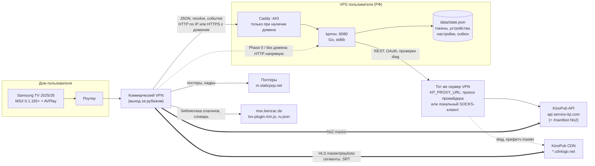
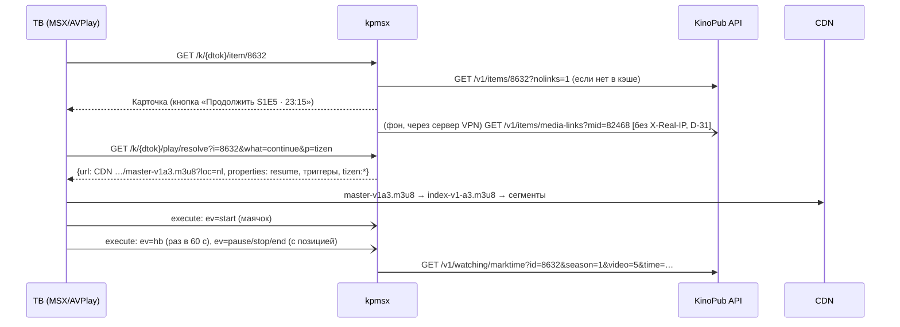
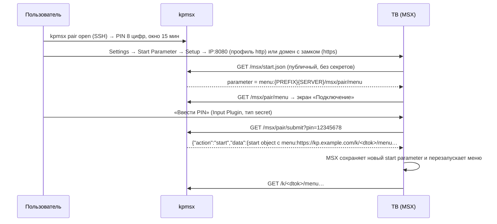
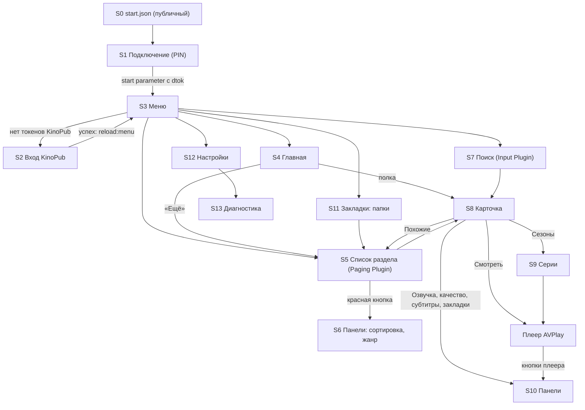

# Архитектура: MSX-приложение для KinoPub — Plan B (серверная схема)

> **Plan B (серверная схема).** Основная схема — `docs/architecture-client.md` (вся логика в interaction plugin на ТВ, без сервера). Этот документ используется, если у API KinoPub нет CORS для запросов из MSX или клиентская схема не проходит Phase 0 (CD-xx/CDG-xx в `architecture-client.md`).

- Статус: **v0.4 — финальная после прожарки**, готова к реализации. Ответы и обоснования: `docs/grill/round-1-answers.md`, `docs/grill/round-2-answers.md`; итог прожарки и перечень правок v0.4 — приложение в конце `docs/grill/design-tree.md`. Ссылки вида «round-N Qn» ведут на вопросы `docs/grill/round-N.md`; V-xx и M-xx — правки из итога прожарки.
- Факты окружения (ответы пользователя, round-1 Q1–Q5): ТВ Samsung 2025/2026 (Tizen 9/10, MSX 0.1.165+); на роутере коммерческий VPN, ТВ ходит в интернет, к CDN и к VPS с IP выхода этого VPN; VPS приложения **в РФ**, Ubuntu 24.04 LTS (`noble`), amd64, тариф неизвестен (рекомендуется от 1 ГБ RAM); API KinoPub с него, вероятно, режется по SNI, поэтому VPS выходит к KinoPub через **тот же сервер коммерческого VPN, что и роутер** — SOCKS5/HTTP-прокси провайдера или локальный клиент с SOCKS на `127.0.0.1`, адрес в `KP_PROXY_URL` (round-2 Q3, v0.4). Временный план переезда VPS в Финляндию после прожарки отменён: пользователь остаётся на VPS в РФ; домена пока нет; код в приватном GitHub, сборка в GitHub Actions, на VPS только деплой; одно устройство KinoPub, клиент `xbmc` в конфиге, 4K/HEVC выключены по умолчанию.
- Дата: 2026-10-05.
- Входные данные: `docs/research/msx-platform.md`, `docs/research/kinopub-api.md`, `docs/research/prior-art-and-playback.md`, исходники prior art в `/tmp/kp-research` и `/tmp/kp`.
- Область: личное использование, один аккаунт KinoPub, 1–3 телевизора Samsung (Tizen), сервер на VPS пользователя.

---

## 0. Как читать документ

### 0.1 Обозначения

| Префикс | Что это | Где полный список |
|---|---|---|
| `D-NN` | Принятое архитектурное решение | §14 (журнал решений) |
| `A-NN` | Допущение: факт не проверен, указано, чем проверим | §15.1 |
| `R-NN` | Риск с планом снятия | §15.2 |
| `Q-NN` | Вопрос к пользователю (есть значение по умолчанию, работу не блокирует) | §15.3 |
| `NFR-NN` | Нефункциональное требование с числом | §2 |
| `DG-NN` | Проверка диагностического инструмента на VPS | §11.5 |
| `TV-NN` | Проверка на телевизоре (экран «Диагностика») | §11.5 |
| `AC-NN` | Пункт приёмочного чек-листа на ТВ | §12.9 |

Пометки уверенности из research: **[✔]** подтверждено кодом, документацией или зафиксированными ответами; **[~]** один источник или косвенно; **[?]** не проверено.

### 0.2 Термины

| Термин | Значение |
|---|---|
| ТВ | Samsung Smart TV (Tizen) с приложением Media Station X (MSX) |
| VPS | Сервер пользователя в РФ (Ubuntu 24.04, amd64); к API KinoPub выходит через тот же сервер коммерческого VPN, что и роутер (`KP_PROXY_URL`: прокси провайдера или локальный SOCKS-клиент) |
| `kpmsx` | Наш серверный процесс на VPS (один бинарник) |
| `kpmock` | Mock-сервер KinoPub API и CDN для разработки и тестов |
| AVPlay | Нативный плеер Samsung, который MSX использует для `video:{URL}` на Tizen 2016+ (MSX ≥ 0.1.128) |
| `hls1` | Тип потока KinoPub `hls` (v1): один файл, одно качество, одна муксованная аудиодорожка, `…/master-v1aN.m3u8` |
| `hls2` | Тип потока KinoPub `hls2`: адаптивный master, только первая аудиодорожка |
| `hls4` | Тип потока KinoPub `hls4`: адаптивный master со всеми озвучками и субтитрами |
| `hls4r` | Наш «урезанный» `hls4`: master, собранный на VPS, с одной выбранной озвучкой |
| `dtok` | Токен устройства (телевизора) для доступа к VPS, выдаётся при сопряжении |
| `mid` | ID видео или эпизода в KinoPub (`videos[].id` / `episodes[].id`), параметр `media-links` |
| TTFF | Time to first frame: от нажатия «Смотреть» до первого кадра |
| SWR | Stale-while-revalidate: отдаём кэш сразу, обновляем в фоне |

### 0.3 Ключевые решения на одной странице

| Область | Решение | ID |
|---|---|---|
| Поставка | Phase 0 «пробник» (diag + тесты на ТВ) строится первым; Phase 1 и 2 разрабатываются параллельно с полевым тестом Phase 0 против `kpmock`; каждая развилка §16.3 переключается конфигом или изолированным модулем (§16.6). Механизм попадает в код, только если без него не проходит AC или его нужность показал Phase 0 | D-28, D-44, §16 |
| Модель UI | Весь MSX JSON генерирует сервер на VPS. Своего JS на ТВ нет. Бесконечные списки и ввод текста — официальные Paging Plugin v0.0.4 (контракт `{OFFSET}`/`{LIMIT}`) и Input Plugin v0.0.21, раздаются с нашего VPS; в их HTML изменён только путь к `tvx-plugin.min.js` | D-01, D-11, D-12, D-25 |
| Стек и поставка | Go 1.27 (только stdlib). Сборка и тесты — GitHub Actions, образ `linux/amd64` в приватный GHCR (Caddy зеркалируется туда же); на VPS только `deploy/update.sh` (pull + up), контейнеры в сети хоста, classic PAT для чтения GHCR. На Mac Go из brew, Docker не нужен | D-02, D-32, D-42 |
| Сеть VPS | VPS выходит к KinoPub через тот же сервер VPN, что и роутер: `KP_PROXY_URL` = SOCKS5/HTTP провайдера или локальный клиент (sing-box, xray, `wireproxy`) на `127.0.0.1`. DG-00 первым показывает, работает ли путь и какой у VPS IP выхода. Схема не зависит от локации: если API доступен напрямую, `KP_PROXY_URL` пуст и `LINK_IP_MODE=from-request` (§16.3) | D-36 |
| Транспорт ТВ → VPS | Phase 0 и запасной режим — `http://<IP>:<порт>` без Caddy (MSX на Tizen работает в local context и принимает HTTP). Постоянный режим — HTTPS с доменом (Caddy, Let's Encrypt); подойдёт бесплатный DDNS-поддомен | D-04, D-37 |
| Версия MSX | Одна целевая версия — 0.1.165+ (Samsung 2025/2026). Гейтинга и обходов для старых версий нет | D-38 |
| Хранилище | Один файл `state.json` с атомарной записью. Без БД | D-03 |
| Доступ ТВ к VPS | Сопряжение по одноразовому PIN (окно 15 мин), после него MSX сохраняет start parameter с токеном устройства. Второй ТВ подключается из настроек уже подключённого | D-05, D-35 |
| Поток на Tizen | По умолчанию `hls1`: файл нужного качества, озвучка подменой `a1→aN` в URL, master и сегменты ТВ берёт прямо с CDN. Резерв в MVP — `hls2`. `hls4r` — только если Phase 0 покажет необходимость | D-06, D-28 |
| Путь медиа | Сегменты всегда идут ТВ ↔ CDN напрямую. Ретрансляция через VPS не строится, пока данные не покажут, что без неё нельзя | D-07 |
| Ссылки и IP | `media-links` запрашивает VPS без `X-Real-IP` (`LINK_IP_MODE=none`): в штатной схеме VPS и ТВ выходят в интернет с одного IP сервера VPN, и ссылка выдаётся для того же IP, с которого ТВ качает видео. Сервер постоянно сравнивает свой IP выхода с IP ТВ (DG-23, TV-03); `from-request`, D-39 и ретрансляция — отложенные резервы | D-08, D-31, D-39 |
| Прогресс | Heartbeat по тикам плеера раз в 60 с (`trigger:60t` + `player:ticking:restart`), `pause`/`stop`/`end` → `marktime`. «Просмотрено» — после 90 %, с проверкой ответа `toggle` | D-09, D-10, D-30 |
| Автопереход | Серверный: в ответе resolve эпизода `button:next`/`button:prev` ведут на resolve следующей/предыдущей серии (с переходом через сезоны), `trigger:complete` нажимает `next`. Одинаково для запуска с карточки и из списка серий | D-29 |
| Resume | `resume:position` из данных KinoPub в ответе `video:resolve`. Локальный `resume:key` MSX не используем | D-15 |
| Кэш и скорость | In-memory SWR: любые закэшированные данные отдаются сразу (персональные — с оверлеем прогресса), обновление в фоне, экран перерисовывается через 3 с только если изменились персональные данные (D-40). Главная кнопка карточки выбирает серию и позицию в момент запуска (D-41). Префетч карточки по фокусу и ссылок при открытии карточки | D-14, D-26, D-33, D-34, D-40, D-41 |
| Нагрузка на KinoPub | Не больше 3 параллельных запросов (фон — 1), backoff на 429, кэш | D-16 |
| Разработка и обратная связь | Всё против `kpmock`. Живую сеть проверяют `kpmsx diag` на VPS и экран «Диагностика» на ТВ; результаты возвращаются разработчику одним файлом `kpmsx diag bundle` | D-18, D-19, D-32 |

---

## 1. Цели, не-цели, scope MVP

### 1.1 Цели

| ID | Цель | Мера успеха |
|---|---|---|
| G-1 | Пользователь добавляет приложение в MSX на ТВ и пользуется KinoPub без других устройств, кроме разового ввода кода на телефоне | Приёмка AC-01…AC-24 пройдена на ТВ пользователя |
| G-2 | Быстрый UI | NFR-01…NFR-05 |
| G-3 | Быстрый старт видео | NFR-06, NFR-07 |
| G-4 | Прогресс просмотра общий с другими клиентами KinoPub | NFR-08, NFR-09, AC-14 |
| G-5 | Посторонние не могут пользоваться VPS и аккаунтом | NFR-19…NFR-21, §6 |
| G-6 | Разработка и тесты без доступа к KinoPub | `make check` проходит на Mac без сети к KinoPub |
| G-7 | Неизвестные факты платформы проверяются одним запуском diag на VPS и одним экраном на ТВ | §11.5 |

### 1.2 Scope MVP

| # | Функция | Что входит | API KinoPub | Экран (§8) |
|---|---|---|---|---|
| F-1 | Сопряжение ТВ с VPS | PIN, выдача `dtok`, запись start parameter, подключение следующего ТВ из настроек уже подключённого, отзыв устройств через CLI | — | S1, S12 |
| F-2 | Авторизация KinoPub | Device flow: код на экране ТВ, ввод на `kino.watch/device`, автоопрос, `device/notify`, выход | `/oauth2/device`, `/oauth2/token`, `/v1/device/*` | S2 |
| F-3 | Главная | Полки: «Продолжить просмотр», «Новые фильмы», «Новые сериалы», «Популярные фильмы», «Популярные сериалы», «Горячее: фильмы», «Горячее: сериалы», «Закладки» (папки) | `/v1/history`, `/v1/watching/serials`, `/v1/items/fresh\|popular\|hot`, `/v1/bookmarks` | S4 |
| F-4 | Каталог | Разделы по типам: Фильмы, Сериалы, Мультфильмы, Документальное, ТВ-шоу, Концерты. Сортировка (6 вариантов), фильтр по жанру, бесконечная прокрутка порциями по 48 | `/v1/items`, `/v1/genres` | S5, S6 |
| F-5 | Поиск | Экранная клавиатура (рус/англ) с пульта, автопоиск от 2 символов, результаты с догрузкой | `/v1/items/search` | S7 |
| F-6 | Карточка | Постер, описание, рейтинги; кнопки «Смотреть/Продолжить», «Сезоны», «Озвучка», «Качество», «Субтитры», «Закладки», «Похожие», «Отметить просмотренным» | `/v1/items/{id}?nolinks=1`, `/v1/items/similar` | S8 |
| F-7 | Сезоны и эпизоды | Переключение сезонов, отметки просмотренного, прогресс по эпизоду, отметка эпизода вручную | данные карточки, `/v1/watching/toggle` | S9 |
| F-8 | Воспроизведение | AVPlay; выбор озвучки, качества, субтитров до старта и во время просмотра; автопереход к следующей серии | `/v1/items/media-links` | §5 |
| F-9 | Прогресс | Resume с позиции KinoPub; `marktime` во время просмотра; «просмотрено» после 90 % | `/v1/watching/marktime`, `/v1/watching/toggle` | §9 |
| F-10 | Закладки | Добавить в папку или убрать; список папок; содержимое папки | `/v1/bookmarks*` | S10, S11 |
| F-11 | Настройки | Качество по умолчанию, предпочитаемая озвучка, тип потока, CDN-сервер, субтитры по умолчанию, AC3, HEVC, 4K. Буфер старта, размер постеров и фоны карточек — переменные окружения (round-1 Q7) | `/v1/device/{id}/settings`, `/v1/references/*` | S12 |
| F-12 | Диагностика | CLI `kpmsx diag` на VPS, экран «Диагностика» на ТВ с тестами воспроизведения, `kpmsx diag bundle` — один обезличенный файл для разработчика | все | S13, §11.5 |

### 1.3 Что точно не делаем

| Не делаем | Почему | Когда пересмотреть |
|---|---|---|
| Несколько аккаунтов KinoPub, профили | Личное использование, один аккаунт (решение пользователя 5) | Не планируется |
| Свой interaction plugin или свой видеоплагин (hls.js) на ТВ | На Samsung используем AVPlay; свой JS добавляет загрузку iframe, ES5-ограничения и тестирование только в браузере (D-01) | Если AVPlay не тянет поток на ТВ пользователя (R-04) или понадобятся LG/Android |
| Оптимизацию под LG webOS, Android TV, браузер | ТВ пользователя — Samsung (решение 3). Другие платформы получают тот же `hls1` в HTML5-плеере без гарантий | Появится такой ТВ |
| Ретрансляцию видеосегментов через VPS по умолчанию | Нагрузка на канал и трафик VPS, лишний hop. Включается только как аварийный режим (D-07) | Если DG-14/TV-03 покажут жёсткую привязку ссылок к IP |
| Обход блокировок | Сеть обеспечивает пользователь (VPN на роутере, решение 1) | — |
| ТВ-каналы `/v1/tv`, подборки, комментарии, голосование, трейлеры, полный экран «История» | Не входят в запрошенный scope | После MVP |
| Создание, переименование и удаление папок закладок с ТВ | Требует ввода текста в панели, Input Plugin с панелями не работает. В MVP только автосоздание папки «MSX», если папок нет | После MVP |
| Админ-веб-интерфейс | Один технический пользователь, хватает CLI | — |
| Серверный ресайз картинок | Нужна зависимость или плохой ресайз средствами stdlib. Используем готовые размеры KinoPub (D-13) | Если постеры окажутся узким местом на ТВ |
| Хранение токенов KinoPub на ТВ, запросы ТВ к API KinoPub | Токены на VPS (решение 2); CORS API не проверен | — |
| Поддержка MSX ниже 0.1.165 | Одна целевая версия (D-38, round-1 Q1) | — |
| 4K и HEVC по умолчанию | Риск зависаний и несовместимости (§5). Доступно в настройках (решение оркестратора по Q5) | По результатам TV-03 |
| Механизмы без доказанной нужности: `hls4r` и полный `hls4`, ретрансляция через VPS, `AUTH_MODE=ip`, серверная цифровая клавиатура, `LIST_MODE=pages`, запасной HTTP, ZeroSSL первым с EAB, `PLAYER_PROPS_IN=item`, маячки `load`/`ready`, снапшот кэша, формат Prometheus и HTTP-админка, DG-18/DG-19 | Правило D-28: в код попадает только то, без чего не проходит AC, или то, нужность чего показал Phase 0 (round-1 Q7). Эскизы и условия включения сохранены | Условие из §16.4 |
| Отдельное устройство KinoPub на каждый ТВ | Решение оркестратора по Q5: одно устройство на VPS, одновременный просмотр на 2 ТВ поддерживается на уровне «не ломается» (общий токен) | Если AC-22 покажет, что KinoPub режет второй поток |

### 1.4 Поддерживаемые окружения

Матрица свёрнута до одной целевой версии (round-1 Q1, D-38).

| Окружение | Уровень |
|---|---|
| Samsung 2025/2026, Tizen 9/10, MSX 0.1.165+ | Единственная целевая платформа. Golden-тесты и приёмка — только для неё |
| Другие Samsung и другие версии MSX | Не поддерживаются и не тестируются. При `v < 0.1.165` сервер добавляет в меню строку-предупреждение «Версия MSX ниже 0.1.165, работа не гарантируется» и работает как обычно |
| Web-версия MSX в Chrome на Mac | Только для e2e-тестов навигации и триггеров (§12.6) |
| LG, Android TV, Fire TV | Не поддерживаются |

Известный факт для целевой платформы: AVPlay на Tizen 9 зависает на полном `hls4` master в 4K с несколькими аудиодорожками [~ lampa_kinopub, F6]. Поэтому полный `hls4` в приложении не используется, а 4K выключен по умолчанию (§5).

Версию MSX сервер получает из параметра `v`, который MSX добавляет к каждому JSON-запросу [✔ wiki Requests]. Платформу и плеер — из ключевых слов `{PLATFORM}` и `{PLAYER}` в URL меню и resolve [✔ wiki Requests].

---

## 2. Нефункциональные требования

### 2.1 Сетевые допущения для бюджетов

Маршрут у пользователя (round-1 Q2, Q3; round-2 Q3): ТВ → роутер → коммерческий VPN (выход за рубежом) → VPS в РФ → тот же сервер VPN (прокси провайдера или локальный SOCKS-клиент) → API KinoPub (Франция). Видео: ТВ → VPN → CDN (NL).

| Сегмент | Значение для расчётов | Чем проверим |
|---|---|---|
| RTT ТВ ↔ VPS (через выход VPN за рубежом обратно в РФ) | 80–150 мс | `ping`/`mtr` до VPS с компьютера в домашней сети; косвенно AC-05 |
| RTT VPS ↔ API KinoPub через сервер VPN | 50–150 мс (зависит от места сервера VPN) | DG-00, DG-04 |
| Время ответа API KinoPub | 150–600 мс; `items/{id}` длинного сериала до 1,5 с | DG-04, DG-09 |
| Канал дома до CDN через VPN | ≥ 30 Мбит/с | TV-03 |

Вывод: путь до VPS у пользователя длиннее, чем предполагалось в v0.1, а промах кэша стоит ещё одного плеча через сервер VPN. Поэтому серверный кэш, префетч по фокусу (D-33) и префетч ссылок (D-26) — основные средства скорости, а не оптимизации «на потом».

### 2.2 Латентность UI

Серверное время измеряется в `kpmsx` от получения запроса до последнего байта ответа (метрика `http_request_duration_seconds`). Время на ТВ — от нажатия до появления экрана.

| ID | Сценарий | Бюджет | Как измеряем |
|---|---|---|---|
| NFR-01 | Ответ сервера при попадании в кэш (любой экран) | p95 ≤ 15 мс | метрика с меткой `cache=hit` |
| NFR-02 | Экран на ТВ, данные в кэше VPS | p95 ≤ 500 мс (RTT до VPS у пользователя 80–150 мс, §2.1) | AC-05 (секундомер, 10 замеров), e2e-тайминги |
| NFR-03 | Экран, требующий одного запроса к KinoPub (страница каталога, поиск, карточка) | сервер p95 ≤ 1500 мс; на ТВ ≤ 2 с. Для карточек это редкий путь: обычно карточка уже в кэше благодаря префетчу по фокусу (NFR-23) | `kpmsx stats` с меткой `cache=miss`, contract-тест с задержкой mock 600 мс |
| NFR-04 | Главная | Есть хоть какие-то данные в кэше: сервер p95 ≤ 30 мс — все полки из кэша, персональные с оверлеем прогресса, обновление в фоне, условная перерисовка (D-40). Сервер ждёт KinoPub, только если данных нет совсем (первый вход, рестарт): общий дедлайн 1,2 с, полки без данных не выводятся (round-1 Q9, round-2 Q1) | `kpmsx stats`, contract-тест C-20 с задержкой mock 600 мс |
| NFR-23 | Открытие карточки нового тайтла после ≥ 1 с фокуса на его плитке | Сервер отдаёт карточку из кэша (цель — ≥ 80 % открытий), на ТВ p95 ≤ 500 мс (round-1 Q14) | AC-25, доля `cache=hit` для маршрута карточки в `kpmsx stats` |
| NFR-05 | `video:resolve` | после префетча p95 ≤ 30 мс; без префетча p95 ≤ 1200 мс | метрика `resolve_duration_seconds{prefetched}` |

### 2.3 Видео

| ID | Требование | Бюджет | Как измеряем |
|---|---|---|---|
| NFR-06 | TTFF старта с начала, режим `hls1`, 1080p, канал ≥ 30 Мбит/с, ссылки предзагружены | p50 ≤ 2,5 с; p95 ≤ 4,0 с | По серверным отметкам: `start_beacon_at − resolve_received_at` + 0,3 с; TV-03 и AC-10 (10 запусков) |
| NFR-06b | TTFF с resume (`resume:position`), те же условия | p50 ≤ 3,0 с; p95 ≤ 4,5 с (round-1 Q15: MSX делает seek после старта, это второй цикл буферизации) | Серверные отметки; TV-04, AC-13 |
| NFR-07 | Смена озвучки или качества во время просмотра до продолжения воспроизведения | p95 ≤ 5 с | AC-12 |
| NFR-08 | Точность resume | старт в пределах ±5 с от сохранённой позиции | AC-13, TV-04 |
| NFR-09 | Потеря прогресса при выключении ТВ кнопкой питания | ≤ 60 с (heartbeat раз в 60 с, D-30) | AC-15 |
| NFR-10 | «Просмотрено» | ставится в окне 90–100 % и никогда раньше 90 % | unit-тесты §9, AC-16 |

Разбивка бюджета NFR-06 (оценка, проверяется TV-03 и TV-04 по серверным отметкам):

| Шаг | Оценка |
|---|---|
| Нажатие → запрос resolve (MSX) | 50 мс |
| Resolve: RTT ТВ↔VPS (через VPN в РФ) + ответ из кэша | 100–200 мс |
| Открытие UI плеера MSX | 100–200 мс |
| Соединение с хостом CDN: DNS + TCP + TLS через VPN (хост `<uuid>.ams-static-NN.cdntogo.net` у тайтлов разный) | 100–300 мс |
| AVPlay: master `master-v1aN.m3u8` с CDN | 1 RTT CDN, 50–150 мс (уходит, если подтвердится TV-13: отдавать сразу media playlist) |
| AVPlay: media playlist `index-v1-aN.m3u8` | 1 RTT CDN, 50–150 мс |
| Буфер старта 4 с при 1080p (~6 Мбит/с → ~3 МБ) на канале 30–50 Мбит/с | 0,5–1,0 с |
| Инициализация декодера, первый кадр | 0,3–0,5 с |
| **Итого, старт с начала** | **1,3–2,6 с** |
| Resume: seek на позицию после старта и повторная буферизация (NFR-06b) | +0,5–1,0 с |
| **Итого, старт с resume** | **1,8–3,6 с** |

### 2.4 Размеры

| ID | Объект | Лимит |
|---|---|---|
| NFR-11 | JSON-ответы до gzip: меню ≤ 6 КБ; главная ≤ 48 КБ; страница списка (48 элементов) ≤ 32 КБ; карточка ≤ 20 КБ; список серий ≤ 40 КБ (сезон > 50 серий делится на страницы); панель ≤ 16 КБ; resolve ≤ 6 КБ. Ответы сжимает gzip сам `kpmsx` (D-43) | golden-тесты проверяют размер |
| NFR-12 | Картинки: постер в сетке — `medium` 250×375 (~25–45 КБ) в ячейку 192×300; постер на карточке — `big` 500×750 в область 408×612; кадр эпизода — `thumbnail` 480×270; полноэкранный фон по умолчанию выключен (`wide` бывает до 3840×2160) | golden-тесты на выбор размера |

Формула размеров ячеек MSX при 1080p: `144 × units − 24` px, в режиме `compress` — `108 × units − 24` px [✔ msx-platform §2.6].

### 2.5 Нагрузка на KinoPub

| ID | Требование |
|---|---|
| NFR-13 | Одновременно не больше 3 запросов «переднего плана» и 1 фонового (префетч, прогрев). Суммарно не больше 5 запросов/с (token bucket, ёмкость 5) |
| NFR-14 | На 429 и 5xx — не больше 2 повторов на запрос с паузами 3 с и 6 с (±20 % jitter). После 429 параллельность падает до 1 на 30 с, затем возвращается к 3 |
| NFR-15a | Холодный экран делает не больше 2 запросов к KinoPub. Исключение — холодная главная: до 8 запросов переднего плана по 3 параллельно, первой — «Продолжить просмотр», дедлайн 1,2 с (NFR-04). Обновление главной по расписанию — фоновый класс |
| NFR-15b | Никаких запросов «по элементу» при построении сеток (N+1 запрещён) |

### 2.6 Ресурсы VPS и надёжность

| ID | Требование |
|---|---|
| NFR-16 | `kpmsx`: RSS ≤ 150 МБ (цель 60 МБ), кэш ограничен 64 МиБ, средняя загрузка CPU < 5 % одного vCPU, готовность к работе ≤ 1 с после старта. Docker-образ ≤ 25 МБ. Данные на диске ≤ 100 МБ. Проверка — самоотчёт `kpmsx diag` на VPS (DG-25), а не CI (round-1 Q13) |
| NFR-17 | VPS: тариф неизвестен; минимум 1 vCPU, 512 МБ RAM, 5 ГБ диска, рекомендация — от 1 ГБ RAM, потому что рядом может работать локальный VPN/SOCKS-клиент (вариант C, §13.4). Ubuntu 24.04 LTS, amd64. На VPS ничего не компилируется (D-32) |
| NFR-18 | Рестарт VPS: сервис готов ≤ 10 с, первая главная собирается холодным путём (NFR-04); снапшот кэша отменён (round-1 Q7/Q9). Если VPS недоступен во время просмотра, видео продолжает играть: сегменты идут с CDN напрямую |

### 2.7 Безопасность и совместимость

| ID | Требование | Проверка |
|---|---|---|
| NFR-19 | В логах нет токенов KinoPub, `dtok`, PIN, поисковых запросов и подписанных URL CDN. Access-лог Caddy выключен, единственный журнал запросов — `kpmsx` (round-1 Q16) | автотест: прогон сценариев и поиск секретов в логах (§12.2); проверка, что в Caddyfile нет директивы `log` |
| NFR-20 | Все маршруты, кроме публичных (§6.3), требуют `dtok` | тест-краулер: каждый маршрут с неверным токеном отвечает 404 (кроме меню — экран «Устройство не подключено» без данных) |
| NFR-21 | Подбор PIN: не больше 5 попыток за 15 мин с одного IP, не больше 20 за окно сопряжения; вне окна PIN не проверяется вовсе (ответ «окно закрыто») | unit- и contract-тесты |
| NFR-22 | Целевая MSX 0.1.165+ (D-38); других версий не поддерживаем | golden-тесты только для целевой версии; e2e на web 0.1.167 |

---

## 3. Компонентная архитектура

### 3.1 Схема



ТВ ходит в интернет, к CDN и к VPS через коммерческий VPN роутера (round-1 Q2). VPS находится в РФ и выходит к KinoPub через тот же сервер VPN (D-36, round-2 Q3), поэтому KinoPub и CDN видят ТВ и VPS с одного IP. Видеотрафик ТВ ↔ CDN не проходит через VPS (D-07).

### 3.2 Маршрутизация запросов

| Запрос | Кто → куда | Через VPS | Примечание |
|---|---|---|---|
| `start.json`, меню, контент, панели (MSX JSON) | ТВ → VPS | да | Каждый экран — один HTTP-запрос |
| HTML/JS плагинов Paging и Input | ТВ → VPS (`/static/msx/…`) | да, статика | Плагины подключают `//msx.benzac.de/js/tvx-plugin.min.js` |
| Данные для плагинов (страницы списков, результаты поиска) | плагин на ТВ → VPS | да | Тот же origin, CORS не нужен (но отдаётся) |
| API KinoPub | VPS → сервер VPN → API | — | В основном режиме ТВ не ходит в API, токены не покидают VPS. Исключение — запасной режим D-39 (ТВ сам получает ссылку через `media-video-link`) |
| `video:resolve` (получение URL потока) | ТВ → VPS | да | Ответ из кэша префетча |
| Master `hls1` (`master-v1aN.m3u8`), media playlists, сегменты | ТВ → CDN | **нет** | Основной режим |
| Master `hls2`/`hls4` (на API-хосте, `/manifest/…`) | ТВ → API-хост | нет | Режимы `hls2` и `hls4` |
| Master `hls4r` (~1 КБ) | ТВ → VPS | да | Отложено до Phase 3 (D-28, §16.4) |
| Субтитры SRT | ТВ → CDN | нет | Подписанные ссылки из `media-links` |
| Постеры, кадры эпизодов | ТВ → `m.staticpop.net` | нет | Не подписаны [✔] |
| События плеера (прогресс) | ТВ → VPS → API | да | `execute:` действия MSX |
| Аварийная ретрансляция (D-07) | ТВ → VPS → сервер VPN → CDN | да | Отложено (§16.4): двойной транзит видео; рассматривается последним |
| Префетч карточки по фокусу (D-33) | ТВ → VPS → сервер VPN → API | да | `execute:service:silent:` из `selection.action`, тело пустое, ответ пустой |
| Условное обновление экрана (D-40) | ТВ → VPS | да | `execute:service:silent:…/check` через 3 с после показа главной, карточки или списка серий |

### 3.3 Выбор модели генерации UI

Сравнивались три варианта.

| Критерий | A. Всё на сервере: MSX грузит JSON по URL | B. Свой interaction plugin на ТВ + сервер как API | C. Гибрид: свой плагин-«мост», сервер рендерит JSON |
|---|---|---|---|
| Сетевые запросы на экран | 1 (ТВ → VPS) | 1 (плагин → VPS), плюс клиентский кэш | 1 (через плагин) |
| Холодный старт приложения | Только JSON меню (~4 КБ) | iframe + `tvx-plugin.min.js` (~100 КБ) + бандл плагина, инициализация JS на слабом CPU | Как в B |
| Где логика | Go на VPS | ES5 JS на ТВ + сервер | Распределена |
| Тестируемость без KinoPub и без ТВ | Полная: Go-тесты против `kpmock`, golden JSON, краулер по всем действиям | Логику плагина можно проверить только в браузере (web MSX, Chrome LNA) | Как в B |
| Совместимость со старыми MSX | JSON-фичи гейтятся по `v` на сервере | Плагин должен быть ES5 и проверять версию сам | Как в B |
| Бесконечные списки, ввод текста | Нужны плагины. Есть готовые официальные: Paging, Input | Пишем сами | Пишем сами |
| Состояние | На сервере, переживает перезапуск MSX | В памяти iframe, теряется при перезагрузке плагина | Смешанное |
| Prior art на Tizen | Семейство kp-msx (slonopot, lmnskate, qnox) — в эксплуатации | RBTV (не KinoPub), arshakpetr (сгенерированный, не проверен) | TorrServer |
| Объём нашего кода на ТВ | 0 строк | 1500–3000 строк ES5 | 400–800 строк ES5 |

**Выбор: вариант A** (D-01). Обоснование:

1. Токены живут на VPS (решение 2), значит, каждый экран всё равно требует RTT до VPS. Генерация JSON на сервере стоит < 2 мс. Плагин на ТВ не убирает этот RTT, но добавляет загрузку JS и iframe.
2. Вся логика тестируется в Go против `kpmock` (решение 4: KinoPub с Mac недоступен).
3. MSX сама кэширует JSON в пределах сессии (`cache`/`reuse`), поэтому возврат назад мгновенный без клиентского кода.
4. Две функции, которым нужен JS (бесконечные списки и ввод текста с пульта), закрываются официальными плагинами автора MSX. Мы раздаём их закреплённые копии со своего VPS (D-11, D-12). Лицензия MSX разрешает копировать и изменять примеры и исходники плагинов [✔ msx-platform §8]. lmnskate/kp-msx v3.0.0 в эксплуатации использует Input Plugin и изменённую копию Paging Plugin [✔ код]; мы берём официальный Paging Plugin с контрактом `{OFFSET}`/`{LIMIT}` (round-1 Q8, FX-03).
5. Ограничение «одновременно загружен один interaction plugin» [~ msx-platform §4.9] даёт один известный крайний случай (возврат из поиска в уже расширенный список, §8.3 S5). Последствие безопасное: список перестаёт догружаться, пока экран не открыть заново.

Условия пересмотра в пользу C: (1) e2e или ТВ покажут конфликт Paging/Input чаще крайнего случая из §8.3; (2) понадобится свой плеер на hls.js (LG/Android); (3) A-11 не подтвердится на ТВ.

### 3.4 Модули сервера

| Пакет `internal/…` | Ответственность | Ключевые зависимости |
|---|---|---|
| `config` | Чтение и валидация env, значения по умолчанию, вывод эффективной конфигурации без секретов | — |
| `store` | `state.json`: атомарная запись, миграции схемы, ротация бэкапов | — |
| `kpapi` | HTTP-клиент KinoPub: пул соединений через `KP_PROXY_URL` (http/https/socks5, D-36), лимитер, приоритеты, ретраи, circuit breaker, толерантный JSON, типизированные модели | `store` (токены) |
| `auth` | Device flow, single-flight refresh, фоновое продление, `device/notify`, применение настроек устройства KinoPub | `kpapi`, `store` |
| `devices` | Сопряжение (PIN, окно), `dtok`, настройки каждого ТВ, предпочтения озвучки | `store` |
| `cache` | TTL + SWR, single-flight по ключу, LRU по байтам | — |
| `catalog` | Главная, списки, поиск, карточка, сезоны, закладки | `kpapi`, `cache` |
| `playback` | Выбор режима и файла, подмена `aN`, `loc`, префетч `media-links` (ключ кэша включает IP, для которого выдана ссылка), resolve (включая `what=continue`, D-41), следующая/предыдущая серия (D-29), цепочка fallback, проверка совпадения IP выхода (§5.12). `hls4r`, ретрансляция и D-39 — только если их включит §16.4 | `kpapi`, `cache`, `devices` |
| `progress` | Сессии просмотра, пороги, `marktime`/`toggle`, outbox | `kpapi`, `store`, `cache` |
| `msx` | Типы MSX JSON, построители экранов, строки интерфейса, хеш персональной части экранов для условного обновления (D-40) | — |
| `web` | Маршруты, middleware (аутентификация `dtok`, rate limit, CORS, request-id, маскирование логов, обработка паник) | все |
| `diag` | Проверки DG-xx и TV-xx; общие для CLI и экрана ТВ; `diag bundle` (HTTP-админка `/admin/diag` отменена, round-1 Q16) | `kpapi`, `playback` |
| `telemetry` | Счётчики и кольцевые буферы в памяти для `kpmsx stats`, журнал сессий воспроизведения (формат Prometheus отменён, round-1 Q7) | — |

### 3.5 Ключевые последовательности

Старт приложения на уже сопряжённом ТВ:

```mermaid
sequenceDiagram
  participant TV as ТВ (MSX)
  participant S as kpmsx (VPS)
  participant K as KinoPub API
  TV->>S: GET /k/{dtok}/menu?p=tizen&pl=…&v=0.1.165
  S-->>TV: Menu Root (статический, ~4 КБ)
  Note over S: фоном: refresh токена, если до истечения < 15 мин;<br/>SWR-обновление полок главной, если старше 60 с
  TV->>S: GET /k/{dtok}/home
  S-->>TV: Главная из кэша (≤ 30 мс)
  S-)K: (фон) history, watching/serials, fresh/popular/hot…
```

Открытие карточки и воспроизведение:



---

## 4. Стек и структура репозитория

### 4.1 Язык и рантайм

| Критерий | Go 1.27 (stdlib) | Node.js 22 + TypeScript | Python 3.12 + FastAPI |
|---|---|---|---|
| Зависимости рантайма | 0 сторонних пакетов: `net/http`, `encoding/json`, `log/slog`, `crypto/*` | Минимум: фреймворк или ручной роутер; сборка TS | FastAPI, uvicorn, httpx/aiohttp, pydantic |
| Холодный старт | ~10–50 мс | ~200–500 мс | ~0,5–1,5 с |
| Память | 20–60 МБ | 60–120 МБ | 80–150 МБ |
| Деплой | Один статический бинарник, образ ~15–20 МБ (distroless) | Образ 50–150 МБ, `node_modules` | Образ 100–200 МБ |
| Потоковая ретрансляция (аварийный режим) | `io.Copy`, дёшево | Нормально | Плохо: prior art предостерегает [✔ prior-art §5 п.4] |
| Тестовый инструмент | Встроен: `go test`, `httptest`, `-race`, бенчмарки | Нужен раннер (встроенный `node --test` подойдёт) | pytest |
| Prior art | — | — | kp-msx (можно сверяться, но не копировать) |

**Выбор: Go 1.27, только стандартная библиотека** (D-02; версия обновлена по round-1 Q13: 1.23 вне поддержки, на Mac в brew есть 1.27.1). Исходящий прокси http/https/socks5 поддерживается `net/http` без сторонних пакетов (D-36). Для single-flight, LRU, лимитера и метрик пишем свои небольшие реализации (по 50–150 строк), чтобы не тянуть даже `golang.org/x/*`.

### 4.2 Остальной стек

| Слой | Выбор | Обоснование |
|---|---|---|
| Тулчейн на Mac | Go 1.27 из brew (`brew install go`), Node 26 для e2e, ffmpeg для тестовых медиа — уже есть или ставятся из brew (FX-01). Docker на Mac не нужен | `make check` и e2e работают без Docker (round-1 Q13) |
| HTTP-сервер и роутинг | `net/http` с шаблонами маршрутов (`GET /k/{dtok}/item/{id}`) | Без фреймворка |
| Логи | `log/slog`, JSON в stdout | stdlib |
| TLS и внешний порт | Caddy 2 (зеркало `caddy:2@sha256` в GHCR) — только в профиле с доменом, без директивы `encode`; без домена `kpmsx` слушает порт напрямую (D-37). Сжатие ответов — в самом `kpmsx` (D-43) | Автоматический ACME |
| Тесты | `go test`, `httptest`, golden-файлы в `testdata/golden`, `-race` | stdlib |
| Mock KinoPub | `cmd/kpmock` на Go (тот же модуль) | Общие типы и фикстуры, без внешних инструментов (D-18) |
| E2E | Playwright (Node) только в `e2e/`, вне рантайма | Управление web-версией MSX в Chromium (D-19) |
| Тестовые медиа | ffmpeg только для перегенерации `testdata/media` (`make testmedia`); результат закоммичен (≤ 1 МБ) | Не нужен для обычной разработки |
| CI/CD | GitHub Actions в приватном репозитории: `go vet`, тесты с `-race`, краулер; сборка статического бинарника `linux/amd64` (arm64 — при необходимости, V-07); образ в приватный GHCR (D-32, §13.9) | Сборка не на VPS; на VPS только pull |
| Образ | `gcr.io/distroless/static-debian12:nonroot` + готовый статический бинарник `linux/amd64`, собранный в CI через `actions/setup-go` (одноэтапный Dockerfile, §13.9) | Минимальный образ без shell |
| Статический анализ | `go vet` (обязательно), `staticcheck` (в CI) | |

### 4.3 Структура репозитория

```
kinopub-msx/
├── cmd/
│   ├── kpmsx/main.go           # подкоманды: serve, healthcheck, health, stats, diag, pair, devices, backup, sessions, version
│   └── kpmock/main.go          # mock KinoPub API + CDN + управление сценариями
├── internal/
│   ├── config/
│   ├── store/                  # state.json, миграции, бэкапы
│   ├── kpapi/                  # клиент KinoPub, модели, лимитер, ретраи, circuit breaker
│   ├── auth/                   # device flow, refresh, notify, настройки устройства KinoPub
│   ├── devices/                # сопряжение, dtok, настройки ТВ
│   ├── cache/                  # TTL+SWR, singleflight, LRU
│   ├── catalog/                # главная, списки, поиск, карточка, сезоны, закладки
│   ├── playback/               # режимы потока, aN, loc, префетч, resolve (hls4r и relay — только по §16.4)
│   ├── progress/               # сессии, пороги, marktime/toggle, outbox
│   ├── msx/                    # типы MSX JSON, билдеры экранов, строки, хеши для D-40
│   ├── web/                    # маршруты, middleware
│   ├── diag/                   # проверки DG-xx/TV-xx
│   └── telemetry/              # метрики, журнал сессий
├── web/static/msx/             # закреплённые копии плагинов автора MSX + иконки
│   ├── paging-0.0.4.html, paging-0.0.4.js   # официальный Paging Plugin; в HTML изменён только путь к tvx-plugin.min.js
│   ├── input-0.0.21.html, input-0.0.21.js   # официальный Input Plugin; та же единственная правка
│   └── LICENSE-MSX.txt         # источник, версии, перечень правок (round-1 Q8)
├── testdata/
│   ├── kp/                     # фикстуры API (написаны вручную по контрактам research)
│   ├── kp/schema-real.json     # отпечаток схемы реального API (из DG-24, без значений)
│   ├── hls/                    # master hls1/hls2/hls4 (форма из дампов lampa/Apple) для diag и TV-13
│   ├── media/                  # тестовое видео: H.264 640×360, 2 аудиодорожки, TS-сегменты по 2 с и MP4
│   └── golden/                 # эталонный MSX JSON по экранам
├── e2e/                        # Playwright: package.json, тесты web MSX
├── .github/workflows/
│   └── ci.yml                  # тесты, сборка бинарников и образа, push в GHCR (§13.9)
├── deploy/
│   ├── docker-compose.yml      # профили: http (без домена) и https (Caddy)
│   ├── Caddyfile
│   ├── update.sh               # pull образа по тегу, бэкап state, up, проверка /health
│   └── .env.example
├── docs/
│   ├── architecture.md         # этот документ
│   └── research/               # исследования (только чтение)
├── Dockerfile                  # одноэтапный: готовый бинарник из CI → distroless
├── Makefile                    # check, test, race, golden, crawl, e2e, mock, run, dist
└── go.mod                      # go 1.27, без require-зависимостей
```

Фикстуры KinoPub пишем вручную по описанным в research формам. Чужие зафиксированные ответы (Kodi, Apple-клиент) используем только как справку, не копируем: у этих репозиториев свои лицензии.

---

## 5. Воспроизведение на Samsung Tizen

### 5.1 Исходные факты

| # | Факт | Источник |
|---|---|---|
| F1 | На Tizen 2016+ MSX ≥ 0.1.128 воспроизводит `video:{URL}` через AVPlay. Свойства `tizen:buffer:*`, `tizen:stream:*`, `tizen:track:*`, `tizen:subtitle:*` задаются в `properties` | [✔ wiki Tizen Player] |
| F2 | `media-links?mid=` отдаёт `files[]` (по файлу на качество, у каждого `urls.{http,hls,hls2,hls4}`) и полный список `subtitles[]` | [✔ kinopub-api §7.1] |
| F3 | В `hls1` озвучка выбирается ссылкой: `master-v1a2.m3u8 … a4` отвечают 200 и ведут на свои `index-v1-aN.m3u8`; номер = `audios[].index` | [✔ захват HipsterCat/kinopub-apple-client 2026-09-28, `/tmp/kp/HipsterCat_kinopub-apple-client/docs/providers/kinopub/hls.md`] |
| F4 | `hls2`/`hls4` master лежит на API-хосте (`api…/manifest/hls{2,4}/<mid>.m3u8`), один на все `files[]`. `hls2` несёт только первую озвучку | [✔ Apple, kinopub-api §7.2] |
| F5 | `hls4`: по варианту на качество, у каждого своя аудиогруппа с полным списком озвучек; `NAME` вида `NN. <тип>. <автор> (<LANG>)` или `Track N (<LANG>)[ AC3]`, `NN` = `audios[].index` | [✔ Apple] |
| F6 | Tizen 9 AVPlay зависает на полном `hls4` master в 4K (PLAYING без кадров). Урезанный master (1 видео + 1 аудио) и `hls2` (TS) работают стабильно, включая 4K HEVC | [~ lampa_kinopub, многократная диагностика автора] |
| F7 | AVPlay не принимает master через `data:`/`blob:`, нужен HTTP-URL | [~ lampa] |
| F8 | `http` (прогрессивный MP4) на Tizen «фризит» | [~ lampa] |
| F9 | Буфер AVPlay по умолчанию 10 с; меньший начальный буфер ускоряет старт; минимум 4 с | [✔ wiki / ~ research] |
| F10 | MSX на Samsung заморожена по году модели: 2017 → 0.1.145, 2018 → 0.1.151, 2019 → 0.1.154, 2020 → 0.1.161, 2022+ → 0.1.165 | [✔ msx-platform §8] |
| F11 | Ссылки подписаны токеном в пути: `base64url("id=<user>;…;<mid>;<issued>&h=<hash>&e=<expires>")`, `e − issued = 86400` на образцах 2021 и 2026 гг. Один источник говорит о «30–40 минутах» | [✔ формат / ? TTL] |
| F12 | AC3-дорожки на MSX часто без звука; одна озвучка бывает в 2–3 строках (`aac` 2.0, `aac` 5.1, `ac3` 5.1) | [~ kinopub-api §6.3] |

### 5.2 Варианты потока

| Критерий | V1. `hls1` + подмена `a1→aN` | V2. `hls4r`: урезка `hls4` на VPS | V3. Полный `hls4` + `tizen:track:audio` | V4. `hls2` | V5. `http` |
|---|---|---|---|---|---|
| Что получает AVPlay | Master одного файла с одним вариантом (видео + выбранная аудио в TS) | Master ~1 КБ: выбранная озвучка, варианты ≤ целевого качества | Master ~20 КБ: 12 озвучек × 4 качества + субтитры | ABR master, TS, одна озвучка | MP4 |
| Запросы до первого сегмента | resolve (VPS) → master (CDN) → playlist (CDN) | resolve (VPS) → master (VPS) → playlists видео и аудио (CDN) | resolve → master (API-хост) → playlists | resolve → master (API-хост) → playlist | resolve → MP4 (range) |
| VPS в медиапути | нет | только master | нет | нет | нет |
| Зависимость от API-хоста `/manifest` | нет (всё на CDN) | VPS забирает master с API-хоста | да | да | нет |
| Выбор озвучки | да, до старта (URL) | да, до старта | да, в плеере, но индекс трека AVPlay ↔ дорожка не проверен | нет | зависит от плеера |
| Качество | Выбор файла; сразу нужное, без ABR | ABR в пределах выбранного потолка | ABR | ABR | файл |
| Субтитры | Внешний SRT через `tizen:subtitle:url` | SRT | встроенные | SRT | SRT |
| Риск на AVPlay | Низкий: тот же пакетировщик CDN (`/hls/…/file.mp4/index-v1…`), что и варианты стабильного `hls2`; один вариант, звук муксован. Контейнер (TS или fMP4) проверяет DG-12 | Средний: альтернативная аудиогруппа (`EXT-X-MEDIA`) | Высокий (F6) | Низкий | Высокий (F8) |
| Смена озвучки | Перезапуск с позиции (~2–4 с) | Перезапуск с позиции | Без перезапуска, если работает | невозможна | — |

**Решение (D-06):**

- Режим по умолчанию на Tizen — **`hls1`** (V1). Самый простой поток для AVPlay: один вариант, TS, звук муксован. Подмена озвучки подтверждена (F3). Master лежит на CDN, поэтому старт не зависит от API-хоста и VPS (кроме resolve). Качество сразу целевое: нет «лестницы» ABR на первых секундах.
- Резерв в MVP — **`hls2`** (V4): URL уже есть в `media-links`, серверного кода почти нет. ABR без выбора озвучки.
- **`hls4r`** (V2) — отложен (D-28, round-1 Q7). Включается по §16.4, если TV-03 покажет, что `hls1` не стартует на части тайтлов, а `hls2` не подходит, потому что нужна выбранная озвучка; или если понадобится ABR с выбором озвучки.
- Полный `hls4` (V3) — отменён (round-1 Q7): на целевом Tizen 9 он зависает в 4K (F6, round-1 Q1). Используется только внутри запасного режима D-39 и только ≤ 1080p.
- `http` (V5) не предлагаем.

Цена `hls1`: нет ABR. При падении скорости будет повторная буферизация, а не снижение качества. Смягчение: потолок качества в настройках и режим `hls2` (ABR без выбора озвучки) в настройках и в цепочке fallback (§5.11).

### 5.3 Режимы и выбор по платформе

| `mode` | Что возвращает resolve | Где используется |
|---|---|---|
| `auto` (по умолчанию) | Режим по шагу цепочки §5.11 (`hls1`, при сбоях — `hls2`) | Tizen |
| `hls1` | URL CDN `…/master-v1aN.m3u8?loc=…` | Tizen, best-effort остальные платформы |
| `hls4r` | URL VPS `https://{host}/k/{dtok}/play/m/{sid}.m3u8` | Отложено (§16.4) |
| `hls2` | URL `files[0].urls.hls2` с подменой `loc` | Tizen |
| `hls4` | URL `files[0].urls.hls4` + `tizen:track:audio` | Отменено (round-1 Q7, Q1); только внутри D-39 |
| `relay` | URL VPS `https://{host}/k/{dtok}/r/{sid}/m.m3u8` (сегменты через VPS) | Отложено (§16.4) |

Платформа приходит в resolve через `p={PLATFORM}`. Целевая платформа одна (Tizen, D-38); при другой платформе сервер отдаёт тот же `hls1` без гарантий.

### 5.4 Выбор качества (файла)

Вход: `files[]` из `media-links` (для префетча годится и лестница `files[]` из карточки `nolinks=1`), настройки ТВ `max_quality` (по умолчанию 1080), `allow_hevc` (по умолчанию нет).

1. Кандидаты: файлы с непустым `urls.hls`; если `allow_hevc = false`, только `codec = h264`.
2. Высота файла = `h`, но для анаморфных файлов (1920×800) качество берём по `quality_id`/ширине: 1 = 480p, 2 = 720p, 3 = 1080p, 4 = 2160p [✔ Apple: ориентироваться на ширину].
3. Берём файл с наибольшим `quality_id` ≤ `max_quality`. Если таких нет — файл с наименьшим `quality_id`.
4. При равенстве — `h264` раньше `h265`, затем больший битрейт (если известен), затем первый по порядку.

### 5.5 Выбор озвучки

Вход: `audios[]` видео или эпизода из карточки (`index`, `codec`, `channels`, `lang`, `type{id,title}`, `author{id,title}`), предпочтения ТВ.

Предпочтения хранятся на сервере для каждого ТВ:

- `title_audio[item_id]` — выбор пользователя для тайтла (для сериала действует на все серии);
- `audio_authors` — упорядоченный список `author.id`; последний выбранный автор поднимается в начало (до 10 элементов);
- `audio_type` — предпочитаемый `type.id` (например, 6 «Оригинал», 3 «Двухголосый»); по умолчанию не задан;
- `audio_lang` — по умолчанию `rus`;
- `allow_ac3` — по умолчанию нет (F12).

Скоринг каждой строки `audios[]` (берём максимум; при равенстве — меньший `index`):

| Условие | Баллы |
|---|---|
| Совпадает с `title_audio[item]` (ключ `lang + type.id + author.id`) | +1000 |
| `author.id` в `audio_authors` на позиции k (0…9) | +500 − 10·k |
| `type.id == audio_type` | +100 |
| `lang == audio_lang` | +50 |
| `codec == aac` | +20 |
| `codec == ac3` и `allow_ac3 = false` | −300 |

Результат — `N = index`, URL `files[q].urls.hls` с заменой `master-v1a\d+\.m3u8` → `master-v1aN.m3u8`. Если строка выбрана вручную и это `ac3`, берём её как есть (пользователь знает, что делает).

Допущение A-04: номера `aN` одинаковы для всех файлов-качеств одного видео. Проверка: DG-13 по всем файлам, TV-03 тест `a2`.

### 5.6 Субтитры

- Источник — `subtitles[]` из `media-links` (полный список, до 60 дорожек) [✔ kinopub-api §7.1]. В карточке список не используем: там 0–3 строки.
- По умолчанию выключены. Настройка ТВ `subs_lang` (выкл/`rus`/`eng`) и выбор пользователя `title_subs[item]`.
- Применение: `"tizen:subtitle:url": "<SRT URL>"` в ответе resolve (MSX 0.1.141+). Строки `forced=true` выбираются автоматически, если язык озвучки отличается от `audio_lang`.
- `shift` из API (сдвиг) передаём как `tizen:subtitle:delay` в мс, если не 0.
- Если `hls4r` включат (§16.4), встроенные субтитры из master использоваться не будут: применяется тот же SRT.

### 5.7 Стартовая позиция

- Передаём `"resume:position": "<секунды>"` в `properties` ответа resolve (D-15). `resume:key` не задаём: иначе MSX хранит свою позицию на ТВ, и она расходится с KinoPub.
- Позиция берётся по правилам §9.7 (данные KinoPub плюс неотправленный outbox).
- `#EXT-X-START` в master не используем: для `hls1` master на CDN, мы его не генерируем. Для `hls4r` вопрос решается вместе с ним (Phase 3).
- Цена: MSX делает seek после старта, это второй цикл буферизации (+0,5–1 с, NFR-06b, round-1 Q15). Измеряется TV-04.

### 5.8 Свойства плеера в ответе resolve

Все свойства плеера отдаются в ответе `video:resolve`, а не в элементах списков (D-20). Так элемент эпизода в списке занимает ~200 байт вместо ~3 КБ. Работа свойств из resolve на ТВ проверяется в Phase 0 (TV-07). Если не подтвердится, свойства переезжают в `template.properties` списков с подстановками `{context:…}` (§16.4).

Пример ответа (`hls1`, эпизод S1E2, MSX 0.1.165+; v0.2 — round-1 Q10, Q11, Q15):

```json
{
  "url": "https://<uuid>.ams-static-14.cdntogo.net/hls/<TOKEN>/2/46/DBCtPgEVqLdlY5qQ5.mp4/master-v1a3.m3u8?loc=nl",
  "label": "Черное зеркало · S1E2 «Пятнадцать миллионов заслуг»",
  "properties": {
    "resume:position": "1287",
    "label:extension": "1080p · Кубик в Кубе · HLS1",
    "control:type": "extended",
    "info:text": "S1E2 · 62 мин",
    "tizen:buffer:size:init": "4",
    "tizen:buffer:size:resume": "6",
    "tizen:buffer:timeout": "10",
    "tizen:subtitle:url": "https://<cdn>/pd/subtitle/<TOKEN>/5/50/235612.srt",
    "button:content:icon": "audiotrack",
    "button:content:action": "panel:https://kp.example.com/k/<dtok>/panel/audio?i=8632&m=82469",
    "button:speed:icon": "subtitles",
    "button:speed:action": "panel:https://kp.example.com/k/<dtok>/panel/subs?i=8632&m=82469",
    "button:restart:icon": "hd",
    "button:restart:action": "panel:https://kp.example.com/k/<dtok>/panel/quality?i=8632&m=82469",
    "button:prev:icon": "default",
    "button:prev:action": "video:resolve:https://kp.example.com/k/<dtok>/play/resolve?i=8632&m=82468&s=1&e=1&p=tizen",
    "button:prev:key": "channel_down",
    "button:next:icon": "default",
    "button:next:action": "video:resolve:https://kp.example.com/k/<dtok>/play/resolve?i=8632&m=82470&s=1&e=3&p=tizen",
    "button:next:key": "channel_up",
    "trigger:complete": "player:button:next:execute",
    "trigger:back": "[execute:service:video:silent:https://kp.example.com/k/<dtok>/play/ev?m=82469&ev=stop|player:eject]",
    "trigger:start": "execute:service:silent:https://kp.example.com/k/<dtok>/play/ev?m=82469&ev=start",
    "trigger:60t": "[execute:service:video:silent:https://kp.example.com/k/<dtok>/play/ev?m=82469&ev=hb|player:ticking:restart]",
    "trigger:pause": "execute:service:video:silent:https://kp.example.com/k/<dtok>/play/ev?m=82469&ev=pause",
    "trigger:stop": "execute:service:video:silent:https://kp.example.com/k/<dtok>/play/ev?m=82469&ev=stop",
    "trigger:end": "execute:service:video:silent:https://kp.example.com/k/<dtok>/play/ev?m=82469&ev=end",
    "trigger:90%": "shot:execute:service:silent:https://kp.example.com/k/<dtok>/play/ev?m=82469&ev=w90"
  }
}
```

Пояснения:

- **Автопереход (D-29, round-1 Q10).** Следующую и предыдущую серию задаёт сервер в каждом ответе resolve, с переходом через границу сезона (после последней серии сезона — первая серия следующего). `trigger:complete` нажимает кнопку `next` (паттерн RBTV [✔ rbtv-msx]). Механизм не зависит от плейлиста MSX, поэтому одинаково работает при запуске с карточки, из списка серий и после смены озвучки. Для первой серии `button:prev` не задаётся, для последней серии и для фильмов не задаётся `button:next`, а `trigger:complete` = `player:eject`. Если на ТВ `player:button:next:execute` из триггера не сработает (TV-10), `trigger:complete` получает тот же `video:resolve:` следующей серии напрямую. Отменено из v0.1: «`trigger:complete` не задаём, работает `player:auto:next`» — плейлист собирается только из элементов шаблона, а кнопки карточки в него не входят (FX-06).
- **Heartbeat (D-30, round-1 Q11).** `trigger:60t` + `player:ticking:restart` (FX-08): раз в 60 тиков плеера уходит событие с реальной позицией, затем счётчик тиков сбрасывается. Отменено из v0.1: 19 процентных триггеров `trigger:5%…95%` и опора на `trigger:inactive` (это «видео ушло в фон внутри MSX», а не выключение ТВ, FX-07). Процентные триггеры — запасной вариант, если TV-09 покажет, что тики не работают (A-32).
- **Синтаксис событий.** `execute:service:video:silent:` задокументирован для 0.1.167+ (FX-09); целевая версия 0.1.165+ (D-38). Phase 0 проверяет на ТВ три варианта (TV-14): `execute:service:video:silent:`, `execute:service:video:`, `execute:video:`. Если `silent:` не работает: события плеера уходят первым рабочим вариантом (цена — индикатор занятости или всплывающая ошибка при недоступном VPS), а префетч по фокусу и условное обновление экранов выключаются (`PREFETCH_ON_FOCUS=off`, `SCREEN_RECHECK=off`), потому что без `silent:` они давали бы индикатор занятости на каждое движение фокуса (round-2 Q5). Порог 0.1.160 из v0.1 отменён.
- `button:speed` на Tizen свободна: AVPlay не поддерживает смену скорости [✔ wiki]. `button:restart` переназначаем на «Качество»; «С начала» есть на карточке.
- `tizen:buffer:size:init = 4` (F9) и `tizen:buffer:size:resume = 6` — стартовые значения; меняются через env `TIZEN_BUFFER_INIT`/`TIZEN_BUFFER_RESUME` по TV-03/TV-04. `tizen:buffer:timeout = 10` (было 20, round-1 Q15): ошибка AVPlay при отсутствии данных появляется через 10 с.
- Для `hls2` добавляется `"tizen:stream:ADAPTIVE_INFO": "STARTBITRATE=HIGHEST"`: варианты уже ограничены потолком качества, стартуем с верхнего.
- На повторных шагах цепочки fallback добавляется `"trigger:load": "info:Предыдущий запуск не удался — пробую <режим>"` (§5.11).

### 5.9 Префетч ссылок

Цель NFR-05: в момент нажатия «Смотреть» ссылки уже лежат в кэше VPS.

| Событие (запрос с ТВ) | Что префетчим (фоновый класс, NFR-13) |
|---|---|
| Открытие карточки фильма | `media-links` для видео, которое запустит кнопка «Смотреть/Продолжить» |
| Открытие карточки сериала | `media-links` эпизода, который запустит «Продолжить» (§9.7) |
| Открытие списка серий сезона | `media-links` первой непросмотренной серии сезона |
| Старт серии k (маячок `ev=start`) | `media-links` серии k+1 (для автоперехода) |
| Рендер главной | `media-links` первых двух элементов «Продолжить просмотр», если они не в кэше (`PREFETCH_CONTINUE=2`) |
| Фокус на плитке тайтла в сетке (S4, S5, S7) ≥ 350 мс без нового фокуса | Карточка `/v1/items/{id}?nolinks=1` (D-33, §7.4) |
| После `media-links`, только при включённом TV-13 «media playlist напрямую» | Master `hls1` тем же путём, что к API, чтобы взять из него URL `index-v1-aN.m3u8` (кэш вместе со ссылками) |

Префетч ссылок не делается для сеток каталога и поиска (NFR-15b); для них работает только префетч карточки по фокусу. Ключ кэша ссылок — `(mid, IP, для которого выдана ссылка)` (D-31). Префетч при открытии карточки идёт для серии, которую карточка считает текущей; если к моменту запуска resolve с `what=continue` выберет другую серию (прогресс изменился на другом устройстве, D-41), ссылки берутся синхронно (+0,3–0,8 с, редкий случай). Префетч и resolve одного `mid` объединяются single-flight-ом: resolve ждёт уже идущий запрос, а не делает второй.

### 5.10 Смена озвучки, качества и субтитров

До старта: кнопки «Озвучка», «Качество», «Субтитры» на карточке (и в опциях эпизода) открывают панели (S10). Выбор сохраняется для тайтла (`title_audio`, `title_quality`, `title_subs`) и сразу отражается в подписи кнопки.

Во время просмотра:

| Что | Действие пункта панели | Как применяется |
|---|---|---|
| Субтитры | `[player:commit:message:tizen:subtitle:url:{SRT}\|execute:service:silent:{pref-url}\|back]`; «Выключить» → `player:commit:message:tizen:subtitle:silent:true` | Без перезапуска (динамическое свойство AVPlay [✔ wiki]) |
| Озвучка | `execute:service:video:{switch-url}?what=audio&val=N` | Сервер сохраняет выбор и позицию из приложенных данных видео и отвечает действием `[cleanup\|player:eject\|video:resolve:{resolve-url}&pos=<позиция>]` с `data.playerLabel` |
| Качество, режим потока | то же, `what=quality\|mode` | то же |

После перезапуска через серверное действие автопереход сохраняется: следующую серию задаёт ответ resolve (D-29), контекст плейлиста MSX не нужен. Ограничение v0.1 (A-28) снято (round-1 Q10).

### 5.11 Цепочка fallback

**Обнаружение сбоя (D-27, изменено по round-1 Q15 и round-2 Q5).** Сессия считается стартовавшей по первому из событий `start`, `hb`, `pause`, `stop` с позицией > 0: потеря одного маячка не превращает успешный запуск в сбой. Сбой предыдущего запуска = новый resolve той же пары (ТВ, `mid`), если прошлая сессия не стартовала и с прошлого resolve прошло ≥ 8 с. Если прошло меньше 8 с (пользователь нетерпеливо нажал ещё раз), режим и ссылки те же. 30-секундное окно из v0.1 отменено: при `tizen:buffer:timeout = 10` ошибка AVPlay появляется раньше.

| Шаг | Режим | Ссылки | Пользователь видит в `label:extension` |
|---|---|---|---|
| 1 | `hls1` | из кэша (≤ 600 с) | `1080p · <озвучка> · HLS1` |
| 2 | `hls1` | свежий `media-links` в обход кэша | `… · HLS1 (новые ссылки)` |
| 3 | `hls2` | свежий | `… · HLS2 (резерв, озвучка по умолчанию)` |
| 4 | — | — | Resolve отвечает `{"error":"Видео не запускается. Откройте Настройки → Диагностика"}` |

Шаги `hls4r`, D-39 и ретрансляции добавляются в цепочку, только если их построят (§16.4).

Что видит пользователь при сбое: AVPlay не получает данных → через ~10 с MSX показывает свою ошибку плеера → пользователь нажимает «Назад» и снова «Смотреть». На шагах 2–3 в начале загрузки появляется всплывающее сообщение «Предыдущий запуск не удался — пробую …» (`trigger:load`). На шаге 4 MSX показывает текст ошибки resolve.

Правила:

- Успешный старт (признак старта по D-27: первое из `start`, `hb`, `pause`, `stop` с позицией > 0) сбрасывает цепочку для этого `mid`.
- Ручной выбор режима в настройках или панели отключает автоцепочку для ТВ.
- Ошибка API KinoPub при resolve (нет `urls.hls` и т. п.) сразу переводит на следующий шаг без участия пользователя.
- Отменено из v0.1 (round-1 Q15): 24-часовая память режима для тайтла и подсказка «Рекомендуем режим HLS4r» — вернутся, если журнал сессий покажет повторяющиеся сбои.

### 5.12 Привязка ссылок к IP и кто получает ссылку

**Суть.** Ссылки на поток подписаны. Если CDN проверяет, что IP скачивающего совпадает с IP, для которого выдана ссылка, воспроизведение сломается, когда ссылку получил один адрес, а качает другой.

**Штатная схема сети (round-1 Q2, round-2 Q3).** ТВ ходит в интернет, к CDN и к VPS через коммерческий VPN роутера, с IP выхода `IP_vpn`. VPS выходит к KinoPub через **тот же сервер** этого VPN: SOCKS5/HTTP-прокси провайдера или локальный клиент с SOCKS на `127.0.0.1`, адрес в `KP_PROXY_URL` (§13.4). Поэтому ссылку запрашивает адрес `IP_vpn`, и качает её тот же `IP_vpn`. Риск привязки к IP (A-01/A-02) в штатной схеме снят без кода. Остаётся поймать расхождение, если роутер или провайдер выдаст разные IP выхода (A-35).

**Что известно о привязке:**

1. В токене ссылки есть числовые поля помимо пользователя, `mid` и времени выдачи. В образце 2021 г. второе поле `3405803786` = `203.0.113.10` как IPv4, в образце 2026 г. `3405803796` = `203.0.113.20`. Гипотеза A-02: второе поле — IPv4 запросившего в виде uint32.
2. slonopot/kp-msx отдаёт ТВ прямые ссылки, полученные сервером, и передаёт в API `X-Real-Ip` [✔ код, FX-12].
3. Через прокси CONNECT/SOCKS TLS сквозной, заголовки `X-Real-IP`/`X-Forwarded-For` доходят до KinoPub без изменений (FX-15).

**Режим `LINK_IP_MODE` (D-31, изменено по round-2 Q3):**

| Значение | Поведение | Когда правильно |
|---|---|---|
| `none` (**по умолчанию**) | Заголовки не передаются; ссылка выдаётся для IP, с которого VPS ходит к KinoPub | Штатная схема: VPS и ТВ выходят через один сервер VPN |
| `from-request` | `X-Real-IP` и `X-Forwarded-For` = IP, с которого ТВ пришёл на VPS | Провайдер выдал VPS и роутеру разные IP выхода, ТВ приходит на VPS через VPN, и KinoPub учитывает заголовок (DG-11) |
| `fixed:<ip>` | Всегда `X-Real-IP: <ip>` | К VPS и к CDN ТВ ходит с разных IP, а IP выхода к CDN постоянный |

**Вторичная ветка, независимая от локации.** Если `KP_PROXY_URL` не задан, а DG-00 показал, что API доступен напрямую (VPS вне РФ или без блокировки), IP выхода VPS и ТВ различаются по построению. Тогда по умолчанию нужен `LINK_IP_MODE=from-request`: он не хуже `none` ни при каком исходе (привязки нет — безвреден; привязка есть и заголовок учитывается — работает только он; заголовок не учитывается — не работают оба, и нужно выравнивание IP через `KP_PROXY_URL`). `kpmsx` при старте с пустым `KP_PROXY_URL` и `LINK_IP_MODE=none` печатает это предупреждение.

Почему теперь `none`, хотя в round-1 Q12 по умолчанию был `from-request`: после ответа round-2 Q3 IP запроса ссылки и IP скачивания совпадают по построению. Тогда заголовок не нужен. `none` убирает три лишние зависимости:

- нет зависимости от того, учитывает ли KinoPub `X-Real-IP`;
- нет утечки домашнего IP, если роутер пустит трафик к российскому VPS мимо VPN (правила `geoip:ru → direct`);
- в этом же случае нет поломки: `from-request` привязал бы ссылку к домашнему IP, а ТВ качает через VPN.

`from-request` остаётся включаемым значением для случая «разные IP выхода у VPS и у роутера».

**Проверка совпадения IP в работе (D-31).**

- Сервер раз в 10 мин и при старте узнаёт свой IP выхода к KinoPub: запрос к echo-сервису (`DIAG_IP_ECHO_URL`) тем же путём, что к API, двумя запросами (два разных ответа означают меняющийся IP).
- Сервер сравнивает этот IP с IP, с которого приходит ТВ.
- При расхождении в S13 и в `kpmsx diag` (DG-23) появляется предупреждение с подсказкой пройти TV-03 и, если там играет только «ссылка для IP ТВ», выставить `LINK_IP_MODE=from-request`.
- Если ТВ приходит с домашнего IP (роутер пускает РФ-адреса мимо VPN), это видно там же. В этом случае `none` остаётся правильным, а предупреждение носит информационный характер.

Ключ кэша ссылок включает IP, для которого выдана ссылка: при смене IP выхода resolve получит новые ссылки.

**Запасные режимы — только отложенные (§16.4).** Порядок, если Phase 0 всё же покажет привязку и расхождение IP:

1. Без кода: выбрать для `KP_PROXY_URL` и роутера один и тот же сервер или IP выхода VPN.
2. `from-request`, если DG-11 показал, что заголовок учитывается.
3. D-39 «ссылку получает сам ТВ».
4. Ретрансляция.

**D-39: ссылку получает сам ТВ, без своего JS** (предложение пользователя в round-1 Q2). Не строится в MVP.

- Механизм: `GET /v1/items/media-video-link?file=<путь>&type=<тип>` отвечает `{"url":"…"}` [✔ kinopub-api §6.1] — это уже формат ответа `video:resolve`. Действие элемента — `video:resolve:https://{host}/k/{dtok}/play/tvlink?…`; VPS отвечает `302 Location: https://api.service-kp.com/v1/items/media-video-link?file=…&type=…&access_token=<текущий access>`; XHR MSX проходит редирект, ТВ сам обращается к API через свой VPN.
- Цена и условия:
  - ответ resolve — это JSON KinoPub, поэтому `properties` из resolve пропадают; свойства плеера переезжают в элементы через `template.properties` с `{context:…}`;
  - `type=hls` даёт только первую озвучку; выбор озвучки — только `type=hls4` + `tizen:track:audio:N` и только ≤ 1080p (F6);
  - после кросс-доменного редиректа `Origin` становится `null`, поэтому API должен отвечать `Access-Control-Allow-Origin: *` или `null` (DG-26 проверяет оба варианта, round-2 Q4);
  - нужно поле `files[].file` (DG-09 проверяет, есть ли оно при `nolinks=1`; если нет — VPS берёт его из `media-links`);
  - access-токен KinoPub (живёт ~1 ч) попадает в ответ VPS, поэтому нужен HTTPS до VPS. Самый дешёвый вариант без покупки домена — бесплатный DDNS-поддомен или сертификат Let's Encrypt на IP (§6.4).
- Ретрансляция сегментов через VPS (`MEDIA_RELAY`) — последний вариант (двойной транзит видео через VPS в РФ).

**Как diag это выявит** (порядок проверок: DG-10 → DG-11 → DG-14, V-03):

| Проверка | Что делает | Вывод |
|---|---|---|
| DG-10 | `media-links` без заголовков; декодирование токена; сравнение второго поля с IP выхода VPS (два запроса к echo-сервису) | Совпало → поле содержит IP запросившего (A-02); разные ответы echo → IP выхода меняется, сравнение недостоверно |
| DG-11 | Тот же запрос с `X-Real-IP: 198.51.100.7` (TEST-NET-2) | Поле = 198.51.100.7 → заголовок учитывается. Достоверно только через прямой прокси или туннель; если `KP_API_BASE` указывает на зеркало или reverse-proxy, diag предупреждает, что зеркало может переписать заголовки (round-2 Q4) |
| DG-14 | Тем же путём скачать master по ссылке, подписанной для 198.51.100.7 | 403/410 → CDN проверяет IP; 200 → не проверяет |
| DG-23 | IP выхода VPS против IP, с которых приходят ТВ | Совпадают → штатная схема; различаются → предупреждение и TV-03 |
| DG-26 | CORS у API с `Origin: <как у MSX>` и `Origin: null` | Можно ли включать D-39 |
| TV-03 | Плитки «ссылка для IP VPS» (`none`) и «ссылка для IP ТВ» (`from-request`) | Окончательный ответ на реальной сети |
| TV-15 | Плитка «ссылку получает ТВ» (`hls` и `hls4` + `tizen:track:audio`) | Работает ли D-39 |

| Результат | Решение |
|---|---|
| DG-23: IP совпадают, TV-03 «для IP VPS» играет | `none` (по умолчанию), запасные режимы не нужны |
| DG-14: привязки нет | `none`; расхождение IP не важно |
| Привязка есть, IP различаются, заголовок учитывается | Сначала выровнять IP выхода; иначе `from-request` |
| Привязка есть, IP различаются, заголовок не учитывается | Выровнять IP выхода; иначе D-39 (HTTPS, DG-26, TV-15); иначе ретрансляция |
| `KP_PROXY_URL` пуст, DG-00: API доступен напрямую | `LINK_IP_MODE=from-request` (вторичная ветка выше) |

### 5.13 Алгоритм `hls4r`

**Отложено до Phase 3 (D-28, round-1 Q7).** Условие включения — в §16.4. Алгоритм сохранён как эскиз.

Вход: master `hls4` (URL из `files[0].urls.hls4`, забирает VPS, кэш 300 с), выбранная озвучка `N`, потолок качества `Q`, `allow_hevc`.

1. Разобрать `#EXT-X-MEDIA` (`TYPE=AUDIO`, `GROUP-ID`, `NAME`, `LANGUAGE`, `DEFAULT`, `URI`) и `#EXT-X-STREAM-INF` (`BANDWIDTH`, `RESOLUTION`, `CODECS`, `FRAME-RATE`, `AUDIO`, URI следующей строкой). `TYPE=SUBTITLES` и `#EXT-X-I-FRAME-STREAM-INF` пропустить.
2. Варианты: высота ≤ `Q` (по `RESOLUTION`, для анаморфных — по ширине), `CODECS` без `hvc1/hev1`, если `allow_hevc = false`. Если пусто — самый низкий вариант.
3. В аудиогруппе каждого оставшегося варианта найти рендицию с `NAME`, начинающимся с `NN.` (двузначный `N`) или `Track N `. Если нет — по `LANGUAGE == audio_lang`, затем `DEFAULT=YES`, затем первую.
4. Вывести:

```
#EXTM3U
#EXT-X-VERSION:4
#EXT-X-INDEPENDENT-SEGMENTS
#EXT-X-MEDIA:TYPE=AUDIO,GROUP-ID="a1080",NAME="a3",LANGUAGE="rus",DEFAULT=YES,AUTOSELECT=YES,URI="https://<cdn>/…/index-a3.m3u8?loc=nl"
#EXT-X-MEDIA:TYPE=AUDIO,GROUP-ID="a720",NAME="a3",LANGUAGE="rus",DEFAULT=YES,AUTOSELECT=YES,URI="https://<cdn>/…/index-a3.m3u8?loc=nl"
#EXT-X-STREAM-INF:BANDWIDTH=5346327,RESOLUTION=1920x1080,CODECS="avc1.640028,mp4a.40.2",FRAME-RATE=23.976,AUDIO="a1080"
https://<cdn>/…/index-v1.m3u8?loc=nl
#EXT-X-STREAM-INF:BANDWIDTH=2215538,RESOLUTION=1280x720,CODECS="avc1.64001f,mp4a.40.2",FRAME-RATE=23.976,AUDIO="a720"
https://<cdn>/…/index-v1.m3u8?loc=nl
```

5. Правила: варианты по убыванию `BANDWIDTH` (целевой первым: многие плееры стартуют с первого); все URI абсолютные (относительные и корневые резолвим от URL master); `NAME` только ASCII; `loc` переписывается по настройке ТВ; ответ `Content-Type: application/vnd.apple.mpegurl`, `Cache-Control: no-store`.
6. Защита: master берётся только по URL из `media-links` этой сессии, без параметров от клиента (§6.6).

### 5.14 CDN-сервер (`loc`)

- Список локаций — `GET /v1/references/server-location` (кэш 24 ч). Значение по умолчанию — `serverLocation` устройства KinoPub.
- Настройка ТВ «CDN-сервер» переписывает query-параметр `loc` во всех URL потока и субтитров (практика Kodi [✔]). Хост менять нельзя [✔ kinopub-api §7.2].
- Сравнение локаций — плитка TV-03 «HLS1, loc=<другая>» на ТВ. DG-18 (замер с VPS) отложен (§16.4).

### 5.15 Не-Tizen платформы

Не поддерживаются (D-38). Resolve на другой платформе отдаёт тот же `hls1` без гарантий.

---

## 6. Токены и безопасность

### 6.1 Модель угроз

VPS доступен из интернета, его адрес можно найти сканированием и по логам Certificate Transparency.

| # | Угроза | Мера |
|---|---|---|
| T1 | Посторонний вызывает эндпоинты и пользуется подпиской | Все маршруты, кроме публичных, требуют `dtok` (256 бит). Неизвестный токен → 404 на всех маршрутах, кроме `/k/{dtok}/menu`, где отдаётся экран «Устройство не подключено» (это меню MSX грузит при старте); rate limit (§6.5) |
| T2 | Подбор PIN сопряжения | PIN действует только в 15-минутном окне, которое открывает владелец через CLI; 8 цифр; 5 попыток на IP за 15 мин; 20 на окно; после успеха окно закрывается |
| T3 | Утечка `dtok` или токенов KinoPub через логи | Маскирование в журнале `kpmsx`; access-лог Caddy выключен; запрет логирования тел и заголовков авторизации (§6.7); автотест NFR-19 |
| T4 | VPS как открытый прокси (SSRF) через `hls4r` и ретрансляцию | В MVP этих механизмов нет (§16.4). При включении: URL только из ответа `media-links` текущей сессии; запрет приватных адресов; никаких URL в параметрах клиента (§6.6) |
| T5 | Перехват трафика ТВ ↔ VPS (участок от выхода VPN до VPS в РФ идёт по открытому интернету) | HTTPS при наличии домена; без домена — HTTP с явным предупреждением, §6.4 (D-37) |
| T6 | Компрометация VPS | Контейнер без shell, не root, read-only FS кроме `/data`, без capabilities; наружу только SSH и порты профиля (8080 или 80/443). Токены в `state.json` с правами 0600. Шифрование at-rest не делаем: ключ лежал бы на том же сервере |
| T7 | Бан аккаунта KinoPub за частые запросы | Лимиты NFR-13/14, кэш, никаких повторов без бюджета |

### 6.2 Токены KinoPub

**Хранение.** `state.json` → `kp`: `access_token`, `refresh_token`, `expires_at` (= `now + expires_in − 30 с`), `obtained_at`, `last_refresh_at`, `kp_device_id`, `notified_version`. Права файла 0600, каталог `/data` — volume. Значения никогда не уходят на ТВ и в логи.

**Клиентские ключи.** `KP_CLIENT_ID`/`KP_CLIENT_SECRET` из env. По умолчанию публичная пара `xbmc` [✔ kinopub-api §4.1] (решение по round-1 Q5). Своя пара от `support@kino.pub` — только при отзыве `xbmc` (R-10).

**Сеть.** Все запросы к OAuth и API идут путём D-36: через `KP_PROXY_URL` (или напрямую, если прокси не задан). Таймауты §10.2 включают плечо до сервера VPN.

**Device flow** (запускает экран входа S2):

1. Если активного кода нет или он истёк, сервер вызывает `POST /oauth2/device?grant_type=device_code&client_id=…&client_secret=…`. Запоминает `code`, `user_code`, `verification_uri`, `interval` (строку приводим к числу, по умолчанию 5), `expires_in`.
2. Фоновая горутина опрашивает `POST /oauth2/device?grant_type=device_token&…&code=…` каждые `max(interval, 5)` с: `authorization_pending` → ждём; `slow_down` → интервал +5 с; `code_expired`/`authorization_expired` → код сбрасывается, при следующем показе экрана берётся новый; 429 → пауза 5 с. Опрос идёт на сервере и не зависит от того, открыт ли экран на ТВ. Остановка — по успеху или через `expires_in`.
3. Успех: новую пару сразу пишем на диск (атомарно), затем `POST /v1/device/notify` (`title=KinoPub MSX`, `hardware=VPS`, `software=kpmsx/<версия>`), `GET /v1/device/info` (запоминаем `device.id`), применение настроек устройства KinoPub (§6.2.1), прогрев кэшей.

Код один на сервер: если вход открыт на двух ТВ, оба показывают один `user_code`. VPS занимает один слот устройства KinoPub независимо от числа ТВ.

**Refresh (single-flight).**

- У пары токенов есть номер поколения `gen`. Запрос, получивший 401 с токеном поколения g, вызывает `refresh(g)`. Под мьютексом: если текущее поколение > g, refresh уже выполнил кто-то другой — повторяем запрос с новым токеном. Иначе выполняем `POST /oauth2/token` (`grant_type=refresh_token`).
- Порядок: ответ → запись новой пары на диск (temp-файл, fsync, rename, fsync каталога) → только потом использование. Refresh ротирует обе половины, старая пара сразу мертва [✔ kinopub-api §4.5].
- Ответ 400 `invalid_refresh_token`/`authorization_expired` или 401 на refresh → токены удаляются, все ТВ видят экран входа.
- Сетевая ошибка или 5xx на refresh → токены не трогаем, повтор через 10 с, затем 60 с. Если сервер KinoPub успел ротировать пару, а ответ потерялся, старый refresh станет недействительным. Этот случай отличить нельзя; он приводит к повторному входу (одна минута работы пользователя, R-14).
- На один исходный запрос — не больше одного refresh и одного повтора.

**Продление в фоне.** Тикер раз в 60 с:

- refresh, если access истекает меньше чем через 5 мин **и** какой-то ТВ был активен за последние 2 ч;
- refresh, если с последнего refresh прошло больше 20 суток (refresh-токен живёт около 30 дней без использования [✔]);
- в остальное время токены не трогаем: каждая ротация — шанс потерять пару (R-14).

На запрос меню (начало сессии ТВ) сервер запускает фоновый refresh, если до истечения access меньше 15 мин. Так первый экран после долгого простоя не ждёт refresh.

**`device/notify`.** После входа и при смене версии `kpmsx` (сравниваем с `notified_version`). Не на каждом старте.

**Выход.** Настройки → «Выйти из KinoPub» (подтверждение в панели) → `POST /v1/device/unlink` → удаление токенов. Касается всех ТВ.

#### 6.2.1 Настройки устройства KinoPub

Это настройки одного «устройства» KinoPub (VPS), общие для всех ТВ. Сервер применяет их после входа и при изменении в S12 через `POST /v1/device/{id}/settings` (form-urlencoded с явным `Content-Type` [✔ ловушка kinopub-api §3]), затем перечитывает и сверяет.

| Поле | Значение | Почему |
|---|---|---|
| `supportSsl` | 1 | Ссылки CDN по HTTPS. Выключение — только как обход проблем TLS у старого AVPlay (R-08) |
| `supportHevc` | 0 по умолчанию | Без HEVC в выдаче не будет чёрного экрана на ТВ без декодера; настройка «HEVC» в S12 |
| `supportHdr` | 0 | HDR вне MVP |
| `support4k` | 0 по умолчанию | Включается, если хоть один ТВ выбрал потолок 2160p |
| `mixedPlaylist` | 1 | Сохраняет h264-фолбэк в `hls4` [✔ Apple] |
| `streamingType` | не меняем | Мы выбираем тип сами; id↔код расходятся в источниках [?] |
| `serverLocation` | не меняем | Локация задаётся на каждом ТВ через `loc` (§5.14) |

### 6.3 Доступ ТВ к VPS: сопряжение и `dtok`

**Публичные маршруты** (без `dtok`): `GET /msx/start.json`, `GET /msx/pair/*`, `GET /static/msx/*`, `GET /health`, `OPTIONS *`. Всё остальное — под `/k/{dtok}/…`. HTTP-админки нет (§6.3.3).

#### 6.3.1 Как ключ попадает в MSX



Детали:

- `start.json` публичный и одинаков для всех: `"parameter": "menu:{PREFIX}{SERVER}/msx/pair/menu"`. Плейсхолдеры работают только в этом файле [✔ msx-platform §1.1].
- Экран сопряжения вызывает Input Plugin (MSX 0.1.123+): `content:request:interaction:https://{host}/msx/pair/submit?pin={INPUT}|secret:8|en|Подключение телевизора|||Введите PIN из «kpmsx pair open»@https://{host}/static/msx/input-<ver>.html`.
- При верном PIN сервер создаёт устройство (`dtok` = 32 случайных байта в base64url, 43 символа; в state хранится только SHA-256), закрывает окно и отвечает `{"action":"start","data":<Start Object>}`. Input Plugin выполняет действие ответа с его `data` [✔ wiki Input Plugin]; действие `start` существует с 0.1.30 [✔ wiki Actions].
- Start Object: `{"name":"KinoPub MSX","version":"1.0.0","parameter":"menu:https://kp.example.com/k/<dtok>/menu?p={PLATFORM}&pl={PLAYER}#msx-protected","welcome":"none"}`. Ключевое слово `msx-protected` (0.1.150+) скрывает параметр от плагинов и серверов в приложенных данных [✔ wiki Attached Data].
- Схема (`https`/`http`) в выданном start parameter совпадает со схемой, по которой пришёл запрос сопряжения.
- Лимит устройств: `MAX_DEVICES=5`.
- Управление: `kpmsx devices list` (id, имя, платформа, версия MSX, последний IP, last_seen), `kpmsx devices revoke <id>`, `kpmsx devices rename <id> <имя>`. Отозванный или неизвестный `dtok` на маршруте меню получает экран «Устройство не подключено» с теми же кнопками, что S1; остальные маршруты отвечают 404.
- Вторая кнопка экрана подключения — «Ввести PIN (только на этот сеанс)»: при верном PIN сервер отвечает `{"action":"menu:https://…/k/<dtok>/menu…"}` без сохранения start parameter. Это проверка A-10 в Phase 0 (TV-08) и запасной путь, если `start` не работает: тогда PIN вводится при каждом запуске MSX, пока не построен `AUTH_MODE=ip` (§16.4).
- **Подключение следующего ТВ без SSH** (round-1 Q16, D-35): Настройки → «Подключить ещё телевизор» на уже подключённом ТВ → `execute:…/pair/open` открывает окно на 15 мин и показывает PIN на этом же экране. CLI `kpmsx pair open` остаётся.

#### 6.3.2 Запасные пути сопряжения

**Отложено (D-28, round-1 Q7).** Строятся, только если TV-08 покажет, что не работает ни Input Plugin, ни действие `start`. До этого запасной путь — кнопка «только на этот сеанс» (§6.3.1).

| Ситуация | Путь |
|---|---|
| Input Plugin не загружается | Экран сопряжения с цифровой клавиатурой из 10 кнопок, сгенерированной сервером: каждая кнопка — `execute:https://{host}/msx/pair/key?d=N`, сервер копит цифры по IP в окне сопряжения (только серверный JSON) |
| Действие `start` не срабатывает на старой MSX (A-10) | `AUTH_MODE=ip`: для запросов с IP из `TRUSTED_TV_IPS` `start.json` сразу ведёт в меню, а все URL строятся с псевдотокеном `ip` (`/k/ip/…`). Псевдотокен принимается только с доверенных IP, с остальных — 404. Работает, если IP выхода VPN статический (например, VPN на роутере ведёт на этот же VPS). Включается вручную, по умолчанию выключено |

#### 6.3.3 Админ-доступ

**HTTP-админка `/admin/*` и `ADMIN_TOKEN` отменены (round-1 Q16, D-35).** Администрирование — только CLI внутри контейнера: `docker compose exec kpmsx /kpmsx <команда>`. Доступ к VPS есть только у пользователя.

### 6.4 Транспорт ТВ → VPS: HTTP и HTTPS (D-37)

Домена у пользователя пока нет (round-1 Q3). Поддерживаются два профиля развёртывания (§13.1).

| Профиль | Как работает | Когда |
|---|---|---|
| `http` | `kpmsx` слушает `LISTEN_ADDR` = `0.0.0.0:8080` напрямую, Caddy не запускается. На ТВ в Start Parameter вводится `<IP>:<порт>` без замка | Phase 0 и временно, пока нет домена |
| `https` | Caddy на 80/443 с сертификатом Let's Encrypt для домена; `kpmsx` за ним. На ТВ — `<домен>` с замком | Постоянный режим |

Допускает ли MSX на Samsung 2025+ HTTP-источник: да. Нативные приложения MSX, включая Tizen, работают в local context (`info.host = "local"`), где разрешены `http://` для start parameter, JSON, плагинов и медиа [✔ msx-platform §1.4]. Ограничения на HTTP есть только у web-версии MSX, открытой по HTTPS. Плагины Paging/Input с нашего HTTP-хоста грузят `https://msx.benzac.de/js/tvx-plugin.min.js` — HTTPS-скрипт на HTTP-странице разрешён.

Рекомендация пользователю:

1. Phase 0 запускать в профиле `http` по IP: так быстрее, домен не нужен.
2. Для постоянной работы завести домен и перейти на `https`. Подойдёт бесплатный DDNS-поддомен (например, DuckDNS) с A-записью на IP VPS или дешёвый собственный домен. Причина: в профиле `http` токен устройства `dtok`, PIN сопряжения и поисковые запросы идут открытым текстом на участке от выхода VPN до VPS в РФ, включая сети с DPI. Кто перехватит `dtok`, сможет пользоваться VPS и подпиской до отзыва устройства (`kpmsx devices revoke`).
3. HTTPS по IP без домена (сертификаты Let's Encrypt для IP-адресов) — возможный вариант, поддержку проверить при деплое; по умолчанию не закладываем.

**Переход ТВ с `http` на `https` (M-05).** Повторная настройка ТВ не нужна, `dtok` сохраняется:

1. Пользователь заводит домен, переключает `PROFILE=https`, `PUBLIC_HOST=<домен>` и задаёт `HTTPS_MIGRATE_TO=https://<домен>`. `LISTEN_ADDR` на время перехода остаётся `0.0.0.0:8080`, порт 8080 в `ufw` остаётся открытым.
2. Запрос меню, пришедший напрямую на `IP:8080` (не через Caddy), получает Menu Root с одним пунктом «Перейти на защищённое подключение» и `"ready": {"action": "start", "data": <Start Object>}`. Start Object: `parameter` = `menu:https://<домен>/k/<dtok>/menu?p={PLATFORM}&pl={PLAYER}#msx-protected`. Пункт с тем же действием — запасной путь, если `ready` не сработает.
3. Когда все ТВ перешли (видно по `kpmsx devices list`: последние запросы идут через `https`), пользователь ставит `LISTEN_ADDR=127.0.0.1:8080`, убирает `HTTPS_MIGRATE_TO` и закрывает 8080 в `ufw`.
4. Запасной путь без автоматики: на ТВ заново настроить Start Parameter на домен с замком и подключить ТВ по PIN; старое устройство отозвать (`kpmsx devices revoke`).

| Решение | Значение |
|---|---|
| Издатель | Let's Encrypt (поведение Caddy по умолчанию, ZeroSSL — встроенный запасной издатель Caddy при заданном email). Целевые ТВ 2025/2026 доверяют ISRG Root X1; ZeroSSL первым с EAB и RSA-ключ из v0.1 отменены (round-1 Q1) |
| Версии TLS | 1.2–1.3 (по умолчанию Caddy) |
| HSTS | Не включаем: иначе переход между профилями ломается |
| Порт | 80/443 в профиле `https` (если заняты — другой порт, MSX принимает `host:port`); 8080 (`LISTEN_ADDR`) в профиле `http` |

### 6.5 Rate limiting

| Область | Лимит | При превышении |
|---|---|---|
| Публичные маршруты, на IP | 30 запросов/мин | 429 на 60 с |
| `pair/submit` | 5 попыток / 15 мин на IP; 20 на окно | 429; при 20 неудачах окно закрывается |
| Неверный `dtok`, на IP | 20 запросов/мин | 429 на 10 мин; после 200 за час — бан IP на 24 ч (в памяти). Бан и IP-лимиты **никогда** не действуют на запросы с валидным `dtok`: IP ТВ — общий выход коммерческого VPN, и посторонний с того же выхода не должен заблокировать ТВ пользователя (round-2 Q5, D-43) |
| Валидный `dtok` | 30 запросов/с, burst 60 | 429 (на практике недостижимо) |

Реализация — token bucket в памяти `kpmsx` по ключу (IP или устройство). IP клиента в профиле `https` берётся из `X-Real-IP`, только если запрос пришёл из сети Caddy (`TRUST_PROXY_CIDRS`); в профиле `http` — адрес TCP-соединения. Важно: у пользователя ТВ приходит с IP выхода коммерческого VPN, который делят и другие клиенты VPN, поэтому лимиты по IP — защита от перебора, а не идентификация.

### 6.6 Защита от SSRF

Действует для `hls4r` и ретрансляции, когда их построят (§16.4). Прокси `KP_PROXY_URL` используется только для запросов, которые формирует сам `kpmsx` (D-36); URL от клиента в исходящие запросы не попадают.

- `hls4r` и ретрансляция работают только с URL, полученными из `media-links` в рамках сессии `sid`. Сессия хранит разрешённые префиксы URL (схема + хост + путь до токена). Хосты master у KinoPub ротируются [✔ kinopub-api §2], поэтому статический белый список доменов не используем (урок lampa [✔]).
- Перед соединением резолвим хост и отклоняем приватные, loopback, link-local и multicast адреса (IPv4 и IPv6).
- Клиент никогда не передаёт URL в параметрах: только `sid` и индекс сегмента или base64url уже выданного сервером пути, который сверяется с префиксами сессии.
- Сессии живут 6 ч.

### 6.7 Логирование

| Логируем | Не логируем никогда |
|---|---|
| Метод, шаблон маршрута (`/k/{dtok}/item/{id}` → `/k/*/item/8632`), статус, длительность, размер ответа, `req_id` | `dtok` (вместо него id устройства `d_7f3a1c` — первые 3 байта SHA-256 от `dtok` в hex) |
| Вызовы KinoPub: эндпоинт, параметры без `access_token`, статус, длительность, номер повтора, класс приоритета | `access_token`, `refresh_token`, заголовок `Authorization`, `client_secret` |
| Попадания в кэш (`hit`/`miss`/`stale`) | PIN, полный `user_code` (только первые 2 символа), поисковые запросы `q` (только длина) |
| События воспроизведения: `mid`, режим, позиция, длительность, решение (marktime/watched/skip) | Подписанные URL CDN: только хост и SHA-256 пути (8 hex) |
| Ошибки с типом и сообщением | Тела запросов и ответов KinoPub (кроме `--debug-bodies` в `kpmock`) |
| IP клиента (нужен для DG-23 и rate limit) | Cookies и заголовки авторизации, учётные данные в `KP_PROXY_URL` (печатается только схема, хост и порт) |

Caddy: access-лог выключен — директива `log` в Caddyfile не задаётся, по умолчанию Caddy access-лог не пишет. Единственный журнал запросов — `kpmsx` с маскированием (round-1 Q16, D-35); NFR-19 проверяет и это. Docker logs: драйвер `json-file`, `max-size=10m`, `max-file=3`.

### 6.8 Hardening контейнера

- Образ `distroless/static:nonroot`, пользователь 65532, без shell.
- `read_only: true`, запись только в volume `/data` и `tmpfs /tmp`.
- `cap_drop: [ALL]`, `security_opt: [no-new-privileges:true]`.
- Контейнеры в сети хоста (D-42, V-06). В профиле `http` `kpmsx` слушает `0.0.0.0:8080`; в профиле `https` — только `127.0.0.1:8080`, наружу смотрит Caddy (80/443). Порты закрывает `ufw` хоста: в сети хоста Docker не публикует портов в обход `ufw`.
- В профиле `http` `kpmsx` стоит в интернете без Caddy, поэтому у его `http.Server` заданы `ReadHeaderTimeout` 10 с, `ReadTimeout` 30 с, `WriteTimeout` 60 с, `IdleTimeout` 120 с, `MaxHeaderBytes` 16 КБ (D-43).
- Брандмауэр хоста: входящие 22 и порты выбранного профиля (8080 или 80/443).
- Базовые требования к хосту — чек-лист §13.4 (round-1 Q16).

---

## 7. Кэширование

### 7.1 Слои

| Слой | Где | Что | Управление |
|---|---|---|---|
| L1. Кэш ответов KinoPub | Память `kpmsx` | Разобранные ответы API по ключу «эндпоинт + нормализованные параметры» | TTL + SWR, single-flight, LRU по байтам (§7.2) |
| L2. Снапшот L1 | — | **Отменён (round-1 Q7/Q9).** Условие возврата — §7.6 | — |
| L3. Кэш MSX на ТВ | MSX | JSON экранов в пределах сессии (`cache`, `reuse`), страницы в Paging Plugin | Флаги в JSON (§7.5) |
| L4. HTTP-кэш браузера ТВ | Tizen WebView | Статика `/static/msx/*` (плагины), постеры KinoPub | `Cache-Control` на статике; к JSON MSX добавляет `?v=&t=`, HTTP-кэш для JSON не работает [✔ wiki Requests] |

Готовый MSX JSON не кэшируем: построение занимает < 2 мс, а данные внутри меняются (прогресс, закладки).

### 7.2 TTL

`TTL` — время, пока запись свежая. `Stale-max` — сколько можно отдавать устаревшую запись, пока она обновляется в фоне или пока KinoPub недоступен (§10).

Правило (round-1 Q9, D-34; уточнено по round-2 Q1, D-40): любые закэшированные данные отдаются сразу. Неперсональные (подборки, каталог, справочники, похожие, метаданные карточки) — любой давности в пределах недели, обновление в фоне. Персональные (история, сериалы в просмотре, закладки, прогресс в карточке) — тоже сразу, но с оверлеем прогресса (§9.1); если им больше 60 с (карточке — 600 с), запускается фоновое обновление, а экран получает условное обновление через 3 с (§7.7). Ждать KinoPub сервер должен, только если данных нет совсем.

| Данные | Эндпоинт KinoPub | TTL, с | Stale-max, с | Инвалидация и особенности |
|---|---|---|---|---|
| Типы, жанры, страны, справочники | `/v1/types`, `/v1/genres?type=`, `/v1/countries`, `/v1/references/*` | 86400 | 604800 | Нет. При пустом кэше и недоступном API — встроенный список жанров из конфига PWA [✔ kinopub-api §6.4] |
| Пользователь, подписка | `/v1/user` | 3600 | 604800 | Нет |
| Настройки устройства | `/v1/device/info` | 3600 | 604800 | После `POST settings` |
| Страница каталога | `/v1/items?…` | 600 | 604800 | Нет |
| Подборки главной | `/v1/items/fresh\|popular\|hot` | 600 | 604800 | Нет |
| Поиск | `/v1/items/search?q=` | 300 | 3600 | Нет |
| Карточка | `/v1/items/{id}?nolinks=1` | 600 | 604800 | marktime, toggle, закладки по этому `id` (запись помечается устаревшей, §7.3). Устаревшая карточка отдаётся сразу, прогресс поверх неё — из оверлея, обновление в фоне и условное обновление экрана (§7.7). Выбор серии и позиции делает resolve с `what=continue` по свежим данным: ждёт обновления карточки старше 600 с не дольше 500 мс (D-41) |
| Похожие | `/v1/items/similar?id=` | 3600 | 604800 | Нет |
| История | `/v1/history?page=1&perpage=50` | 60 | 604800 | Любое событие прогресса: запись помечается устаревшей; после `stop`/`end` — фоновое обновление через 2 с |
| Сериалы в просмотре | `/v1/watching/serials` | 60 | 604800 | То же |
| Папки закладок | `/v1/bookmarks` | 300 | 604800 | add/remove/create |
| Содержимое папки | `/v1/bookmarks/{folder}?page=` | 120 | 604800 | add/remove в эту папку |
| Ссылки на поток | `/v1/items/media-links?mid=` | **600** | 0 | Ключ — `(mid, IP, для которого выдана ссылка)` (D-31). Шаг 2 цепочки fallback (§5.11). Никогда не пишутся на диск |

Почему ссылки — 600 с: в токене `e − issued = 24 ч`, но есть свидетельство про 30–40 мин (A-03). 10 минут укладываются в обе версии; DG-17 покажет реальный срок, и TTL можно будет поднять (`LINKS_TTL`).

Лимит памяти: `CACHE_MAX_BYTES=64MiB`, размер записи — размер исходного JSON. При превышении вытесняется давно не использованное (LRU). Ссылки и данные главной вытесняются последними, каталог и поиск — первыми.

### 7.3 Инвалидация после мутаций

«Сбросить» значит **пометить запись устаревшей**, а не удалить её (round-2 Q1). Устаревшая запись продолжает отдаваться с оверлеем прогресса, пока не придёт обновление. Так полка «Продолжить» не пропадает сразу после просмотра, даже если путь до KinoPub медленный.

| Мутация | Что помечается устаревшим | Что обновляется в фоне |
|---|---|---|
| Событие прогресса (`hb`, `pause`) | Ничего; позиция идёт в оверлей (§9.1) | — |
| `stop`, `end` (marktime) | `items/{id}`, `history`, `watching/serials` | Через 2 с после ответа KinoPub на marktime: `history`, `watching/serials`, `items/{id}` (фоновый класс) |
| `toggle` (просмотрено) | `items/{id}`, `history`, `watching/serials`; оверлей получает значение из ответа `toggle` | То же |
| Закладки add/remove | `bookmarks`, `bookmarks/{folder}`, `items/{id}` | `bookmarks` |
| Настройки устройства | `device/info`; ссылки на поток удаляются (меняется набор `files[]`) | `device/info` |
| Смена `loc`, качества, озвучки на ТВ | Ничего: применяются при сборке URL | — |

### 7.4 Прогрев и префетч

Путь до KinoPub у пользователя длинный (VPN → VPS в РФ → прокси, §2.1), поэтому главное средство скорости — получить данные до того, как их попросит ТВ.

| Когда | Что | Класс |
|---|---|---|
| Старт `kpmsx` | Справочники, если есть токены | фон |
| Запрос меню (начало сессии ТВ) | Refresh токена, если до истечения < 15 мин; обновление персональных полок главной (история, сериалы в просмотре, закладки), если им > 60 с; неперсональные полки — если старше TTL. Главная при этом не ждёт обновления (§7.7) | передний план (персональные), фон (остальное) |
| `stop`/`end` воспроизведения | Персональные полки и карточка через 2 с (§7.3) | фон |
| Пока ТВ активен (запрос за последние 30 мин), раз в 10 мин | Неперсональные полки главной | фон |
| Отдана страница N списка | Страница N+1 той же выборки | фон |
| Фокус на плитке тайтла ≥ 350 мс (D-33) | Карточка `items/{id}?nolinks=1` | фон, «побеждает последний» |
| Открытие карточки, сезона, старт серии | Ссылки на поток (§5.9) | фон |

Фоновый класс — не больше 1 запроса к KinoPub одновременно; он не занимает слоты переднего плана и отбрасывается, если в очереди переднего плана есть ожидающие дольше 200 мс.

**Префетч карточки по фокусу (D-33, round-1 Q14).** В `template` сеток S4, S5, S7 задаётся `"selection": {"action": "execute:service:silent:https://{host}/k/{dtok}/pf/item?id={context:kid}"}` (`selection` — с 0.1.110; `{context:…}` в `template.selection` раскрывается [✔ msx-platform §2.1, RBTV]); у каждого элемента сетки есть поле `kid` — числовой id тайтла. Сервер на каждое событие запоминает «последний фокус» ТВ и через 350 мс без нового фокуса ставит в очередь запрос карточки, если её нет в кэше или она старше TTL. Вытесненные фокусом запросы отбрасываются, в полёте — не больше одного запроса префетча на ТВ. Отключается `PREFETCH_ON_FOCUS=off`; выключается автоматически, если TV-14 покажет, что `silent:` не работает. Phase 0 проверяет, что события фокуса не дают рывков навигации на ТВ (TV-11, A-30).

### 7.5 Флаги кэша MSX по экранам

| Экран | `cache` | `reuse` | Почему |
|---|---|---|---|
| Меню | `true` | `true` | Статическое; перестраивается через `reload:menu` после входа и выхода |
| Главная | `false` | `false` | Прогресс и «Продолжить» меняются после каждого просмотра; сервер отвечает из кэша за ≤ 30 мс. `flag: "home"` — для условного обновления (§7.7) |
| Списки (через Paging Plugin) | плагин кэширует страницы сам | — | Повторный вход в тот же список — из памяти плагина |
| Карточка, список серий | `false` | по умолчанию | Уникальные флаги `item_<id>` / `ep_<id>_<n>` (M-01). После просмотра обновляется `reload:content` (§9.2); при открытии с устаревшими данными — условное обновление (§7.7) |
| Панели | `false` | `false` | Отражают текущий выбор |
| Настройки, диагностика | `false` | `false` | Динамические |

### 7.6 Снапшот и холодный старт

**Отменено (round-1 Q7/Q9).** Снапшот кэша на диск не строим. После рестарта главная собирается холодным путём с дедлайном 1,2 с (NFR-04). Условие возврата: рестарты VPS чаще раза в сутки или холодная главная дольше 2 с по `kpmsx stats`.

### 7.7 Условное обновление экранов (D-40)

Добавлено по round-2 Q1. Экраны с персональными данными — главная S4, карточка S8, список серий S9 — отдаются сразу из кэша. Если сервер при этом использовал устаревшие персональные данные или их обновление уже идёт, в корень ответа добавляется:

```json
"ready": {"action": "delay:kp_rf:3:execute:service:silent:https://{host}/k/{dtok}/check?scr=<экран>&h=<хеш>"}
```

- Флаг корня экрана уникален (M-01): `home`, `item_<id>`, `ep_<id>_<n>` — без двоеточий, чтобы не путаться с разделителями действия `replace:content:<flag>:<URL>`. Общий флаг `item`/`episodes` из v0.3 отменён: отложенный `check` карточки A мог через `replace` подменить открытую следом карточку B (FX-22).
- ID отложенного действия общий — `kp_rf`: новое `delay` с тем же ID отменяет предыдущее (FX-21), поэтому при быстром переходе между экранами лишних проверок нет. Флаг остаётся второй защитой.
- `<экран>` — `home`, `item:<id>` или `season:<id>:<n>`.
- `h` — первые 8 hex от SHA-256 персональной части экрана в том виде, в каком она отдана.
  - Главная: id, прогресс в целых процентах, `tag` и `badge` полок «Продолжить» и «Закладки».
  - Карточка: подпись главной кнопки и серия, которую она запустит при `what=continue`, подпись закладок, статус «просмотрено».
  - Серии: статус и прогресс в процентах по каждой серии.
- `GET|POST /k/{dtok}/check` ждёт завершения фонового обновления данных этого экрана не дольше 3 с, заново считает хеш и отвечает:
  - `{"action":"replace:content:<flag>:<URL экрана>"}`, если хеш изменился;
  - пустым ответом, если нет — экран не перерисовывается.
- `replace:content:<flag>:…` ничего не делает, если пользователь уже ушёл с этого экрана: флаг текущего контента не совпадёт [✔ wiki Internal Actions, FX-19].
- Экран, отданный по свежим данным, `ready` не получает, поэтому циклов нет.
- Если TV-14 покажет, что `silent:` не работает, механизм выключается (`SCREEN_RECHECK=off`): тогда экран остаётся устаревшим до следующего открытия.

---

## 8. MSX UI

### 8.1 Общие правила

| Правило | Значение |
|---|---|
| Сетка | Сетки постеров (главная, списки, поиск, серии, закладки) — `compress: true` (16×8, ячейка 108 px). Input Plugin и так работает в 16×8 [✔ wiki]. Карточка, вход, настройки, диагностика — обычная сетка 12×6 (крупнее шрифт) |
| Язык интерфейса MSX | `"dictionary": "http://msx.benzac.de/dic/ru.json"` в меню |
| URL | Только абсолютные, схема и хост — из запроса (проверяются против `PUBLIC_HOST`). Protocol-relative `//host` не используем [✔ msx-platform §1.1] |
| Шаблоны | Общие свойства элементов — в `template`, в элементах только `id`, `title`, `titleFooter`, `image`, `action` и при необходимости `badge`/`tag`/`stamp`/`progress` |
| ID элементов | `i<item>` для тайтлов, `e<mid>` для эпизодов, `b_<name>` для кнопок — нужны для сохранения фокуса при `reload:content` (A-12) и для `update:content` |
| Версия MSX | Одна целевая версия 0.1.165+ (D-38): `stamp`, `round`, `progressBackColor`, `ready`, `replace:`, `selection` доступны. Гейтинга по `v` нет, кроме строки-предупреждения в меню при `v < 0.1.165` (отменено из v0.1, round-1 Q1). Синтаксис событий проверяет TV-14 |
| Ошибки | Экран-заглушка S14 с кнопкой «Повторить» (`[invalidate:content\|reload:content]`), а не HTTP-ошибка: MSX надёжно показывает только ответы с HTTP 200 [✔ wiki Responses] |
| Кнопки пульта | Красная (и кнопка меню) — панель опций экрана (`options`). `channel_up`/`channel_down` в плеере — следующая/предыдущая серия |

### 8.2 Карта экранов



### 8.3 Экраны

#### S0. `start.json`

`GET /msx/start.json` (публичный, CORS):

```json
{
  "name": "KinoPub MSX",
  "version": "1.0.0",
  "parameter": "menu:{PREFIX}{SERVER}/msx/pair/menu",
  "welcome": "none"
}
```

Вариант `AUTH_MODE=ip` (start parameter сразу ведёт в меню для доверенного IP) отложен (§6.3.2, §16.4).

#### S1. Подключение

- `GET /msx/pair/menu` — Menu Root с одним пунктом «Подключение», `data` = `GET /msx/pair/content`.
- Контент (12×6, `type:"pages"`): текст «Телевизор не подключён. На VPS выполните `kpmsx pair open`, затем нажмите „Ввести PIN“» и две кнопки:
  - «Ввести PIN» → Input Plugin (§6.3.1), ответ — действие `start`;
  - «Ввести PIN (только на этот сеанс)» → тот же Input Plugin, ответ — действие `menu:` без сохранения start parameter (§6.3.1, TV-08).
- Цифровая клавиатура из v0.1 отложена (§6.3.2).
- Если окно сопряжения закрыто, `pair/submit` отвечает `{"action":"warn:Окно подключения закрыто. Выполните kpmsx pair open"}`.

#### S2. Вход в KinoPub

- `GET /k/{dtok}/login`. 12×6, `type:"pages"`.
- Элементы: крупный заголовок «Вход в KinoPub»; текст «1. Откройте на телефоне {txt:msx-white:kino.watch/device} 2. Введите код:»; плитка `2,2,8,2` с кодом `user_code` крупно; строка «Код действует до HH:MM»; кнопки «Проверить сейчас» (`execute:…/login/poll`) и «Новый код» (`execute:…/login/new`).
- Автоопрос: `"ready": {"action": "delay:kplogin:5:execute:service:silent:https://{host}/k/{dtok}/login/poll"}` (`ready` — 0.1.142+). Ответ `poll`: ожидание → то же действие `delay:…` (самовозобновление); успех → `[success:Вход выполнен|reload:menu]`; код истёк → `reload:content` (сервер выдаст новый код).
- Пока токенов нет, меню S3 содержит только «Вход», «Настройки» и «Диагностика».

#### S3. Меню

`GET /k/{dtok}/menu?p={PLATFORM}&pl={PLAYER}` → Menu Root, `cache: true`. Сервер записывает платформу, плеер и `v` в профиль устройства.

| Пункт | `icon` | `data` |
|---|---|---|
| Главная | `home` | `https://{host}/k/{dtok}/home` |
| Поиск | `search` | `request:interaction:https://{host}/k/{dtok}/search?q={INPUT}&offset={OFFSET}&limit={LIMIT}\|search:2\|ru\|Поиск\|\|\|Минимум 2 символа\|\|48@https://{host}/static/msx/input-0.0.21.html` |
| — «Каталог» | `type: separator` | — |
| Фильмы | `movie` | `request:interaction:https://{host}/k/{dtok}/list/catalog?type=movie&sort=-updated&offset={OFFSET}&limit={LIMIT}\|48@https://{host}/static/msx/paging-0.0.4.html` |
| Сериалы | `tv` | то же, `type=serial` |
| Мультфильмы | `child-care` | то же, `type=movie,serial&genre=23` |
| Документальное | `public` | то же, `type=documovie,docuserial` |
| ТВ-шоу | `live-tv` | то же, `type=tvshow` |
| Концерты | `music-note` | то же, `type=concert` |
| — | `type: separator` | — |
| Закладки | `bookmark` | `https://{host}/k/{dtok}/bookmarks` |
| Настройки KinoPub | `tune` | `https://{host}/k/{dtok}/settings` |
| Настройки MSX | `type: settings` | встроенный пункт MSX |

Состав разделов соответствует официальному приложению (Мультфильмы = жанр 23 [✔ kinopub-api §6.4]). Схема `https://` в примерах условна: в профиле `http` все URL строятся с `http://<IP>:<порт>` (§6.4).

#### S4. Главная

- `GET /k/{dtok}/home`. 16×8, `type:"list"`, явные `pages`: каждая страница — две полки. `cache:false`, `reuse:false`, `flag:"home"`.
- Полка: заголовок (элемент `type:"space"`, `layout 0,y,16,1`) и 7 плиток-постеров (`type:"default"`, `layout x,y+1,2,3`, x = 0, 2, …, 12; картинка 192×300) плюс плитка «Ещё →» (`14,y+1,2,3`), ведущая в полный список (S5). Вторая полка страницы начинается с y = 4. У плиток тайтлов — `selection` префетча карточки (D-33).
- Состав полок оставлен по требованию пользователя («новинки/популярное/горячее по типам»); предложение критика вынести «Популярное» и «Горячее» в меню отклонено (round-1 Q9). Порядок в таблице — это и порядок на экране, и приоритет холодной сборки:

| Полка | Данные | Источник | «Ещё» |
|---|---|---|---|
| Продолжить просмотр | персональные | §8.3.1 | `GET /k/{dtok}/continue` (до 50 элементов, без пагинации) |
| Новые фильмы | неперсональные | `/v1/items/fresh?type=movie&perpage=7` | S5 `list/fresh?type=movie` |
| Новые сериалы | неперсональные | `/v1/items/fresh?type=serial&perpage=7` | S5 |
| Закладки | персональные | `/v1/bookmarks` — плитки папок с иконкой и числом элементов | S11 |
| Популярные фильмы | неперсональные | `/v1/items/popular?type=movie&perpage=7` | S5 |
| Популярные сериалы | неперсональные | `/v1/items/popular?type=serial&perpage=7` | S5 |
| Горячее: фильмы | неперсональные | `/v1/items/hot?type=movie&perpage=7` | S5 |
| Горячее: сериалы | неперсональные | `/v1/items/hot?type=serial&perpage=7` | S5 |

- **Сборка (round-1 Q9, D-34; изменено по round-2 Q1):**
  1. Все полки, для которых в кэше есть хоть какие-то данные, отдаются сразу: неперсональные — любой давности (до 7 суток), персональные — с оверлеем прогресса (§9.1). Сервер p95 ≤ 30 мс (NFR-04).
  2. Если персональным полкам больше 60 с или их обновление уже идёт (запущено при запросе меню или после `stop`/`end`), ответ получает условное обновление `ready → check` (§7.7). Через 3 с главная перерисуется, только если «Продолжить» или «Закладки» действительно изменились. Мерцания при каждом заходе нет.
  3. Холодная сборка (данных нет совсем: первый вход, рестарт): запросы переднего плана по 3 параллельно в порядке таблицы, общий дедлайн 1,2 с. Полка без данных к дедлайну не выводится; если такие полки были, ответ тоже получает условное обновление.
- Пустая полка не выводится. Если все полки пусты (новый аккаунт, ошибка API), выводится заглушка с кнопкой «Повторить».
- Плитка тайтла ведёт в карточку: `content:https://{host}/k/{dtok}/item/{id}`.

##### 8.3.1 «Продолжить просмотр»

Источники: `H` = `/v1/history?page=1&perpage=50` (порядок по `last_seen`), `W` = `/v1/watching/serials`.

1. Пройти `H` по порядку, оставить первую запись каждого `item.id`, не больше 15 тайтлов.
2. Фильм (`movie`, `documovie`, `concert`, `3D`): `progress = time / media.duration` (A-27: `history.time` — позиция в секундах). Если `progress ≥ 0.9`, тайтл пропускается. Подпись `stamp`: «осталось 47 мин».
3. Сериал (`serial`, `docuserial`, `tvshow`): запись `W` с тем же `id`. Показываем, если `watched < total` или `new > 0`. `tag`: «S{snumber}E{number}» последней просмотренной серии; `progress = watched / total`; `badge`: «+{new}», если `new > 0`.
4. Если `H` пуст или недоступен — элементы `W` и `/v1/watching/movies` без прогресса.
5. Плитка ведёт в карточку, где «Продолжить» уже наведено (`focus: true`) и ссылки предзагружены (§5.9). Прямой запуск с главной не делаем: случайное нажатие стартовало бы видео.

#### S5. Список раздела

- Открывается через официальный Paging Plugin v0.0.4 (round-1 Q8): `content:request:interaction:https://{host}/k/{dtok}/list/{src}?…&offset={OFFSET}&limit={LIMIT}|48@https://{host}/static/msx/paging-0.0.4.html`. Суффикс `|48` — размер порции [✔ wiki Paging Plugin]. Синтаксис `page={PAGE}|1` из v0.1 отменён: он взят из изменённой копии lmnskate («Paging with Pages»), у которой нет лицензии (FX-03).
- `GET /k/{dtok}/list/{src}?…&offset=&limit=48`, `src`:

| `src` | Запрос KinoPub (`page = offset/48 + 1`, `perpage = 48`) |
|---|---|
| `catalog` | `/v1/items?type=&genre=&sort=&page=` |
| `fresh`, `popular`, `hot` | `/v1/items/{src}?type=&genre=&page=` |
| `folder` | `/v1/bookmarks/{folder}?page=` |
| `similar` | `/v1/items/similar?id=` (одна порция) |

- `offset = 0`: полный Content Root — `type:"list"`, `compress:true`, `flag:"catalog"`, `headline` («Фильмы · Обновлённые · Драма»), `extension` («{ico:msx-red:stop} Сортировка и жанр»), `options` (S6), `template` `{"type":"separate","layout":"0,0,2,4","color":"msx-glass","imageFiller":"cover","selection":{…префетч D-33…}}` (картинка 192×300, полоса названия 1 ряд; 8 плиток в ряд, 2 ряда на экране), до 48 элементов.
- `offset > 0`: `{"items":[…]}` — только элементы [✔ wiki Paging Plugin].
- Плагин продолжает догрузку, только если пришло ровно `limit` элементов [✔ wiki Paging Plugin]. Последняя страница KinoPub (меньше 48 элементов) сама завершает список. За концом (`pagination.current < page`, KinoPub отдаёт последнюю страницу вместо пустой, A-13) — `{"items":[]}`.
- Невыровненный `offset` (`offset % 48 ≠ 0`) или `limit ≠ 48` → `{"items":[]}` и запись в лог: плагин сам так не запросит.
- Элемент: `title` (русское название до « / »), `titleFooter` («2023 · КП 7,9»), `image` (`posters.medium`), `badge` («4K», если `quality ≥ 2160`), `action` → карточка.
- Сортировки (S6): Обновлённые (`-updated`, по умолчанию), Новые на сайте (`-created`), Рейтинг КП (`-kinopoisk_rating`), IMDb (`-imdb_rating`), Популярные (`-views`), Год (`-year`).
- Запасной режим `LIST_MODE=pages` (без плагина) — отложен (§16.4), включается, если TV-12 покажет, что Paging Plugin не работает.
- Известный крайний случай: Paging Plugin и Input Plugin — разные interaction plugins, одновременно загружен один [~]. Если пользователь вернулся «Назад» из поиска в уже расширенный список, сообщение `extend` уйдёт в Input Plugin и будет проигнорировано: список перестанет догружаться, пока экран не открыть заново. Данные не теряются. Проверяется в e2e (§12.6), условие пересмотра D-01 — в §3.3.

#### S6. Сортировка и жанр

- Панели по красной кнопке на S5: `panel:https://{host}/k/{dtok}/panel/sort?<текущие параметры>` и `…/panel/genres?…`.
- Пункт панели: `[back|replace:content:catalog:request:interaction:<новый URL с offset={OFFSET}&limit={LIMIT}>{pipe}48@<paging>]` (`replace:` — 0.1.144+). Вертикальная черта внутри цепочки (разделитель номера страницы в data ID Paging Plugin) записывается как `{pipe}` [✔ msx-platform §2.1].
- Жанры: `/v1/genres?type=` (кэш 24 ч), при недоступности — встроенный список.

#### S7. Поиск

- Input Plugin v0.0.21 (тип `search:2`, раскладка `ru`, переключение на `en` — внутри плагина, лимит 48). `template` как в S5, с `selection` префетча (D-33).
- `GET /k/{dtok}/search?q=&offset=&limit=48` → `/v1/items/search?q=&field=title&page=offset/48+1&perpage=48`.
- `offset = 0`: `headline` («Поиск: „матрица“»), `hint` («Найдено: 23»), `template` как в S5, `items`. `offset > 0`: только `items` [✔ wiki Input Plugin].
- Ничего не найдено: `hint` «Ничего не найдено», `items: []`.

#### S8. Карточка

- `GET /k/{dtok}/item/{id}` → `/v1/items/{id}?nolinks=1`. 12×6, `type:"pages"`, одна страница, `cache:false`, `flag:"item_<id>"` (M-01); при устаревших данных — условное обновление (§7.7). Фон по умолчанию — цвет; при настройке «Фоны карточек» — `posters.wide` (если нет — `big`).

| Элемент | `layout` | Содержимое | Действие |
|---|---|---|---|
| Постер | `0,0,3,5` | `posters.big`, `imageFiller: fit`, `type: space` | — |
| Описание | `3,0,9,4` | `headline` — название; `text` — «2023 · Драма, Триллер · США{br}КП 7,9 · IMDb 8,1 · 2 ч 01 мин{br}{br}сюжет до 600 символов» | — |
| Главная кнопка | `3,4,3,1` | «▶ Смотреть» / «▶ Продолжить 1:02:15» / «▶ Продолжить S2E5» / «▶ S2E6» (следующая серия), `focus: true`. Подпись может быть устаревшей — запуск всё равно правильный (D-41) | `video:resolve:https://{host}/k/{dtok}/play/resolve?i={id}&what=continue&p={PLATFORM}`: серию и позицию сервер выбирает в момент запуска по свежим данным (§9.7) |
| Вторая | `6,4,3,1` | Сериал: «Сезоны»; фильм: «С начала» | `content:…/item/{id}/season/{n}`; `video:resolve:…/play/resolve?i={id}&what=start&p={PLATFORM}` |
| Закладки | `9,4,3,1` | «★ В закладках» / «☆ В закладки» | `panel:…/panel/bookmarks?i={id}` |
| Озвучка | `3,5,3,1` | «Озвучка: Кубик в Кубе» | `panel:…/panel/audio?i={id}&m={mid}` |
| Качество | `6,5,3,1` | «Качество: 1080p» | `panel:…/panel/quality?…` |
| Субтитры | `9,5,3,1` | «Субтитры: выкл» | `panel:…/panel/subs?…` |
| Похожие | `0,5,3,1` | «Похожие» | S5 `list/similar?id=` |

- Опции (красная кнопка): «Отметить просмотренным» / «Снять отметку» (фильм, `execute:…/act/watched?i=&v=1`), «Режим потока для этого тайтла» (панель), «Обновить».
- Фильм из нескольких частей (`subtype: multi`): вторая кнопка — «Части», открывает S9 с одним «сезоном».
- Нет подписки или тайтл удалён (404): заглушка S14 с текстом.

#### S9. Серии

- `GET /k/{dtok}/item/{id}/season/{n}`. 16×8, `type:"list"`, `flag:"ep_<id>_<n>"` (M-01), `cache:false`; при устаревших данных — условное обновление (§7.7). Плитки серий запускают конкретную серию (`m`, `s`, `e` в URL): пользователь выбрал её сам.
- `header` (0.1.53+): вкладки сезонов — кнопки `2×1` «Сезон N · 5/10» (просмотрено/всего). Действие: `replace:content:ep_<id>_<n>:https://{host}/k/{dtok}/item/{id}/season/{N}` — с флагом **текущего** сезона `n`; новый экран приходит со своим флагом `ep_<id>_<N>` (M-01). Если сезонов больше 8 — одна кнопка «Сезон N ▾», открывающая панель выбора.
- `template`: `{"type":"separate","layout":"0,0,4,3","color":"msx-glass","imageFiller":"cover","progress":-1,"progressColor":"msx-blue","enumerate":false}` — кадр 408×192, 4 плитки в ряд. `enumerate:false` — чтобы поведение не зависело от плейлиста MSX и совпадало с запуском с карточки (FX-06, round-1 Q10).
- Элемент эпизода: `id: e<mid>`, `title` «5. Название», `titleFooter` «44 мин», `image` — `thumbnail`, `progress` = `time/duration` для статуса 0, `badge` «✓» (`badgeColor: msx-green`) для статуса 1, `playerLabel` «Сериал · S1E5», `action: video:resolve:…?i=&m=&s=&e=&p={PLATFORM}`. Автопереход к следующей серии, в том числе в следующий сезон, задаёт ответ resolve (D-29, §5.8). Утверждение v0.1 про плейлист MSX и `player:auto:next` отменено (round-1 Q10).
- `focus: true` — у серии, которую запустит «Продолжить» (§9.7).
- `options` эпизода (красная кнопка): «Отметить просмотренной» / «Снять отметку» (`execute:…/act/watched?i=&s=&e=` → ответ `reload:content`), «Смотреть с начала» (`video:resolve:…&what=start`), «Озвучка…».
- Сезон больше 50 серий делится на страницы по 50 через Paging Plugin (редкий случай, NFR-11).

#### S10. Панели

Панели MSX (сетка 8×6). Все `cache:false`.

| Панель | Содержимое | Действие пункта |
|---|---|---|
| Озвучка | Строки `audios[]`: «Дубляж · Пифагор (RUS) · AAC 5.1», текущая отмечена `{ico:check}`; AC3 помечены «может не играть» | До старта: `execute:…/act/pref?i=&what=audio&val=N` → `[back\|reload:content]`. В плеере: §5.10 |
| Качество | Файлы из лестницы `files[]` (≤ потолка — обычные, выше — серые) + «Авто (потолок из настроек)» | то же, `what=quality` |
| Субтитры | «Выключены» + языки из `media-links` (группировка по `lang`, `forced` отдельно) | до старта: `act/pref`; в плеере: §5.10 |
| Закладки | Папки пользователя с отметкой, в каких лежит тайтл (`item.bookmarks`); если папок нет — пункт «Создать папку „MSX“ и добавить» | `execute:…/act/bookmark?i=&f=&op=add\|remove` → `[reload:panel\|reload:content]` |
| Режим потока | Авто / HLS1 / HLS2 | `act/pref?what=mode` |
| CDN-сервер | Локации из `references/server-location` | `settings/set?k=loc` |

#### S11. Закладки

- `GET /k/{dtok}/bookmarks`: 16×8, плитки папок `0,0,4,2` (иконка `bookmark`, название, «23 шт.»). Папка открывается списком S5 `list/folder?folder=`.

#### S12. Настройки

- `GET /k/{dtok}/settings`: 12×6, `type:"list"`, строки-кнопки `0,0,12,1` с текущим значением в `extensionLabel`. Каждая строка открывает панель выбора; выбор → `execute:…/settings/set?k=&v=` → `[back|reload:content]`.

| Группа | Настройка | Значения | По умолчанию | Хранение |
|---|---|---|---|---|
| Воспроизведение | Качество (потолок) | 2160p, 1080p, 720p, 480p | 1080p | ТВ |
| | Тип потока | Авто, HLS1, HLS2 | Авто | ТВ |
| | CDN-сервер | из справочника | локация устройства KinoPub | ТВ (`loc`) |
| | Язык озвучки | rus, ukr, eng, оригинал | rus | ТВ |
| | Тип озвучки | Любой, Дубляж, Многоголосый, Двухголосый, Одноголосый, Оригинал | Любой | ТВ |
| | Любимые студии | список; «Сбросить» | пусто | ТВ |
| | Разрешить AC3 | да/нет | нет | ТВ |
| | Субтитры по умолчанию | выкл, rus, eng | выкл | ТВ |
| KinoPub | HEVC | вкл/выкл | выкл | Устройство KinoPub (общая) |
| | 4K | вкл/выкл (включается автоматически при потолке 2160p) | выкл | Устройство KinoPub |
| | Аккаунт | подписка до DD.MM.YYYY, осталось N дней; «Выйти» | — | — |
| Устройство | Имя, версия MSX, платформа | — | — | — |
| | Подключить ещё телевизор | показывает PIN, окно 15 мин (§6.3.1) | — | — |
| | Отключить этот телевизор | подтверждение | — | отзыв `dtok` |
| Диагностика | → S13 | | | |

Буфер старта, размер постеров и фоны карточек из v0.1 перенесены в переменные окружения `TIZEN_BUFFER_INIT`, `POSTER_SIZE`, `CARD_BACKGROUNDS` (round-1 Q7).

#### S13. Диагностика

- `GET /k/{dtok}/diag`: 12×6, `type:"list"`.
- Строки с результатами последнего прогона DG-xx (иконка ✓/✗/?, краткий итог) и сведениями TV-01 (версия MSX, платформа, плеер, IP ТВ и IP выхода VPS — совпадают ли, §5.12).
- Кнопки: «Проверить сервер» (`execute:…/diag/run` → быстрые проверки ≤ 15 с → `reload:content`), «Тесты Phase 0» (плитки TV-02…TV-15, §11.5), «Показать рекомендации» (текст с рекомендуемыми `LINK_IP_MODE`, режимом потока, `loc`).

#### S14. Ошибка

12×6 (или 16×8 внутри списков), один элемент `0,0,12,6`: `headline` «{ico:msx-yellow:warning} Не удалось загрузить», `text` — причина простыми словами (таблица §10.1) и код (`KP-429`, `KP-NET`, `VPS-500`), кнопки «Повторить» (`[invalidate:content|reload:content]`) и «Диагностика».

### 8.4 Прогресс на плитках

| Где | Источник | Отображение |
|---|---|---|
| «Продолжить просмотр» | §8.3.1 | `progress` (0…1), `progressColor: msx-blue`; `stamp` «осталось 47 мин»; `tag` «S2E5»; `badge` «+3» |
| Серии | `episodes[].watching` из карточки | `progress` для статуса 0; `badge` «✓» для статуса 1 |
| Вкладки сезонов | `seasons[].episodes[].watching.status` | «Сезон 2 · 5/10» |
| Главная кнопка карточки | §9.7, D-41 | «▶ Продолжить 1:02:15»; при устаревших данных подпись обновляется условно (§7.7), запуск всегда по свежим данным |
| Сетки каталога, поиска, похожих | нет данных о просмотре без N+1 запросов | не показываем (NFR-15b) |

После возврата из плеера карточка или список серий перезагружаются (`reload:content` в ответе на событие `stop`, §9.2), сервер отдаёт их с учётом оверлея прогресса (§9.1).

---

## 9. Синхронизация прогресса

### 9.1 Источник истины

- Источник истины — KinoPub (`watching.time`, `watching.status` в `/v1/items/{id}`, история). Resume работает между устройствами (G-4).
- Локальный `resume:key` MSX не используем (D-15).
- На VPS есть **оверлей прогресса**: последние позиции и статусы по ключу `(item, season, video)`, полученные от ТВ, с временем получения. Он нужен, чтобы экраны сразу после просмотра показывали новую позицию, даже если KinoPub ещё не ответил или кэш не сброшен. Запись оверлея удаляется, когда KinoPub подтвердил `marktime` и кэш карточки обновлён, или через 24 ч.
- Неотправленные события лежат в outbox (§9.5) и переживают рестарт.

### 9.2 События плеера

Все события адресованы `POST /k/{dtok}/play/ev?m={mid}&ev=…` (тело — JSON от MSX, `Content-Type: application/x-www-form-urlencoded` [✔ msx-platform §3.4]). Сервер находит сессию по паре (ТВ, `mid`); сессия создаётся при resolve и хранит `item`, номера сезона и серии, длительность из KinoPub, режим, время resolve.

| Триггер MSX | Действие | Данные | Что делает сервер |
|---|---|---|---|
| `trigger:start` | `execute:service:silent:…&ev=start` | — | Фиксирует успешный старт (TTFF, сброс цепочки fallback), префетч следующей серии. **Ничего не отмечает в KinoPub** |
| `trigger:60t` | `[execute:service:video:silent:…&ev=hb\|player:ticking:restart]` | `video.data.position/duration` | Heartbeat раз в 60 тиков (D-30): marktime по §9.3; при позиции ≥ 90 % — правило «просмотрено» |
| `trigger:pause` | `execute:service:video:silent:…&ev=pause` | позиция | marktime сразу |
| `trigger:stop` | `execute:service:video:silent:…&ev=stop` | позиция | marktime сразу. Ответ `{"action":"reload:content"}` — карточка или список серий за плеером перерисуются с новой позицией. Исключение: сессия дошла до `end` и у неё есть следующая серия (идёт автопереход D-29) — ответ пустой, чтобы не перерисовывать экран под стартующей серией |
| `trigger:end` | `execute:service:video:silent:…&ev=end` | позиция | marktime(duration); правило «просмотрено» |
| `trigger:90%` | `shot:execute:service:silent:…&ev=w90` | — | Страховка правила «просмотрено» (§9.4) |
| `trigger:complete` | `player:button:next:execute` или `player:eject` | — | Автопереход (D-29, §5.8); сервер видит его как resolve следующей серии |
| `trigger:back` | `[execute:service:video:silent:…&ev=stop\|player:eject]` | позиция | Событие `stop` с позицией уходит до закрытия плеера, поэтому позиция при выходе по Back не зависит от того, вызовет ли MSX `trigger:stop` после `eject` (A-09, M-02). Повторный `stop` в пределах 2 с склеивается в одно событие |

Отменено из v0.1 (round-1 Q11): 19 процентных триггеров `trigger:5%…95%` и строка про `trigger:inactive` — это «видео ушло в фон внутри MSX» (FX-07), выключение ТВ оно не ловит. Процентные триггеры остаются запасным вариантом, если TV-09 покажет, что тики не работают (A-32). Тогда они уходят с `execute:service:video:silent:` (с реальной позицией), а при resume сервер игнорирует проценты ниже стартовой позиции.

Разбор позиции толерантен к формату: ищем `video.data.position`, затем `data.position`, затем `position` (числа или строки). Формат приложенных данных задокументирован для 0.1.160+ [✔ wiki Attached Data] и подходит целевой версии 0.1.165+. Если позиции нет, событие учитывается без неё (`pause` — пропуск, `stop` — последняя позиция heartbeat), а в журнал сессий пишется пример тела для разбора (`kpmsx sessions --payloads`, попадает в `diag bundle`).

### 9.3 Правила `marktime`

`GET /v1/watching/marktime?id=<item>&video=<номер>&time=<сек>[&season=<номер>]`. `video` и `season` — **номера** (`number`), не id; для фильма `video=1`, для части фильма `video=videos[].number` [✔ kinopub-api §8.1]. Без `video` API отвечает 400, без `season` у сериала — 404 [✔ lmnskate].

| Правило | Значение |
|---|---|
| Порог начала | Позиция < 30 с — marktime не отправляем (случайный запуск не должен создавать «начатый» тайтл) |
| Частота | Heartbeat — раз в 60 с (около 1 запроса к KinoPub в минуту на смотрящий ТВ). `pause`/`stop`/`end` отправляются всегда; события в пределах 2 с склеиваются в одно с последней позицией; позиция, равная уже отправленной (пауза), повторно не отправляется |
| Монотонность | Отправляем позицию события как есть: перемотка назад — законное изменение позиции |
| После «просмотрено» | Если в сессии уже поставлена отметка «просмотрено», marktime с позицией < 90 % не отправляем: не спорим с отметкой (A-18) |
| Округление | `time` — целые секунды, вниз |
| Токен | Перед стартом resolve проверяет, что access переживёт `duration + 10 мин`; иначе фоновый refresh (практика Kodi [✔]) |

### 9.4 Правило «просмотрено»

1. Порог: позиция ≥ 90 % длительности (`ev=w90`, `ev=end`, или любое событие с позицией ≥ 90 %). Никогда на `load`/`ready`/`start` (ошибка slonopot/kp-msx: `trigger:ready → toggle` [✔ prior-art §2.1]).
2. Берём текущий статус из оверлея или карточки (`watching.status`). Если уже 1 — только marktime.
3. Иначе `GET /v1/watching/toggle?id=&video=&season=`. `toggle` — переключатель [✔ kinopub-api §8.1], поэтому проверяем ответ: `watched == 1` — готово; `watched == 0` (статус уже был 1, а кэш устарел) — повторный `toggle` один раз и проверка.
4. В оверлей пишем `status = 1`.
5. Ручная отметка из карточки или списка серий (`act/watched`) — тот же `toggle` с проверкой ответа и ожидаемым значением из нажатой кнопки.

### 9.5 Outbox и повторы

- Любой неудачный marktime/toggle (сеть, 5xx, 429, открытый circuit breaker) кладётся в outbox (`state.json`), ключ `(item, season, video)`, хранится последнее значение.
- Повторы: 10 с, 30 с, 2 мин, 10 мин, далее каждые 30 мин, до 24 ч. Потом запись удаляется с предупреждением в логе.
- Повторы — фоновый класс запросов (NFR-13).
- `4xx` кроме 401 и 429 (например, 404 «Requested item or video not found») — не повторяем, пишем ошибку: это баг сопоставления номеров, его ловит contract-тест.

### 9.6 Чего не делаем

- Не отмечаем «просмотрено» при старте.
- Не опрашиваем позицию плеера по таймеру из JS: своего JS на ТВ нет; роль таймера выполняет heartbeat на тиках плеера (D-30).
- Не вызываем `/v1/watching?id=` для карточек: прогресс уже есть в `/v1/items/{id}` [✔].

### 9.7 Расчёт стартовой позиции и «что смотреть»

Расчёт выполняет resolve в момент запуска: с `what=continue` — по свежим данным карточки (ждёт обновления карточки старше 600 с не дольше 500 мс) с учётом оверлея; подпись кнопки на экране могла устареть, запуск — нет (D-41, round-2 Q1).

Фильм или отдельное видео:

| Условие | `resume:position` |
|---|---|
| Явный запуск «С начала» (`what=start`) | `none` |
| `status == 1` | `none` |
| `time < 30` | `none` |
| `time > duration − 60` | `none` |
| Иначе | `time − 3` (3 с контекста) |

`time` и `status` берутся из оверлея, если запись там новее последнего ответа карточки, иначе из карточки.

Серия для кнопки «Продолжить» у сериала (по сезонам и сериям в порядке номеров):

1. L — последняя по порядку серия со статусом 0 или 1.
2. Если L нет — S1E1 с начала.
3. Если у L статус 0 — L с позиции по таблице выше.
4. Если у L статус 1 — следующая за L серия с начала (если её нет — сериал досмотрен, кнопка «▶ Смотреть снова S1E1»).

### 9.8 Ограничения

- Между heartbeat позиция известна с точностью 60 с: при выключении ТВ кнопкой питания теряется не больше 60 с (NFR-09).
- Если тики не работают на ТВ (TV-09), запасной вариант — процентные триггеры с шагом 5 %: потеря до 5 % длительности.

---

## 10. Ошибки и деградация

### 10.1 Матрица

| Ситуация | Обнаружение | Реакция сервера | Что видит пользователь на ТВ |
|---|---|---|---|
| 401 от KinoPub | Статус ответа | Single-flight refresh, один повтор (§6.2) | Ничего (задержка +0,3–0,5 с) |
| Refresh отклонён (`invalid_refresh_token`, `authorization_expired`) | Ответ `/oauth2/token` | Токены удаляются, меню перестраивается | Экран S2 «Сессия KinoPub завершена, войдите снова» с новым кодом |
| 429 | Статус | Повторы 3 с и 6 с в пределах дедлайна запроса; параллельность → 1 на 30 с (NFR-14); если есть кэш — отдаём устаревшие данные | Данные из кэша с пометкой в `extension` «{ico:msx-yellow:history} данные могут быть устаревшими». Без кэша — S14 «KinoPub ограничил частоту запросов, повторите через 10 секунд» (`KP-429`) |
| 5xx, таймаут, разрыв TLS (в том числе DPI-блокировка) | Статус, таймаут | Повтор 1 раз; circuit breaker: 5 сбоев подряд за 30 с → 15 с быстрых отказов, затем одна пробная попытка; отдаём кэш | Кэш с пометкой; без кэша — S14 «KinoPub не отвечает» (`KP-NET`/`KP-5xx`) |
| HTML вместо JSON (неверный хост/путь) | `Content-Type` | Как 5xx; при постоянной ошибке основного хоста — переключение на `KP_API_FALLBACK_BASE` (`api.srvkp.com`) | Как 5xx |
| 404 тайтла | Статус | — | S14 «Тайтл недоступен или удалён из каталога» |
| Подписка неактивна | `/v1/user` → `subscription.active = false` | Баннер в меню и на главной | «Подписка KinoPub неактивна (до DD.MM)»; каталог работает, воспроизведение отвечает ошибкой resolve |
| Протухшие ссылки | Нет признака старта (D-27) после resolve | Шаг 2 цепочки: свежие `media-links` (§5.11) | Первый запуск не стартует, повторное нажатие «Смотреть» — стартует |
| CDN недоступен или медленный с ТВ | Нет признака старта (D-27), повторные запуски | Цепочка fallback; подсказка сменить `loc` | Ошибка плеера MSX; при повторе — другой режим, в `label:extension` видно какой; в S13 — рекомендация |
| Ссылки привязаны к IP | DG-10 → DG-11 → DG-14, DG-23, TV-03 | Штатно IP выхода VPS и ТВ совпадают (`none`); при расхождении — выравнивание IP, затем `from-request`, D-39, ретрансляция (§5.12, §16.3) | Ошибки старта до настройки; после — работает |
| API не отвечает: прокси `KP_PROXY_URL` недоступен или API недоступен напрямую | Ошибки соединения | Как сеть/5xx: circuit breaker, отдаём кэш; `kpmsx diag` (DG-00) показывает, какой путь работает | Кэш с пометкой; без кэша — S14: при заданном `KP_PROXY_URL` «Нет связи с KinoPub через VPN сервера» (`KP-PROXY`), без прокси — «KinoPub не отвечает» (`KP-NET`) |
| VPS недоступен при старте MSX | MSX не может загрузить меню | — | Встроенная ошибка MSX «Server responded with status: 0» и повтор. Лечится восстановлением VPS (§13.8) |
| VPS недоступен во время просмотра | — | — | Видео продолжает играть (CDN напрямую). События, отправленные, пока VPS недоступен, теряются без сообщений на экране (`silent:`); события после восстановления (следующий heartbeat, пауза, стоп) доходят как обычно |
| VPS перезапустился | — | Кэш пуст: первая главная собирается холодным путём (NFR-04); outbox из state | Первая главная может прийти без части полок, они появятся при условном обновлении |
| Ошибка сборки JSON (баг) | Паника в обработчике | Middleware перехватывает, логирует со стеком, отдаёт S14 (`VPS-500`) | Заглушка с «Повторить» |
| MSX ниже целевой (< 0.1.165) | Параметр `v` | Строка-предупреждение в меню, работа продолжается (§1.4) | «Версия MSX ниже 0.1.165, работа не гарантируется» |

### 10.2 Таймауты

| Вызов | Таймаут | Повторы |
|---|---|---|
| Соединение с KinoPub (dial до прокси или API / CONNECT или SOCKS, если есть прокси / TLS) | 3 с / 5 с / 5 с | — |
| `/v1/items*`, `search`, `history`, `watching/*`, `bookmarks*` | 8 с | 1 (5xx, сеть) + до 2 на 429 |
| `/v1/items/{id}` (большие сериалы) | 15 с | 1 |
| `media-links` при resolve | 6 с | 1 |
| `media-links` префетч | 10 с | 0 |
| OAuth | 15 с | по §6.2 |
| `marktime`, `toggle` | 5 с | outbox |
| Master `hls1` для TV-13 (и `hls4` для `hls4r`, если его включат, §16.4) | 5 с | 1 |
| Общий дедлайн обработки запроса ТВ | 12 с (MSX ждёт до 30 с [✔ wiki Responses]) | — |

---

## 11. Наблюдаемость и диагностика

### 11.1 Логи

- JSON-строки `slog` в stdout, уровень `LOG_LEVEL` (`info` по умолчанию).
- Поля HTTP: `ts`, `level`, `msg`, `req_id`, `route` (шаблон), `dev`, `ip`, `status`, `dur_ms`, `bytes`, `cache`, `kp_calls`, `msx_v`, `platform`.
- Поля вызовов KinoPub: `kp_ep`, `kp_status`, `kp_dur_ms`, `kp_try`, `kp_class` (`fg`/`bg`).
- Поля воспроизведения: `mid`, `mode`, `ev`, `pos`, `dur`, `decision` (`marktime`, `watched`, `skip:<причина>`), `ttff_ms`.
- Правила маскирования — §6.7.

### 11.2 Эндпоинты и команды состояния

| Что | Доступ | Содержимое |
|---|---|---|
| `GET /health` | публичный | `{"status":"ok","version":"1.0.0"}`; 200, если процесс жив и state прочитан. Без подробностей |
| `kpmsx health` | CLI в контейнере | `kp_auth` (`ok`/`expiring`/`none`), возраст access и refresh, `last_kp_success_age_s`, состояние circuit breaker, вердикт по прокси, размер outbox, размеры кэша, число устройств, uptime |
| `kpmsx stats` | CLI | p50/p95 за 24 ч по метрикам §11.3 |
| `kpmsx sessions [--n 20] [--payloads]` | CLI | Последние сессии воспроизведения с таймлайном и примерами тел событий |
| `kpmsx diag …`, `kpmsx diag bundle` | CLI | §11.5 |

HTTP-админка `/admin/*` отменена (round-1 Q16, D-35).

### 11.3 Метрики

Хранятся в памяти: счётчики и кольцевые буферы последних 10 000 измерений на метрику. Наружу не отдаются — их печатает `kpmsx stats` и включает `kpmsx diag bundle`. Формат Prometheus и гистограммы с бакетами отменены (round-1 Q7).

| Метрика | Тип | Метки |
|---|---|---|
| `http_request_duration` | буфер | `route`, `status`, `cache` |
| `kp_request_duration` | буфер | `endpoint`, `status`, `class` |
| `kp_429`, `kp_errors` | счётчик | `endpoint` |
| `cache_requests` | счётчик | `kind`, `result` (`hit`/`miss`/`stale`) |
| `resolve_duration` | буфер | `prefetched`, `mode` |
| `playback_ttff` | буфер | `mode`, `resume` — от получения resolve до признака старта (D-27) |
| `playback_start_failures`, `playback_fallback` | счётчик | `mode` / `from`, `to` |
| `progress_events` | счётчик | `ev`, `decision` |
| `focus_prefetch` | счётчик | `result` (`queued`, `dropped`, `hit`) — для оценки D-33 |
| `outbox_size` | значение | — |
| `token_refresh` | счётчик | `result`, `reason` |

### 11.4 Телеметрия старта видео

Каждая сессия воспроизведения хранит таймлайн: `resolve_received`, `resolve_sent`, `start_beacon`, режим, шаг цепочки fallback, примеры тел событий. Маячки `load`/`ready` и флаг `TELEMETRY_STARTUP` отменены (round-1 Q7): для TTFF хватает отметок resolve → `start`.

### 11.5 Диагностический инструмент

Три входа к одному пакету `internal/diag`:

1. CLI на VPS: `./dc.sh exec kpmsx /kpmsx diag [--json] [--probe-watching --item=ID] [--schema-dump]` (обёртка `dc.sh` — §13.1).
2. Экран S13 на ТВ: быстрые проверки и тесты Phase 0.
3. `kpmsx diag bundle` (round-1 Q13, D-32): один обезличенный файл `data/diag/bundle-<UTC-время>.json.gz` — результаты DG и TV, отпечаток схемы API (DG-24), примеры тел событий, таймлайны последних сессий, версии, конфигурация без секретов, `kpmsx stats`. Пользователь прикладывает этот файл в чат; коммит в репозиторий — только с его подтверждения.

Отдельные прогоны сохраняются в `data/diag/<UTC-время>.json` без секретов: токены не пишутся, подписанные URL сокращены до `хост + первые 8 символов токена + SHA-256 пути`. Этот файл пользователь может переслать для разбора.

Тестовый тайтл: `DIAG_ITEM_ID` (env). Если не задан — первый фильм из `/v1/items/fresh?type=movie` с `langs ≥ 2`.

#### Проверки на VPS

| ID | Что проверяем | Как | Критерий / что даёт |
|---|---|---|---|
| DG-00 | **Путь VPS к KinoPub (выполняется первым, D-36)** | Один и тот же запрос `GET /v1/types?access_token=x` через `KP_PROXY_URL` (если задан) и напрямую; для каждого — DNS, TCP, TLS (по SNI), время, статус; для рабочего пути — IP выхода через echo-сервис | Вердикт одной строкой. Ожидаемый для VPS в РФ — «API доступен через прокси, IP выхода X». Варианты: «прокси не задан, напрямую API режется — настройте `KP_PROXY_URL` (§13.4)» / «через прокси не работает: <ошибка>» / «прокси не задан, API доступен напрямую — `LINK_IP_MODE=from-request` (§16.3)». Если `KP_API_BASE` не официальный — предупреждение о зеркале (§5.12) |
| DG-01 | Часы | Сравнить время VPS с заголовком `Date` ответа API | Расхождение ≤ 5 с (иначе ошибки в `expires_at`) |
| DG-02 | DNS | A/AAAA для `api.service-kp.com`, `api.srvkp.com`, `m.staticpop.net` | Адреса получены |
| DG-03 | TLS к API | Время handshake, издатель, ALPN | Handshake ≤ 2 с |
| DG-04 | Доступность API | `GET /v1/types?access_token=x` × 5 | 401 с JSON; p50/p95 латентности. Таймаут TLS = блокировка на маршруте VPS |
| DG-05 | Device flow | `POST /oauth2/device` с `grant_type=device_code` (код **не** подтверждаем) | 200; поля `code`, `user_code`, `verification_uri`, `interval`, `expires_in` и их типы |
| DG-06 | Токены и подписка | Состояние, реальный `expires_in` последнего ответа, возраст refresh; `GET /v1/user` | Подписка активна, дней осталось (A-14) |
| DG-07 | Устройство KinoPub | `GET /v1/device/info`, `references/streaming-type`, `references/server-location` | Снимок настроек §6.2.1; соответствие id ↔ код |
| DG-08 | Каталог | `/v1/items?type=movie&perpage=48&page=1`; затем `page = total + 1` | Пришло 48 элементов; KinoPub зажимает страницу или отдаёт пустую (A-13) |
| DG-09 | Карточка | `/v1/items/{DIAG_ITEM_ID}?nolinks=1` | Размер, время; есть ли `subtitles[].url` и `files[].file` при `nolinks` (нужно D-39, round-2 Q4) |
| DG-10 | Ссылки и токен | `media-links` тестового `mid` без заголовков; декодирование токена; IP выхода VPS — двумя запросами к echo-сервису (`DIAG_IP_ECHO_URL`) тем же путём | Поля, `e − issued` (срок по подписи); второе поле == IP выхода VPS? (A-02). Два разных ответа echo → IP выхода меняется, сравнение недостоверно (round-2 Q4) |
| DG-11 | Учитывается ли `X-Real-IP` | `media-links` с `X-Real-IP: 198.51.100.7` | Поле = 198.51.100.7 → заголовок учитывается. Достоверно только через прямой прокси или туннель; при зеркале в `KP_API_BASE` результат помечается недостоверным |
| DG-12 | CDN с VPS | `hls1` master `a1` → media playlist → первые 2 МБ первого сегмента | 200, `#EXTM3U`, TTFB, скорость; контейнер сегментов (TS по сигнатуре `0x47` или fMP4 по `EXT-X-MAP`), `TARGETDURATION` |
| DG-13 | Подмена `aN` | Для N = 1…min(4, число дорожек) и для каждого файла-качества: `master-v1aN.m3u8` | 200 и различающиеся плейлисты (A-04) |
| DG-14 | Привязка к IP | Если DG-11 положительна: тем же путём, что к API, скачать master по ссылке, подписанной для 198.51.100.7 | 403/410 → привязка есть; 200 → нет (§5.12) |
| DG-15 | `hls4` | Master: хост, размер, число аудиогрупп и рендиций, формат `NAME` (`NN.`), субтитры; первый variant playlist: `EXT-X-MAP` (fMP4 или TS), `TARGETDURATION` | Подтверждает алгоритм `hls4r` (A-25) |
| DG-16 | `hls2` | Master: варианты, кодеки | Работоспособность резерва |
| DG-17 | Срок жизни ссылок (облегчённая версия, round-1 Q7) | Diag сохраняет одну ссылку тестового тайтла с отметкой времени и при каждом следующем запуске diag повторно запрашивает её master | Возраст ссылки и статус попадают в бандл; по нескольким запускам видно, когда ссылка умирает (A-03). 25-часовая фоновая задача `--ttl-probe` отложена |
| DG-18 | Локации CDN | Отложено (§16.4): замер с VPS ничего не говорит о маршруте ТВ | — |
| DG-19 | Лимит запросов | Отложено (§16.4); ориентир — метрика `kp_429` в эксплуатации | — |
| DG-20 | Семантика просмотров (`--probe-watching --item=ID`, явное согласие; Phase 2, необязательно) | marktime → чтение `/v1/watching?id=`; `toggle` и ответ; marktime около конца → статус; восстановление исходного состояния | A-18 |
| DG-21 | Постеры | `posters.medium` тестового тайтла | 200, `image/jpeg`, размер |
| DG-22 | Наш TLS (только профиль `https`) | Подключение к `PUBLIC_HOST:443` | Издатель, срок действия |
| DG-23 | Совпадение IP | IP выхода VPS (как в DG-10) против последних IP каждого ТВ | Совпадают → штатная схема (§5.12); различаются → предупреждение и подсказка пройти TV-03. Та же проверка идёт в работе раз в 10 мин и видна в S13 |
| DG-24 | Отпечаток схемы (`--schema-dump`, входит в `diag bundle`) | Для ответов `items`, `items/{id}` (с `nolinks=1` и без), `media-links`, `history`, `watching/*`, `bookmarks`, `device/info`: пути ключей и типы JSON, без значений | `data/diag/schema-real.json` — для сравнения с фикстурами mock (§12.7) |
| DG-25 | Ресурсы `kpmsx` | RSS, uptime, размер кэша и state | Самоотчёт для NFR-16 (round-1 Q13) |
| DG-26 | CORS API для MSX | `GET /v1/types?access_token=x` и `media-video-link` с заголовком `Origin` как у MSX и с `Origin: null` (так браузер шлёт после кросс-доменного редиректа) | Есть ли `Access-Control-Allow-Origin: *` или эхо `null` — условие для D-39 (round-2 Q4) |

Без флагов CLI выполняет DG-00…DG-17, DG-21…DG-26 за ≤ 90 с, не меняет данные аккаунта и укладывается в лимиты NFR-13. Для DG-10…DG-17 нужен вход в KinoPub.

#### Проверки на ТВ (S13)

| ID | Что | Как | Результат |
|---|---|---|---|
| TV-01 | Сведения о клиенте | Сервер берёт `v`, `{PLATFORM}`, `{PLAYER}` и IP из запросов ТВ | Версия MSX, платформа, плеер, IP ТВ и совпадает ли он с IP выхода VPS (§5.12) |
| TV-02 | Постеры с ТВ | Плитка с постером `m.staticpop.net` | Пользователь видит картинку (A-17) |
| TV-03 | Матрица воспроизведения | Плитки: «HLS1 1080p a1», «HLS1 1080p a2», «HLS2», «HLS1, ссылка для IP VPS (через прокси)» (`none`), «HLS1, ссылка для IP ТВ» (`from-request`), «HLS1, loc=<другая>». Каждая плитка запускает тестовый тайтл с позиции 0 | TTFF или «не стартовало» по каждому варианту; итог виден в S13 и в `diag bundle` |
| TV-04 | Resume | Запуск с `resume:position = 600` | TTFF с seek (NFR-06b); позиция первого heartbeat или `pause` ≈ 600 с |
| TV-05 | Субтитры | Запуск с `tizen:subtitle:url` | Пользователь видит субтитры |
| TV-06 | Данные событий | Запуск, пауза, стоп | Есть ли позиция в теле `pause`/`stop`; пример тела в журнале сессий (A-07) |
| TV-07 | Свойства из resolve | В тестовом resolve только свойства, без свойств в элементе | Пришли ли маячки `start` и heartbeat, работают ли кнопки (A-06) |
| TV-08 | Действие `start` | Обе кнопки экрана подключения: «сохранить» (`start`) и «только на этот сеанс» (`menu:`) | Сохраняется ли start parameter после перезапуска MSX (A-10) |
| TV-09 | Heartbeat | Плитка с `trigger:10t` + `player:ticking:restart` (10 тиков вместо 60 — для быстроты теста) и контрольным `trigger:5%`; 2 мин просмотра, пауза, снова просмотр | Идут ли события раз в 10 тиков, есть ли позиция, сбрасывает ли счётчик `player:ticking:restart`, тикает ли на паузе (A-32) |
| TV-10 | Автопереход | Тестовый сериал: старт последней серии сезона с позиции «длительность − 20 с»; вариант A — `trigger:complete: player:button:next:execute`, вариант B — `video:resolve:` следующей серии | Стартует ли первая серия следующего сезона; приходит ли `stop` от прошлой серии (A-31) |
| TV-11 | Префетч по фокусу | Тестовая сетка из 48 плиток с `selection.action`; пользователь быстро и медленно листает | Есть ли рывки навигации; частота событий на сервере; раскрывается ли `{context:kid}` (A-30) |
| TV-12 | Paging Plugin | Тестовый список из 150 синтетических элементов через официальный плагин (`offset`/`limit`) | Догрузка, остановка в конце, фокус (A-11, A-12) |
| TV-13 | Media playlist напрямую | `hls1` с URL `index-v1-aN.m3u8` (VPS берёт его из master при префетче) против master | Принимает ли AVPlay media playlist; разница TTFF (A-33) |
| TV-14 | Синтаксис событий | Три сессии: `execute:service:video:silent:`, `execute:service:video:`, `execute:video:`; плюс `selection.action` с `execute:service:silent:` на тестовой сетке | Какой вариант доходит до сервера с позицией и без индикатора занятости (A-20). Без `silent:` выключаются D-33 и D-40 |
| TV-15 | Ссылку получает ТВ (D-39) | Только если DG-26 нашёл CORS и включён профиль `https`: resolve через 302 на `media-video-link`, варианты `type=hls` и `type=hls4` + `tizen:track:audio:N` (≤ 1080p) | Проходит ли MSX кросс-доменный редирект, играет ли видео, какую озвучку даёт N |

---

## 12. Тестирование

### 12.1 Уровни

| Уровень | Что | Где запускается | Нужна сеть к KinoPub |
|---|---|---|---|
| Unit | Чистая логика пакетов | Mac, `make test` | нет |
| Contract | `kpmsx` + `kpmock` в одном процессе (`httptest`), сценарии KinoPub | Mac, `make test` | нет |
| Краулер | Обход всех действий MSX от `start.json` | Mac, `make crawl` (входит в `make check`) | нет |
| E2E | Web-версия MSX в Chromium против `kpmsx` + `kpmock` | Mac, `make e2e` | нет (нужен `msx.benzac.de`) |
| Diag | `kpmsx diag` против реального KinoPub | VPS пользователя | да |
| Приёмка | Чек-лист AC-xx на ТВ | Дом пользователя | да |

### 12.2 Unit

| Пакет | Обязательные случаи |
|---|---|
| `playback` | Выбор файла (потолок, h264/h265, анаморфные, пустые `urls`); скоринг озвучки (все строки таблицы §5.5, AC3, ручной выбор); подмена `master-v1aN` (разные формы URL, сохранение query); переписывание `loc`; следующая/предыдущая серия с переходом через сезон, последняя серия, фильм (D-29); цепочка fallback (правило 8 с, шаги, сброс); ключ кэша ссылок с IP; `LINK_IP_MODE` (`from-request`/`none`/`fixed`); декодирование токена ссылки (образцы 2021/2026) |
| `progress` | Пороги (< 30 с, 90 %, `duration − 60`); heartbeat (повтор той же позиции не отправляется); склейка событий 2 с; запрет «просмотрено» на `start`; двойной `toggle` при рассинхроне; ответ на `stop` при автопереходе; outbox (повторы, коалесценция, удаление через 24 ч); разбор позиции из разных форм тела |
| `auth` | Single-flight refresh: 50 горутин с 401 → ровно один `POST /oauth2/token` (тест с `-race`); запись на диск до использования; поведение на 400/5xx/сеть; правила фонового продления (5 мин, 2 ч активности, 20 суток) |
| `kpapi` | Толерантный JSON (числа строкой, `url`/`urls`, `trailer` объект или массив, пустые строки); лимитер (3/1 in-flight, 5 rps); ретраи 429 с джиттером; AIMD после 429; circuit breaker; переключение на запасной хост; исходящий прокси http и socks5 (тестовый CONNECT-прокси на `httptest` и минимальный SOCKS5-сервер в тесте) |
| `cache` | TTL/SWR, single-flight по ключу, LRU по байтам и приоритетам, инвалидация с дебаунсом |
| `msx` | Golden JSON каждого экрана (S0–S14) для целевой версии 0.1.165 (D-38); лимиты размеров NFR-11; экранирование `{pipe}` в цепочках; `selection` префетча в шаблонах сеток |
| `devices` | Окно сопряжения, лимиты попыток, хеширование `dtok`, отзыв |
| `web` | Маскирование логов: прогон всех сценариев contract-тестов с захватом логов; в логах не должно быть ни одного токена, PIN, `dtok` и подписанного пути (NFR-19) |
| `diag` | Каждая проверка DG-xx против `kpmock` в состояниях «ок» и «сбой»; корректная рекомендация `LINK_IP_MODE` для всех строк матрицы §5.12 |

### 12.3 Mock KinoPub (`kpmock`)

Отдельный бинарник и библиотека для тестов. Реализует только то, что использует `kpmsx`, и воспроизводит известные особенности API.

**API (хост `api.mock`):**

| Эндпоинты | Поведение |
|---|---|
| `POST /oauth2/device` (`device_code`, `device_token`), `POST /oauth2/token` | Параметры в query и в теле; `authorization_pending` (HTTP 400) N раз, затем успех; `slow_down`; `code_expired`; `interval` строкой; ротация refresh (старая пара сразу недействительна); `invalid_refresh_token` |
| `GET /v1/user`, `/v1/types`, `/v1/genres`, `/v1/countries`, `/v1/references/*` | Фикстуры |
| `POST /v1/device/notify`, `GET /v1/device/info`, `GET\|POST /v1/device/{id}/settings`, `POST /v1/device/unlink` | Состояние в памяти; **тело с неверным `Content-Type` молча игнорируется с ответом `{"status":200}`** [✔ ловушка Apple] |
| `GET /v1/items`, `/fresh`, `/hot`, `/popular`, `/search` | Каталог из 500 сгенерированных тайтлов всех типов; фильтры `type` (через запятую), `genre`, `sort`; **страница за пределами зажимается до последней** (A-13); числа местами строками |
| `GET /v1/items/{id}` | Фильм, фильм из нескольких частей, сериал на 10 сезонов по 20 серий, тайтл с 12 озвучками (включая `ac3` и повторы одной озвучки), HEVC-файлы, анаморфный файл; `nolinks=1` убирает `url`; 404 для «удалённого» тайтла |
| `GET /v1/items/media-links?mid=` | Без `status`, поле `urls`, полный список субтитров; токены формата KinoPub с IP запросившего (или `X-Real-IP`, если включено) во втором поле |
| `GET /v1/items/similar` | Фикстуры |
| `GET /v1/watching/marktime`, `/toggle` | Проверка: `video` и `season` — номера, `season` обязателен у сериала (иначе 404 `Requested item or video not found.`), без `video` — 400. `toggle` — переключатель |
| `GET /v1/history`, `/v1/watching/serials`, `/v1/watching/movies` | Строятся из состояния просмотров mock-а; `history` в поле `history`, `perpage ≤ 50` |
| `GET /v1/bookmarks*`, `POST /v1/bookmarks/create\|add\|remove-item` | Состояние в памяти |
| `/manifest/hls2/<TOKEN>/<mid>.m3u8`, `/manifest/hls4/<TOKEN>/<mid>.m3u8` | Master в форме реальных дампов: `hls4` — группы `audio1080/720/480` с повтором озвучек, `NAME` вида `NN. …`, субтитры с корневыми URI |

**CDN (хост `cdn.mock`):** тексты плейлистов `/hls/<TOKEN>/<path>.mp4/master-v1aN.m3u8` → `index-v1-aN.m3u8` (для логики diag и TV-13), SRT-субтитры, `/pd/<TOKEN>/<path>.mp4` (MP4 для e2e в браузере), постеры-заглушки. TS-сегменты не нужны: на ТВ воспроизведение проверяется по живому CDN в Phase 0, в браузере — MP4 (round-1 Q7). Master `hls4` хранится как текстовая фикстура для DG-15.

**Управление сценариями** (`/__mock/*`, только в тестах):

| Ручка | Что задаёт |
|---|---|
| `POST /__mock/scenario` | Состояние входа; правила ошибок (`path regex → статус, задержка, число раз`); лимит 429 (`N запросов за окно`); задержки ответов (по умолчанию 0, для тестов NFR — 300–600 мс); `ip_binding: off\|strict` (CDN сверяет второе поле токена с IP запроса и отдаёт 403); `honor_x_real_ip: true\|false`; `link_ttl_s`; сдвиг часов |
| `GET /__mock/calls` | Журнал запросов к mock для проверок в тестах (сколько раз, с какими параметрами) |
| `POST /__mock/reset` | Сброс состояния |

Фикстуры пишем вручную по контрактам из research; формы сверяются с отпечатком реального API (§12.7).

### 12.4 Contract-тесты (сценарии)

| # | Сценарий | Проверка |
|---|---|---|
| C-01 | Первый вход: pending ×3 → успех | Токены записаны до `device/notify`; меню перестроено; опрос остановлен |
| C-02 | `slow_down`, `code_expired` | Интервал вырос на 5 с; новый код при повторном показе экрана |
| C-03 | Access истёк посреди работы, 10 параллельных запросов | Один refresh, все 10 запросов успешны |
| C-04 | Refresh отклонён | Токены удалены, экраны отдают S2 |
| C-05 | 429 на 3 запроса подряд | Повторы с паузами, затем кэш или S14 `KP-429`; параллельность снижена |
| C-06 | 5xx и таймауты | Circuit breaker открывается и закрывается; отдаётся stale |
| C-07 | Пагинация | `offset=0` — полный корень; `offset=48` — только `items`; ровно 48 элементов, пока есть данные; за последней страницей — `{"items":[]}` несмотря на зажатие; невыровненный `offset` → `{"items":[]}` |
| C-08 | Карточка сериала → «Продолжить» | Правильная серия по §9.7 для 6 состояний просмотров |
| C-09 | Префетч + resolve | Resolve после карточки не вызывает `media-links` (по `/__mock/calls`) |
| C-10 | Озвучка | Для тайтла с 12 строками `audios[]` resolve отдаёт `aN` по предпочтениям; ручной выбор сохраняется для сериала |
| C-11 | Цепочка fallback | Resolve без `start` → повтор → шаги 2, 3, 4; `start` сбрасывает цепочку |
| C-12 | События прогресса | `hb`/`pause`/`stop`/`end` → правильные `marktime` (номера, season); одинаковая позиция не повторяется; «просмотрено» ровно один раз после 90 %, никогда на `start` |
| C-13 | Outbox | Mock недоступен → события в outbox → после восстановления отправлены, порядок по ключу сохранён |
| C-14 | Закладки | add/remove обновляют карточку и папку |
| C-15 | Настройки устройства | Неверный `Content-Type` поймал бы mock; проверяем, что настройки применились по повторному чтению |
| C-16 | `hls4r` | Отложено вместе с `hls4r` (§16.4) |
| C-17 | Привязка к IP | `ip_binding=strict`: одинаковые IP выхода VPS и ТВ → `none` проходит; разные IP, `honor_x_real_ip=true` → `from-request` проходит, `none` даёт 403; `honor_x_real_ip=false` → DG-11 сообщает «не учитывается», DG-14 — «неизвестно»; кэш ссылок различает IP; DG-23 предупреждает о расхождении |
| C-18 | Сопряжение | Окно, лимиты, ответ `start` и ответ «только на сеанс», открытие окна из настроек подключённого ТВ, отзыв устройства |
| C-19 | Префетч по фокусу | Серия событий фокуса за 200 мс → один запрос карточки по последнему; карточка уже в кэше → запроса нет; в полёте не больше одного запроса на ТВ |
| C-20 | Главная | Холодная: mock с задержкой 600 мс → ответ ≤ 1,2 с, полки без данных опущены, есть `ready` с `check`. Тёплая с устаревшими персональными данными: ответ ≤ 30 мс из кэша с оверлеем и `ready`. Свежая: без `ready`. После `stop` полка «Продолжить» не пропадает (запись помечена устаревшей, а не удалена) |
| C-23 | Условное обновление | `check` с неизменившимся хешем → пустой ответ; mock меняет историю → `replace:content:home:…`; `check` ждёт фонового обновления ≤ 3 с |
| C-25 | Экран того же типа в пределах 3 с (M-01) | Открыть устаревшую карточку A, через 1 с — карточку B; `check` A возвращает `replace` с флагом `item_A`, который не совпадает с текущим `item_B`; переключение сезона заменяет экран с флагом текущего сезона |
| C-24 | Запуск «Продолжить» по свежим данным | Карточка в кэше показывает S1E4; mock отмечает S1E5 просмотренной «на другом устройстве»; resolve с `what=continue` запускает S1E6 и берёт ссылки для неё |
| C-21 | Автопереход | Порядок серий через границу сезона; последняя серия и фильм — `player:eject`; ответ на `stop` после `end` при наличии следующей серии пустой |
| C-22 | Путь к KinoPub | При заданном `KP_PROXY_URL` все исходящие запросы `kpmsx` идут через него (тестовый прокси считает соединения); при пустом — напрямую; при «блокировке» (mock рвёт TLS) DG-00 даёт понятный вердикт; loopback-прокси в сети моста даёт подсказку |

### 12.5 Краулер

`make crawl` поднимает `kpmsx` + `kpmock` и обходит граф действий (запуск «с начала» везде — `what=start`, M-04) от `start.json` (глубина 5): берёт все строки `action`, `data`, `options`, `properties` со схемами `menu:`, `content:`, `panel:`, `execute:`, `video:resolve:` и `request:interaction:<url>@<plugin>` (URL достаётся из data ID, `{INPUT}`, `{OFFSET}`, `{LIMIT}` подставляются тестовыми значениями).

Проверки для каждого ответа: HTTP 200, валидный JSON, обязательные поля MSX по типу объекта, нет нераскрытых `{…}` кроме ключевых слов MSX, все URL абсолютные и с хостом `kpmsx`, размер в пределах NFR-11, время ответа ≤ 50 мс при нулевых задержках mock. Отдельно: каждый маршрут `/k/…` с неверным `dtok` отвечает 404, а меню — экраном «Устройство не подключено» без данных аккаунта (NFR-20).

### 12.6 E2E в web-версии MSX

- Инструмент: Playwright + Chromium, `e2e/` (Node 20). Запуск: `make e2e` поднимает `kpmock` и `kpmsx` с `KPMSX_E2E=1` (фиксированный тестовый `dtok`, хост `127.0.0.1:18080`).
- Точка входа: `http://msx.benzac.de/?start=menu:http://127.0.0.1:18080/k/<e2e-dtok>/menu?p={PLATFORM}%26pl={PLAYER}&animate=0&layout=1080p`.
- **Chrome Local Network Access** (Chrome 142+ блокирует запросы публичной страницы `http://msx.benzac.de` к `127.0.0.1` [✔ msx-platform §7]). Основной обход: Chromium запускается с `--disable-features=LocalNetworkAccessChecks` (A-21). Запасной: зафиксировать версию Playwright, в которой Chromium < 142. Третий: HTTPS-версия MSX + `kpmsx` по HTTPS с сертификатом `mkcert` + выдача разрешения через CDP.
- Сценарии:

| # | Сценарий | Проверка |
|---|---|---|
| E-01 | Сопряжение | Ввод PIN в Input Plugin, MSX принимает действие `start` (на версии web 0.1.167) |
| E-02 | Вход KinoPub | Код на экране; mock подтверждает; `ready`/`delay` переводят на главную без нажатий |
| E-03 | Главная → карточка → назад | Фокус возвращается на плитку |
| E-04 | Список: прокрутка до конца первой порции | Paging Plugin запрашивает `offset=48&limit=48`, фокус сохраняется (A-12) |
| E-05 | Сортировка и жанр | `replace:content` меняет список |
| E-06 | Поиск «мат» по-русски | Запросы `q=ма`, `q=мат`, результаты, догрузка `offset=48` |
| E-07 | Поиск → назад в расширенный список | Фиксируем фактическое поведение крайнего случая §8.3 S5 |
| E-08 | Воспроизведение (MP4-режим `KPMSX_E2E_STREAM=mp4`, ролик 3 мин) | Resolve с `p=…`; маячок `start`; heartbeat по тикам (в e2e — `trigger:10t`); `pause` и `stop` приходят с позицией; `w90` ровно один раз; `reload:content` после стопа обновляет плитку |
| E-09 | Панели в плеере и автопереход | `panel:` открывается поверх плеера; смена озвучки перезапускает видео с позиции; после конца ролика стартует «следующая серия» через `button:next` (D-29) |
| E-10 | Триггеры только из resolve | Тестовый тайтл без свойств в элементе — маячки приходят (A-06 для 0.1.167) |
| E-11 | Ошибки | mock отдаёт 429/5xx → S14 и «Повторить» работает |
| E-12 | Префетч по фокусу | Перемещение по сетке даёт события `pf/item` с правильным `id`; открытие карточки после 1 с фокуса — попадание в кэш |
| E-13 | Условное обновление главной | Mock меняет историю → через 3 с главная перерисовывается; без изменений — не перерисовывается; если за 3 с открыть карточку, она не перезагружается (флаг `home`); сохраняется ли фокус при `replace` (A-34) |
| E-14 | Карточка → карточка за 3 с (M-01) | Открыть карточку A с устаревшими данными, сразу перейти в похожий тайтл B: B не подменяется содержимым A; переключение сезонов в S9 работает |

Web-версия не проверяет AVPlay и поведение старых версий MSX; это делают TV-03…TV-07 и приёмка.

Доступ с Mac к `msx.benzac.de`, npm и CDN Playwright подтверждён (FX-02, A-26 закрыто).

### 12.7 Защита от расхождения mock и реального API

- `kpmsx diag --schema-dump` на VPS сохраняет отпечаток схемы реальных ответов (DG-24): пути ключей и типы JSON, без значений и без персональных данных.
- Пользователь кладёт `schema-real.json` в `testdata/kp/` (через git).
- Тест `TestFixturesMatchRealSchema` сверяет каждую фикстуру `kpmock` с отпечатком: в фикстуре не должно быть путей, которых нет в реальности, и типы должны совпадать (с учётом «число или строка»). Расхождение — красный тест с перечнем путей.

### 12.8 Производительность

- Бенчмарки построителей JSON (`go test -bench`): ≤ 2 мс на экран.
- Нагрузочный тест в Go (`internal/web/load_test.go`, тег `load`): mock с задержкой 400 мс, 3 «ТВ» листают каталог и открывают карточки 5 мин; проверяются NFR-01, NFR-03, NFR-13 (не больше 3 одновременных запросов к mock по `/__mock/calls`).
- Тест холодной главной: рестарт без кэша, mock с задержкой 600 мс — ответ ≤ 1,2 с (C-20).

### 12.9 Приёмочный чек-лист на ТВ

Пользователь проходит его после деплоя. Время замеряется секундомером, по 3–10 повторов, где указано.

| ID | Шаг | Ожидание | Критерий |
|---|---|---|---|
| AC-01 | Start Parameter → `<IP>:<порт>` без замка (профиль `http`) или `<домен>` с замком (профиль `https`) | MSX показывает «KinoPub MSX 1.0.0» | Если «status: 0» — проверить порт/брандмауэр и §6.4 |
| AC-02 | `kpmsx pair open`, ввод PIN на ТВ | MSX предлагает сохранить start parameter, затем открывается меню | Повторный запуск MSX открывает меню без PIN |
| AC-03 | Вход: код на ТВ, ввод на `kino.watch/device` | ТВ сам переходит на главную ≤ 10 с после подтверждения | — |
| AC-04 | Запрос меню → главная на экране (по серверным отметкам: запрос меню → запрос главной → ответ главной); холодный старт самого MSX замеряется отдельно как базовая линия | Главная с полками | ≤ 1,5 с от запроса меню до ответа главной при наличии кэша (round-1 Q15) |
| AC-05 | Переходы главная ↔ карточка ↔ список (10 раз) | Экран появляется быстро | p95 ≤ 500 мс (NFR-02) |
| AC-06 | Каталог «Фильмы»: прокрутка 150 элементов | Догрузка без остановок, фокус не прыгает | — |
| AC-07 | Сортировка «Рейтинг КП», жанр «Драма» | Список меняется | ≤ 2 с |
| AC-08 | Поиск «матрица» | Результаты по мере ввода | ≤ 2 с после последней буквы |
| AC-09 | Карточка сериала | Сезоны, отметки ✓, прогресс серий, кнопка «Продолжить SxEy» | Совпадает с сайтом KinoPub |
| AC-10 | «Смотреть» на фильме (10 разных фильмов) | Видео стартует | TTFF p50 ≤ 2,5 с, p95 ≤ 4 с (NFR-06) |
| AC-11 | Выбор озвучки до старта (тайтл с ≥ 5 озвучками) | Играет выбранная озвучка; в `label:extension` её имя | — |
| AC-12 | Смена озвучки и качества во время просмотра | Видео продолжается с той же позиции | ≤ 5 с (NFR-07) |
| AC-13 | Остановить на 20:00, открыть снова | Старт около 19:57 | ±5 с (NFR-08) |
| AC-14 | Остановить на ТВ, открыть тот же тайтл на сайте или в другом клиенте KinoPub | Позиция совпадает | ±30 с |
| AC-15 | Во время просмотра выключить ТВ кнопкой питания на 37-й минуте, включить, открыть тайтл | Старт не раньше, чем за 60 с до точки выключения | NFR-09 |
| AC-16 | Досмотреть эпизод до титров | Отметка ✓ появилась после 90 % и не раньше; на 50 % её нет | NFR-10 |
| AC-17 | Конец серии: запуск с карточки («Продолжить») и из списка серий; последняя серия сезона | Следующая серия стартует автоматически, в том числе первая серия следующего сезона | — |
| AC-18 | Субтитры rus во время просмотра | Появляются без перезапуска | — |
| AC-19 | Закладки: добавить, проверить на сайте, убрать | Совпадает с сайтом | — |
| AC-20 | Настройки: качество 720p, перезапуск фильма | В `label:extension` «720p» | — |
| AC-21 | Перезапустить VPS во время просмотра | Видео играет дальше; после восстановления прогресс доходит | — |
| AC-22 | Второй ТВ: подключение из настроек первого; одновременный просмотр разных тайтлов на двух ТВ | Работает независимо, свои настройки; одновременный просмотр не ломает ни один поток и прогресс (решение по Q5: «не ломается») | Если KinoPub режет второй поток — фиксируем как ограничение (A-29) |
| AC-23 | Диагностика: S13 → «Проверить сервер», «Тесты воспроизведения» | Все проверки ✓ или понятная рекомендация | Результаты сохранены в `data/diag` |
| AC-24 | Отключить ТВ через `kpmsx devices revoke` | ТВ показывает «Устройство не подключено» с кнопками подключения | — |
| AC-25 | Открытие карточки нового тайтла после 1 с фокуса на плитке (10 раз) | Карточка появляется быстро | p95 ≤ 500 мс (NFR-23) |
| AC-26 | `kpmsx diag bundle` | Один файл, без токенов и PIN | Файл приложен в чат разработчику |

### 12.10 Definition of Done для изменения

- `make check` зелёный: `go vet`, unit, contract, `-race`, краулер, golden.
- Изменение golden-файлов — осознанное, видно в diff.
- Новые эндпоинты попали в краулер и в таблицу П1.
- Для изменений воспроизведения — прогон `make e2e` и, если затронут AVPlay-путь, отметка о проверке на ТВ.
- Вне §16.4 и журнала решений §14 нет упоминаний отменённых и отложенных механизмов как действующих (round-2 Q6). Проверка: поиск по документу и коду имён `hls4r`, `MEDIA_RELAY`, `AUTH_MODE`, `LIST_MODE`, `PLAYER_PROPS_IN`, процентных триггеров и `trigger:inactive`.

---

## 13. Деплой на VPS

**VPS (v0.4):** в РФ, Ubuntu 24.04 LTS (`noble`), amd64 по умолчанию. Тариф неизвестен; рекомендация — от 1 ГБ RAM, потому что рядом с `kpmsx` может работать локальный VPN/SOCKS-клиент. API KinoPub из РФ режется, поэтому VPS выходит к KinoPub через тот же сервер коммерческого VPN, что и роутер (§13.4, D-36). Схема от локации не зависит: если API доступен напрямую, `KP_PROXY_URL` пуст и `LINK_IP_MODE=from-request` (§16.3). Домена пока нет. Код — в приватном GitHub, сборка — в GitHub Actions, на VPS только деплой. Push в GitHub, создание релизов и любые действия на VPS выполняются только после отдельного подтверждения пользователя.

### 13.1 Топология и профили (D-42)

| Сервис | Образ | Сеть | Тома |
|---|---|---|---|
| `kpmsx` | `ghcr.io/<owner>/kpmsx:<тег>` из приватного GHCR (собирается в CI, §13.9). Статика плагинов и шаблоны встроены в бинарник (`go:embed`) | `network_mode: host`. Слушает `LISTEN_ADDR`: `0.0.0.0:8080` в профиле `http`, `127.0.0.1:8080` в профиле `https` | `./data:/data` (state, бэкапы, результаты diag) |
| `caddy` | `ghcr.io/<owner>/caddy:<версия>` — зеркало официального `caddy:2@sha256:…` (digest в `deploy/images.lock`), которое делает CI: Docker Hub из РФ ненадёжен (round-2 Q2) | `network_mode: host`, порты 80 и 443 | `./Caddyfile` (ro), `caddy_data`, `caddy_config` |

Почему сеть хоста (V-06):

- проще: нет публикации портов и NAT-прослойки `docker-proxy`;
- локальный VPN/SOCKS-клиент на `127.0.0.1` (вариант C, §13.4) доступен из контейнера без перенастройки и без открытия его порта на мост Docker;
- правила `ufw` действуют на порты хоста, а порты, опубликованные Docker, `ufw` обходят. В сети хоста брандмауэр хоста действительно закрывает всё, кроме разрешённого.

Изоляция остаётся на уровне процесса: без shell, не root, read-only FS, `cap_drop: ALL`.

Профиль выбирается переменной `PROFILE` в `.env` (`http` по умолчанию, пока нет домена; `https` — когда домен есть, §6.4). Все команды compose идут через обёртку `deploy/dc.sh`, которая вызывает `docker compose -f docker-compose.yml -f docker-compose.${PROFILE}.yml "$@"`. Её используют `update.sh`, cron-бэкап и все примеры ниже, поэтому служебные команды всегда видят тот же набор сервисов (M-06).

`deploy/docker-compose.yml` (общая часть):

```yaml
services:
  kpmsx:
    image: ${KPMSX_IMAGE}
    network_mode: host
    restart: unless-stopped
    env_file: .env
    volumes:
      - ./data:/data
    read_only: true
    tmpfs:
      - /tmp
    cap_drop: [ALL]
    security_opt: ["no-new-privileges:true"]
    healthcheck:
      test: ["CMD", "/kpmsx", "healthcheck"]
      interval: 30s
      timeout: 3s
      retries: 3
    logging:
      driver: json-file
      options: { max-size: "10m", max-file: "3" }
```

`kpmsx healthcheck` берёт адрес из `LISTEN_ADDR` (для `0.0.0.0` обращается к `127.0.0.1`) и запрашивает `/health` (M-06).

`deploy/docker-compose.http.yml` не добавляет сервисов: в `.env` `LISTEN_ADDR=0.0.0.0:8080`.

`deploy/docker-compose.https.yml`:

```yaml
services:
  caddy:
    image: ${CADDY_IMAGE}
    network_mode: host
    restart: unless-stopped
    depends_on: [kpmsx]
    env_file: .env
    volumes:
      - ./Caddyfile:/etc/caddy/Caddyfile:ro
      - caddy_data:/data
      - caddy_config:/config
volumes:
  caddy_data: {}
  caddy_config: {}
```

Если Docker на VPS поставить нельзя, тот же бинарник из релиза GitHub запускается systemd-сервисом от отдельного пользователя (юнит `deploy/kpmsx.service`). Это запасной вариант, основной — Docker.

### 13.2 Caddyfile (профиль `https`)

```
{
	email {$ACME_EMAIL}
}

{$PUBLIC_HOST} {
	header -Server
	reverse_proxy 127.0.0.1:8080 {
		header_up X-Real-IP {remote_host}
	}
}
```

- Директивы `log` нет: access-лог Caddy выключен (D-35).
- Директивы `encode` нет: JSON и статику сжимает сам `kpmsx` (D-43).
- Издатель — Let's Encrypt по умолчанию (D-37).
- Отменено (round-1 Q1, Q7, Q16): блок ZeroSSL с EAB, `key_type rsa2048`, фильтр логов и `render-caddyfile.sh` из v0.1.

### 13.3 Переменные окружения

`.env` на VPS, права 0600, владелец root. В репозитории только `deploy/.env.example` без значений.

| Переменная | По умолчанию | Назначение | Статус |
|---|---|---|---|
| `PROFILE` | `http` | `http` или `https` (§13.1) | MVP |
| `KPMSX_IMAGE` | — (обязательна) | `ghcr.io/<owner>/kpmsx:vX.Y.Z` | MVP |
| `CADDY_IMAGE` | — | `ghcr.io/<owner>/caddy:<версия>` (профиль `https`) | MVP |
| `LISTEN_ADDR` | `0.0.0.0:8080` | Адрес `kpmsx`; в профиле `https` — `127.0.0.1:8080` (на время перехода с `http` — оставить `0.0.0.0:8080`, §6.4) | MVP |
| `PUBLIC_HOST` | — | Домен (профиль `https`) или `IP:8080` (профиль `http`) для построения абсолютных URL | MVP |
| `HTTPS_MIGRATE_TO` | пусто | `https://<домен>` — на время перехода меню по старому HTTP-адресу переводит ТВ на HTTPS (§6.4, M-05) | MVP |
| `ACME_EMAIL` | — | Почта для ACME (профиль `https`) | MVP |
| `KP_PROXY_URL` | пусто | Выход к KinoPub через тот же сервер коммерческого VPN, что у роутера: `socks5://…`/`http://…` провайдера VPN (вариант A) или локального клиента на `127.0.0.1` (вариант C, §13.4). Для VPS в РФ обязателен. Пуст только если DG-00 показал, что API доступен напрямую (тогда `LINK_IP_MODE=from-request`, §16.3) | MVP |
| `KP_API_BASE` | `https://api.service-kp.com` | API KinoPub. Указание зеркала или reverse-proxy делает DG-11 недостоверной (§5.12) | MVP |
| `KP_API_FALLBACK_BASE` | `https://api.srvkp.com` | Запасной хост API | MVP |
| `KP_CLIENT_ID`, `KP_CLIENT_SECRET` | `xbmc`, публичный секрет | Клиент OAuth (решение по Q5, R-10) | MVP |
| `STATE_DIR` | `/data` | Каталог состояния | MVP |
| `LOG_LEVEL` | `info` | Уровень логов | MVP |
| `MAX_DEVICES` | `5` | Лимит сопряжённых ТВ | MVP |
| `PAIR_WINDOW_MIN` | `15` | Длительность окна сопряжения | MVP |
| `TRUST_PROXY_CIDRS` | `127.0.0.1/32` | Откуда принимать `X-Real-IP` (Caddy в сети хоста, профиль `https`) | MVP |
| `LINK_IP_MODE` | `none` | `none`, `from-request`, `fixed:<ip>` (§5.12, D-31). `none` — при выходе через тот же сервер VPN; `from-request` — при прямом выходе без прокси | MVP |
| `STREAM_MODE_DEFAULT` | `hls1` | Режим потока по умолчанию: `hls1`; `hls4r` и `media` (media playlist напрямую, TV-13) — переключатели развилок §16.6 | MVP |
| `PROGRESS_TRIGGERS` | `ticks` | `ticks` (heartbeat на тиках) или `percent` (запасной вариант, TV-09) | MVP |
| `EVENT_SYNTAX` | `service-video-silent` | `service-video-silent`, `service-video` или `video` (TV-14) | MVP |
| `AUTONEXT_MODE` | `button` | `button` (`player:button:next:execute`) или `resolve` (`video:resolve:` в `trigger:complete`, TV-10) | MVP |
| `LINKS_TTL` | `600` | TTL ссылок на поток, с (§7.2) | MVP |
| `CACHE_MAX_BYTES` | `67108864` | Лимит L1-кэша | MVP |
| `KP_MAX_INFLIGHT` | `3` | Параллельность переднего плана к KinoPub | MVP |
| `KP_MAX_RPS` | `5` | Лимит запросов в секунду к KinoPub | MVP |
| `PREFETCH_CONTINUE` | `2` | Сколько элементов «Продолжить» префетчить | MVP |
| `PREFETCH_ON_FOCUS` | `on` | Префетч карточки по фокусу (D-33); принудительно `off`, если `EVENT_SYNTAX` не `service-video-silent` | MVP |
| `SCREEN_RECHECK` | `on` | Условное обновление экранов (D-40); выключается вместе с `PREFETCH_ON_FOCUS` | MVP |
| `TIZEN_BUFFER_INIT`, `TIZEN_BUFFER_RESUME` | `4`, `6` | Буферы AVPlay (§5.8) | MVP |
| `POSTER_SIZE` | `medium` | `medium` или `small` | MVP |
| `CARD_BACKGROUNDS` | `off` | Фон карточки из `posters.wide` | MVP |
| `DIAG_ITEM_ID` | пусто | Тестовый тайтл для diag | MVP |
| `DIAG_IP_ECHO_URL` | `https://api.ipify.org` | Сервис «мой IP» для DG-10, DG-23 и проверки совпадения IP выхода (§5.12) | MVP |
| `TZ` | `UTC` | Часовой пояс логов | MVP |
| `KPMSX_E2E`, `KPMSX_E2E_STREAM` | не заданы | Только для тестов; в production-образе отклоняются при старте | тесты |
| `PLAYER_PROPS_IN` | `resolve` | `item` — свойства плеера в `template.properties` (TV-07) | переключатель §16.6, реализуется в Phase 1 |
| `LIST_MODE` | `paging` | `pages` без плагина (TV-12) | переключатель §16.6, реализуется в Phase 1 |
| `LINK_SOURCE` | `vps` | `vps` или `tv` (D-39) | отложено (§16.4) |
| `MEDIA_RELAY` | `off` | Ретрансляция | отложено (§16.4) |
| `AUTH_MODE`, `TRUSTED_TV_IPS` | `token`, пусто | Вход по IP | отложено (§16.4) |
| `HTTP_PORT` | — | Заменён на `LISTEN_ADDR` | отменено (round-2 Q2) |
| `ADMIN_TOKEN`, `TELEMETRY_STARTUP`, `HLS4R_EXT_X_START`, `PLAIN_HTTP`, `PLAIN_HTTP_BIND`, `ZEROSSL_EAB_*` | — | Из v0.1 | отменено (round-1 Q1, Q7, Q16; профиль `http` заменил `PLAIN_HTTP`) |

`kpmsx` при старте печатает эффективную конфигурацию без секретов (у `KP_PROXY_URL` — только схема, хост и порт) и отказывается стартовать при невалидных значениях.

### 13.4 Первичная установка

**Чек-лист хоста** (round-1 Q16), один раз:

- вход по SSH только по ключу, `PasswordAuthentication no`, `PermitRootLogin prohibit-password` или отдельный пользователь с sudo;
- автоматические обновления безопасности (`unattended-upgrades`);
- `ufw`: разрешить 22 и порты профиля — 8080 (`http`) или 80/443 (`https`), остальное входящее закрыть;
- Docker CE и плагин Compose из официального репозитория `download.docker.com` для Ubuntu 24.04 `noble`. Если `download.docker.com` с VPS в РФ недоступен — `docker.io` + `docker-compose-v2` из репозиториев Ubuntu (R-23).

**Выход VPS к KinoPub через тот же сервер коммерческого VPN, что и роутер** (round-2 Q3, D-36). Тогда KinoPub выдаёт ссылку для того же IP, с которого ТВ качает видео, и `LINK_IP_MODE=none` корректен при любом исходе проверок привязки.

| Вариант | Настройка | `KP_PROXY_URL` |
|---|---|---|
| A. SOCKS5/HTTP-прокси провайдера VPN (предпочтительно) | Ничего на хосте; адрес, порт и логин из личного кабинета VPN; сервер — тот же, что у роутера | `socks5://user:pass@<host>:<port>` |
| C. Локальный клиент с SOCKS/HTTP на `127.0.0.1` | sing-box или xray (VLESS и другие протоколы), `wireproxy` (конфиг WireGuard), для провайдера только с OpenVPN — клиент в отдельном контейнере со встроенным HTTP/SOCKS-прокси (например, gluetun) с портом на `127.0.0.1`. Клиент подключён к тому же серверу VPN, что и роутер, и **не меняет маршруты хоста** | `socks5://127.0.0.1:<port>` |

Вариант B из v0.3 «VPN-клиент на хосте с маршрутами» удалён (v0.4). Локальный клиент с SOCKS покрывает все протоколы VPN, включая WireGuard (`wireproxy`) и OpenVPN (клиент в контейнере), и при этом не трогает маршрутизацию хоста. А туннель, забравший маршрут по умолчанию, отправлял бы ответы на входящие соединения ТВ в туннель, и VPS пропадал бы из сети (бывший R-24).

Если провайдер выдаёт VPS и роутеру разные IP выхода, это видно в DG-23 и в S13 (предупреждение, §5.12). Тогда — TV-03 и, при необходимости, `LINK_IP_MODE=from-request`.

Шаги:

1. Настроить выход к KinoPub (вариант A или C выше).
2. `docker login ghcr.io -u <owner>` с **classic** personal access token с единственным правом `read:packages` и сроком действия от 1 года (GHCR принимает только classic PAT, FX-16); затем пробный `docker pull ghcr.io/<owner>/kpmsx:<тег>`. Токен хранится в `/root/.docker/config.json` (0600). Если GHCR с VPS недоступен или медленный — прокси для демона Docker через тот же VPN: systemd drop-in `/etc/systemd/system/docker.service.d/proxy.conf` с `HTTPS_PROXY=http://127.0.0.1:<port>` (у sing-box/xray включить HTTP- или mixed-вход).
3. `mkdir -p /opt/kinopub-msx && cd /opt/kinopub-msx`; скопировать содержимое `deploy/` из репозитория (`git clone` с deploy-ключом только на чтение или архив из релиза GitHub).
4. `cp .env.example .env && chmod 600 .env`; заполнить `KPMSX_IMAGE`, `PUBLIC_HOST`, `KP_PROXY_URL`.
5. `mkdir -p data && sudo chown 65532:65532 data && chmod 700 data`.
6. `./update.sh` — pull образов и запуск.
7. Проверка: `curl -fsS http://<IP>:8080/health` → `{"status":"ok",…}`.
8. `./dc.sh exec kpmsx /kpmsx diag` — первым идёт DG-00 (ожидаемо: «API доступен через прокси, IP выхода X»), затем DG-01…DG-05 до входа.
9. Подключить ТВ (§13.7), войти в KinoPub, затем `./dc.sh exec kpmsx /kpmsx diag bundle` и передать файл разработчику (Phase 0, §16).

### 13.5 Обновление и откат

`deploy/update.sh [<новый тег>]`:

1. Если передан тег — записывает его в `KPMSX_IMAGE` в `.env`, прежнее значение сохраняет в `.env.prev-image`.
2. `./dc.sh pull`.
3. `./dc.sh exec -T kpmsx /kpmsx backup` (если контейнер работает).
4. `./dc.sh up -d`.
5. Ждёт `GET /health` до 30 с; при неудаче печатает команду отката `./update.sh $(cat .env.prev-image)`.

Простой — 2–5 с, ТВ повторит запрос. Миграции `state.json` только добавляют поля; перед миграцией сохраняется `state.json.bak-<старая версия>`. Если бинарник видит схему новее своей, он не стартует; откат — `./update.sh <прежний тег>` и копирование `state.json.bak-<версия>` в `state.json`.

### 13.6 Бэкап и восстановление

- `kpmsx backup` пишет `data/backups/state-YYYYMMDD.json` (хранятся 7 последних). Запуск по cron хоста через ту же обёртку: `0 4 * * * cd /opt/kinopub-msx && ./dc.sh exec -T kpmsx /kpmsx backup`, плюс перед каждым обновлением (`update.sh`).
- Копию за пределы VPS пользователь делает сам (например, `scp` с шифрованием `age`): в файле токены KinoPub.
- Refresh-токен ротируется, поэтому токены из бэкапа почти всегда недействительны. Бэкап нужен для устройств, настроек и предпочтений озвучки. После восстановления — повторный вход по коду (около минуты).
- Сертификаты Caddy не бэкапим: выпускаются заново.

### 13.7 Подключение телевизора

1. На ТВ Samsung: Apps → найти «Media Station X» → установить и открыть.
2. Settings → Start Parameter → Setup.
3. Профиль `http`: ввести `<IP VPS>:8080` **без** замка. Профиль `https`: ввести домен с замком. Ввод с пульта поддерживает `0-9a-z` [✔ msx-platform §1.2]; точки и двоеточие вводятся с экранной клавиатуры MSX.
4. MSX покажет «KinoPub MSX 1.0.0» → подтвердить. Откроется экран «Подключение».
5. На VPS: `./dc.sh exec kpmsx /kpmsx pair open` → 8-значный PIN на 15 мин. Для второго ТВ проще с уже подключённого: Настройки → «Подключить ещё телевизор».
6. На ТВ: «Ввести PIN» → ввести → согласиться на сохранение стартового параметра.
7. Экран «Вход в KinoPub»: на телефоне открыть `kino.watch/device`, ввести код с экрана. ТВ сам перейдёт на главную.
8. Диагностика → тесты Phase 0 (§11.5), затем чек-лист §12.9.

Если на шаге 4 MSX пишет «Server responded with status: 0»: проверить, что порт открыт в `ufw` и `curl http://<IP>:8080/msx/start.json` отвечает с другого компьютера.

### 13.8 Шпаргалка по эксплуатации

| Симптом | Что сделать |
|---|---|
| На ТВ «status: 0» при запуске | `curl` на `/health` и `/msx/start.json` с внешнего компьютера; `ufw status`; в профиле `https` — `./dc.sh logs caddy` |
| «Нет связи с KinoPub» | `./dc.sh exec kpmsx /kpmsx diag` → DG-00: работает ли путь через `KP_PROXY_URL`; жив ли VPN-клиент (вариант C) |
| «Сессия KinoPub завершена» | Войти по коду; `kpmsx health` — причина последнего неудачного refresh |
| Видео не стартует | S13 → тесты; `kpmsx sessions --n 10`; `kpmsx diag` (DG-10 → DG-11 → DG-14, DG-23); решения — §16.3 |
| Частые «KinoPub ограничил частоту» | `kpmsx stats` (`kp_429`); `KP_MAX_INFLIGHT=2` |
| Прогресс не совпадает с сайтом | `kpmsx sessions --payloads` (есть ли позиция в событиях), размер outbox в `kpmsx health` |
| Нужно показать разработчику, что происходит | `./dc.sh exec kpmsx /kpmsx diag bundle`, приложить файл |
| Добавить ТВ | Настройки → «Подключить ещё телевизор» на подключённом ТВ или `kpmsx pair open` |
| Потерян ТВ | `kpmsx devices revoke <id>` |

### 13.9 CI/CD (минимальный)

`.github/workflows/ci.yml` в приватном репозитории:

| Задача | Когда | Что делает |
|---|---|---|
| `test` | push в любую ветку, pull request | `actions/setup-go` (1.27), `go vet ./...`, `staticcheck ./...`, `go test -race ./...`, `make crawl` |
| `image` | push в `main` и теги `v*`, после `test` | `CGO_ENABLED=0 GOOS=linux GOARCH=amd64 go build -trimpath -ldflags "-s -w -X main.version=<тег или sha>"`; одноэтапный Dockerfile копирует готовый бинарник в `gcr.io/distroless/static-debian12:nonroot`; push в `ghcr.io/<owner>/kpmsx:sha-<short>`, для тегов ещё `:vX.Y.Z`. Только `linux/amd64` (V-07); arm64 добавляется при необходимости |
| `mirror` | вручную и при смене digest в `deploy/images.lock` | Копирует закреплённый по digest `caddy:2@sha256:…` (`linux/amd64`) в `ghcr.io/<owner>/caddy:<версия>` (`docker buildx imagetools create` или `crane copy`), чтобы VPS в РФ не ходил в Docker Hub (round-2 Q2) |
| `e2e` | вручную (`workflow_dispatch`) | Playwright + web MSX против `kpmsx` + `kpmock` (§12.6); основной прогон e2e — на Mac |

- Права workflow: `contents: read`, `packages: write`; используется только встроенный `GITHUB_TOKEN`. Секретов приложения в GitHub нет.
- Деплой не автоматический: CI не ходит на VPS, ключей SSH в GitHub нет. Пользователь запускает `./update.sh vX.Y.Z` на VPS.
- Релиз: тег `vX.Y.Z` на `main` → образ с этим тегом. Версия попадает в `start.json` и в `software` при `device/notify`.
- Для Phase 0 тот же поток: тег `v0.0.x` → образ → `update.sh`.

### 13.10 Секреты

| Секрет | Где живёт | Кто видит |
|---|---|---|
| Токены KinoPub, хеши `dtok` | `data/state.json` на VPS (0600, uid 65532) | Только процесс `kpmsx` и root VPS |
| `KP_CLIENT_SECRET`, `KP_PROXY_URL` с логином/паролем прокси | `.env` на VPS (0600, root) | root VPS |
| Classic PAT GitHub только с `read:packages`, срок от 1 года | `/root/.docker/config.json` на VPS | root VPS |
| `dtok` | Start parameter MSX на ТВ | Владелец ТВ |
| `GITHUB_TOKEN` | Выдаётся GitHub Actions на время задачи | CI |

В репозитории, образе, логах и `diag bundle` секретов нет (NFR-19). Classic PAT даёт чтение всех пакетов владельца; для личного аккаунта с одним приложением это приемлемо, продлевается вручную до истечения.

---

## 14. Журнал решений (ADR-lite)

| ID | Решение | Рассмотренные варианты | Выбор | Почему | Как проверим |
|---|---|---|---|---|---|
| D-01 | Модель генерации UI | A: сервер генерирует JSON; B: свой interaction plugin + сервер-API; C: гибрид | A | Токены на VPS → RTT до VPS неизбежен; логика тестируется в Go против mock; нет своего ES5-кода; MSX кэширует JSON; prior art kp-msx (§3.3) | NFR-02 в AC-05; краулер; E-03/E-04 |
| D-02 | Язык и рантайм | Go, Node.js/TS, Python/FastAPI | Go 1.27, только stdlib (версия обновлена по round-1 Q13) | Один бинарник, 0 зависимостей рантайма, старт за мс, 20–60 МБ RAM | NFR-16: самоотчёт DG-25 на VPS |
| D-03 | Хранилище | SQLite, Redis, JSON-файл | `state.json` с атомарной записью | Один аккаунт, ≤ 5 устройств, outbox — килобайты; без зависимостей; атомарность через rename | Unit-тест: kill -9 во время записи не портит файл |
| D-04 | TLS и внешний порт | Caddy, nginx + certbot, без TLS | Caddy только в профиле `https` (домен), Let's Encrypt по умолчанию; без домена — профиль `http` (D-37). Из v0.1 «ZeroSSL первым, RSA 2048» — **отменено, см. round-1 Q1**: целевые ТВ 2025/2026 доверяют Let's Encrypt | Автоматический ACME, gzip; минимум настроек | AC-01, DG-22 |
| D-05 | Доступ ТВ к VPS | `{ID}` MSX как секрет; Basic Auth; белый список IP; секрет в hostname; PIN-сопряжение + `dtok` в start parameter | PIN-сопряжение в 15-минутном окне, `dtok` 256 бит, start parameter через действие `start`; запасные пути §6.3.2 | `{ID}` — не секрет и виден плагинам; Basic Auth MSX не поддерживает; IP динамический; hostname попадает в CT-логи | C-18, E-01, AC-02, AC-24 |
| D-06 | Поток на Tizen по умолчанию | `hls1`+`aN`, `hls4r`, `hls4`+`tizen:track:audio`, `hls2`, `http` | `hls1`, резерв `hls2`; `hls4r` отложен (§16.4), полный `hls4` отменён (round-1 Q1, Q7) | Самый простой поток для AVPlay, master на CDN, выбор озвучки подтверждён, нет ABR-лестницы на старте (§5.2) | TV-03, AC-10, AC-11 |
| D-07 | Путь медиа | ТВ ↔ CDN напрямую; всё через VPS | Напрямую. Ретрансляция через VPS — **отложено, см. round-1 Q7** (§16.4); при VPS в РФ это двойной транзит через прокси | Скорость, нет нагрузки на VPS, видео живёт при падении VPS | AC-21 |
| D-08 | Кто получает ссылки | VPS + `X-Real-IP`; ТВ сам запрашивает ссылку | VPS (через тот же сервер VPN, что у ТВ, D-36), заголовок по D-31. Эвристика `LINK_IP_MODE=auto` — **отменено, см. round-1 Q12**. Получение ссылки самим ТВ — отложенный запасной режим D-39 | Токены не покидают VPS; выбор озвучки `aN` возможен только при получении ссылки на VPS | DG-10, DG-11, DG-14, DG-23, TV-03 |
| D-09 | Синхронизация прогресса | Триггеры MSX + `execute:`; события interaction plugin; свой видеоплагин с таймером | Триггеры `pause`/`stop`/`end` с позицией + heartbeat по тикам (D-30). Процентные триггеры как основной механизм и опора на `trigger:inactive` — **отменено, см. round-1 Q11** | Работает с нативным AVPlay, без своего JS | E-08, TV-06, TV-09, AC-13…AC-15 |
| D-10 | Отметка «просмотрено» | На старте (kp-msx); `trigger:complete`; ≥ 90 % с проверкой ответа `toggle` | ≥ 90 %, `toggle` с проверкой и одной коррекцией | Исключает ложные отметки; учитывает, что `toggle` — переключатель | C-12, AC-16 |
| D-11 | Бесконечные списки | Paging Plugin; кнопка «Ещё»; свой плагин; `replace` с накоплением | Официальный Paging Plugin v0.0.4, контракт `{OFFSET}`/`{LIMIT}`, порция 48. Синтаксис `page={PAGE}` и ссылка «проверен в lmnskate» — **отменено, см. round-1 Q8** (то была изменённая копия без лицензии) | Плавная догрузка; 0 своего JS | E-04, TV-12, AC-06 |
| D-12 | Ввод текста (поиск, PIN) | Input Plugin; своя клавиатура из кнопок на сервере; свой плагин | Официальный Input Plugin v0.0.21. Серверная цифровая клавиатура — **отложено, см. round-1 Q7** (§16.4) | Русская раскладка, автопоиск, догрузка результатов из коробки (FX-04) | E-06, TV-08, AC-08 |
| D-13 | Постеры | Напрямую с `m.staticpop.net`; прокси и ресайз на VPS; сторонние прокси | Напрямую, `medium` в сетке, `big` в карточке, фоны выключены | Без нагрузки на VPS и зависимостей; размеры близки к ячейкам | TV-02, AC-05 |
| D-14 | Кэш | Redis; in-memory SWR; без кэша | In-memory SWR, TTL по §7.2; правила свежести главной — D-34. Снапшот на диск — **отменено, см. round-1 Q7/Q9** | Один процесс, быстрый ответ | NFR-01/04, C-20 |
| D-15 | Resume | `resume:key` MSX; `resume:position` из KinoPub; `EXT-X-START` | `resume:position` в ответе resolve | Общий прогресс между устройствами; нет расхождения с локальной позицией MSX | TV-04, AC-13, AC-14 |
| D-16 | Нагрузка на KinoPub | Без ограничений (как Kodi, 8 потоков); фиксированный лимит; лимит + AIMD | 3 + 1 фоновый, 5 rps, AIMD на 429 | Prior art фиксирует 429 даже при нескольких параллельных запросах | C-05, DG-19, метрика `kp_429_total` |
| D-17 | Продление токенов | Ежечасный фоновый refresh; только по требованию; гибрид | По требованию + проактивно перед истечением при активном ТВ + раз в 20 суток | Меньше ротаций — меньше шансов потерять пару; refresh не протухает | Unit-тесты §12.2, `token_refresh_total` |
| D-18 | Mock KinoPub | WireMock/Prism по OpenAPI; свой на Go | Свой `kpmock` на Go | Нужны особенности API (зажатие страниц, тихий игнор тела, ротация refresh, привязка к IP); общие типы; без JVM/Node | C-01…C-25 |
| D-19 | E2E | Только ручные тесты; Playwright + web MSX | Playwright + web MSX (навигация, триггеры) + краулер | Проверяет реальный клиент MSX без ТВ | E-01…E-14 |
| D-20 | Где свойства плеера | В элементах списков; в ответе resolve | В resolve. Переключатель `PLAYER_PROPS_IN=item` — **отложено** (§16.4), включается, если TV-07 провалится | Элемент эпизода ~200 байт вместо ~3 КБ | E-10, TV-07 |
| D-21 | Минимальная MSX | 0.1.145; 0.1.151; 0.1.160 | **Отменено, см. round-1 Q1** → D-38 (одна целевая версия 0.1.165+) | — | — |
| D-22 | Настройки устройства KinoPub | Не трогать; выставлять при входе | Выставлять: SSL 1, HEVC 0, HDR 0, 4K 0, mixed 1; HEVC и 4K включаются в настройках (решение по Q5) | Предсказуемый набор файлов для AVPlay | DG-07, C-15 |
| D-23 | Кодек озвучки по умолчанию | Первая дорожка; AAC; AC3 | AAC, AC3 только по разрешению или явному выбору | AC3 на MSX часто без звука | AC-11 |
| D-24 | Логи | Полные URL; маскирование | Маскирование `dtok`, токенов, PIN, поисковых запросов и подписанных URL в `kpmsx`; access-лог Caddy выключен (D-35). Фильтр логов Caddy из v0.1 — **отменено, см. round-1 Q16** | VPS в интернете, логи попадают в бэкапы и чаты поддержки | Тест NFR-19 |
| D-25 | Откуда грузить плагины Paging/Input | С `msx.benzac.de`; копии на VPS | Копии официальных v0.0.4 и v0.0.21 на VPS (встроены в бинарник), в HTML изменён только путь к `https://msx.benzac.de/js/tvx-plugin.min.js` (FX-05); правка отмечена в `LICENSE-MSX.txt` | Контроль версии; лицензия MSX разрешает копировать и изменять примеры и плагины | TV-08, TV-12, E-04, E-06 |
| D-26 | Префетч | Без префетча; всё подряд; по вероятному следующему действию | По вероятному действию: карточка, сезон, следующая серия, 2 элемента «Продолжить» | NFR-05 без лишних запросов к KinoPub | C-09, `resolve_duration_seconds{prefetched}` |
| D-27 | Обнаружение сбоя старта | Ничего; клиентский плеер сообщает об ошибке; отсутствие маячка `start` | Сессия стартовала по первому из `start`, `hb`, `pause`, `stop` с позицией > 0; сбой — повторный resolve без старта через ≥ 8 с. Окно «30 с + 10 мин» из v0.1 — **отменено, см. round-1 Q15**; один маячок как единственный признак — **отменено, см. round-2 Q5** | AVPlay в MSX не отдаёт ошибку на сервер; несколько признаков старта защищают от потери одного запроса | C-11, TV-03 |
| D-28 | Порядок поставки и объём MVP (round-1 Q6, Q7) | Строить конечное состояние целиком; поэтапно с пробником | Фазы §16: Phase 0 «пробник» → Phase 1 → Phase 2 → Phase 3. Правило: механизм попадает в код, только если без него не проходит AC или его нужность показал Phase 0; для остальных — эскиз и условие включения (§16.4) | Самые дорогие неизвестные (привязка к IP, AVPlay, триггеры, `start`, схема API) проверяются только на ТВ и VPS; строить до проверки — риск переделок `playback`, `progress`, `devices` | Критерии выхода фаз §16 |
| D-29 | Автопереход к следующей серии (round-1 Q10) | Плейлист MSX (`player:auto:next`); серверный `next` в ответе resolve; действие `playlist:` | Серверный: `button:next`/`button:prev` = `video:resolve:` соседней серии (через границу сезона), `trigger:complete` = `player:button:next:execute`; запасной вариант — `video:resolve:` прямо в `trigger:complete` | Кнопки карточки не входят в плейлист MSX (FX-06); серверный вариант одинаков для всех путей запуска и переживает смену озвучки | TV-10, E-09, C-21, AC-17 |
| D-30 | Heartbeat прогресса (round-1 Q11) | 19 процентных триггеров; тики `trigger:Nt` + `player:ticking:restart`; таймер в своём JS | `trigger:60t` + `player:ticking:restart` с реальной позицией; процентные триггеры — запасной вариант | Реальная позиция раз в минуту, потеря при выключении ≤ 60 с, нет залпа событий при resume | TV-09, E-08, AC-15 |
| D-31 | Значение `LINK_IP_MODE` (round-1 Q12, Q2; round-2 Q3; v0.4) | Эвристика «частный/публичный»; `none`; `from-request` | `none` по умолчанию при выходе VPS через тот же сервер VPN, что и роутер; `from-request` — при прямом выходе без прокси (вторичная ветка §5.12, §16.3); `fixed:<ip>` — вручную; ключ кэша ссылок включает IP; расхождение IP ТВ и VPS — предупреждение (DG-23, S13). `from-request` по умолчанию из round-1 — **изменено, см. round-2 Q3**; временный пересмотр V-02 под VPS в Финляндии — **отменён вместе с переездом** | Ссылка выдаётся для IP, с которого ТВ качает. `none` не зависит от учёта заголовка | DG-10/11/14, DG-23, TV-03, C-17 |
| D-32 | Тулчейн, сборка, доставка, обратная связь (round-1 Q13 + ответ пользователя Q4) | Сборка на VPS; сборка на Mac + архив; GitHub Actions + GHCR | Go 1.27; GitHub Actions: тесты, статические бинарники amd64/arm64, образ в приватный GHCR; на VPS `update.sh` (pull + up), без компиляции; Docker на Mac не нужен; `kpmsx diag bundle` — один файл обратной связи | На VPS 512 МБ компиляция Go рискованна; Docker Desktop на корпоративном Mac платный; код уже в GitHub | Зелёный CI, NFR-16 через DG-25, AC-26 |
| D-33 | Префетч карточки по фокусу (round-1 Q14) | Без префетча; префетч по фокусу через `selection.action` | `selection.action` в шаблонах сеток → `pf/item`; сервер ждёт 350 мс без нового фокуса, фоновый класс, «побеждает последний», ≤ 1 запроса в полёте на ТВ; `PREFETCH_ON_FOCUS`; только при рабочем `silent:` (round-2 Q5) | Открытие нового тайтла — самое частое и самое медленное действие; у пользователя промах кэша дорогой | NFR-23, TV-11, TV-14, E-12, C-19, AC-25 |
| D-34 | Свежесть главной (round-1 Q9, round-2 Q1) | Короткий stale-max; длинный stale-max + дедлайн + самоперезагрузка; убрать полки | Всё, что есть в кэше, — сразу (персональное с оверлеем); ждём KinoPub только при пустом кэше (дедлайн 1,2 с); «сброс» после мутаций = пометка устаревшим; перерисовка — условная (D-40). Безусловная самоперезагрузка и ожидание персональных полок старше 60 с — **отменено, см. round-2 Q1**. Состав полок оставлен (требование пользователя) | NFR-04 выполняется при каждом заходе, а не только при старте MSX | NFR-04, C-20, C-23, E-13 |
| D-35 | Безопасность и UX сопряжения (round-1 Q16) | Как в v0.1; упрощение | Access-лог Caddy выключен; HTTP-админка `/admin/*` убрана; чек-лист хоста; «Подключить ещё телевизор» в настройках; кнопки подключения на экране «Устройство не подключено» | Меньше поверхности атаки и мест утечки; второй ТВ без SSH | NFR-19, C-18, AC-24, AC-26 |
| D-36 | Сеть VPS (ответы пользователя round-1 Q3, round-2 Q3; v0.4) | Только напрямую; встроенный обход; стандартный исходящий путь из конфига | VPS в РФ выходит к KinoPub через тот же сервер коммерческого VPN, что и роутер: `KP_PROXY_URL` = SOCKS5/HTTP провайдера (A) или локальный клиент на `127.0.0.1` (C: sing-box, xray, `wireproxy`, клиент в контейнере). VPN-клиент на хосте с маршрутами (B из v0.3) — **удалён в v0.4**. Если API доступен напрямую — прокси пуст | API KinoPub из РФ режется по SNI; общий сервер VPN даёт общий IP выхода с ТВ; локальный SOCKS-клиент не трогает маршруты хоста | DG-00, DG-23, C-22 |
| D-37 | Транспорт ТВ → VPS без домена (ответ пользователя Q3) | Только HTTPS с доменом; HTTP по IP; HTTPS по IP | Два профиля: `http` по IP:порт (Phase 0 и пока нет домена) и `https` с доменом через Caddy (рекомендуется для постоянной работы, подойдёт бесплатный DDNS) | MSX на Tizen работает в local context и принимает HTTP; но по HTTP `dtok` идёт открытым текстом от выхода VPN до VPS | AC-01, DG-22 |
| D-38 | Целевая версия MSX (ответ пользователя Q1) | Матрица 0.1.145/0.1.151/0.1.160; одна версия | Одна целевая версия 0.1.165+ (Samsung 2025/2026, Tizen 9/10), без гейтинга и обходов | Меньше кода и тестов; нужные возможности (`stamp`, `selection`, `replace:`, формат событий 0.1.160+) есть | Golden-тесты, TV-01 |
| D-39 | Ссылку получает сам ТВ (предложение пользователя в Q2) | Не делать; свой JS; без JS через 302 на `media-video-link` | Без JS: resolve на VPS отвечает 302 на `media-video-link` KinoPub, ответ `{"url"}` — формат resolve. **Отложено** (§16.4): включается, если привязка есть, `X-Real-IP` не учитывается, есть CORS (DG-26) и TV-15 прошёл; только в профиле `https` | Ссылка выдаётся для IP ТВ без своего JS; цена — свойства плеера в элементах, только первая озвучка или `hls4` + `tizen:track:audio` ≤ 1080p, access-токен уходит на ТВ | DG-26, TV-15 |
| D-40 | Условное обновление экранов (round-2 Q1, M-01) | Безусловная самоперезагрузка; ожидание свежих данных; условная перерисовка по хешу | `ready → delay:kp_rf:3 → execute:service:silent:…/check?scr=&h=`; сервер отвечает `replace:content:<flag>:…` только при изменении персональной части; уникальные флаги `home`, `item_<id>`, `ep_<id>_<n>`; общий ID отложенного действия отменяет предыдущую проверку (FX-21) | Экран не ждёт KinoPub и не мерцает зря; карточка A не подменит карточку B | C-23, C-25, E-13, E-14, A-34 |
| D-41 | Запуск «Продолжить» по свежим данным (round-2 Q1) | Зашивать серию в кнопку; выбирать в момент запуска | Главная кнопка карточки — `play/resolve?i=&what=continue`; серию и позицию сервер выбирает при запуске по свежей карточке (ожидание ≤ 500 мс) с оверлеем | Карточка может быть устаревшей до 7 суток, а прогресс меняется и на других устройствах (G-4) | C-24, AC-14 |
| D-42 | Деплой на VPS в РФ (round-2 Q2, Q3; v0.4) | Мост + `host.docker.internal`; сеть хоста; systemd без Docker | Сеть хоста (проще; локальный SOCKS на `127.0.0.1` доступен без перенастройки; `ufw` действует на порты хоста, а порты, опубликованные Docker, его обходят); образы только из GHCR (CI зеркалирует Caddy); classic PAT `read:packages`; Docker CE из `download.docker.com` для Ubuntu 24.04 `noble`, запасной — `docker.io` + `docker-compose-v2`; прокси демона Docker при недоступном GHCR; обёртка `dc.sh` для всех команд compose | Docker Hub и `download.docker.com` из РФ ненадёжны; fine-grained токены GHCR не поддерживаются (FX-16) | Первый деплой Phase 0, DG-00 |
| D-43 | `kpmsx` без Caddy в профиле `http` (round-2 Q5) | Полагаться на Caddy; закрыть в самом `kpmsx` | Таймауты `http.Server` (`ReadHeaderTimeout` 10 с, `ReadTimeout` 30 с, `WriteTimeout` 60 с, `IdleTimeout` 120 с, `MaxHeaderBytes` 16 КБ); gzip JSON и статики в `kpmsx` (`compress/gzip`); IP-лимиты и баны не действуют на запросы с валидным `dtok` | В профиле `http` `kpmsx` смотрит в интернет напрямую; IP ТВ — общий выход коммерческого VPN | Unit-тесты `web`, NFR-11 |
| D-44 | Порядок разработки (решение оркестратора после прожарки) | Строго последовательно: ждать бандла Phase 0; параллельно | Phase 0 строится первым. Phase 1 и 2 разрабатываются параллельно с полевым тестом Phase 0 против `kpmock`, не дожидаясь бандла пользователя. Каждая развилка §16.3 переключается конфигом или изолированным модулем (§16.6) | Полевой цикл Phase 0 зависит от времени пользователя (R-22); переключатели делают любой исход Phase 0 сменой конфига, а не переписыванием | §16.6, unit-тесты всех значений переключателей |

---

## 15. Риски и открытые вопросы

### 15.1 Допущения

| ID | Допущение | Основание | Если неверно | Как проверим |
|---|---|---|---|---|
| A-01 | CDN не проверяет IP получателя ссылки либо KinoPub учитывает `X-Real-IP` | slonopot/kp-msx отдаёт ТВ прямые ссылки, полученные сервером | В штатной схеме неважно: VPS и ТВ выходят с одного IP (round-2 Q3). Важно только при расхождении IP выхода (A-35) | DG-11, DG-14, DG-23, TV-03 (Phase 0) |
| A-02 | Второе поле токена ссылки — IPv4 запросившего (uint32) | Образцы 2021/2026 декодируются в правдоподобные публичные IP | Теряем быстрый способ проверить привязку с VPS; остаётся TV-03 | DG-10 (сравнение с внешним IP прокси) |
| A-03 | Ссылки живут ≥ 10 мин | `e − issued = 24 ч` в образцах; противоречит «30–40 мин» у автора lampa | Чаще срабатывает шаг 2 цепочки fallback | DG-17 |
| A-04 | `aN` одинаковы для всех файлов-качеств одного видео | Захват Apple для одного файла | Не та озвучка на части качеств | DG-13, TV-03 |
| A-05 | AVPlay на Tizen 9/10 быстро и стабильно играет `hls1` 1080p | TS-путь, тот же, что у стабильного `hls2` (lampa) | Не выполняется NFR-06; включаем `hls4r` (§16.4) | TV-03, AC-10 |
| A-06 | Свойства (`trigger:*`, `tizen:*`, кнопки) из ответа resolve применяются | Wiki: resolve с `properties` с 0.1.145 | Нет прогресса и кнопок | E-10, TV-07; запас `PLAYER_PROPS_IN=item` |
| A-07 | В событиях `execute:…video…` есть позиция | Wiki описывает формат 0.1.160+, целевая версия 0.1.165+ (round-1 Q1) — в основном закрыто | Точность прогресса падает до процентов | TV-06, TV-09, E-08 |
| A-08 | `trigger:N%` срабатывает в нативном AVPlay | Триггеры с 0.1.58 | Как основной механизм **отменено (round-1 Q11)**; важно только для запасного варианта heartbeat | TV-09 (контрольная плитка) |
| A-09 | После `player:eject` по Back срабатывает `trigger:stop` с позицией | Логика MSX (не проверено) | Позиция при выходе только из процентов | E-08, TV-06 |
| A-10 | Действие `start` из ответа Input Plugin сохраняет start parameter на 0.1.165 | `start` с 0.1.30; Input Plugin выполняет `action` с `data` | Сопряжение по PIN не работает | AC-02; запас §6.3.2 |
| A-11 | Официальные Paging Plugin v0.0.4 (`offset`/`limit`) и Input Plugin v0.0.21 с правкой пути к `tvx-plugin.min.js` работают на 0.1.165 | Официальные плагины автора MSX (FX-03, FX-04) | Нет догрузки или поиска | TV-08, TV-12, E-04, E-06 |
| A-12 | `reload:content` сохраняет фокус по `id` | Поведение Paging Plugin | Фокус прыгает после догрузки и обновлений | E-04 |
| A-13 | KinoPub отдаёт последнюю страницу вместо пустой | Комментарий в коде lmnskate | Безопасно в обе стороны: проверяем `pagination.current` | DG-08 |
| A-14 | `expires_in ≈ 3600`, refresh живёт ~30 дней и ротируется | kinoapi.com, клиенты | Меняются интервалы продления (настраиваются) | DG-06, логи `token_refresh_total` |
| A-15 | 3 параллельных запроса не вызывают 429 | simkl-sync: потолок 3 | Чаще stale-ответы | DG-19, `kp_429_total` |
| A-16 | ТВ доверяет сертификату Let's Encrypt | Для ТВ 2025/2026 практически гарантировано — **в основном закрыто (round-1 Q1)**; актуально только в профиле `https` | Остаётся профиль `http` | AC-01 в профиле `https`, DG-22 |
| A-17 | ТВ загружает постеры с `m.staticpop.net` через VPN | Хост не подписан, CDN обычно не блокируется | Нет картинок; понадобится прокси постеров | TV-02 |
| A-18 | `marktime` около конца не ставит «просмотрено» сам; `toggle` — переключатель | Kodi, Apple (частично противоречиво) | Лишний `toggle` снимет отметку — ловится проверкой ответа | DG-20 |
| A-19 | `panel:` открывается поверх нативного плеера, действия пунктов работают | kp-msx открывает панели плеера | Смена озвучки только с карточки | E-09, AC-12 |
| A-20 | Синтаксис `execute:service:video:silent:` работает на 0.1.165, и действие из ответа выполняется для `service:silent:` | Wiki Internal Actions 0.1.167 | Переходим на `execute:video:`; карточка после стопа обновляется по-другому | TV-14, E-08 |
| A-21 | Флаг Chromium отключает Local Network Access | Документация Chrome по LNA | E2E не запускается локально; запасные пути §12.6 | Первый запуск `make e2e` |
| A-22 | Плеер web MSX в Chromium играет тестовый MP4 и выполняет триггеры | HTML5-плеер | E-08 проверяется только на ТВ | E-08 |
| A-23 | `{PLATFORM}`/`{PLAYER}` подставляются в URL меню и resolve | Wiki Requests, 0.1.128+ | Сервер не знает платформу; считаем Tizen по умолчанию | TV-01 |
| A-24 | `ready` + `delay:` обеспечивают автоопрос на экране входа | slonopot использует `delay:` в эксплуатации | Пользователь нажимает «Проверить» сам | E-02, AC-03 |
| A-25 | `NAME` в `hls4` начинается с `NN.` или `Track N` | Захват Apple | `hls4r` выбирает озвучку по языку | DG-15 |
| A-26 | С корпоративного Mac доступен `msx.benzac.de` | **Закрыто: подтверждено критиком (FX-02)** | — | — |
| A-27 | `history[].time` — позиция просмотра в секундах | Структура записи истории | Неверный прогресс на полке «Продолжить» | DG-24, AC-09 |
| A-28 | После перезапуска видео серверным действием автопереход пропадает | **Снято (round-1 Q10):** автопереход теперь серверный (D-29) | — | E-09 |
| A-29 | Два ТВ могут одновременно смотреть через одно «устройство» KinoPub | Не известно. Решение по Q5: поддерживаем на уровне «не ломается», отдельных устройств не делаем | Второй поток отклоняется — фиксируем как ограничение | AC-22 |
| A-30 | События `selection.action` по фокусу не дают рывков навигации на ТВ, `{context:kid}` раскрывается в `template.selection` | RBTV использует `selection` и `{context:…}` (FX-10) | Префетч по фокусу выключается (`PREFETCH_ON_FOCUS=off`), карточки открываются с промахом кэша | TV-11, E-12 |
| A-31 | `player:button:next:execute` из `trigger:complete` запускает действие кнопки `next`; `stop` прошлой серии приходит | Паттерн RBTV | Запасной вариант — `video:resolve:` прямо в `trigger:complete` | TV-10, E-09 |
| A-32 | Тики `trigger:Nt` идут раз в секунду воспроизведения, `player:ticking:restart` есть на 0.1.165, в теле события есть позиция | Wiki Extended Properties, Internal Actions (FX-08) | Запасной вариант — процентные триггеры с `execute:service:video:silent:` | TV-09 |
| A-33 | AVPlay принимает media playlist `index-v1-aN.m3u8` напрямую | Media playlist — допустимый вход HLS | Остаёмся на master (+1 RTT) | TV-13 |
| A-34 | `replace:content:<flag>` из ответа `check` сохраняет фокус или хотя бы не мешает | Wiki: при несовпадении флага замена не выполняется (FX-19) | Условное обновление выключается (`SCREEN_RECHECK=off`) | E-13 |
| A-35 | ТВ и VPS выходят в интернет с одного IP сервера коммерческого VPN | Ответы пользователя (round-1 Q2, round-2 Q3) | Если провайдер выдаст разные IP выхода — включается `from-request` или выравнивание IP (§5.12) | DG-23 (и постоянная проверка в работе), TV-03 |
| A-36 | Путь VPS к KinoPub через сервер VPN (прокси провайдера или локальный SOCKS-клиент) пропускает TLS к API и стабилен | Ответ пользователя (round-2 Q3): настраивает он сам | Без этого пути приложение не работает | DG-00 |
| A-37 | GHCR и github.com доступны с VPS в РФ (напрямую или через `HTTPS_PROXY` демона Docker) | Не проверено [~] | Деплой через GHCR не работает; запасной путь — бинарник из релиза GitHub и systemd | Шаг 1 §13.4 (пробный pull) |
| A-38 | При `nolinks=1` в `files[]` сохраняется поле `file` | Research говорит только о `codec/w/h/quality` [?] | D-39 потребует лишний вызов `media-links` на VPS | DG-09, DG-24 |

### 15.2 Риски

| ID | Риск | Вероятность | Влияние | План снятия | Сигнал |
|---|---|---|---|---|---|
| R-01 | Ссылки привязаны к IP, а IP выхода ТВ и VPS разошлись | Низкая (VPS и роутер на одном сервере VPN, round-2 Q3) | Высокое: видео не играет | Постоянная проверка совпадения IP (DG-23); выравнивание IP выхода; `from-request`; D-39; ретрансляция — в этом порядке (§5.12) | DG-23, DG-14 = 403, TV-03 |
| R-02 | Ссылки живут 30–40 мин | Средняя | Низкое: TTL кэша 600 с, шаг 2 цепочки | `LINKS_TTL` по DG-17 | Рост `playback_fallback_total{from=hls1,to=hls1-fresh}` |
| R-03 | Свойства из resolve игнорируются старой MSX | Низкая | Высокое: нет прогресса | `PLAYER_PROPS_IN=item` (JSON списков серий растёт до ~40 КБ) | TV-07 |
| R-04 | AVPlay на ТВ пользователя медленно стартует или нестабилен с `hls1` | Низкая–средняя | Высокое | Цепочка `hls4r`/`hls2`; подбор буфера; после MVP — свой hls.js-плагин (пересмотр D-01) | TV-03, AC-10 |
| R-05 | Нет позиции в событиях или не работают тики | Низкая (целевая 0.1.165+) | Среднее | Запасной вариант — процентные триггеры | TV-06, TV-09 |
| R-06 | Сопряжение через `start` не работает | Низкая | Среднее | Кнопка «только на этот сеанс» сразу; `AUTH_MODE=ip` — Phase 3 | TV-08 |
| R-07 | Paging и Input конфликтуют чаще крайнего случая | Низкая | Среднее | Пересмотр D-01 в сторону варианта C (один свой плагин из кода автора) | E-07 |
| R-08 | ТВ не принимает сертификат | Низкая для ТВ 2025/2026 (round-1 Q1) | Среднее | Профиль `http` | AC-01 |
| R-09 | 429 и временные баны | Низкая | Среднее | NFR-13/14, кэш, stale | `kp_429_total` |
| R-10 | Отзыв публичного `client_id=xbmc` | Низкая | Высокое: вход невозможен | Своя пара от `support@kino.pub`, переменные окружения | Ошибка `invalid_client` |
| R-11 | Недоступен `msx.benzac.de` (`tvx-plugin.min.js`, словарь) | Низкая | Среднее: нет догрузки списков и поиска | `LIST_MODE=pages` (отложен, §16.4); поиск недоступен до восстановления | Ошибки загрузки плагина |
| R-12 | Mock расходится с реальным API | Средняя | Среднее: баги всплывают на ТВ | Отпечаток схемы DG-24 + тест §12.7 | Красный `TestFixturesMatchRealSchema` |
| R-13 | Общее «устройство» KinoPub для всех ТВ: конфликт 4K/HEVC, одновременный просмотр | Средняя | Низкое–среднее | Решение по Q5: одно устройство, 4K/HEVC выключены с переключателем, одновременный просмотр — «не ломается» | AC-22 |
| R-14 | Потеря пары токенов при обрыве во время refresh | Низкая | Низкое: повторный вход ~1 мин | Запись до использования; редкие ротации (D-17) | `token_refresh_total{result=lost}` |
| R-15 | KinoPub меняет API, хосты master, формат ссылок | Средняя за год | Среднее | Толерантный разбор, без белых списков доменов, diag после обновлений | DG-xx, ошибки в логах |
| R-16 | E2E не запускается на корпоративном Mac (LNA) | Низкая (доступ подтверждён, FX-02) | Низкое | Флаг Chromium; запасные пути §12.6 | Первый `make e2e` |
| R-17 | Трафик и задержка при ретрансляции | Зависит от R-01 | Высокое при VPS в РФ (двойной транзит видео) | Ретрансляция последней после выравнивания IP и D-39; отложена | — |
| R-18 | Префетч по фокусу даёт рывки навигации или лишнюю нагрузку на KinoPub | Низкая–средняя | Среднее | Дебаунс 350 мс, ≤ 1 запроса в полёте, фоновый класс; флаг `PREFETCH_ON_FOCUS=off` | TV-11, `kp_429` |
| R-19 | Путь VPS к KinoPub через сервер VPN недоступен или медленный | Средняя | Высокое: холодные экраны и ссылки не работают | SWR-кэш, circuit breaker, DG-00 с понятным вердиктом; надёжность VPN — на стороне пользователя | DG-00, `KP-PROXY` на ТВ |
| R-20 | В профиле `http` `dtok` и PIN идут открытым текстом от выхода VPN до VPS в РФ | Средняя, пока нет домена | Среднее | Рекомендация перейти на `https` с доменом (§6.4); отзыв устройства одной командой | — |
| R-21 | Смена IP выхода VPN между resolve и скачиванием | Низкая | Низкое | Ключ кэша ссылок с IP; шаг 2 цепочки берёт свежие ссылки | `playback_fallback` |
| R-22 | Phase 0 зависит от времени пользователя (деплой, тесты на ТВ, бандл) и от подтверждений push/деплоя | Высокая | Среднее: растёт цикл | Один тег — один деплой — один бандл; тесты Phase 0 собраны на одном экране S13 | — |
| R-23 | Docker Hub, `download.docker.com` или GHCR недоступны с VPS в РФ | Средняя | Среднее: не развернуть или не обновить | Образы только из GHCR (Caddy зеркалируется в CI), Docker из пакетов дистрибутива, `HTTPS_PROXY` демона Docker, запасной systemd-путь | Шаг 1 §13.4 |
| R-24 | VPN-клиент на хосте забирает маршрут по умолчанию, и VPS пропадает из сети для ТВ | — | — | **Снят в v0.4:** вариант B удалён, локальный клиент с SOCKS маршруты хоста не меняет (§13.4) | — |

### 15.3 Вопросы к пользователю

Вопросы Q-01…Q-08 из v0.1 заменены вопросами `[USER]` раунда 1 и закрыты ответами пользователя (round-1 Q1–Q5, подробности — `docs/grill/round-1-answers.md`):

| Вопрос | Ответ | Что изменилось |
|---|---|---|
| Q1. ТВ и версия MSX | Samsung 2025/2026, Tizen 9/10, MSX 0.1.165+ | D-38, §1.4, §8.1; A-07, A-16 в основном закрыты; ZeroSSL/RSA отменены |
| Q2. VPN | Коммерческий VPN на роутере, не на VPS; ТВ ходит к CDN и к VPS с IP его выхода | D-31 (`from-request`), D-39, §5.12, A-35 |
| Q3. VPS | В РФ; API KinoPub оттуда режется; домена нет | D-36 (`KP_PROXY_URL`, DG-00), D-37 (профили `http`/`https`), §2.1 |
| Q4. Код и деплой | Приватный GitHub, сборка в CI, на VPS только деплой; push и доступ к VPS — с подтверждения | D-32, §13.9, §13.10, §16 |
| Q5. Аккаунт | Одно устройство KinoPub, `xbmc` в конфиге, 4K/HEVC выключены с переключателем, одновременный просмотр — «не ломается» | D-22, R-13, A-29, AC-22 |
| round-2 Q3. Прокси VPS | VPS выходит в интернет через тот же сервер коммерческого VPN, что и роутер: SOCKS5/HTTP провайдера или локальный SOCKS-клиент на `127.0.0.1` в `KP_PROXY_URL` | D-31 (`none`), D-36, D-42, §5.12, §13.4, A-35, R-01 |
| После прожарки: ОС и локация VPS | VPS остаётся в РФ (план переезда в Финляндию отменён), Ubuntu 24.04 LTS `noble`, amd64, тариф неизвестен | Шапка, NFR-17, §13, D-42; итог прожарки — приложение `design-tree.md` |

Открытых вопросов к пользователю нет. Домен (для профиля `https`) пользователь может завести в любой момент: переход — смена `PROFILE` и `PUBLIC_HOST` в `.env`.

---

## 16. План поставки

Добавлен в v0.2 по round-1 Q6 и Q7 (D-28).

### 16.1 Принципы

1. Phase 0 строится первым и уходит в полевой тест. Phase 1 и 2 разрабатываются **параллельно** с полевым тестом против `kpmock`, не дожидаясь бандла пользователя (D-44). Самые дорогие неизвестные проверяются на реальных ТВ и VPS; от них зависит устройство `playback`, `progress` и `devices`: привязка ссылок к IP, работа AVPlay с `hls1` и `aN`, свойства и триггеры из resolve, тики, действие `start`, схема ответов API. Поэтому каждая развилка §16.3 с первого дня реализуется как переключатель конфига или изолированный модуль (§16.6), и исход Phase 0 означает смену значения, а не переписывание.
2. Механизм попадает в код, только если (а) без него не проходит пункт приёмки AC или (б) Phase 0 показал, что он нужен. Остальное описано эскизом с условием включения (§16.4).
3. Каждая фаза заканчивается одним циклом: тег `vX.Y.Z` → образ в GHCR (CI) → `./update.sh vX.Y.Z` на VPS → проверки на ТВ → `kpmsx diag bundle` → файл разработчику. Push в GitHub, создание тега и любые действия на VPS — только после отдельного подтверждения пользователя. Агент-разработчик к VPS не подключается без такого подтверждения.

### 16.2 Фазы

| Фаза | Цель | Состав | Критерий выхода | Закрывает | Размораживает узлы дерева (`docs/grill/design-tree.md`) |
|---|---|---|---|---|---|
| **Phase 0 «Пробник»** | Получить факты о сети, плеере и MSX на ТВ пользователя до основной разработки | `kpmsx`: config, store, kpapi с `KP_PROXY_URL`, лимитером и ретраями, auth (device flow, refresh, notify), сопряжение (PIN, `start` и «только на сеанс»); MSX-экраны S0, S1, S2 и S13 с плитками TV-01…TV-15; diag DG-00…DG-17, DG-21…DG-26 и `diag bundle`; `kpmock` для этих путей; CI (тесты, образ), `update.sh`, профиль `http` | Получен бандл, в котором: DG-00 «путь к KinoPub работает», IP выхода VPS известен; вход в KinoPub выполнен с ТВ; есть ответы TV-03, TV-06…TV-14 и DG-10/11/14/23/26; есть `schema-real.json` | A-01, A-02, A-04, A-05, A-06, A-07, A-09, A-10, A-11, A-12, A-20, A-27, A-30…A-33, A-35, A-36; R-01 (выбор режима), R-03, R-05, R-06, R-12, R-18 | N1.1.2, N3.1, N4.1.1, N5.1, N5.3, N5.5, N5.7, N5.8, N6.1, N9.3 |
| **Phase 1 «Смотрю кино»** | Пользователь находит фильм или сериал в одном разделе и смотрит его с прогрессом | Меню; раздел «Фильмы» и «Сериалы» через Paging Plugin; карточка; сезоны и серии; resolve `hls1` с выбором озвучки, качества и субтитров до старта; heartbeat, `pause`/`stop`/`end`, «просмотрено»; resume; автопереход (D-29); префетч ссылок и карточки по фокусу; S14; цепочка `hls1` → свежие ссылки → `hls2`; всё, что Phase 0 перевёл в «критично» (§16.3); условное обновление экранов (D-40) и запуск «Продолжить» по свежим данным (D-41); contract-тесты C-01…C-12, C-17…C-24; краулер; golden | AC-01…AC-03, AC-10, AC-11, AC-13, AC-15, AC-16, AC-17, AC-25 | Основные NFR воспроизведения (NFR-05, NFR-06, NFR-06b, NFR-09, NFR-10, NFR-23) | N3.5, N5.6, N6.2, N9.4 |
| **Phase 2 «Полное приложение»** | Весь scope §1.2 | Главная со всеми полками и D-34; все разделы; сортировка и жанры; поиск; закладки; панели в плеере (смена озвучки, качества, субтитров); настройки; «Подключить ещё телевизор»; экран диагностики в итоговом виде; e2e E-01…E-13 | Весь чек-лист §12.9 (AC-01…AC-26) | NFR-01…NFR-04, NFR-07; R-13 (AC-22) | N3.4, N4.1.2, N8.2 |
| **Phase 3 «Резервы по факту»** | Только то, что показали Phase 0 и эксплуатация | Механизмы из §16.4, у которых сработало условие | Пункт AC или метрика, ради которой механизм включали | По факту | По факту |

### 16.3 Решения по итогам Phase 0

| Результат Phase 0 | Решение |
|---|---|
| DG-00: API недоступен ни одним путём | Работа останавливается, пока пользователь не настроит выход VPS через сервер VPN (§13.4): без API приложение не работает |
| DG-14: привязки нет | `LINK_IP_MODE=none` остаётся (при выходе через сервер VPN); D-39 и ретрансляция не нужны |
| DG-23: IP выхода ТВ и VPS совпадают, TV-03 «ссылка для IP VPS» играет | `none` подтверждён; запасные режимы не нужны |
| Вторичная ветка: `KP_PROXY_URL` пуст, DG-00 «API доступен напрямую» | `LINK_IP_MODE=from-request`; при привязке без учёта заголовка — выравнивание IP через `KP_PROXY_URL` |
| Привязка есть, IP выхода различаются | Сначала выровнять IP выхода (VPS и роутер на один сервер VPN); иначе `from-request`, если DG-11 «учитывается»; иначе D-39 в Phase 1 как критичный (HTTPS, DG-26, TV-15); иначе ретрансляция |
| TV-03: `hls1` не стартует | `hls4r` в Phase 1 как основной режим |
| TV-07: свойства из resolve не применяются | Свойства в `template.properties` (`PLAYER_PROPS_IN=item`) в Phase 1 |
| TV-09: тики не работают | Процентные триггеры с `execute:service:video:silent:` в Phase 1 |
| TV-14: `silent:` не работает | События плеера — первым рабочим из `execute:service:video:` и `execute:video:`; `PREFETCH_ON_FOCUS=off`, `SCREEN_RECHECK=off` |
| TV-06 / A-09: после Back `trigger:stop` не приходит или без позиции | Позиция при выходе уже приходит из `ev=stop` в `trigger:back` (M-02); если и там нет позиции — используется последняя позиция heartbeat |
| TV-08: `start` не сохраняется | Остаётся «только на этот сеанс»; `AUTH_MODE=ip` — в Phase 3 по желанию пользователя |
| TV-10: вариант A не работает | Вариант B (`video:resolve:` прямо в `trigger:complete`) |
| TV-11: рывки навигации | `PREFETCH_ON_FOCUS=off`, NFR-23 пересматривается |
| TV-12: Paging Plugin не работает | `LIST_MODE=pages` в Phase 1 |
| TV-13: media playlist принимается и быстрее | Resolve отдаёт `index-v1-aN.m3u8` по умолчанию |
| DG-24: схема расходится с фикстурами | Фикстуры `kpmock` правятся до начала Phase 1 (§12.7) |

### 16.4 Отложенные механизмы и условия включения

| Механизм | Эскиз | Условие включения | Фаза |
|---|---|---|---|
| D-39: ссылку получает ТВ | §5.12 | Привязка есть, IP выхода ТВ и VPS не удаётся выровнять, `X-Real-IP` не учитывается (DG-11), CORS с `Origin: null` есть (DG-26), TV-15 прошёл, профиль `https` (бесплатный DDNS или сертификат на IP) | Phase 1, если условие сработало |
| `hls4r` | §5.13 | TV-03: `hls1` не стартует на части тайтлов, а `hls2` не подходит из-за озвучки; или нужен ABR с выбором озвучки | Phase 1 или 3 |
| Ретрансляция `MEDIA_RELAY` | §5.12 | Привязка есть, IP не выровнять, заголовок не учитывается, D-39 невозможен | Последней |
| `PLAYER_PROPS_IN=item` | §5.8 | TV-07 провален | Phase 1 |
| Процентные триггеры | §9.2 | TV-09 провален | Phase 1 |
| `LIST_MODE=pages` | §8.3 S5 | TV-12 провален или недоступен `msx.benzac.de` | Phase 1 или 3 |
| `AUTH_MODE=ip`, серверная цифровая клавиатура | §6.3.2 | TV-08: не работает ни `start`, ни Input Plugin, или ввод PIN на каждом запуске неприемлем | Phase 3 |
| Снапшот кэша на диск | §7.6 | Рестарты VPS чаще раза в сутки или холодная главная > 2 с | Phase 3 |
| Полный DG-17 (`--ttl-probe` 25 ч), DG-18, DG-19 | §11.5 | Облегчённый DG-17 не даёт однозначного срока; частые 429 в эксплуатации | Phase 3 |
| 24-часовая память режима и подсказка | §5.11 | Журнал сессий показывает повторяющиеся сбои на одних и тех же тайтлах | Phase 3 |
| Профиль `https` | §6.4 | Пользователь завёл домен (только конфигурация, кода не требует) | Любая |
| ZeroSSL первым, RSA-ключ, HTTP-админка, формат Prometheus, маячки `load`/`ready`, полный `hls4` | — | Отменены (round-1 Q1, Q7, Q16) | — |

### 16.6 Переключатели развилок (D-44)

Каждая развилка §16.3 реализуется с первого дня как значение конфигурации или как изолированный модуль за интерфейсом. Unit- и contract-тесты прогоняют все значения переключателей. Исход Phase 0 применяется сменой `.env` и `./update.sh`, без переписывания кода.

| Развилка (исход Phase 0) | Переключатель | Где изолировано |
|---|---|---|
| Привязка ссылок к IP (DG-10/11/14, TV-03) | `LINK_IP_MODE`, `KP_PROXY_URL` | `playback/links` |
| `silent:` и синтаксис событий (TV-14) | `EVENT_SYNTAX`, `PREFETCH_ON_FOCUS`, `SCREEN_RECHECK` | `msx/actions` |
| Heartbeat (TV-09) | `PROGRESS_TRIGGERS=ticks\|percent` | `msx/player` |
| Свойства из resolve (TV-07) | `PLAYER_PROPS_IN=resolve\|item` | `msx/player` |
| Автопереход (TV-10) | `AUTONEXT_MODE=button\|resolve` | `msx/player` |
| Режим потока по умолчанию (TV-03, TV-13) | `STREAM_MODE_DEFAULT=hls1\|media\|hls4r` (`hls4r` — модуль `playback/hls4r`, строится только по §16.4) | `playback/modes` |
| Paging Plugin (TV-12) | `LIST_MODE=paging\|pages` | `msx/lists` |
| Сопряжение без `start` (TV-08) | Кнопка «только на этот сеанс» есть всегда; `AUTH_MODE` — §16.4 | `devices` |
| Ссылку получает ТВ (D-39) | `LINK_SOURCE=vps\|tv` | `playback/tvlink` (строится только по §16.4) |

Порядок работ:

1. Phase 0 (неделя 1) → тег `v0.0.x`, полевой тест у пользователя.
2. Параллельно Phase 1 и Phase 2 против `kpmock` со всеми значениями переключателей.
3. По бандлу Phase 0 — правка `.env.example` значениями по умолчанию и фикстур `kpmock` по отпечатку схемы (§12.7).

### 16.5 Оценка объёма

Оценка грубая, для сравнения вариантов, а не для обязательств.

| Вариант | Объём Go с тестами | До первого фильма на ТВ пользователя |
|---|---|---|
| v0.1 целиком (оценка критика) | 15–20 тыс. строк | 4–6 недель работы |
| Phase 0 | 2–3 тыс. строк | Фильма нет; 2–3 дня кода + цикл у пользователя |
| Phase 0 + Phase 1 | 5–7 тыс. строк | 1,5–2 недели с учётом циклов «деплой → тест → бандл» |
| Phase 0–2 (MVP) | 8–10 тыс. строк | — |

---

## Приложения

### П1. HTTP API `kpmsx`

Все ответы JSON — `Content-Type: application/json; charset=utf-8`, CORS `Access-Control-Allow-Origin: *`, `Access-Control-Allow-Headers: Origin, Content-Type, Accept`, `Access-Control-Allow-Methods: GET, POST, OPTIONS`. `OPTIONS` на любой путь → 204. Тела `execute:`-запросов MSX — JSON с `Content-Type: application/x-www-form-urlencoded`; сервер разбирает тело как JSON независимо от заголовка. Ответ на `execute:` — `{"response":{"status":200,"data":{"action":"…","data":{…}}}}`.

| Метод | Путь | Доступ | Назначение | Ответ |
|---|---|---|---|---|
| GET | `/health` | публичный | Жив ли процесс | `{"status":"ok","version":"…"}` |
| GET | `/msx/start.json` | публичный | Start Object | S0 |
| GET | `/msx/pair/menu`, `/msx/pair/content` | публичный | Экран подключения | S1 |
| GET | `/msx/pair/submit?pin=` | публичный, окно сопряжения | Проверка PIN из Input Plugin | `{"action":"start","data":{…}}` или `{"action":"warn:…"}` |
| POST | `/msx/pair/key?d=0..9\|del\|ok` | публичный, окно сопряжения | Запасная цифровая клавиатура | Отложено (§16.4) |
| GET | `/static/msx/*` | публичный | Копии плагинов, иконки | `Cache-Control: public, max-age=31536000, immutable` |
| GET | `/k/{dtok}/menu?p=&pl=` | `dtok` | Меню | S3 |
| GET | `/k/{dtok}/login` | `dtok` | Экран входа KinoPub | S2 |
| POST | `/k/{dtok}/login/poll`, `/login/new` | `dtok` | Опрос / новый код | `execute`-ответ |
| GET | `/k/{dtok}/home` | `dtok` | Главная | S4 |
| GET | `/k/{dtok}/continue` | `dtok` | Полный список «Продолжить» | Content Root |
| GET | `/k/{dtok}/list/{src}?…&offset=&limit=48` | `dtok` | Порция списка для Paging Plugin | S5 |
| GET | `/k/{dtok}/search?q=&offset=&limit=` | `dtok` | Поиск для Input Plugin | S7 |
| GET | `/k/{dtok}/item/{id}` | `dtok` | Карточка | S8 |
| GET | `/k/{dtok}/item/{id}/season/{n}` | `dtok` | Серии | S9 |
| GET | `/k/{dtok}/bookmarks` | `dtok` | Папки | S11 |
| GET | `/k/{dtok}/panel/{audio\|quality\|subs\|bookmarks\|sort\|genres\|mode\|loc\|seasons}?…` | `dtok` | Панели | S6, S10 |
| POST | `/k/{dtok}/act/bookmark?i=&f=&op=add\|remove` | `dtok` | Закладки | `[reload:panel\|reload:content]` |
| POST | `/k/{dtok}/act/watched?i=&s=&e=&v=&to=0\|1` | `dtok` | Ручная отметка | `reload:content` |
| POST | `/k/{dtok}/act/pref?i=&what=audio\|quality\|subs\|mode&val=` | `dtok` | Выбор для тайтла до старта | `[back\|reload:content]` |
| GET | `/k/{dtok}/play/resolve?i=&what=continue\|start` или `?i=&m=&s=&e=&v=` + `&p=&pos=&mode=` | `dtok` | `video:resolve` (D-41: `what=continue` выбирает серию и позицию при запуске) | `{url,label,properties}` или `{error}` |
| POST | `/k/{dtok}/check?scr=home\|item:<id>\|season:<id>:<n>&h=` | `dtok` | Условное обновление экрана (D-40) | `{"action":"replace:content:…"}` или пустой `execute`-ответ |
| GET | `/k/{dtok}/play/m/{sid}.m3u8` | `dtok` + сессия | Master `hls4r` | Отложено (§16.4) |
| GET | `/k/{dtok}/r/{sid}/…` | `dtok` + сессия | Ретрансляция | Отложено (§16.4) |
| GET | `/k/{dtok}/play/tvlink?…` | `dtok` | D-39: 302 на `media-video-link` | Отложено (§16.4) |
| POST | `/k/{dtok}/pf/item?id=` | `dtok` | Префетч карточки по фокусу (D-33) | пустой `execute`-ответ |
| POST | `/k/{dtok}/pair/open` | `dtok` | «Подключить ещё телевизор»: открыть окно и показать PIN | `execute`-ответ с обновлением экрана |
| POST | `/k/{dtok}/play/ev?m=&ev=&p=` | `dtok` | События плеера | `execute`-ответ (для `stop` — `reload:content`) |
| POST | `/k/{dtok}/play/switch?m=&what=&val=` | `dtok` | Смена озвучки, качества, режима в плеере | `execute`-ответ с `video:resolve` |
| GET | `/k/{dtok}/settings` | `dtok` | Настройки | S12 |
| POST | `/k/{dtok}/settings/set?k=&v=` | `dtok` | Изменение настройки | `[back\|reload:content]` |
| GET | `/k/{dtok}/diag` | `dtok` | Экран диагностики | S13 |
| POST | `/k/{dtok}/diag/run` | `dtok` | Быстрые проверки | `execute`-ответ |
| GET | `/k/{dtok}/diag/test?case=` | `dtok` | Resolve и экраны тестов TV-03…TV-15 | как `play/resolve` или Content Root |
| GET | `/admin/*` | — | Отменено (round-1 Q16) | — |

### П2. Примеры MSX JSON

Меню (сокращено):

```json
{
  "headline": "KinoPub",
  "dictionary": "http://msx.benzac.de/dic/ru.json",
  "cache": true,
  "menu": [
    {"id": "home", "icon": "home", "label": "Главная",
     "data": "https://kp.example.com/k/<dtok>/home"},
    {"id": "search", "icon": "search", "label": "Поиск",
     "data": "request:interaction:https://kp.example.com/k/<dtok>/search?q={INPUT}&offset={OFFSET}&limit={LIMIT}|search:2|ru|Поиск|||Минимум 2 символа||48@https://kp.example.com/static/msx/input-0.0.21.html"},
    {"type": "separator", "label": "Каталог"},
    {"id": "movies", "icon": "movie", "label": "Фильмы",
     "data": "request:interaction:https://kp.example.com/k/<dtok>/list/catalog?type=movie&sort=-updated&offset={OFFSET}&limit={LIMIT}|48@https://kp.example.com/static/msx/paging-0.0.4.html"},
    {"type": "settings"}
  ]
}
```

Первая порция списка (`offset=0`, два элемента из 48). Поле `kid` — числовой id тайтла для подстановки `{context:kid}` в `selection`:

```json
{
  "type": "list",
  "compress": true,
  "flag": "catalog",
  "headline": "Фильмы · Обновлённые",
  "extension": "{ico:msx-red:stop} Сортировка и жанр",
  "template": {"type": "separate", "layout": "0,0,2,4", "color": "msx-glass", "imageFiller": "cover",
               "selection": {"action": "execute:service:silent:https://kp.example.com/k/<dtok>/pf/item?id={context:kid}"}},
  "items": [
    {"id": "i18422", "kid": "18422", "title": "Невидимый Рим", "titleFooter": "2015 · IMDb 7,5",
     "image": "https://m.staticpop.net/poster/item/medium/18422.jpg",
     "action": "content:https://kp.example.com/k/<dtok>/item/18422"},
    {"id": "i8632", "kid": "8632", "title": "Черное зеркало", "titleFooter": "2011 · КП 8,4", "badge": "4K",
     "image": "https://m.staticpop.net/poster/item/medium/8632.jpg",
     "action": "content:https://kp.example.com/k/<dtok>/item/8632"}
  ],
  "options": {
    "headline": "Опции",
    "template": {"type": "button", "layout": "0,0,8,1"},
    "items": [
      {"label": "Сортировка: Обновлённые", "action": "panel:https://kp.example.com/k/<dtok>/panel/sort?src=catalog&type=movie&sort=-updated"},
      {"label": "Жанр: все", "action": "panel:https://kp.example.com/k/<dtok>/panel/genres?src=catalog&type=movie&sort=-updated"}
    ]
  }
}
```

Следующие порции (`offset=48`, `96`, …): `{"items":[…]}`; за концом списка: `{"items":[]}`.

Эпизод в списке серий:

```json
{"id": "e82468", "title": "1. Национальный гимн", "titleFooter": "44 мин", "enumerate": false,
 "image": "https://…/480x270.jpg", "badge": "✓", "badgeColor": "msx-green",
 "playerLabel": "Черное зеркало · S1E1",
 "action": "video:resolve:https://kp.example.com/k/<dtok>/play/resolve?i=8632&m=82468&s=1&e=1&p={PLATFORM}",
 "options": {"items": [
   {"label": "Снять отметку", "action": "execute:https://kp.example.com/k/<dtok>/act/watched?i=8632&s=1&e=1&to=0"},
   {"label": "Смотреть с начала", "action": "video:resolve:https://kp.example.com/k/<dtok>/play/resolve?i=8632&m=82468&s=1&e=1&p={PLATFORM}&what=start"}
 ]}}
```

Ответ на событие `stop`:

```json
{"response": {"status": 200, "data": {"action": "reload:content"}}}
```

Ошибка resolve:

```json
{"error": "Видео не запускается. Откройте Настройки → Диагностика"}
```

### П3. Формат `state.json`

```json
{
  "schema": 1,
  "kp": {
    "access_token": "…", "refresh_token": "…", "gen": 17,
    "expires_at": 1791234567, "obtained_at": 1791230967, "last_refresh_at": 1791230967,
    "kp_device_id": 123456, "notified_version": "1.0.0"
  },
  "login": {"code": "…", "user_code": "ABC123", "verification_uri": "https://kino.watch/device",
            "interval": 5, "expires_at": 1791231567},
  "devices": [{
    "id": "d_7f3a1c", "token_sha256": "…", "name": "Samsung (tizen)",
    "created_at": 1791200000, "last_seen_at": 1791230000, "last_ip": "203.0.113.10",
    "msx_version": "0.1.165", "platform": "tizen", "player": "tizen",
    "settings": {"max_quality": 1080, "mode": "auto", "buffer_init": 4, "loc": "nl",
                 "audio_lang": "rus", "audio_type": null, "allow_ac3": false,
                 "subs_lang": null, "posters": "medium", "backgrounds": false},
    "audio_authors": [13, 51],
    "titles": {"8632": {"audio": "rus|3|13", "quality": null, "subs": null, "mode": null}}
  }],
  "pairing": {"open_until": 0, "pin_sha256": null, "attempts": 0},
  "outbox": [{"item": 8632, "season": 1, "video": 5, "time": 1287, "watched": false,
              "created_at": 1791230000, "tries": 2, "next_at": 1791230120}],
  "overlay": {"8632:1:5": {"time": 1287, "status": 0, "updated_at": 1791230000}},
  "diag": {"last_run_at": 1791220000, "recommended_link_ip_mode": "none", "vps_egress_ip": "203.0.113.20"}
}
```

Запись: атомарная (temp-файл → fsync → rename → fsync каталога), права 0600. Частота: токены — при изменении; outbox и оверлей — с дебаунсом 2 с; `last_seen_at` — не чаще раза в 5 мин.
